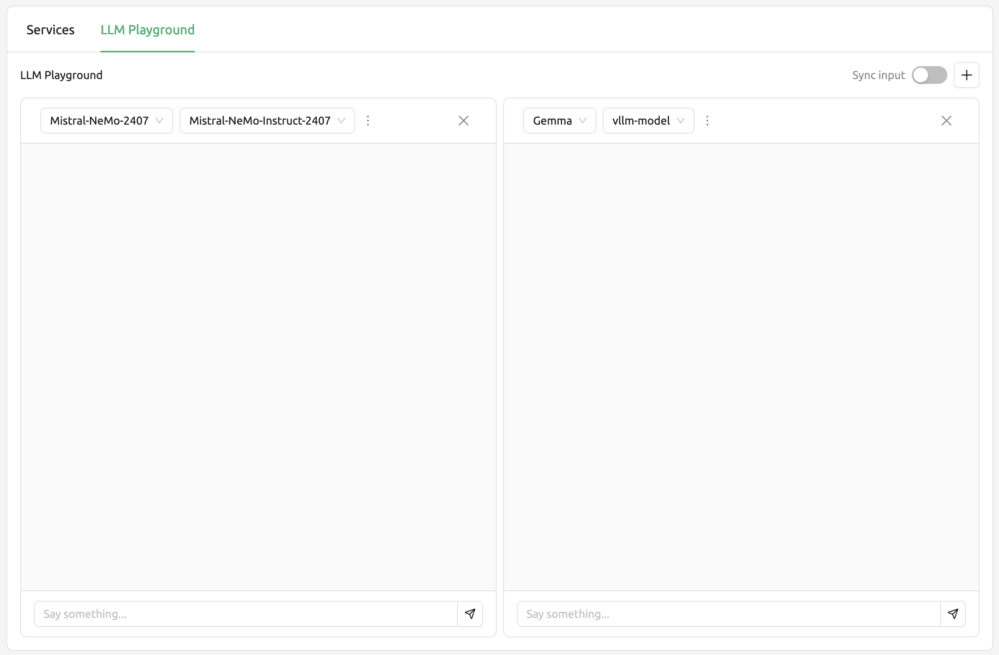
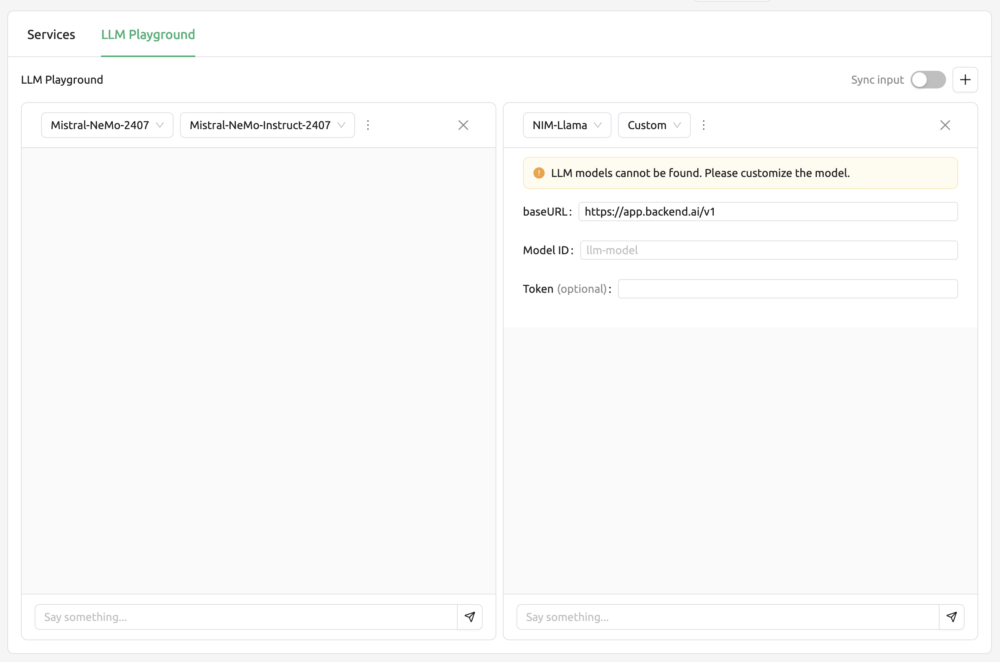
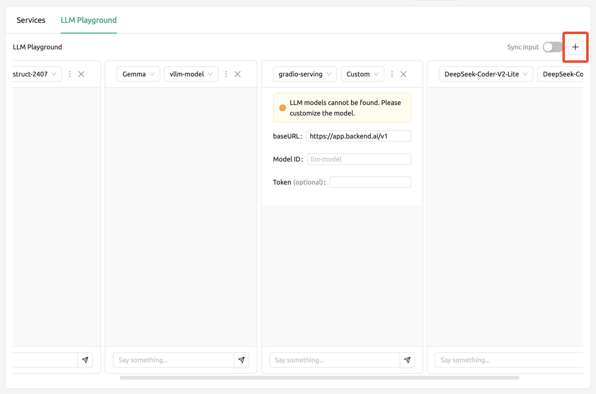
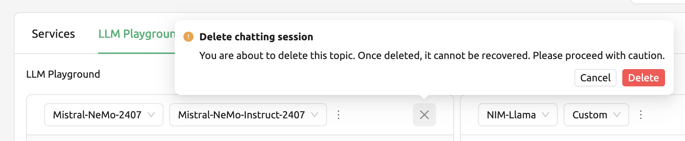
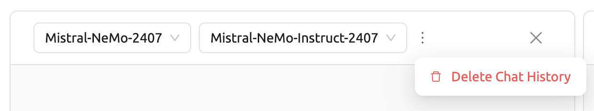
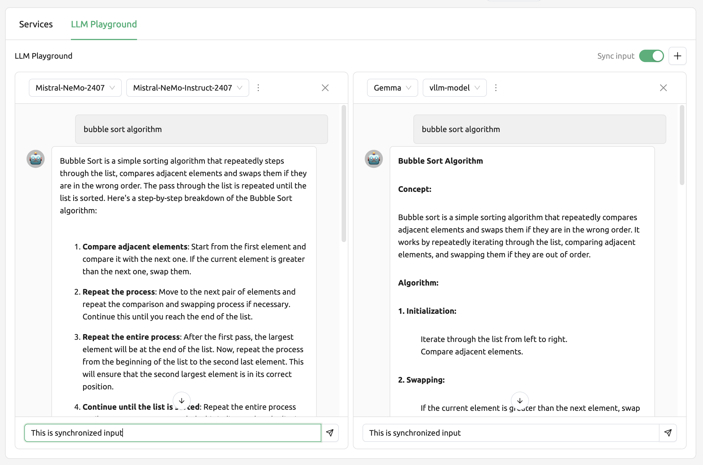

.. _LLM-playground:

==============
LLM Playground
==============

LLM Playground
--------------

Starting from version 24.03, Backend.AI introduces the 'LLM Playground' feature, allowing users to easily compare and
interact with various LLM models in one place. This enables users to experience not only the services provided by
Backend.AI but also various LLM models firsthand. Let's explore the features provided by selecting the 'LLM Playground'
tab on the 'Serving' page.

Selecting models
----------------

In the top left corner of each card, there is an endpoint selector and a model selector. The endpoint selector allows you
to search for and select endpoints created by Backend.AI services. In the model selector, you can choose a model ID, and
if the model cannot be fetched, it will be set to 'Custom'.

Please refer to the following description for the inputs required for custom modal settings.

- baseURL: The base URL of the server where the model is located. Please ensure that the
  version information is included. For example, if using the OpenAI API, you would enter
  https://api.openai.com/v1.
- Model ID: The unique identifier of the model you want to use. For example, for GPT-4,
  you would enter gpt-4o.
- token (optional): An authentication key to access the model service. Tokens can be 
  generated from various services, not just Backend.AI. The format and generation process
  may vary depending on the service. Always refer to the specific service's guide for details.
  For instance, when using the service generated by Backend.AI, please refer to the
  :ref:`Generating Tokens<generating-tokens>` section for instructions on how to generate one.

Add and remove chatting cards
-----------------------------

You can add new chatting cards by clicking the '+' button on the top right corner.

To delete each chat session, click the 'x' button located at the top right corner of the card.
Please be cautious as this will delete all entered content.

Delete chat history
-------------------

Let's look at how to delete the chat history of each card. When you click the 'More' button,
the 'Delete Chat History' button will appear. Clicking this button will delete all chat history
on the card, but the card session will not end.

Synchronize input
-----------------

The 'Sync input' button of the top right allows you to synchronize the input of all chatting cards.
When 'Sync input' is enabled, pressing 'Enter' or clicking the 'Send' button on any card will apply
the input of the card you are currently typing in. This feature is useful when you want to compare
the results of different models with the same input.

