.. _admin-menu:

===========
Admin Menus
===========

Logging in with an admin account will reveal an extra Administration menu on the bottom left of the sidebar. 
User information registered in Backend.AI is listed in the Users tab. Domain admin can see only the users who belong to the domain, 
while superadmin can see all users' information. Only superadmin can create and deactivate a user.

User ID (email), Name (username), and Main Access Key can be filtered by typing text in the 
search box on each column header.

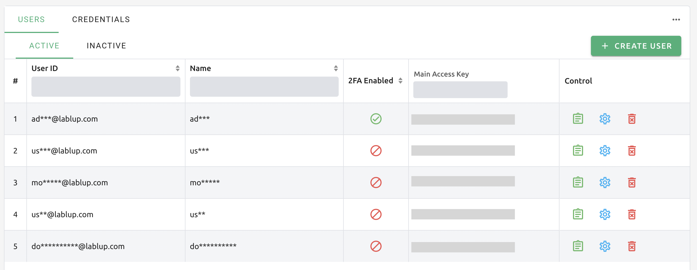

.. note::

   Depending on the plugin settings, the ``2FA Enabled`` column might be invisible. In that 
   case, please contact administrator of your system.

Create and update users
-----------------------

A user can be created by clicking the CREATE USER button. Note that the password
must be longer or equal to 8 characters and at least 1 alphabet/special
character/ number should be included. The maximum length allowed for E-Mail and Username is 64.

.. note::

   If a user with the same email or username already exists, it is not possible to
   creat user account. Please try other email and username.

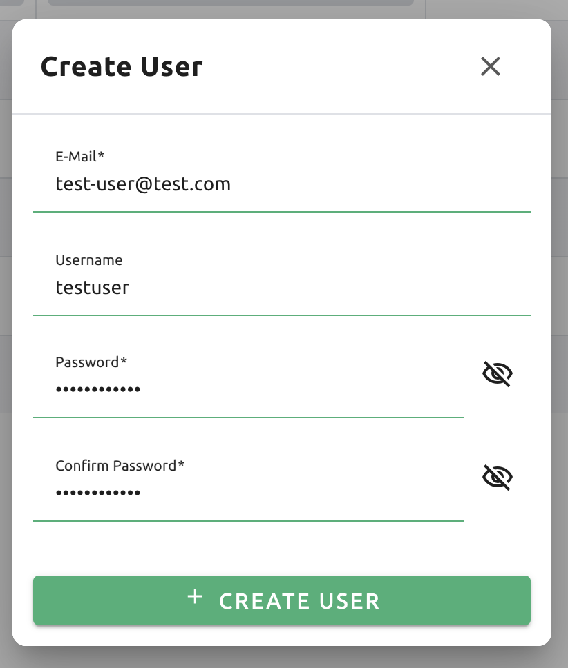

Check if the user is created.

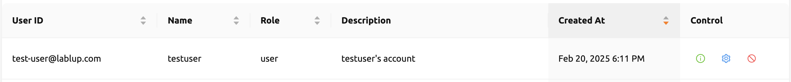

Click the green button in the Controls panel for more detailed user
information. You can also check the domain and project information where the
user belongs.

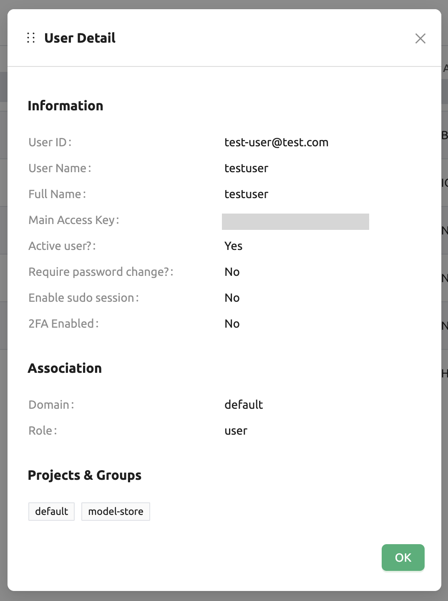

Click the 'Setting (Gear)' in the Controls panel to update information of a user who
already exists. User's name, password, activation state, etc. can be changed. User ID cannot be changed.

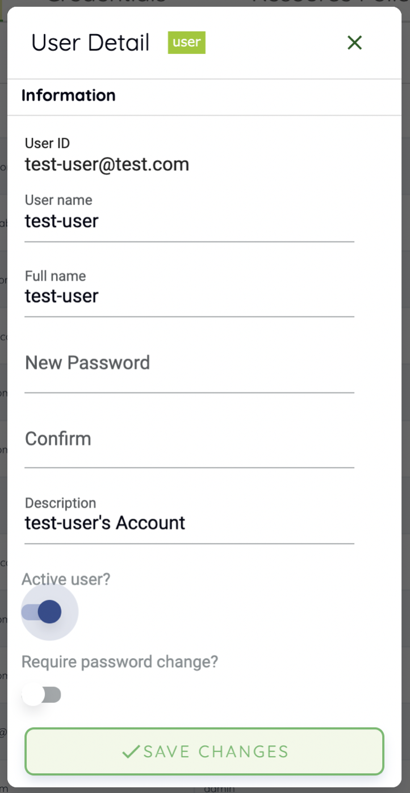

Each of the three items at the bottom of the dialog has the following functions.

* User Status: Indicates the user's status. Inactive users cannot log
  in. Before Verification is a status indicates that a user needs an additional
  step to activate the account such as email verification or an approval from an
  admin. Note that the inactive users are listed in the Inactive tab separately.

  .. image:: active_user_selection.png
     :width: 350
     :align: center
* Require password change?: If the admin has chosen random passwords while
  creating users in batches, this field can be set to ON to indicate that
  password change is required. The users will see the top bar that notify user
  to update their password, but this is a kind of descriptive flag which has no
  effect on actual use.
* Enable sudo session: Allow the user to use sudo in the compute session.
  This is useful when the user needs to install packages or run commands that
  require root privileges. However, it is not recommended to enable this option
  for all users, as it may cause security issues.
* 2FA Enabled: A flag indicating whether the user uses two-factor authentication.
  When using two-factor authentication, users are additionally required to enter an
  OTP code when logging in. Administrators can only disable two-factor authentication
  for other users.
* Resource Policy: From Backend.AI version 24.09, you can select the user resource policy 
  to which the user belongs. For more information about user resource policies, please 
  refer :ref:`user resource policy <user-resource-policy>` section.

Inactivate user account
-----------------------

Deleting user accounts is not allowed even for superadmins, to track usage
statistics per user, metric retention, and accidental account loss. Instead,
admins can inactivate user accounts to keep users from logging in. Click the
delete icon in the Controls panel. A popover asking confirmation appears, and
you can deactivate the user by clicking the Deactivate button.

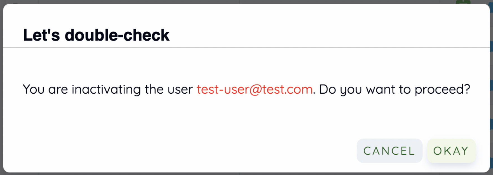

To re-activate users, go to Users - Inactive tab, and select the status of
the target user to ``Active``.

.. warning::

   Please note that deactivating the user changes all of credentials to be inactive,
   but reactivating the user does not reactivate the inactivated credentials, since the user
   account can have multiple keypairs, which brings it hard to decide which credential
   should be reactivated.

Manage User's Keypairs
----------------------

Each user account usually have one or more keypairs. A keypair is used for API
authentication to the Backend.AI server, after user logs in. Login requires
authentication via user email and password, but every request the user sends to
the server is authenticated based on the keypair.

A user can have multiple keypairs, but to reduce the user's burden of managing
keypairs, we are currently using only one of the user's keypairs to send requests.
Also, when you create a new user, a keypair is automatically created, so you do
not need to create and assign a keypair manually in most cases.

Keypairs can be listed on the Credentials tab of in the Users page. Active
keypairs are shown immediately, and to see the inactive keypairs, click the
Inactive panel at the bottom.

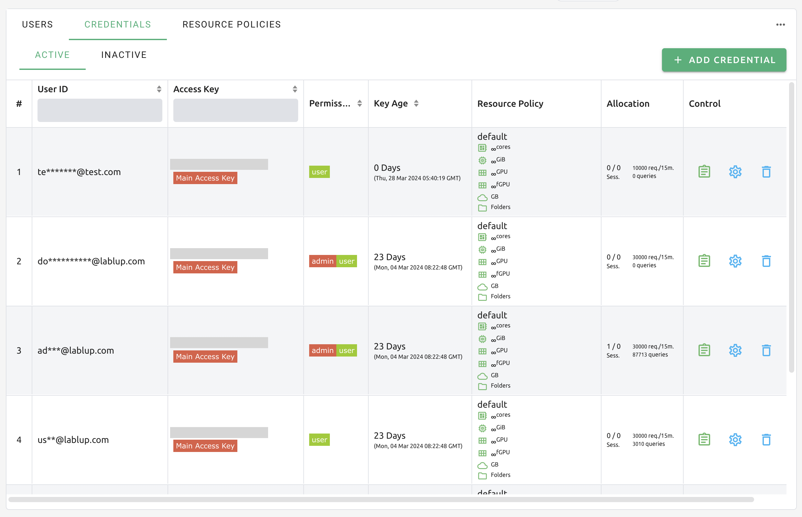

Like in Users tab, you can use the buttons in the Controls panel to view or
update keypair details. Click the blue trash button to disable that keypair, or
click the red trash button to completely delete the keypair. However, if you
have created a compute session using a keypair, you cannot delete it. If you
accidentally deleted a keypair, you can re-create keypair for the user by
clicking the ADD CREDENTIAL button at the upper right corner. If necessary, you
can also explicitly enter the access key and secret key by clicking the Advanced
panel.

The Rate Limit field is where you specify the maximum number of requests that
can be sent to the Backend.AI server in 15 minutes. For example, if set to 1000,
and the keypair sends more than 1000 API requests in 15 minutes, and the server
throws an error and does not accept the request. It is recommended to use the
default value and increase it when the API request frequency goes up high
according to the user's pattern.

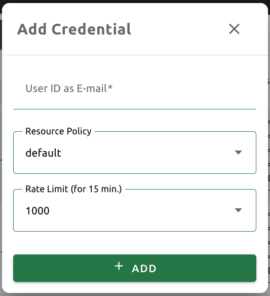

.. .. note::

..    In each of USERS, CREDENTIALS tabs, there is an icon (``...``) on the right side of the tab
..    header. Clicking this shows export CSV menu, which again brings up a CSV export dialog for
..    each tabs. By giving an appropriate file name, if necessary, and clicking EXPORT CSV FILE
..    button, you can download the list of users, keypairs.

..     .. image:: export_csv_user.png
..        :width: 400
..        :align: center

.. _sharing-a-group-storage:

Share project storage folders with project members
--------------------------------------------------

Backend.AI provides storage folders for projects, in addition to user's own
storage folder. A project storage folder is a folder belonging to a specific
project, not a specific user, and can be accessed by all users in that project.

.. note::
   Project folders can be created only by administrators. Normal users can only
   access the contents of the project folder created by the administrator.
   Depending on the system settings, project folders may not be allowed.

First, log in with an admin account and create a project folder. After moving to
the Data & Storage page, click NEW FOLDER to open the folder creation dialog.
Enter the folder name, set the Type to Project, and select the project to share
the folder.  Let's select the project to which User B belongs for this example
to work. Permission is set to Read-Only.

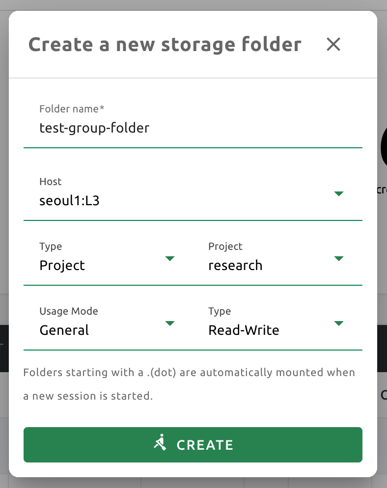

After confirming that the folder has been created, log in with the User B's
account and check that the project folder just created on the Data & Storage page
is displayed without any invitation procedure. You can see that R (Read Only) is
also displayed in the Permission panel.

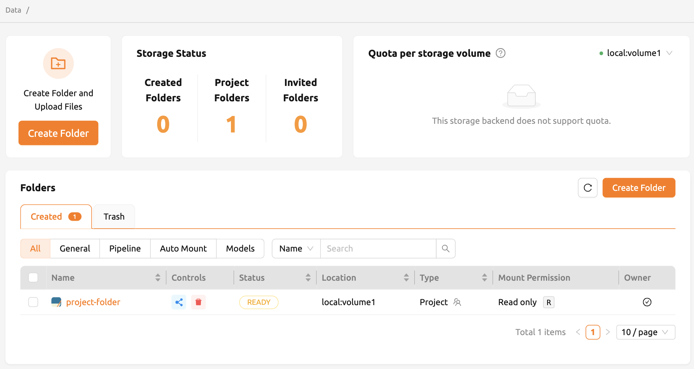

Manage Models cards
-------------------

All of the Model cards in model store are managed by project admin. 
After uploading model store with model-definition file, any user in the project 
can access to model card and clone it if needed.

Following method is to add model cards from the Hugging Face.

.. note::
   Before creating a model card, getting an access to the specific model on Hugging Face is needed.
   For more information, please refer to `Gated models <https://huggingface.co/docs/hub/models-gated>`_ .

First, Set the project to 'model-store'.

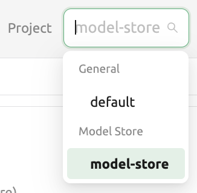

Click the 'Add' button on the right side. Enter the folder name, 
and set the rest of folder configuration as shown below:

   - Type: project
   - Project: 'model-store'
   - Usage Mode: Model
   - Permission: Read-Write
   - Cloneable: True

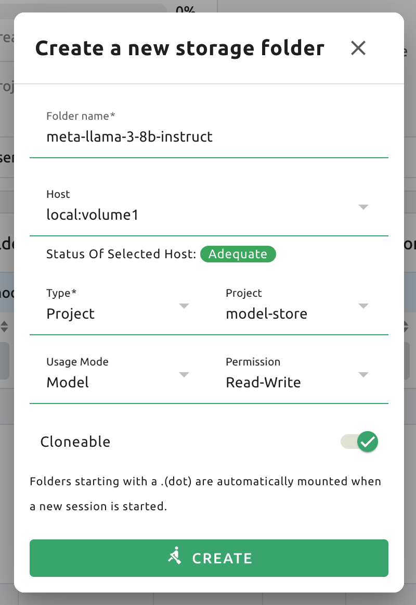

After creating the folder, you need to set and upload the model-definition.yaml file 
to the folder that you've just created. Following is the example of the model-definition file. 
If you want to know how to write model-definition file, 
please refer to :ref:`Model definition guide <model_definition_guide>` section.

.. code:: yaml

   models:
   - metadata:
      architecture: LlamaForCausalLM
      author: meta-llama
      category: huggingface
      created_at: '2024-04-17 09:35:12'
      description: Meta's Llama 3 by AI@Meta are dialogue-optimized, safe large language
         models in 8B and 70B sizes.
      framework:
      - transformers
      label:
      - facebook
      - meta
      - pytorch
      - llama
      - llama-3
      license: llama3
      min_resource:
         cuda.shares: 2.4305981636047362
      modified_at: '2024-05-29 12:27:16'
      task: text-generation
      title: meta-llama/Meta-Llama-3-8B-Instruct
   model_path: /models
   name: Meta-Llama-3-8B-Instruct

Once the model-definition file is uploaded, the model card will appear in the model store page.

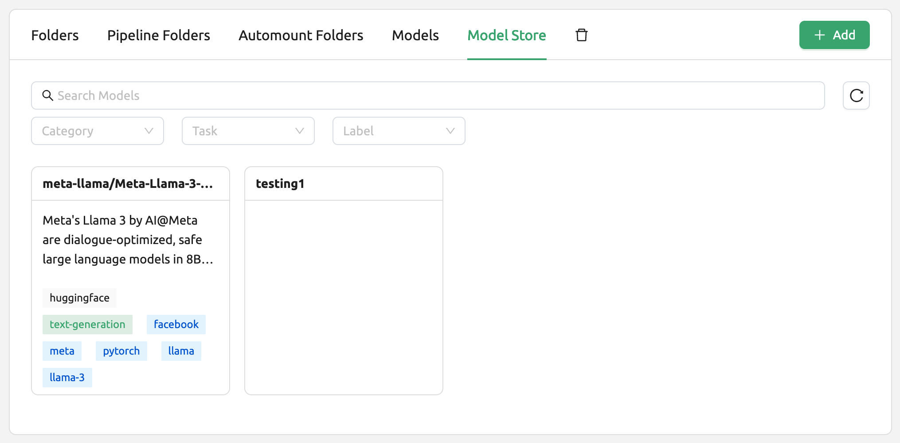

.. note::
   You need to download model manually after setting model-definition file. For downloading the model file to folder, 
   you can mount the model folder to session creation and download file to there by referring 
   `Downloading models <https://huggingface.co/docs/hub/models-downloading>`_ .

Clicking on the model card you've just created will display the details of the model-definition file you uploaded. 
Now, every member of the project can access the model card and clone it.

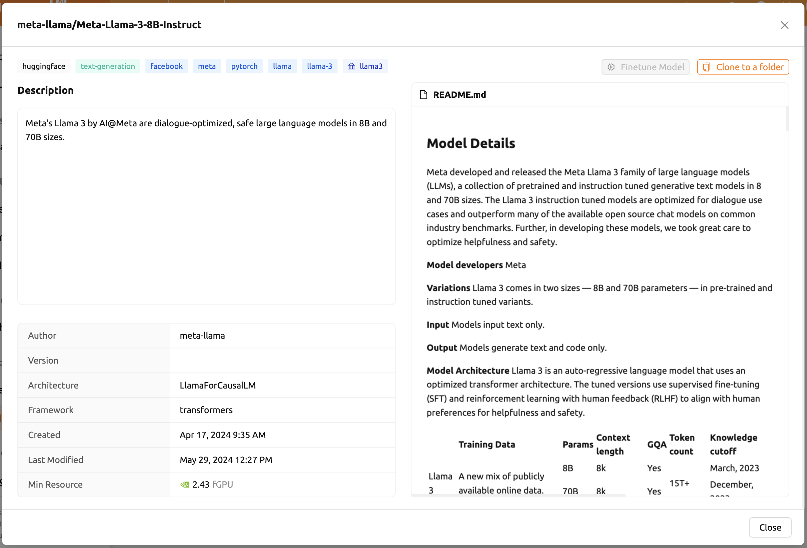

Manage Resource Policy
----------------------

Keypair Resource Policy
~~~~~~~~~~~~~~~~~~~~~~~

In Backend.AI, administrators have the ability to set limits on the total resources available for each keypair, user, and project.
Resource policies enable you to define the maximum allowed resources and other compute session-related settings.
Additionally, it is possible to create multiple resource policies for different needs, 
such as user or research requirements, and apply them on an individual basis. 

The Resource Policy page allows administrators to view a list of all registered resource policies. 
Administrators can review the resource policies established for keypairs, users, and projects directly on this page.  
Let's begin by examining the resource policies for keypairs. In the figure below, there are
three policies in total (gardener, student, default). The infinity symbol (∞)
indicates that no resource restrictions have been applied to those resources.

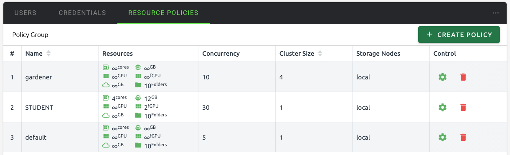

The user account being used in this guide is currently assigned to the default
resource policy. This can be verified in the Credentials tab on the Users page.
You can also confirm that all resource policies are set to default in the Resource Policy panel.

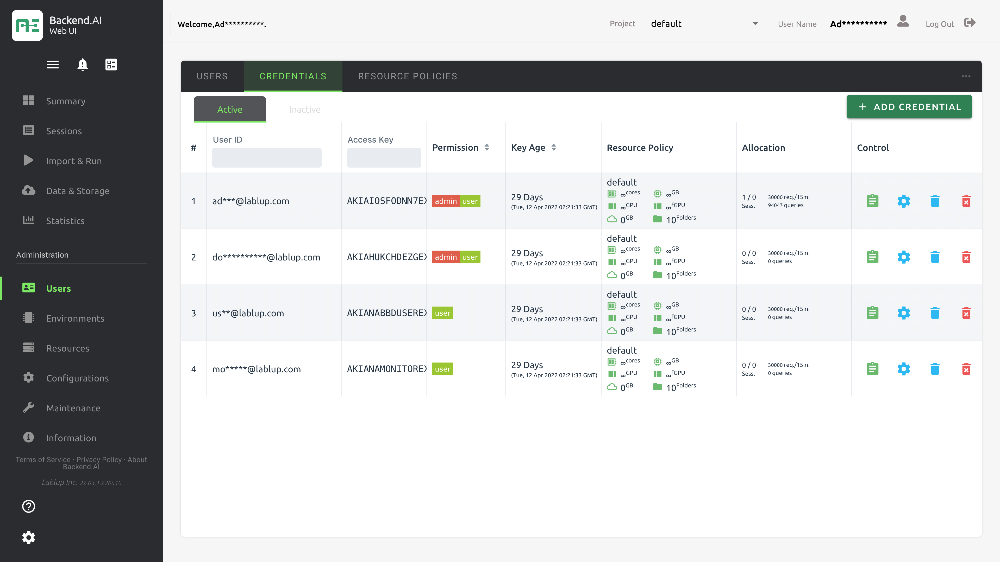

To modify resource policies, click the 'Setting (Gear)' in the Control column of the
default policy group. In the Update Resource Policy dialog, every option is
editable except for Policy Name, which serves as the primary key for
distinguishing resource policies in the list. Uncheck the Unlimited checkbox
at the bottom of CPU, RAM, and fGPU, and set the resource limits to the desired
values. Ensure that the allocated resources are less than the total hardware
capacity. In this case, set CPU, RAM, and fGPU to 2, 4, and 1 respectively.
Click the OK button to apply the updated resource policy.

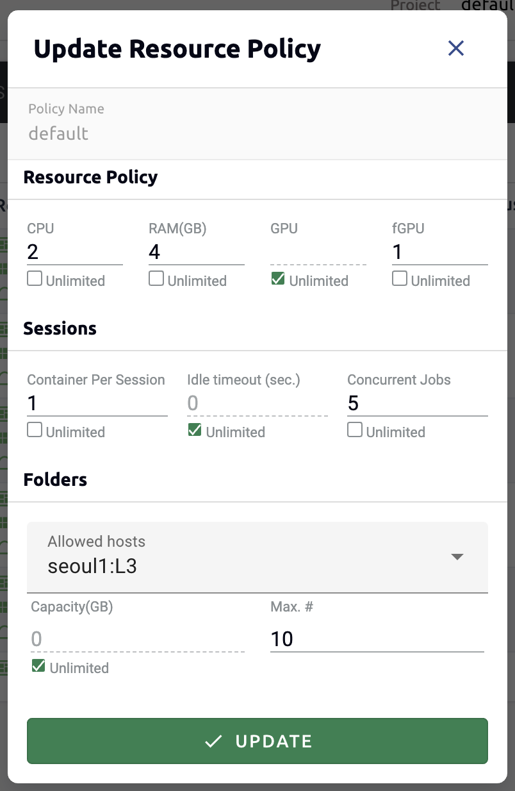

About details of each option in resource policy dialog, see the description below.

* Resource Policy
   * CPU: Specify the maximum amount of CPU cores. (max value: 512)
   * Memory: Specify the maximum amount of memory in GB. It would be good practice
     to set memory twice as large as the maximum value of GPU memory. (max value: 1024)
   * CUDA-capable GPU: Specify the maximum amount of physical GPUs. If fractional GPU
     is enabled by the server, this setting has no effect. (max value: 64)
   * CUDA-capable GPU (fractional): Fractional GPU (fGPU) is literally split a single
     GPU to multiple partitions in order to use GPU efficiently. Notice that the minimum
     amount of fGPU required is differed by each image. If fractional GPU is not enabled
     by the server, this settings has no effect. (max value: 256)

* Sessions
   * Container Per Session: The maximum number of containers per session.
     To make a user to create a cluster session, this value should be greater than 1.
     (max value: 100)
   * Session Lifetime (sec.): Limits the maximum lifetime of a compute session
     from the reservation in the active status, including ``PENDING`` and
     ``RUNNING`` statuses. After this time, the session will be force-terminated
     even if it is fully utilized. This will be useful to prevent the session
     from running indefinitely.
   * Concurrent Jobs: Maximum number of concurrent compute session per keypair.
     If this value is set to 3, for example, users bound to this resource policy
     cannot create more than 3 compute sessions simultaneously. (max value: 100)
   * Idle timeout (sec.): Configurable period of time during which the user can
     leave their session untouched. If there is no activity at all on a
     compute session for idle timeout, the session will be garbage collected
     and destroyed automatically. The criteria of the "idleness" can be
     various and set by the administrators. (max value: 15552000 (approx. 180 days))

* Folders
   * Allowed hosts: Backend.AI supports many NFS mountpoint. This field limits
     the accessibility to them. Even if a NFS named "data-1" is mounted on
     Backend.AI, users cannot access it unless it is allowed by resource policy.
   * (Deprecated since 23.09.4) Max. #: the maximum number of storage folders that
     can be created/invited. (max value: 100).

In the keypair resource policy list, check that the Resources value of the default
policy has been updated.

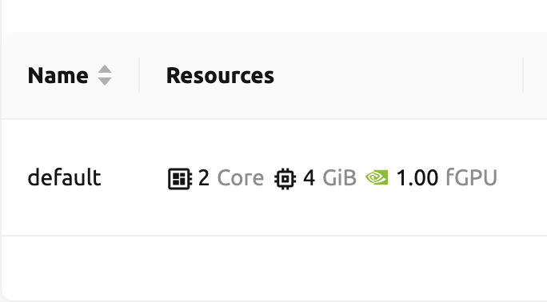

You can create a new resource policy by clicking the Create button. Each setting
value is the same as described above.

To create a resource policy and associate it with a keypair, go to the
Credentials tab of the Users page, click the gear button located in the
Controls column of the desired keypair, and click the Select Policy field to
choose it.

You can also delete each of resource keypairs by clicking trash can icon
in the Control column. When you click the icon, the confirmation popup will appears.
Click 'Delete' button to erase."

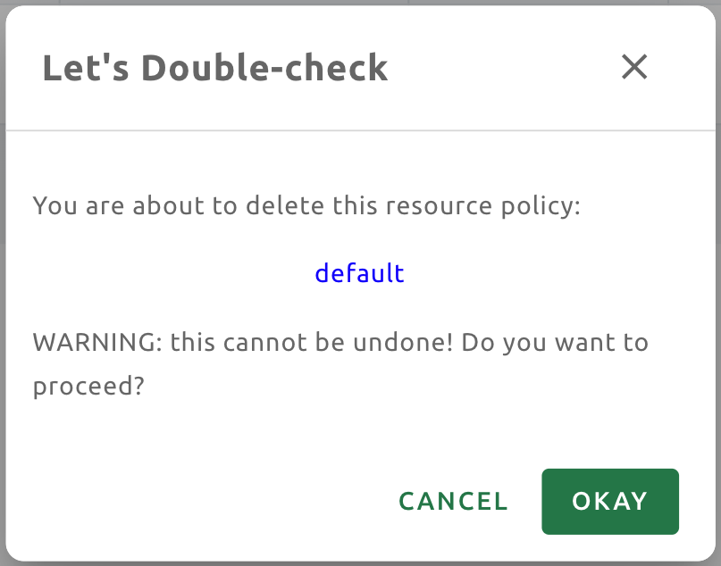

.. note::

   If there's any users (including inactive users) following a resource policy to be deleted,
   deletion may not be done. Before deleting a resource policy, please make sure that
   no users remain under the resource policy.

If you want to hide or show specific columns, click the 'Setting (Gear)' at the bottom right of the
table. This will bring up a dialog where you can select the columns you want to display.

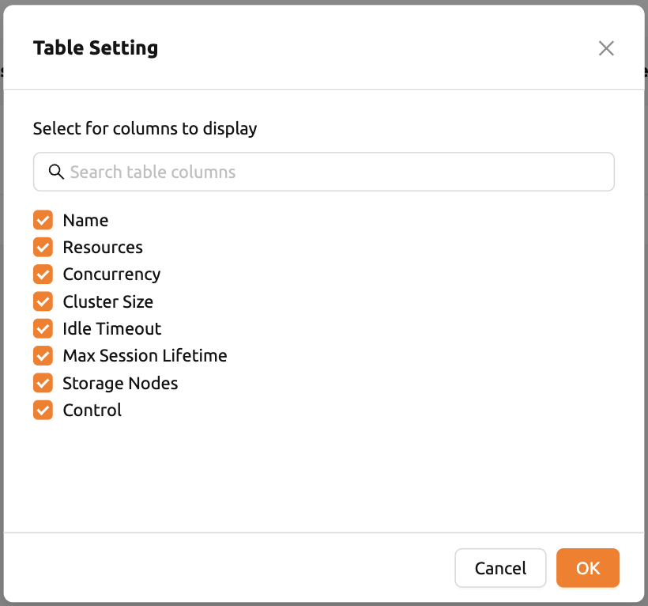

User Resource Policy
~~~~~~~~~~~~~~~~~~~~

.. _user-resource-policy:

Starting from version 24.03, Backend.AI supports user resource policy management. While each
user can have multiple keypairs, a user can only have one user resource policy. In the user
resource policy page, users can set restrictions on various settings related to folders such as
Max Folder Count and Max Folder Size, as well as individual resource limits like Max Session
Count Per Model Session and Max Customized Image Count.

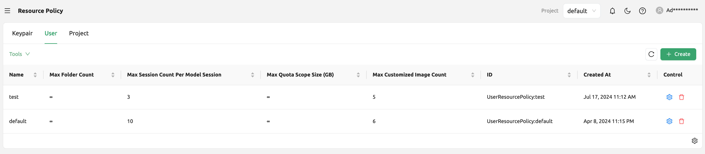

To create a new user resource policy, click the Create button.

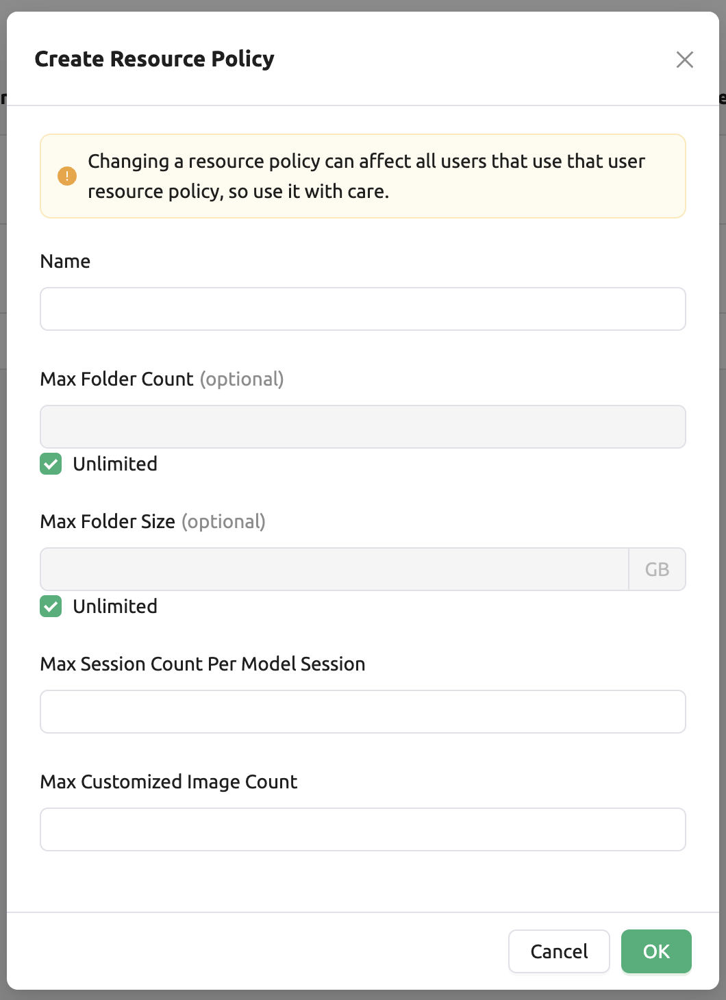

- Name: The name of the user resource policy.
- Max Folder Count: The maximum number of folders that the user can create.
  If the user's folder count exceeds this value, user cannot create a new folder.
  If set to Unlimited, it is displayed as "∞".
- Max Folder Size: The maximum size of the user's storage space. If
  user's storage space exceeds this value, user cannot create a new data
  folder. If set to Unlimited, it is displayed as "∞".
- Max Session Count Per Model Session: The maximum number of available sessions per model
  service created by a user. Increasing this value can put a heavy load on the session
  scheduler and potentially lead to system downtime, so please caution when
  adjusting this setting.
- Max Customized Image Count: The maximum number of customized images that
  user can create. If user's customized image count exceeds this value,
  user cannot create a new customized image. If you want to know more about customized 
  images, please refer to the :ref:`My Environments<my-environments>` section.

To update, click the 'Setting (Gear)' button in the control column. To delete, click the trash can
button.

.. note::

   Changing a resource policy may affect all users who use that policy, so use
   it with caution.

Similar to keypair resource policy, users can select and display only columns users want by
clicking the 'Setting (Gear)' button at the bottom right of the table.

Project Resource Policy
~~~~~~~~~~~~~~~~~~~~~~~

Starting from version 24.03, Backend.AI supports project resource policy management. Project
resource policies manage storage space (quota) and folder-related limitations for projects.

When clicking the Project tab of the Resource Policy page, you can see the list of project
resource policy.

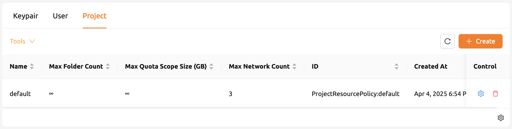

To create a new project resource policy, click the 'Create' button at the top right of the table.

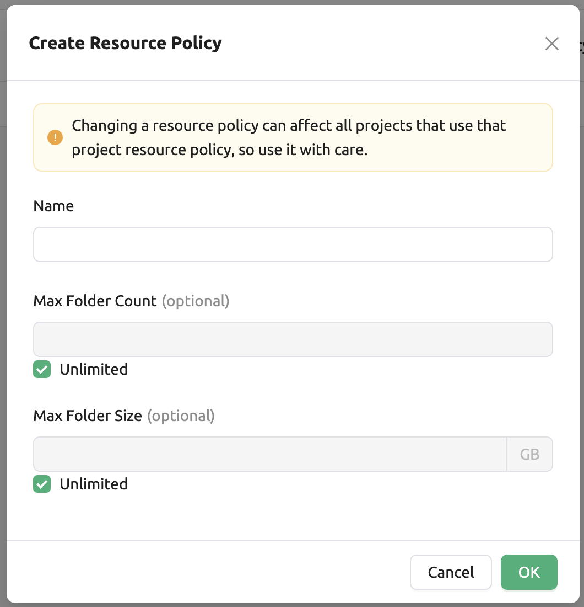

- Name: The name of the project resource policy.
- Max Folder Count: The maximum number of project folders that an administrator can create.
  If the project folder count exceeds this value, the administrator will not be able to create
  a new project folder. If set to Unlimited, it will be displayed as "∞".
- Max Folder Size: The maximum size of the project's storage space. If the project's storage
  space exceeds this value, the administrator cannot create a new project folder. If set to
  Unlimited, it is displayed as "∞".
- Max Network Count: The maximum number of networks that can be created for the project since Backend.AI version 24.12. If set to Unlimited, it is displayed as "∞".

The meaning of each field is similar to the user resource policy. The difference is that the
project resource policy is applied to the project folders, while the user resource policy is
applied to the user folders.

If you want to make changes, click the 'Setting (Gear)' button in the control column. Resource policy
names cannot be edited. Deletion can be done by clicking the trash can icon button.

.. note::
   Changing a resource policy may affect all users who use that policy,
   so use it with caution.

You can select and display only the columns you want by clicking the 'Setting (Gear)' button at the
bottom right of the table.

Exporting current resource policy as CSV
~~~~~~~~~~~~~~~~~~~~~~~~~~~~~~~~~~~~~~~~

To save the current resource policy as a file, click on the 'Tools' menu located at the top left of each tab. Once you click the menu, download dialog will appear. 

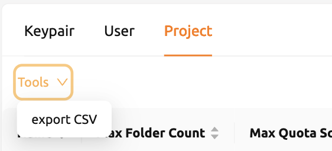

Manage Images
-------------

Admins can manage images, which are used in creating a compute session, in the
Images tab of the Environments page. In the tab, meta information of all images
currently in the Backend.AI server is displayed. You can check information such
as registry, namespace, image name, image's based OS, digest, and minimum
resources required for each image. For images downloaded to one or more agent
nodes, there will be a ``installed`` tag in each Status column.

.. note::
   The feature to install images by selecting specific agents is currently
   under development.

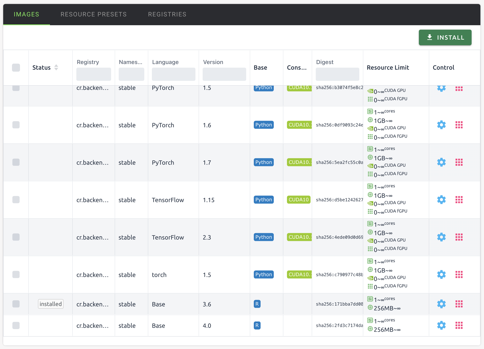

You can change the minimum resource requirements for each image by clicking the
'Setting (Gear)' in the Controls panel. Each image has hardware and resource
requirements for minimal operation. (For example, for GPU-only images, there
must be a minimum allocated GPU.) The default value for the minimum resource
amount is provided as embedded in the image's metadata. If an attempt is made to
create a compute session with a resource that is less than the amount of
resources specified in each image, the request is automatically adjusted to the
minimum resource requirements for the image and then generated, not cancelled. 

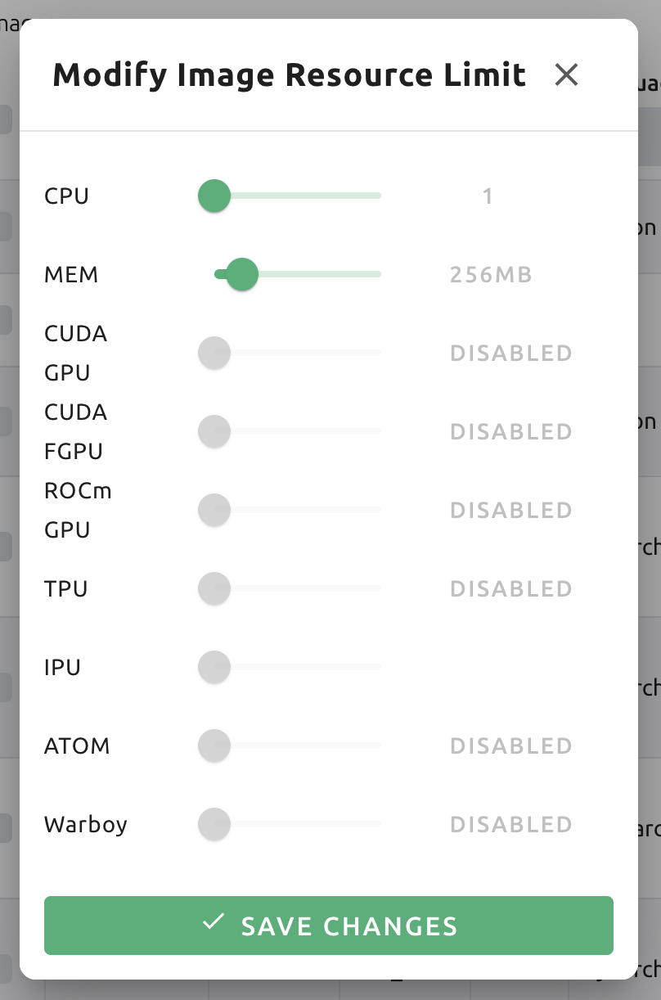

.. warning::
   Don't change the minimum resource requirements to an amount less than the
   predefined value! The minimum resource requirements included in the image
   metadata are values that have been tested and determined. If you are not
   really sure about the minimum amount of resources you want to change, leave
   it in the default.

Additionally, you can add or modify the supported apps for each image by clicking the 'Apps' icon located in the Controls column.
Once you click the icon, the name of the app and its corresponding port number will be displayed accordingly.

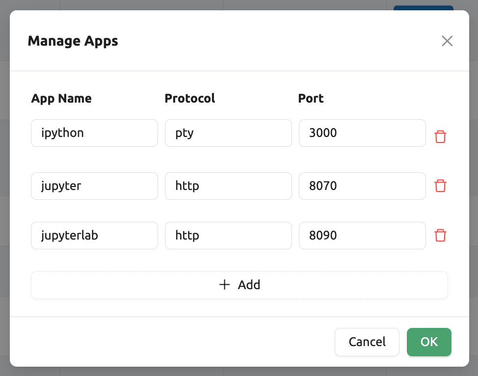

In this interface, you can add supported custom applications by clicking the 'Add' button below. To delete an application, simply click the 'red trash can' button on the right side of each row. 

.. note::
   You need to reinstall the image after changing the managed app.

   .. image:: confirmation_dialog_for_manage_app_change_in_image.png
      :width: 300
      :align: center
      :alt: Confirmation dialog for manage app change in image

Manager docker registry
-----------------------

You can click on the Registries tab in Environments page to see the information
of the docker registry that are currently connected. ``cr.backend.ai`` is
registered by default, and it is a registry provided by Harbor.

.. note::
   In the offline environment, the default registry is not accessible, so
   click the trash icon on the right to delete it.

Click the refresh icon in Controls to update image metadata for Backend.AI from
the connected registry. Image information which does not have labels for
Backend.AI among the images stored in the registry is not updated.

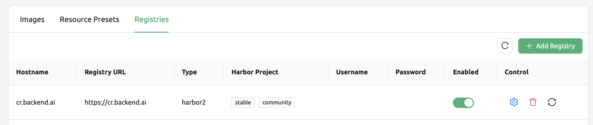

You can add your own private docker registry by clicking the ADD REGISTRY
button. Note that Registry Name and Registry URL address must be set
identically, and in the case of Registry URL, a scheme such as ``http://`` or
``https://`` must be explicitly attached. Also, images stored in the registry
must have a name prefixed with Registry Name. Username and Password are
optional and can be filled in if you set separate authentication settings in the
registry. In Extra Information, you can pass additional information needed for each registry type as a JSON string

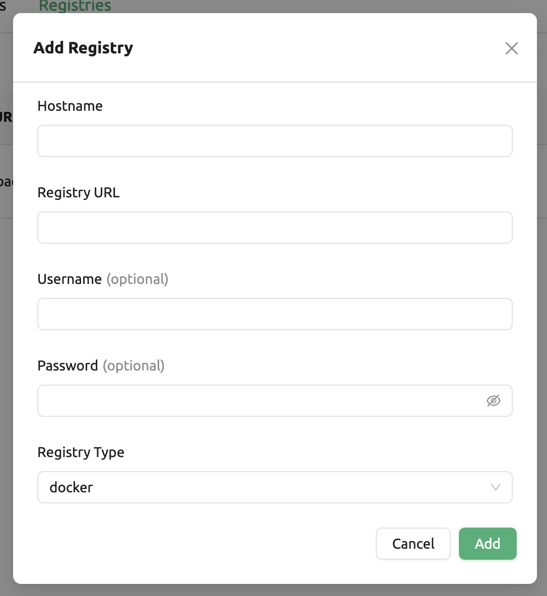

You can also update the information of an existing registry, except the
Registry Name.

Even if you created a registry and update meta information, users cannot use the
images in the registry, immediately. Just as you had to register the allowed hosts
to use the storage host, you must register the registry in the allowed docker
registries field at the domain or project level, after registering the registry,
so that users in the domain or project can access the registry image. Allowed
docker registries can be registered using the Control-Panel with domain and project
management. The function to set the allowed docker registries in the keypair's
resource policy is not provided yet.

Manage resource preset
----------------------

The following predefined resource presets are displayed in the Resource
allocation panel when creating a compute session. Superadmin can manage these
resource presets.

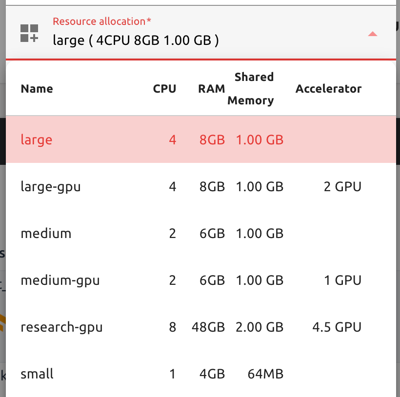

Go to the Resource Presets tab on the Environment page. You can check the list
of currently defined resource presets.

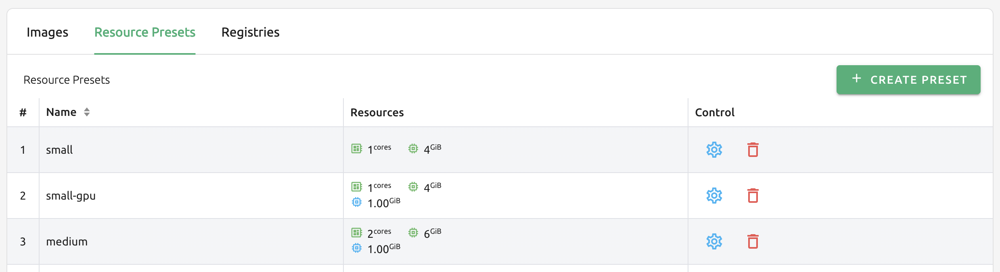

You can set resources such as CPU, RAM, fGPU, etc. to be provided by the
resource preset by clicking the 'Setting (Gear)' (cogwheel) in the Controls panel.
Create or Modify Resource Preset modal shows fields of the resources currently available. 
Depending on your server's settings, certain resources may not be visible. 
After setting the resources with the desired values, save it and check if the corresponding preset is displayed
when creating a compute session. If available resources are less
than the amount of resources defined in the preset, the corresponding preset
would not be shown.

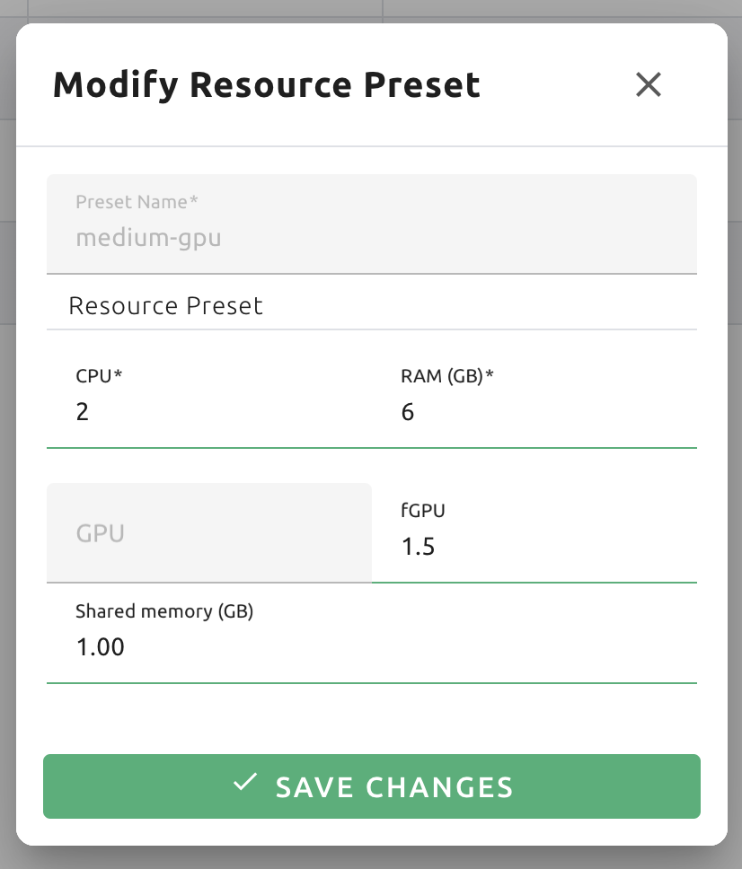

Also you can create resource preset by Clicking CREATE PRESETS button in the
right top of the Resource Presets tab. You cannot create the same resource
preset name that already exists, since it is the key value for distinguishing
each resource preset.

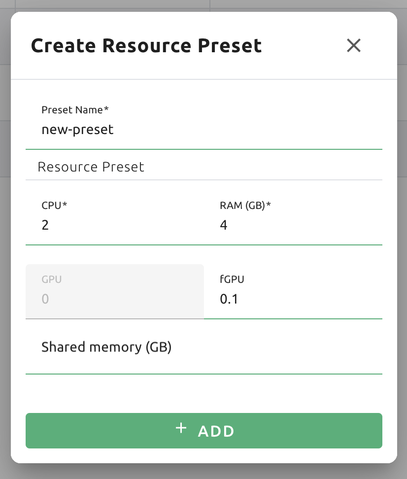

Manage agent nodes
------------------

Superadmins can view the list of agent worker nodes, currently connected to
Backend.AI, by visiting the Resources page. You can check agent node's IP,
connecting time, actual resources currently in use, etc. The WebUI does
not provide the function to manipulate agent nodes.

Query agent nodes
~~~~~~~~~~~~~~~~~

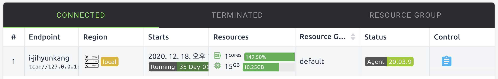

Also You can see exact usage about the resources in the agent worker node
by Click note icon in the Control panel.

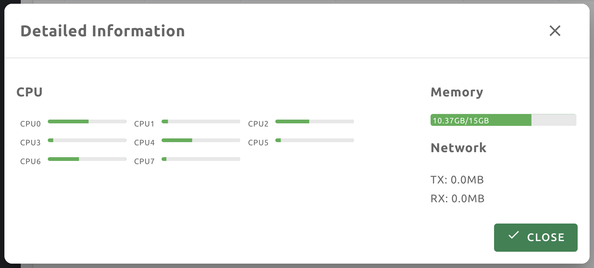

On Terminated tab, you can check the information of the agents that has been
connected once and then terminated or disconnected. It can be used as a
reference for node management. If the list is empty, then it means
that there's no disconnection or termination occurred.

.. image:: terminated_agent_list.png
   :alt: Terminated agent node list

Set schedulable status of agent nodes
~~~~~~~~~~~~~~~~~~~~~~~~~~~~~~~~~~~~~

You may want to prevent new compute sessions from being scheduled to an Agent
service without stopping it. In this case, you can disable the Schedulable
status of the Agent. Then, you can block the creation of a new session while
preserving the existing sessions on the Agent.

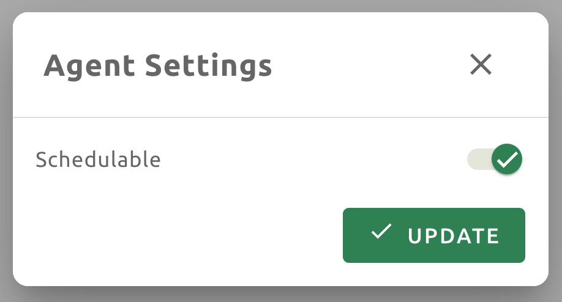

.. _scheduling-methods:

Manage resource group
---------------------

Agents can be grouped into units called resource (scaling) groups. For example,
let's say there are 3 agents with V100 GPUs and 2 agents with P100 GPUs. You
want to expose two types of GPUs to users separately, then you can group three
V100 agents into one resource group, and the remaining two P100 agents into
another resource group.

Adding a specific agent to a specific resource group is not currently handled in
the WebUI, and it can be done by editing agent config file from the installation
location and restart the agent daemon. Management of the resource groups is
possible in Resource Group tab of the Resource page.

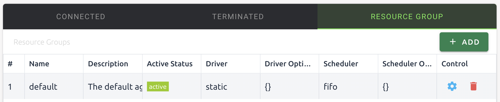

You can edit a resource group by clicking the 'Setting (Gear)' in the Control
panel. In the Select scheduler field, you can choose the scheduling method for
creating a compute session. Currently, there are three types: ``FIFO``, ``LIFO``, and
``DRF``. ``FIFO`` and ``LIFO`` are scheduling methods creating the first- or the
last-enqueued compute session in the job queue. ``DRF`` stands for Dominant Resource
Fairness, and it aims to provide resources as fair as possible for each user.
You can deactivate a resource policy by turning off Active Status.

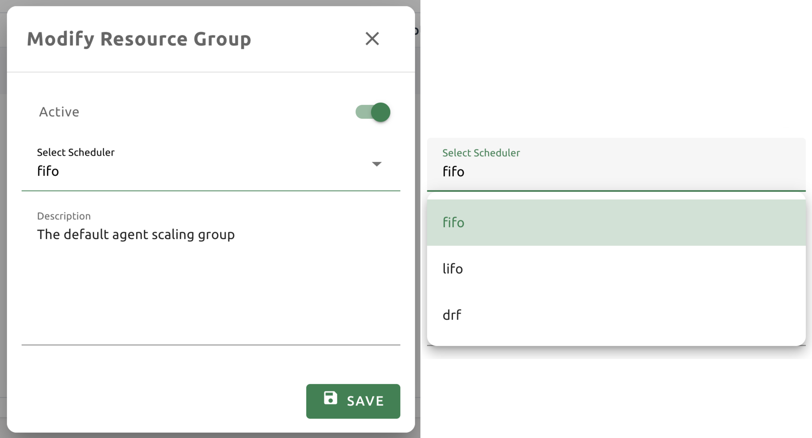

WSProxy Server Address sets the WSProxy address for the resource group's Agents
to use. If you set a URL in this field, WSProxy will relay the traffic of an app
like Jupyter directly to the compute session via Agent bypassing Manager (v2
API). By enabling the v2 API, you can lower the Manager's burden when using app
services. This also achieves the better efficiency and scalability in deploying
the services. If a direct connection from WSProxy to the Agent node is not
available, however, please leave this field blank to fall back to the v1 API,
which relays the traffic through Manager in a traditional way.

The resource group has further Scheduler Options. The details are described below.

* Allowed session types:
  Since user can choose the type of session, resource group can allow certain type of session.
  You should allow at lest one session types. The allowed session types are Interactive, Batch, and Inference.
* Pending timeout:
  A compute session will be canceled if it stays ``PENDING`` status for longer
  than the Pending timeout. When you wish to prevent a session from remaining
  PENDING indefinitely, set this time. Set this value to zero (0) if you do not
  want to apply the pending timeout feature.
* The number of retries to skip pending session: 
  The number of retries the scheduler tries before skipping a PENDING session.
  It can be configured to prevent the situation where one PENDING session blocks
  the scheduling of the subsequent sessions indefinitely (Head-of-line blocking,
  HOL). If no value is specified, the global value in Etcd will be used (``num
  retries to skip``, default three times).

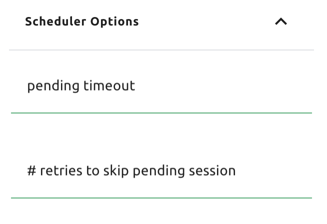

You can create a new resource policy by clicking the CREATE button.
Likewise other creating options, you cannot create a resource policy with the name
that already exists, since name is the key value.

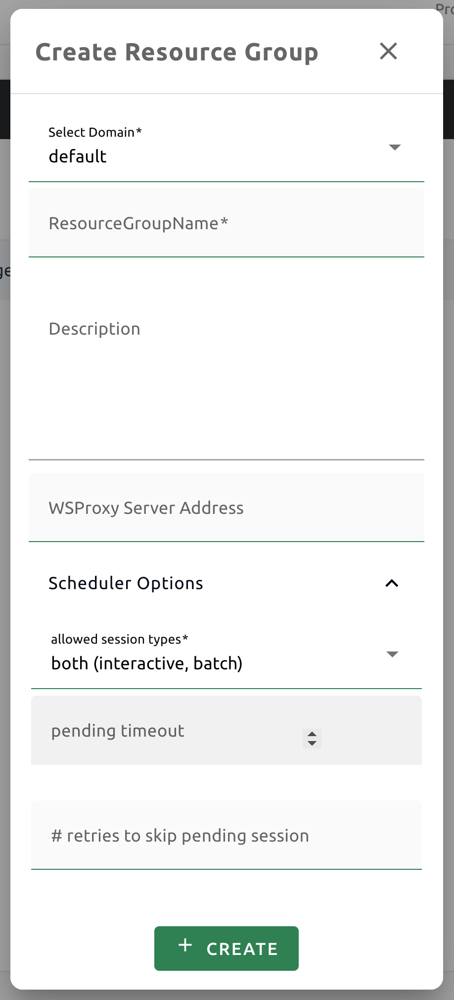

Storages
--------

On STORAGES tab, you can see what kind of mount volumes (usually NFS) exist.
From 23.03 version, We provide per-user/per-project quota setting on storage that supports quota management.
By using this feature, admin can easily manage and monitor the exact amount of storage usage for each user and project based folder.

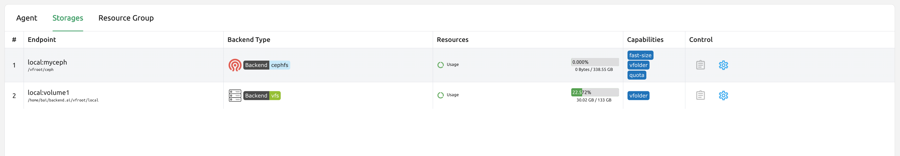

In order to set quota, you need to first access to storages tab in resource page.
And then, click 'Setting (Gear)' in control column.

.. note:: 
   Please remind that quota setting is only available in storage that provides quota setting 
   (e.g. XFS, CephFS, NetApp, Purestorage, etc.). Although you can see the usage of storage 
   in quota setting page regardless of storage, you cannot configure the quota which doesn't 
   support quota configuration internally.
   
   .. image:: no_support_quota_setting.png

.. _quota-setting-panel:

Quota Setting Panel
~~~~~~~~~~~~~~~~~~~~

In Quota setting page, there are two panels that represent the corresponding items for each panel's title.

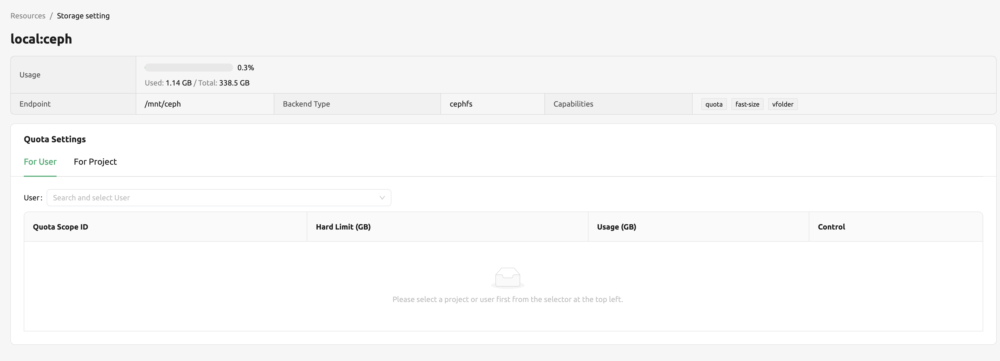

* Overview panel
   * Usage: Shows the actual amount usage of the selected storage.
   * Endpoint: Represents the mount point of the selected storage.
   * Backend Type: The type of storage.
   * Capabilities: The supported feature of the selected storage.

* Quota Settings
   * For User: Configure per-user quota setting here.
   * For Project: Configure per-project quota(project-folder) setting here.
   * ID: Corresponds to user or project id.
   * Hard Limit (GB): Currently set hard limit quota for selected quota.
   * Control: Provides editing the hard limit or even deleting the quota setting.

Set User Quota
~~~~~~~~~~~~~~~~

In Backend.AI, there are two types of vfolders created by user and admin(project). In this section,
we would like to show how to check current quota setting per-user and how to configure it.   
First, make sure the active tab of quota settings panel is ``For User``. Then, select user you desire to 
check and edit the quota. You can see the quota id that corresponds to user's id and the configuration already set 
in the table, if you already set the quota.   

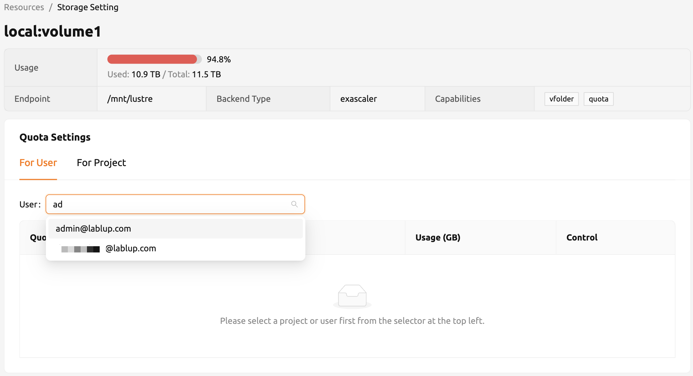

Of course, if you want to edit the quota, you can simply click the Edit button in the control column. After Clicking ``Edit`` button, you may see the small modal that enables configuring quota setting. 
After input the exact amount, don't forget to Click ``OK`` button, unless the changes will not be applied.

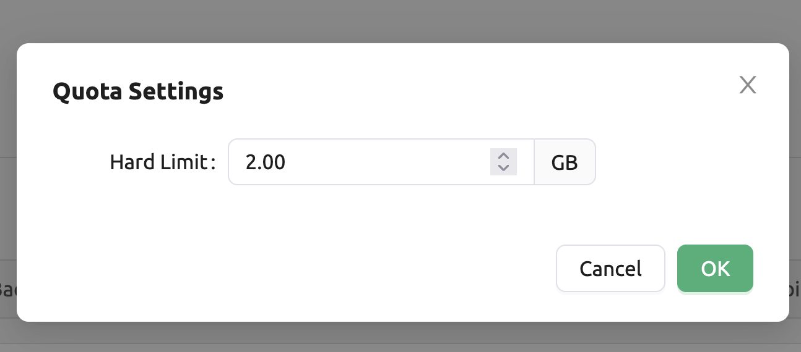

Set Project Quota
~~~~~~~~~~~~~~~~~~

Setting a quota on project-folder is similar to setting a user quota. The difference between setting 
project quota and user quota is to confirm setting the project quota requires one more procedure, 
which is selecting the domain that the project is dependent on. The rest are the same.
As in the picture below, you need to first select the domain, and then select the project.

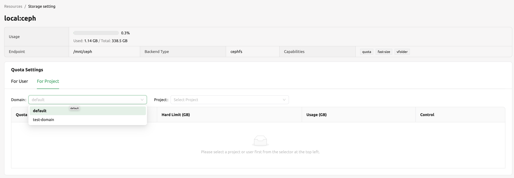

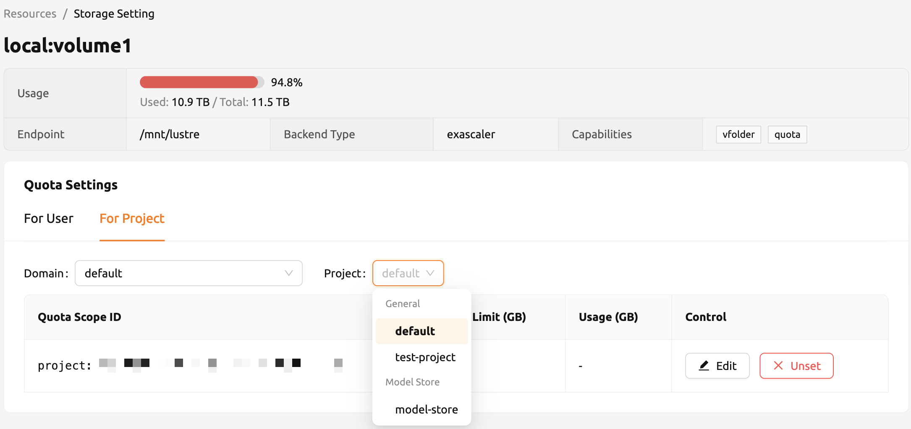

Unset Quota
~~~~~~~~~~~~

We also provides the feature to unset the quota. Please remind that after removing the quota setting, quota will automatically follows 
user or project default quota, which cannot be set in WebUI. If you want to change the default quota setting, you may need to access to admin-only page.   
By Clicking ``Unset`` button in control column, the small snackbar message will show up and confirm whether you really want to delete the current quota setting. 
If you click ``OK`` button in the snackbar message, then it will delete the quota setting and automatically reset the quota follows to corresponding quota, 
which depends on the quota type(user / project).

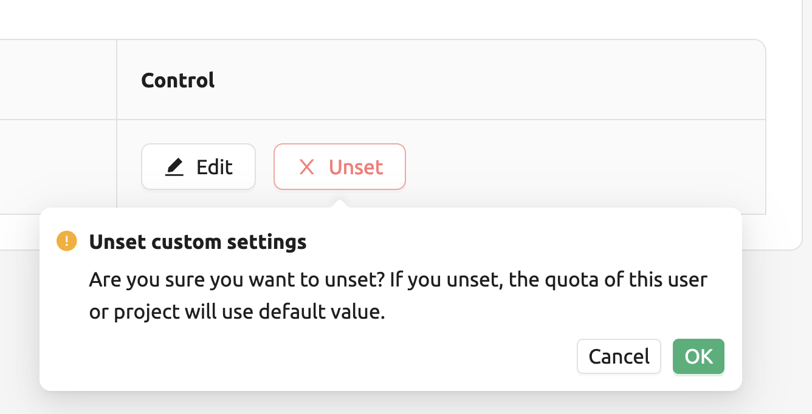

.. note::
   
   If there's no config per user/project, then corresponding values in the user/project resource policy will be set as 
   a default value. For example, If no hard limit value for quota is set, ``max_vfolder_size`` value in the resource policy 
   is used as the default value.

Download session lists
----------------------

There's additional feature in Session page for admin.
On the right side of the FINISHED tab there is a menu marked with ``...``.
When you click this menu, a sub-menu export CSV appears.

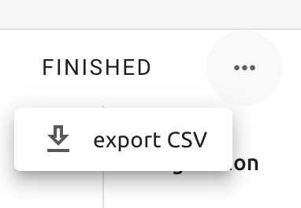

If you click this menu, you can download the information of the comcpute sessions
created so far in CSV format. After the following dialog opens, enter an appropriate
file name (if necessary), click the EXPORT button and you will get the CSV file.
Please note that a file name can have up to 255 characters.

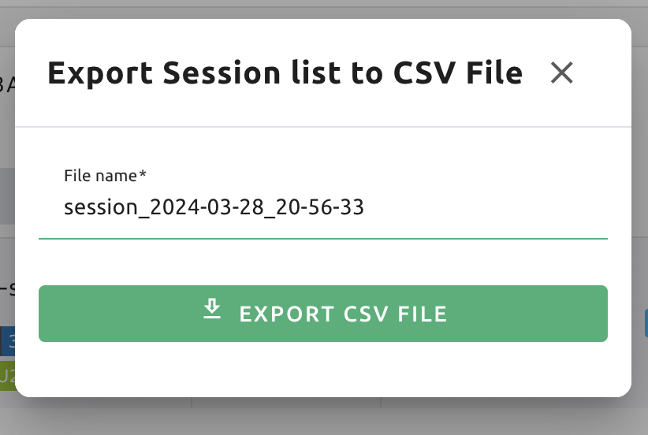

System settings
---------------

In the Configuration page, you can see main settings of Backend.AI server.
Currently, it provides several controls which can change and list settings.

You can change image auto install and update rule by selecting one option from
``Digest``, ``Tag``, ``None``. ``Digest`` is kind of checksum for the image which
verifies integrity of the image and also enhances  efficiency in downloading images
by reusing duplicated layers. ``Tag`` is only for developing option since it does not
guarantee the Integrity of the image.

.. warning::
   Don't change rule selection unless you completely understand the meaning of each rule.

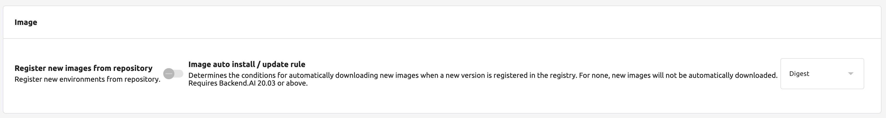

You can also change settings for scaling, plugins and enterprise features.

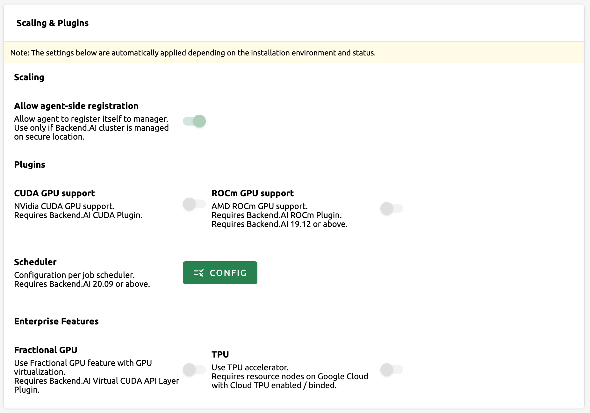

When a user launches a multi-node cluster session, which is introduced at
version 20.09, Backend.AI will dynamically create an overlay network to support
private inter-node communication. Admins can set the value of the Maximum
Transmission Unit (MTU) for the overlay network, if it is certain that the value
will enhance the network speed.

.. image:: overlay_network_setting_dialog.png
   :width: 350
   :align: center
   :alt: Overlay network setting dialog

.. seealso::
   For more information about Backend.AI Cluster session, please refer to
   :ref:`Backend.AI Cluster Compute Session<backendai-cluster-compute-session>` section.

You can edit the configuration per job scheduler by clicking the Scheduler's config button.
The values in the scheduler setting are the defaults to use when there is no scheduler
setting in each :ref:`resource group<scheduling-methods>`. If there is a resource
group-specific setting, this value will be ignored.

Currently supported scheduling methods include ``FIFO``, ``LIFO``, and ``DRF``.
Each method of scheduling is exactly the same as the :ref:`scheduling methods<scheduling-methods>` above.
Scheduler options include session creation retries. Session creation retries refers to the number
of retries to create a session if it fails. If the session cannot be created within the trials,
the request will be ignored and Backend.AI will process the next request. Currently, changes are
only possible when the scheduler is FIFO.

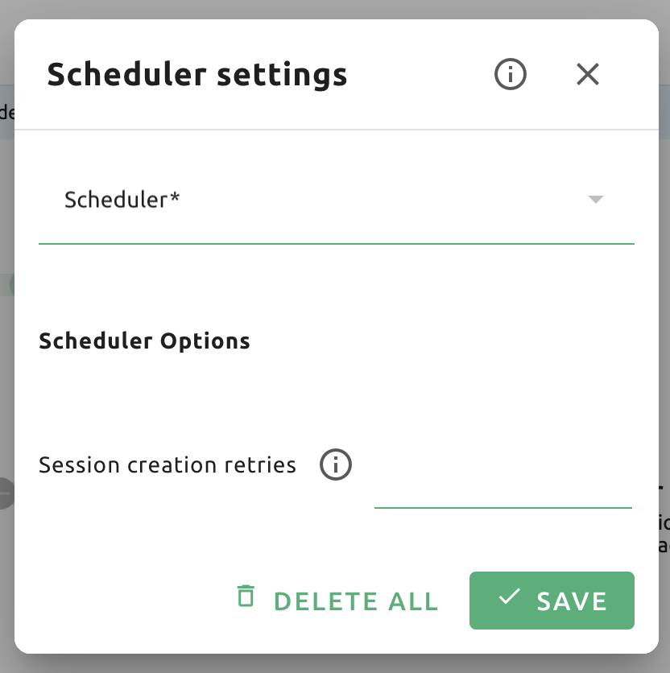

.. note::
   We will continue to add broader range of setting controls.

.. note::
   System settings are default settings. If resource group has certain value,
   then it overrides configured value in system settings.

Server management
-----------------

Go to the Maintenance page and you will see some buttons to manage the server.

- RECALCULATE USAGE: Occasionally, due to unstable network connections or
  container management problem of Docker daemon, there may be a case where the
  resource occupied by Backend.AI does not match the resource actually used by
  the container. In this case, click the RECALCULATE USAGE button to manually
  correct the resource occupancy.
- RESCAN IMAGES: Update image meta information from all registered Docker
  registries. It can be used when a new image is pushed to a
  Backend.AI-connected docker registry.

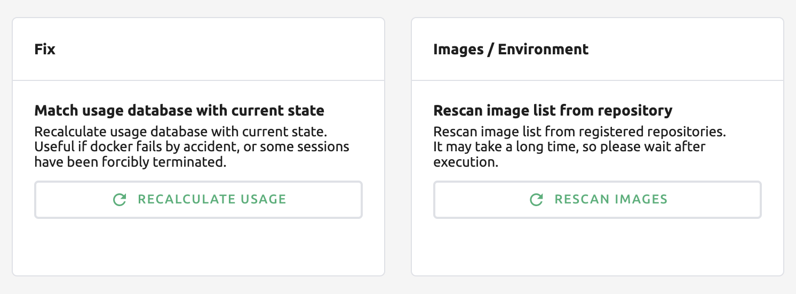

.. note::
   We will continue to add other settings needed for management, such as
   removing unused images or registering periodic maintenance schedules.

Detailed Information
---------------------

In Information page, you can see several detailed information and status of each feature.
To see Manager version and API version, check the Core panel. To see whether each component
for Backend.AI is compatible or not, check the Component panel.

.. note::

   This page is only for showing current information.

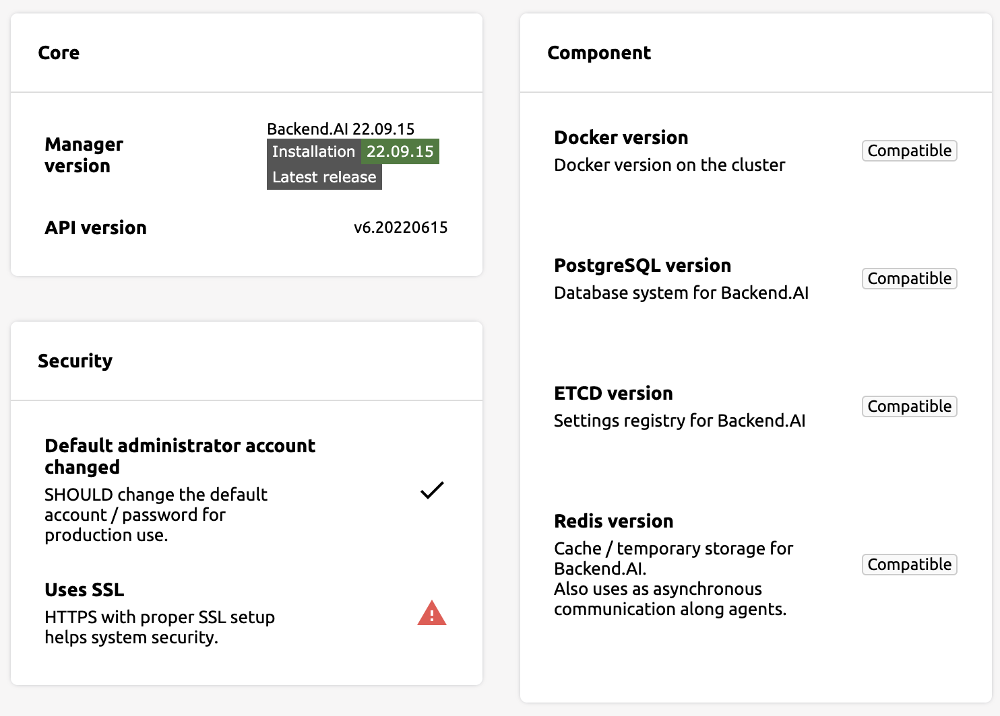

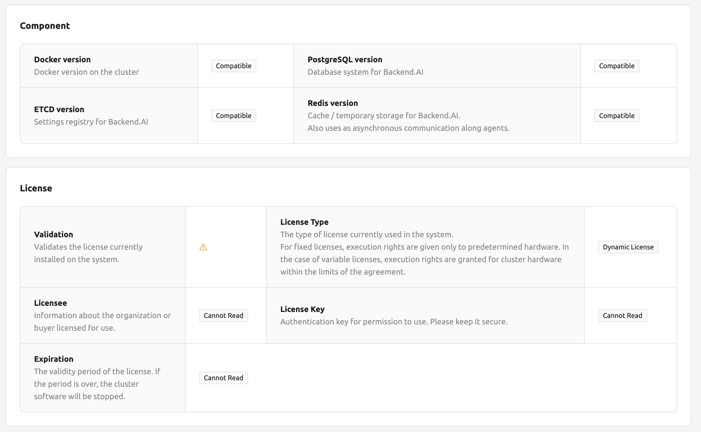
