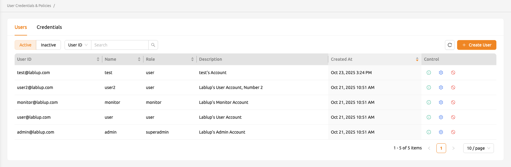
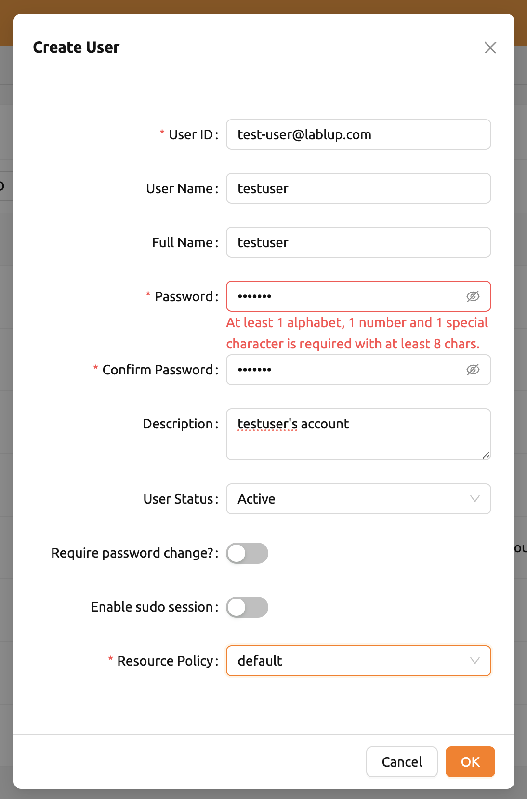
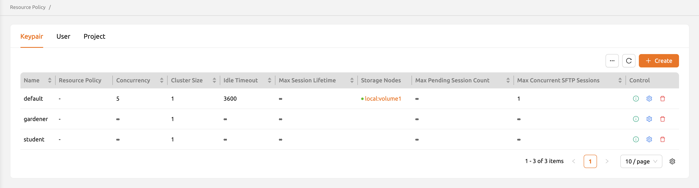
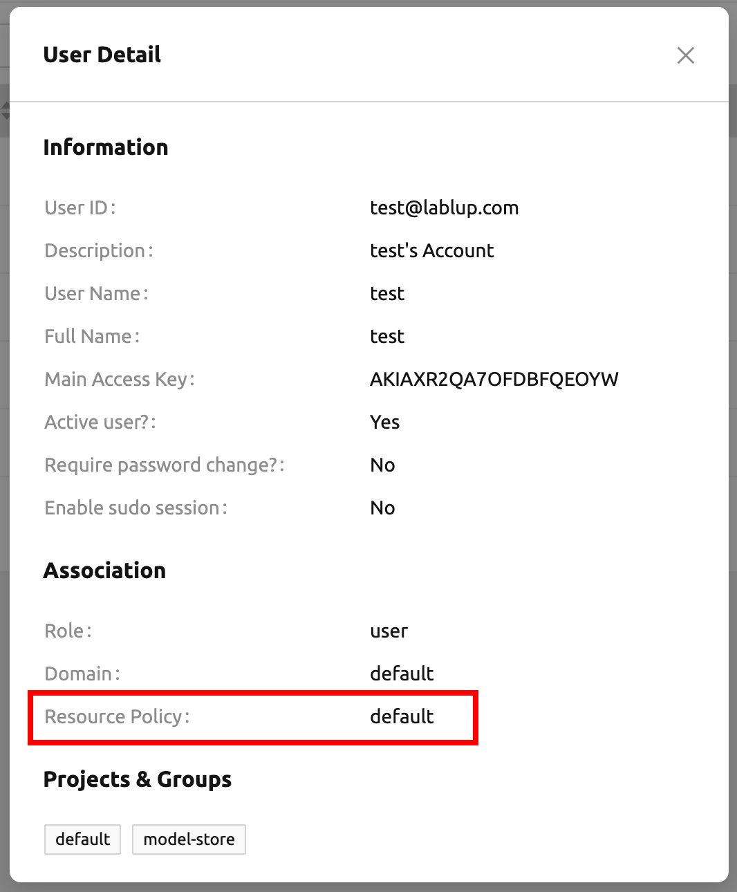
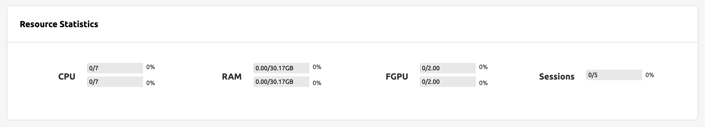
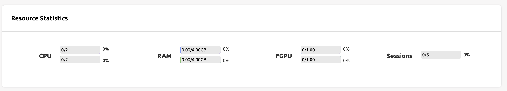
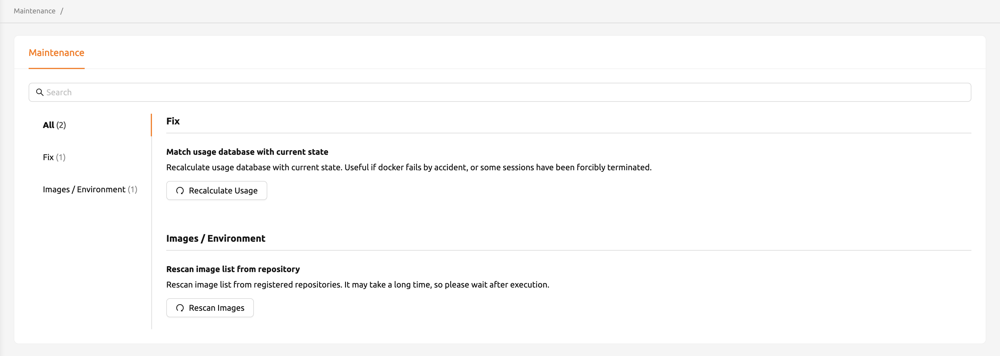

.. _admin-menu:

===========
Admin Menus
===========

When you log in with an admin account, you will see an additional Administration
menu in the bottom left sidebar. User information registered in Backend.AI is
listed in the Users tab. You can view active users in the Active tab and
inactive users in the Inactive tab.  Admins can see all user information. Only
admins can create and deactivate a user.

User ID (email) and Name (username) can be filtered by typing some text in the
search box on each column header.

Create and update user
----------------------

A user can be created by clicking the CREATE USER button. Note that the password
must be longer or equal to 8 characters and at least 1 alphabet/special
character/ number should be included. The maximum allowed length of E-Mail and
Username is 64.

.. note::

   If user with the same email or username already exists, it is not possible to
   creat user account. Please try other email and username.

If password didn't match the policy, then validation failed message will be displayed under the input field.
A message displays the reason why the password you entered is wrong, so you can easily check it.

* no inputs

* no input on password confirmation

* all input with non-matching value

Check if the user is created.

.. image:: check_if_user_created.png
   :alt: User management page

Click the green button in the Controls column for more detailed user
information. You can also check the domain and group information where the
user belongs.

.. image:: user_detail_dialog.png
   :width: 500
   :align: center
   :alt: Detailed information of a user

Click the gear icon in the Controls column to update information of a
user who already exists. User’s name, password, activation state, etc.
can be changed. Notice that user ID is disabled so that it can’t be changed.

Also, password can be updated with same policy as creating a new user.
Username and Fullname can contain up to 64 characters.

.. image:: user_update_dialog.png
   :width: 350
   :align: center
   :alt: User update dialog

Each of the two items at the bottom of this dialog has the following functions.

* Active user?: Indicates the user's active status. Inactive users cannot log
  in. You can adjust this option to change the user to active or inactive state.
  Note that for inactive users, they are displayed separately in the Inactive
  tab.
* Require password change?: If an admin has randomly specified a password while
  creating users in bulk, this field can be set to On to distinguish between
  them. This is a kind of descriptive flag indicating that password change is
  required, but it has no effect on actual use.

Deactivate user account
-----------------------

Deleting user accounts is not allowed even for superadmins, to track usage
statistics per user, metric retention, and accidental account loss. Instead,
admins can deactivate user accounts to keep users from logging in. Click the
trash icon in the Controls column. A dialog asking confirmation appears, and
you can deactivate the user by clicking the OKAY button.

.. image:: user_deactivate_confirmation.png
   :width: 400
   :align: center
   :alt: Deactivating user account

To re-activate users, go to Users - Inactive tab, and edit the target user to
turn on "Active user?" field.

.. note:: 

   Please note that inactivating the user affects all of credentials to be inactive,
   but reactivating the user does not affects inactivated credentials, since the user
   account can have multiple keypairs, which brings hard to decide which credential 
   should be reactivated.

.. _sharing-a-group-storage:

Sharing a group storage folder with group members
-------------------------------------------------

In addition to user's storage folders, Backend.AI provides storage folders for groups. A group storage folder is a folder belonging to a specific group, not a
specific user, and can be accessed by all users belonging to that group.

.. note::
   Group folders can only be created by administrators. Normal users can only
   access the contents of the group folder created by the administrator. Also,
   there may be cases where group folder is not allowed depending on the system
   settings.

First, log in with an administrator account and create a group folder. After
moving to the Data & Storage page, click NEW FOLDER to open the folder creation
dialog. Enter the folder name, set the Type to Group, and select the target
group. The target group should be set to the group to which User B belongs for
this example to work.  Permission is set to Read-Only again.

.. image:: group_folder_creation.png
   :width: 450
   :align: center

After confirming that the folder has been created, log in with the user B's
account and check that the group folder just created on the Data & Storage page
is displayed without an invitation procedure! You can see that R (Read Only) is
also displayed in the Permission column.

.. image:: group_folder_listed_in_B.png

In this way, Backend.AI provides invitation for user's folders and group folders
to help you share data and models in a flexible way.

Limiting Maximum Compute Resources per User (Keypair)
-----------------------------------------------------

.. note:: Objective

   * After logging in to the administrator account, use the function to set the
     allowed resources for each user (keypair)
   * Confirm that only allowed resources can be used at maximum when creating a
     compute session by a user

In Backend.AI, you can set a limit on the total amount of resources available
for each user and group. Resource limits per group can only be set through the
enterprise-dedicated administrator GUI Hub, but resource limits per user
(precisely user's keypair) can be set in the user GUI console.

Log in to the user GUI Console with an administrator account to check the
resource limit status. If you log in as an administrator, you will see more
administrator-only menus at the bottom of the left menu. Among them, click Users
to go to the user management page and click the Resource Policies tab. You can
check the list of currently registered resource policies. In the figure below,
there are a total of three policies (gardener, STUDENT, default). If you look at
the Resources column of the default policy, you can see that resources such as
Cores, Ram, and fGPU are marked as infinite (∞). The infinity means that no
resource restrictions have been placed at all.

Currently, the user accounts used in this guide are restricted by the default
resource policy. This can be found in the Credentials tab on the left. If you
look at the Resource Policy, you can also see that all resources can be used
indefinitely (to the extent the hardware allows).

Log in again with your user account, now. Go to the Sessions page and check the
resource indicator at the top. Check the maximum quota for CPU, RAM and FGPU.
This corresponds to the total amount of resources currently held by the test
node.

Click START to open the compute session creation dialog and pull the CPU, RAM,
and GPU sliders all the way to the right, and you can see that you cannot
allocate more than the total amount shown in the resource indicator.

Now log back into the administrator account and go to the Resource Policies tab.
Click the gear button in the Control column of the default policy to enter the
policy editing screen. In Update Resource Policy dialog, every option is
changeable except Policy Name which is the primary key for distinguishing the
resource policy from list. Each numeric value is regarded as maximum value for
creating/destroying a session and also for the number of vfolders. Uncheck the
Unlimited checkbox at the bottom of CPU, RAM, fGPU, and set the resource limits
to the desired values. Set the amount of constrained resource to be smaller than
the total amount of hardware. Here, we set it to 2, 4 and 1 respectively. Click
the UPDATE button to update the resource policy.

.. image:: update_resource_policy.png
   :width: 400
   :align: center

About details in each option in resource policy dialog, see the description below.

* Resource Policy
   * CPU : Specify the maximum amount of CPU cores. (max value: 512)
   * RAM : Specify the maximum amount of memory in GB. It would be good practice
     to set memory twice as large as the maximum value of GPU memory. (max value: 1024)
   * GPU : Specify the maximum amount of physical GPUs. If fractional GPU is
     enabled by the server (it is in most Enterprise sites), this setting has no
     effect. (max value: 64)
   * fGPU : Fractional GPU (fGPU) is literally split a single GPU to multiple
     partitions in order to use GPU efficiently. Notice that the minimum amount
     of fGPU required is differed by each image. If fractional GPU is not
     enabled by the server, this settings has no effect. (max value: 256)

* Sessions
   * Container Per Session : The maximum number of containers per session.
     Currently, this value has no effect since the server only allows one
     container per compute session. (max value: 100)
   * Idle timeout (sec.) : Configurable period of time during which the user can
     be inactive without any impact on their session. If there is no activity at
     all on a compute session for idle timeout, the session will be garbage
     collected and destroyed automatically.(max value: 15552000 (approx. 180 days))
   * Concurrent Jobs : Maximum number of concurrent compute session per keypair.
     If this value is set to 3, for example, user bound to this resource policy
     caanot create more than 3 compute sessions simultaneously. (max value: 100)

* Folders
   * Allowed hosts : Backend.AI supports many NFS mountpoint. This field limits
     the accessibility to them. Even if a NFS named "data-1" is mounted on
     Backend.AI, user cannot access it unless it is allowed by resource policy.
   * Capacity(GB) : the maximum size (GB) a storage folder can contain. This
     feature is only effective for special type of storages/filesystems such as
     FlashBlade. (max value: 1024)
   * Max. # : the maximum number of storage folders that can be created/invited.
     (max value: 50)

In the resource policy list, check that the Resources value of the default
policy has been updated.

.. image:: update_check.png
   :width: 400
   :align: center

Once again, log in with your user account. Go to the Session page. You can see
that the resource constraint value set earlier is reflected in the resource
indicator at the top.

Click START to open the calculation session creation dialog and pull the CPU,
RAM, and GPU sliders all the way to the right, and you can see that it cannot be
moved beyond the value after the resource constraint was placed.

In this way, it was confirmed that the development user can control the maximum
amount of resources that can be allocated when creating a compute session
based on the user's key pair.

You can also delete each of resource keypairs by clicking trash can icon
in the Control panel. When you click the icon, the confirmation dialog will appears.
click OKAY button to delete.

.. image:: resource_policy_delete_dialog.png
   :width: 350
   :align: center

.. note::
   
   If there's any user including inactive user follows the resource policy to be deleted,
   It will throw an error. Please make sure that Before deleting the task, make sure that
   no users who have selected that resource policy remain.

.. note::

   In each of USERS, CREDENTIALS, RESOURCE POLICIES tabs, there is an icon
   (``...``) on the far right side of the tab header. Clicking this reveals
   export CSV menu, which again brings up a CSV export dialog for each tabs.
   By giving appropriate file name, if necessary, and clicking EXPORT CSV FILE
   button, you can download the list of users, keypairs, and/or resource
   policies.

    .. image:: export_csv_user.png
       :width: 400
       :align: center

Session List Download
---------------------

There's additional feature in Session page for admin. 
On the right side of the OTHERS tab there is a menu marked with ``...``.
When you click this menu, a sub-menu export CSV appears.

If you click this menu, you can download the information of the calculation sessions 
created so far in CSV format. After the following dialog opens, enter an appropriate 
file name (if necessary) and click the EXPORT button. Please note that file name can 
only contain up to 255 characters. A CSV file will be downloaded soon.

.. image:: export_session_dialog.png
   :width: 350
   :align: center

Server management
-----------------

Go to the Maintenance page and you will see some buttons to manage the server.

- RECALCULATE USAGE: Occasionally, due to unstable network connections or
  container management problem of Docker daemon, there may be a case where the
  resource occupied by Backend.AI does not match the resource actually used by
  the container. In this case, click the RECALCULATE USAGE button to manually
  correct the resource occupancy.

Information
-----------

Information page display various details about Backend.AI service, license
information.
