.. _admin-menu:

===========
Admin Menus
===========

When you log in with an admin account, you will see an additional Administration
menu in the bottom left sidebar. User information registered in Backend.AI is
listed in the Users tab. Domain admin can see only the users who belong to the domain,
while superadmin can see all users' information. Only
superadmin can create and deactivate a user.

User ID (email) and Name (username) can be filtered by typing text in the
search box on each column header.

.. image:: admin_user_page.png
   :alt: User management page

Create and update users
-----------------------

A user can be created by clicking the CREATE USER button. Note that the password
must be longer or equal to 8 characters and at least 1 alphabet/special
character/ number should be included. The maximum length allowed for E-Mail and Username is 64.

.. note::

   If a user with the same email or username already exists, it is not possible to
   creat user account. Please try other email and username.

.. image:: create_user_dialog.png
   :width: 500
   :align: center
   :alt: Create user dialog

Check if the user is created.

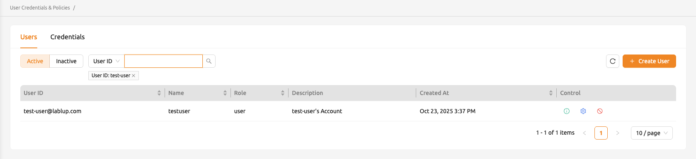

Click the green button in the Controls panel for more detailed user
information. You can also check the domain and project information where the
user belongs.

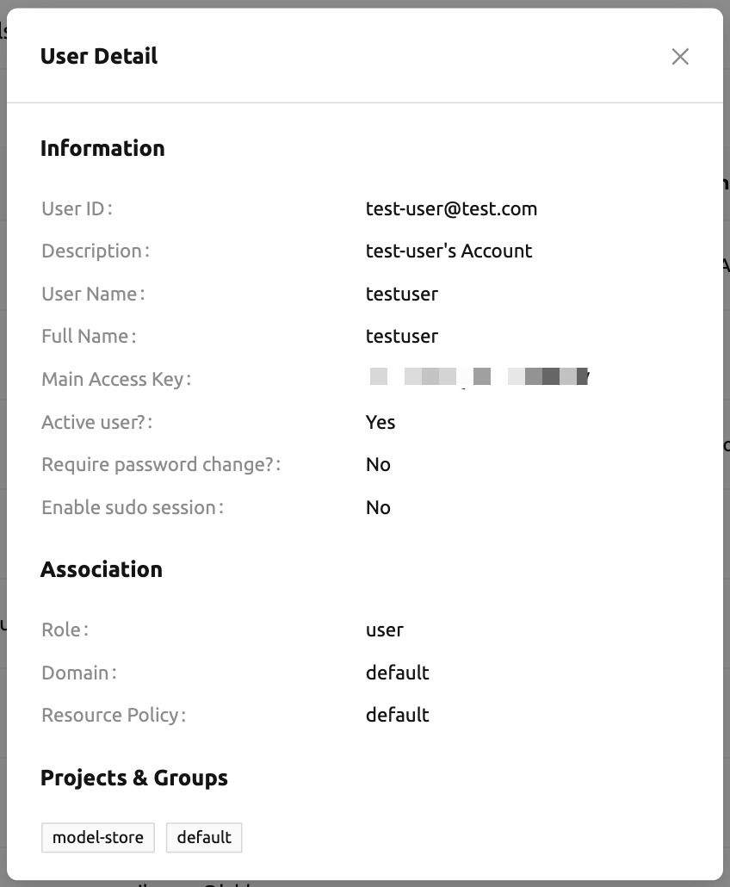

Click the gear icon in the Controls panel to update information of a user who
already exists. User's name, password, activation state, etc. can be changed. User ID cannot be changed.

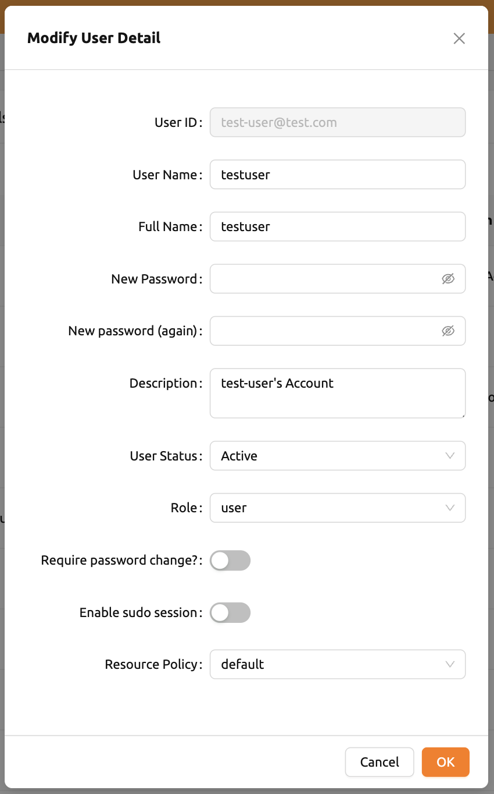

Each of the two items at the bottom of the dialog has the following functions.

* User Status: Indicates the user's status. Inactive users cannot log
  in. Before Verification is a status indicates that a user needs an additional
  step to activate the account such as email verification or an approval from an
  admin. Note that the inactive users are listed in the Inactive tab separately.

  .. image:: active_user_selection.png
     :width: 350
     :align: center
* Require password change?: If the admin has chosen random passwords while
  creating users in batches, this field can be set to ON to indicate that
  password change is required. The users will see the top bar that notify user
  to update their password, but this is a kind of descriptive flag which has no
  effect on actual use.

Inactivate user account
-----------------------

Deleting user accounts is not allowed even for superadmins, to track usage
statistics per user, metric retention, and accidental account loss. Instead,
admins can inactivate user accounts to keep users from logging in. Click the
trash icon in the Controls panel. A dialog asking confirmation appears, and
you can inactivate the user by clicking the OKAY button.

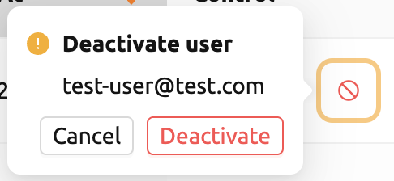

To re-activate users, go to Users - Inactive tab, and select the status of
the target user to ``Active``.

.. warning::

   Please note that inactivating the user changes all of credentials to be inactive,
   but reactivating the user does not reactivate the inactivated credentials, since the user
   account can have multiple keypairs, which brings it hard to decide which credential
   should be reactivated.

Manage User's Keypairs
----------------------

Each user account usually have one or more keypairs. A keypair is used for API
authentication to the Backend.AI server, after user logs in. Login requires
authentication via user email and password, but every request the user sends to
the server is authenticated based on the keypair.

A user can have multiple keypairs, but to reduce the user's burden of managing
keypairs, we are currently using only one of the user's keypairs to send requests.
Also, when you create a new user, a keypair is automatically created, so you do
not need to create and assign a keypair manually in most cases.

Keypairs can be listed on the Credentials tab of in the Users page. Active
keypairs are shown immediately, and to see the inactive keypairs, click the
Inactive panel at the bottom.

.. image:: credential_list_tab.png
   :alt: Credential list page

Like in Users tab, you can use the buttons in the Controls panel to view or
update keypair details. Click the blue trash button to disable that keypair, or
click the red trash button to completely delete the keypair. However, if you
have created a compute session using a keypair, you cannot delete it. If you
accidentally deleted a keypair, you can re-create keypair for the user by
clicking the ADD CREDENTIAL button at the upper right corner. If necessary, you
can also explicitly enter the access key and secret key by clicking the Advanced
panel.

The Rate Limit field is where you specify the maximum number of requests that
can be sent to the Backend.AI server in 15 minutes. For example, if set to 1000,
and the keypair sends more than 1000 API requests in 15 minutes, and the server
throws an error and does not accept the request. It is recommended to use the
default value and increase it when the API request frequency goes up high
according to the user's pattern.

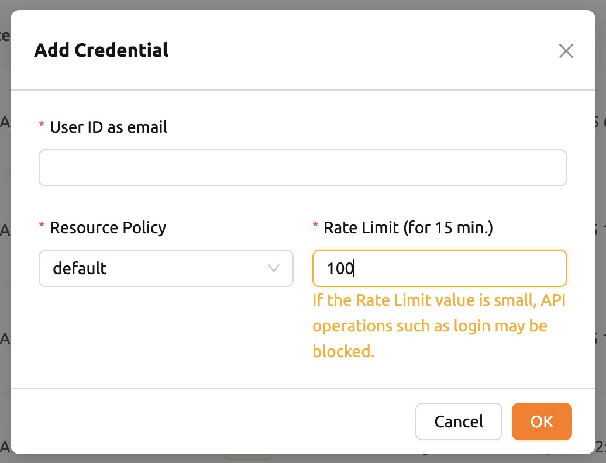

.. _sharing-a-group-storage:

Share project storage folders with project members
--------------------------------------------------

Backend.AI provides storage folders for projects, in addition to user's own
storage folder. A project storage folder is a folder belonging to a specific
project, not a specific user, and can be accessed by all users in that project.

.. note::
   Project folders can be created only by administrators. Normal users can only
   access the contents of the project folder created by the administrator.
   Depending on the system settings, project folders may not be allowed.

First, log in with an admin account and create a project folder. After moving to
the Data & Storage page, click NEW FOLDER to open the folder creation dialog.
Enter the folder name, set the Type to Project, and select the project to share
the folder.  Let's select the project to which User B belongs for this example
to work. Permission is set to Read-Only.

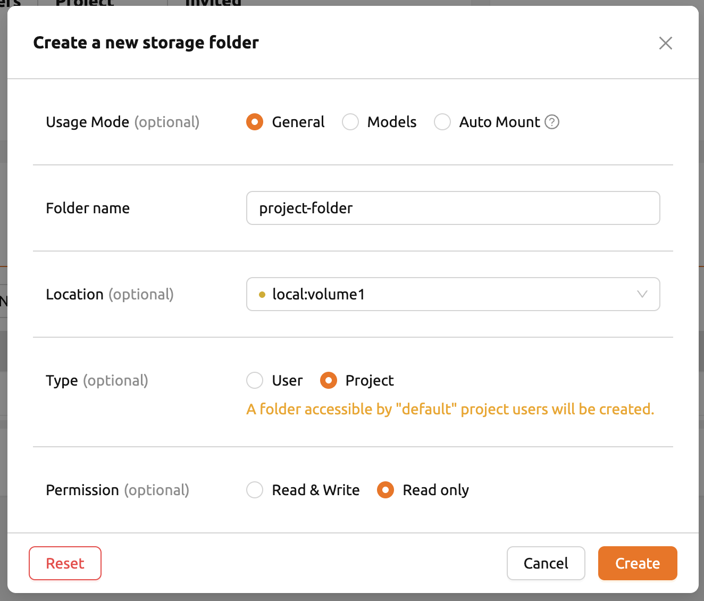

After confirming that the folder has been created, log in with the User B's
account and check that the project folder just created on the Data & Storage page
is displayed without any invitation procedure. You can see that R (Read Only) is
also displayed in the Permission panel.

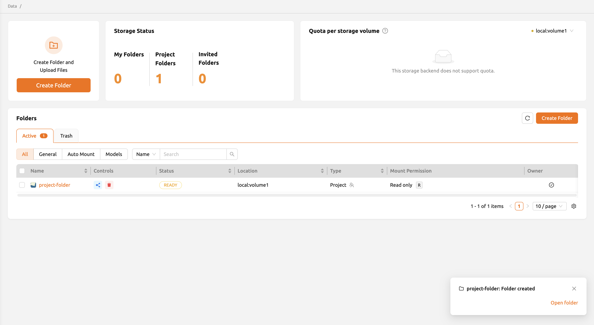

Manage Resource Policy
----------------------

In Backend.AI, admins can set a limit on the total amount of resources available
for each user and project. Resource limits per project can only be set through the
enterprise-dedicated administrator GUI Control-Panel, but resource limits per user
(precisely per user's keypair) can be set in the user Web-UI.

Resource policies allow you to set maximum allowed resources and/or
other compute session related settings per keypair basis. If necessary, multiple
resource policies can be created, for example, user / research purposes, and
apply them separately to each keypair.

.. note::
   To set resource policies at the domain and project level, you have to use
   admin Control-Panel, a UI for superadmin only. In the Web-UI, you can only set
   resource policies based on keypairs. Control-Panel is a part of the
   enterprise version.

In Resource Policies tab on the Users page, the admin can check the list of
currently registered resource policies.  In the figure below, there are a total
of three policies (gardener, STUDENT, default).  The infinity (∞) marks for
resources such as Cores, Ram, and fGPU in the Resources panel means that no
resource restrictions have been placed for those resources.

.. image:: resource_policy_page.png
   :alt: Resource policy page

The user account currently used in this guide is under the default
resource policy. This can be confirmed in the Credentials tab on the left. In the Resource Policy panel,
you can also see that all resources can be used to the extent the hardware allows (∞).

.. image:: credentials.png

You can modify resouce policies by clicking the gear button in the Control panel of default policy group.
In Update Resource Policy dialog, every option is
changeable except Policy Name, which is the primary key for distinguishing the
resource policies in the list. Uncheck the Unlimited checkbox at the bottom of CPU, RAM, fGPU, and set the resource limits
to the desired values. Set the amount of allocated resource to be smaller than
the total amount of hardware's. Here, CPU, RAM and fGPU are set to 2, 4 and 1, respectively. Click
the UPDATE button to update the resource policy.

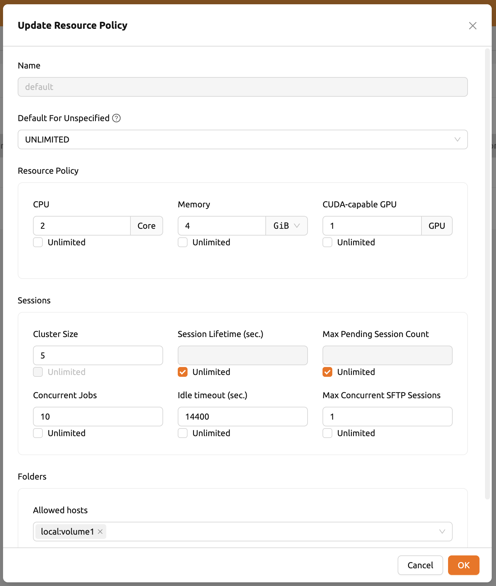

About details of each option in resource policy dialog, see the description below.

* Resource Policy
   * CPU:  Specify the maximum amount of CPU cores. (max value: 512)
   * RAM: Specify the maximum amount of memory in GB. It would be good practice
     to set memory twice as large as the maximum value of GPU memory. (max value: 1024)
   * GPU: Specify the maximum amount of physical GPUs. If fractional GPU is
     enabled by the server, this setting has no effect. (max value: 64)
   * fGPU: Fractional GPU (fGPU) is literally split a single GPU to multiple
     partitions in order to use GPU efficiently. Notice that the minimum amount
     of fGPU required is differed by each image. If fractional GPU is not
     enabled by the server, this settings has no effect. (max value: 256)

* Sessions
   * Container Per Session: The maximum number of containers per session.
     To make a user to create a cluster session, this value should be greater than 1.
     (max value: 100)
   * Idle timeout (sec.): Configurable period of time during which the user can
     leave their session untouched. If there is no activity at all on a
     compute session for idle timeout, the session will be garbage collected
     and destroyed automatically. The criteria of the "idleness" can be
     various and set by the administrators. (max value: 15552000 (approx. 180 days))
   * Concurrent Jobs: Maximum number of concurrent compute session per keypair.
     If this value is set to 3, for example, users bound to this resource policy
     cannot create more than 3 compute sessions simultaneously. (max value: 100)
   * Session Lifetime (sec.): Limits the maximum lifetime of a compute session
     from the reservation in the active status, including ``PENDING`` and
     ``RUNNING`` statuses. After this time, the session will be force-terminated
     even if it is fully utilized. This will be useful to prevent the session
     from running indefinitely.

* Folders
   * Allowed hosts: Backend.AI supports many NFS mountpoint. This field limits
     the accessibility to them. Even if a NFS named "data-1" is mounted on
     Backend.AI, users cannot access it unless it is allowed by resource policy.
   * Capacity (GB): the maximum size (GB) a storage folder can contain. This
     feature is only effective for special type of storages/filesystems such as
     FlashBlade. (max value: 1024)
   * Max. #: the maximum number of storage folders that can be created/invited.
     (max value: 100)

In the resource policy list, check that the Resources value of the default
policy has been updated.

.. image:: update_check.png
   :width: 400
   :align: center

You can create a new resource policy by clicking the CREATE POLICY button. Each
setting value is the same as described above.

To create a resource policy and associate it with a keypair, go to the
Credentials tab of the Users page, click the gear button located in the
Controls panel of the desired keypair, and click the Select Policy field to
choose it.

You can also delete each of resource keypairs by clicking trash can icon
in the Control panel. When you click the icon, the confirmation dialog will appears.
click OKAY button to delete.

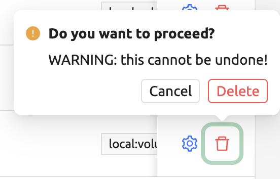

.. note::

   If there's any users (including inactive users) following a resource policy to be deleted,
   deletion may not be done. Before deleting a resource policy, please make sure that
   no users remain under the resource policy.

.. note::

   In each of USERS, CREDENTIALS, RESOURCE POLICIES tabs, there is an icon
   (``...``) on the right side of the tab header. Clicking this shows
   export CSV menu, which again brings up a CSV export dialog for each tabs.
   By giving an appropriate file name, if necessary, and clicking EXPORT CSV FILE
   button, you can download the list of users, keypairs, and/or resource
   policies.

    .. image:: export_csv_user.png
       :width: 400
       :align: center

Manage Images
-------------

Admins can manage images, which are used in creating a compute session, in the
Images tab of the Environments page. In the tab, meta information of all images
currently in the Backend.AI server is displayed. You can check information such
as registry, namespace, image name, image's based OS, digest, and minimum
resources required for each image. For images downloaded to one or more agent
nodes, there will be a ``installed`` tag in each Status column.

.. note::
   The feature to install images by selecting specific agents is currently
   under development.

.. image:: image_list_page.png
   :alt: Image list page

You can change the minimum resource requirements for each image by clicking the
gear icon in the Controls panel. Each image has hardware and resource
requirements for minimal operation. (For example, for GPU-only images, there
must be a minimum allocated GPU.) The default value for the minimum resource
amount is provided as embedded in the image's metadata. If an attempt is made to
create a compute session with a resource that is less than the amount of
resources specified in each image, the request is automatically adjusted to the
minimum resource requirements for the image and then generated, not canceled.

.. warning::
   Don't change the minimum resource requirements to an amount less than the
   predefined value! The minimum resource requirements included in the image
   metadata are values that have been tested and determined. If you are not
   really sure about the minimum amount of resources you want to change, leave
   it in the default.

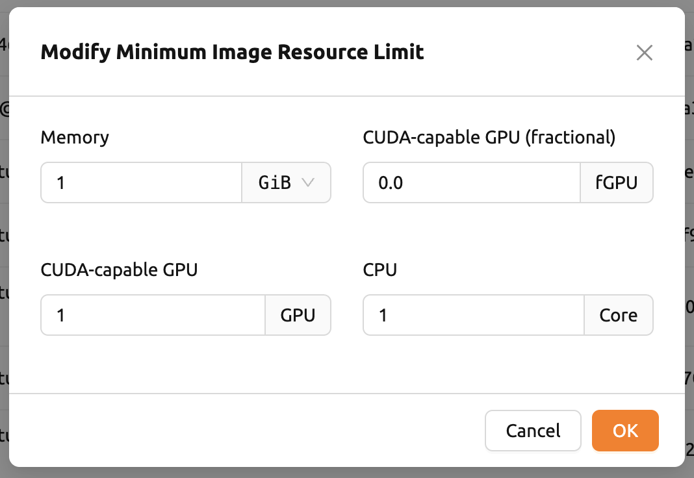

Manager docker registry
-----------------------

You can click on the Registries tab in Environments page to see the information
of the docker registry that are currently connected. ``cr.backend.ai`` is
registered by default, and it is a registry provided by Harbor.

.. note::
   In the offline environment, the default registry is not accessible, so
   click the trash icon on the right to delete it.

Click the refresh icon in Controls to update image metadata for Backend.AI from
the connected registry. Image information which does not have labels for
Backend.AI among the images stored in the registry is not updated.

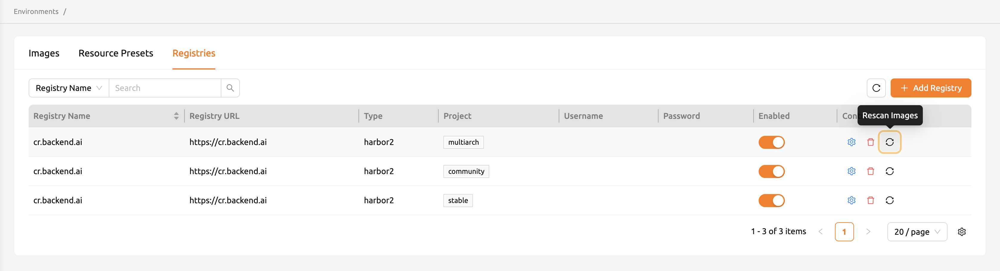

You can add your own private docker registry by clicking the ADD REGISTRY
button. Note that Registry Hostname and Registry URL address must be set
identically, and in the case of Registry URL, a scheme such as ``http://`` or
``https://`` must be explicitly attached. Also, images stored in the registry
must have a name prefixed with Registry Hostname. Username and Password are
optional and can be filled in if you set separate authentication settings in the
registry.

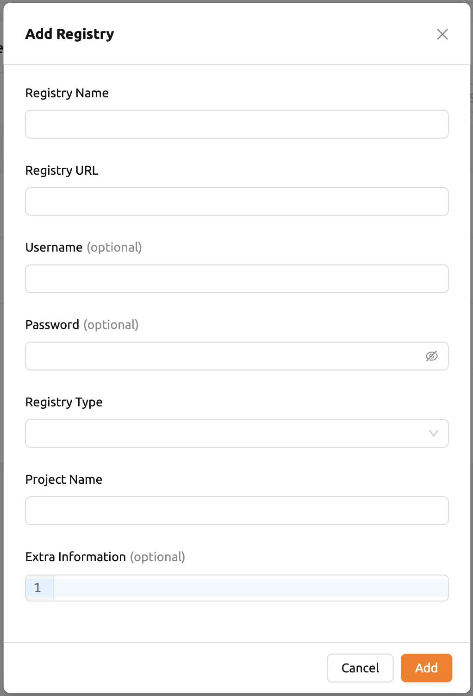

You can also update the information of an existing registry, except the
hostname.

Even if you created a registry and update meta information, users cannot use the
images in the registry, immediately. Just as you had to register the allowed hosts
to use the storage host, you must register the registry in the allowed docker
registries field at the domain or project level, after registering the registry,
so that users in the domain or project can access the registry image. Allowed
docker registries can be registered using the Control-Panel with domain and project
management. The function to set the allowed docker registries in the keypair's
resource policy is not provided yet.

Manage resource preset
----------------------

The following predefined resource presets are displayed in the Resource
allocation panel when creating a compute session. Superadmin can manage these
resource presets.

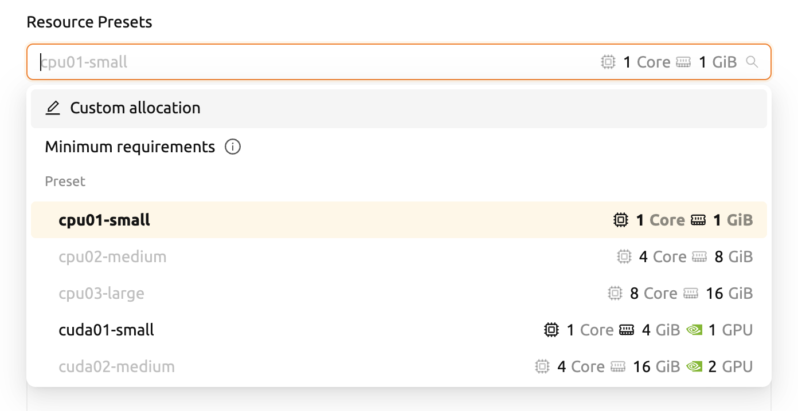

Go to the Resource Presets tab on the Environment page. You can check the list
of currently defined resource presets.

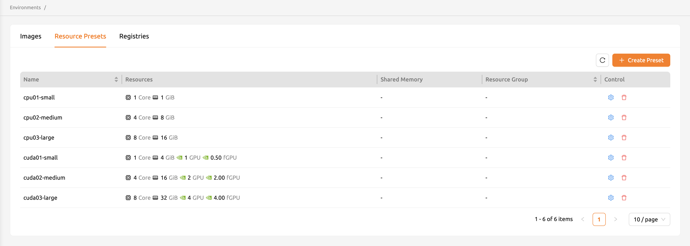

You can set resources such as CPU, RAM, fGPU, etc. to be provided by the
resource preset by clicking the gear icon (cogwheel) in the Controls panel.
In the example below, the GPU field is disabled since the GPU provision mode of
the Backend.AI server is set to "fractional". After setting the resources with
the desired values, save it and check if the corresponding preset is displayed
when creating a compute session. If available resources are less
than the amount of resources defined in the preset, the corresponding preset
would not be shown.

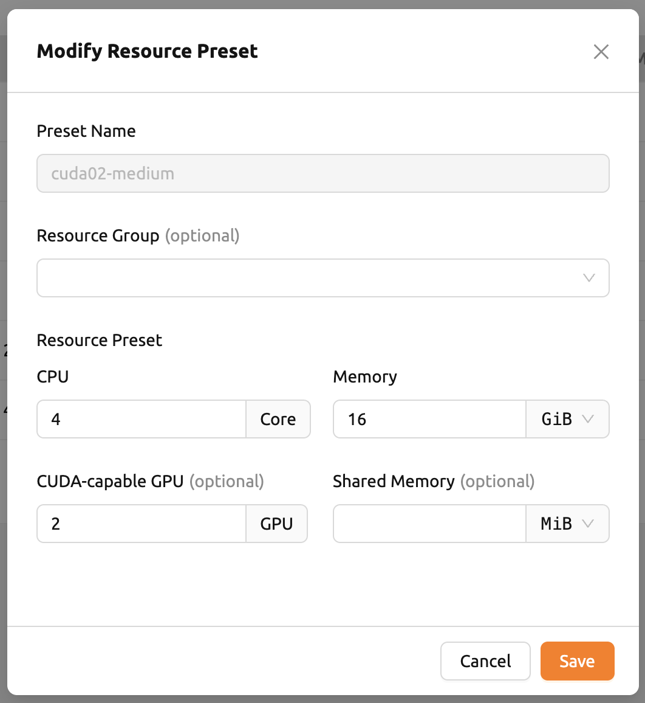

Also you can create resource preset by Clicking CREATE PRESETS button in the
right top of the Resource Presets tab. You cannot create the same resource
preset name that already exists, since it is the key value for distinguishing
each resource preset.

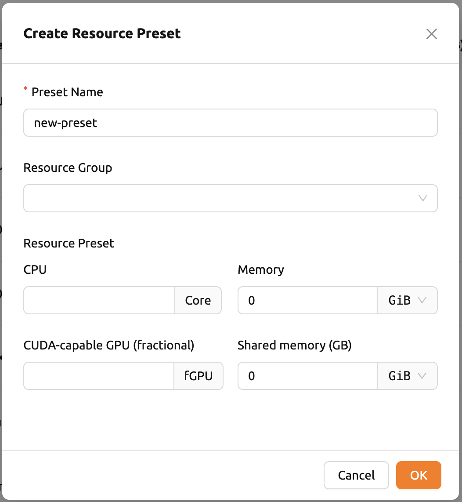

Manage agent nodes
------------------

Superadmins can view the list of agent worker nodes, currently connected to
Backend.AI, by visiting the Resources page. You can check agent node's IP,
connecting time, actual resources currently in use, etc. The Web-UI does
not provide the function to manipulate agent nodes.

Query agent nodes
~~~~~~~~~~~~~~~~~

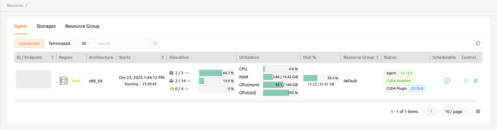

Also You can see exact usage about the resources in the agent worker node
by Click note icon in the Control panel.

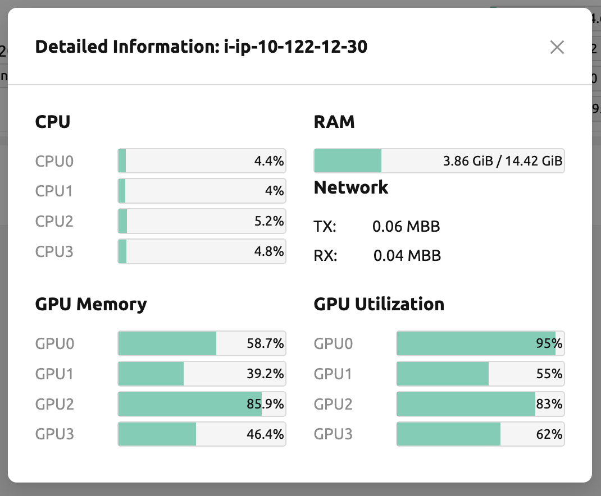

On Terminated tab, you can check the information of the agents that has been
connected once and then terminated or disconnected. It can be used as a
reference for node management. If the list is empty, then It means
that there's no disconnection or termination occurred.

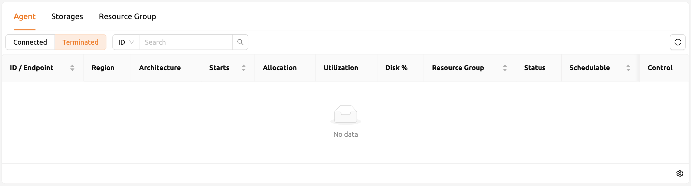

Set schedulable status of agent nodes
~~~~~~~~~~~~~~~~~~~~~~~~~~~~~~~~~~~~~

You may want to prevent new compute sessions from being scheduled to an Agent
service without stopping it. In this case, you can disable the Schedulable
status of the Agent. Then, you can block the creation of a new session while
preserving the existing sessions on the Agent.

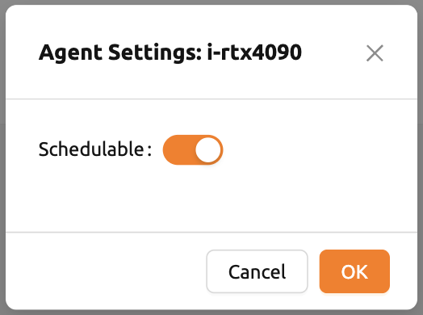

.. _scheduling-methods:

Manage resource group
---------------------

Agents can be grouped into units called resource (scaling) groups. For example,
let's say there are 3 agents with V100 GPUs and 2 agents with P100 GPUs. You
want to expose two types of GPUs to users separately, then you can group three
V100 agents into one resource group, and the remaining two P100 agents into
another resource group.

Adding a specific agent to a specific resource group is not currently handled in
the Web-UI, and it can be done by editing agent config file from the installation
location and restart the agent daemon. Management of the resource groups is
possible in Resource Group tab of the Resource page.

.. image:: scaling_group_tab.png
   :alt: Resource group tab

You can edit a resource group by clicking the gear icon in the Control
panel. In the Select scheduler field, you can choose the scheduling method for
creating a compute session. Currently, there are three types: ``FIFO``, ``LIFO``, and
``DRF``. ``FIFO`` and ``LIFO`` are scheduling methods creating the first- or the
last-enqueued compute session in the job queue. ``DRF`` stands for Dominant Resource
Fairness, and it aims to provide resources as fair as possible for each user.
You can deactivate a resource policy by turning off Active Status.

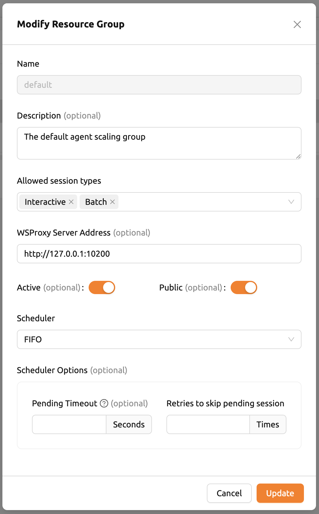

WSProxy Server Address sets the WSProxy address for the resource group's Agents
to use. If you set a URL in this field, WSProxy will relay the traffic of an app
like Jupyter directly to the compute session via Agent bypassing Manager (v2
API). By enabling the v2 API, you can lower the Manager's burden when using app
services. This also achieves the better efficiency and scalability in deploying
the services. If a direct connection from WSProxy to the Agent node is not
available, however, please leave this field blank to fall back to the v1 API,
which relays the traffic through Manager in a traditional way.

The resource group has further Scheduler Options. The details are described below.

* Allowed session types:
  Since user can choose the type of session, resource group can allow certain type of session.
  You can allow both type, or allow interactive or batch only.
* Pending timeout:
  A compute session will be canceled if it stays ``PENDING`` status for longer
  than the Pending timeout. When you wish to prevent a session from remaining
  PENDING indefinitely, set this time. Set this value to zero (0) if you do not
  want to apply the pending timeout feature.
* The number of retries to skip pending session:
  The number of retries the scheduler tries before skipping a PENDING session.
  It can be configured to prevent the situation where one PENDING session blocks
  the scheduling of the subsequent sessions indefinitely (Head-of-line blocking,
  HOL). If no value is specified, the global value in Etcd will be used (``num
  retries to skip``, default three times).

.. image:: modify_resource_group_scheduler_options.png
   :width: 350
   :align: center
   :alt: Modify resource group scheduler options

You can create a new resource policy by clicking the CREATE button.
Likewise other creating options, you cannot create a resource policy with the name
that already exists, since name is the key value.

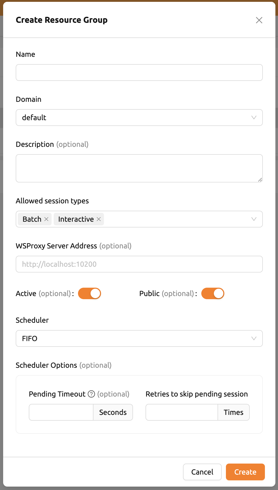

Storages
--------

On STORAGES tab, you can see what kind of mount volumes (usually NFS) exist.

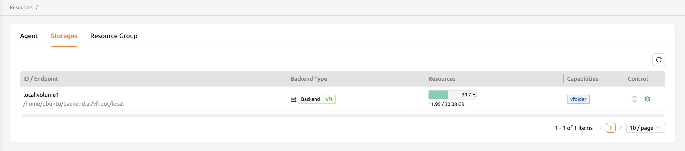

Download session lists
----------------------

There's additional feature in Session page for admin.
On the right side of the OTHERS tab there is a menu marked with ``...``.
When you click this menu, a sub-menu export CSV appears.

.. image:: export_csv_menu.png

If you click this menu, you can download the information of the comcpute sessions
created so far in CSV format. After the following dialog opens, enter an appropriate
file name (if necessary), click the EXPORT button and you will get the CSV file.
Please note that a file name can have up to 255 characters.

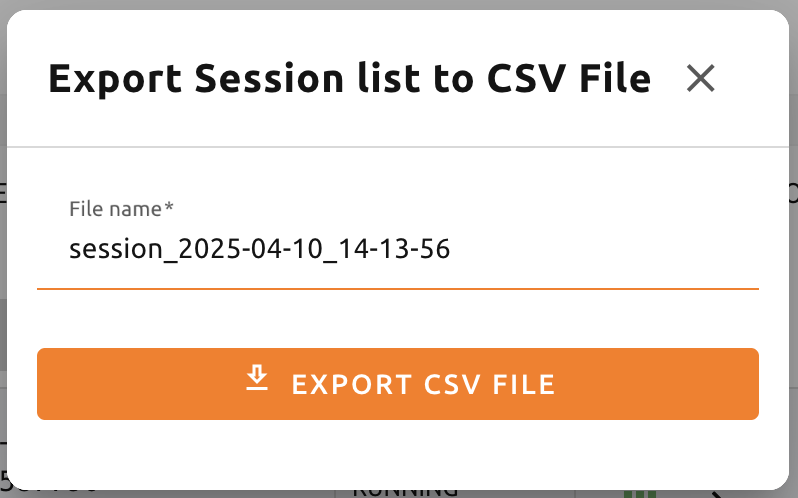

System settings
---------------

In the Configuration page, you can see main settings of Backend.AI server.
Currently, it provides several controls which can change and list settings.

You can change image auto install and update rule by selecting one option from
``Digest``, ``Tag``, ``None``. ``Digest`` is kind of checksum for the image which
verifies integrity of the image and also enhances  efficiency in downloading images
by reusing duplicated layers. ``Tag`` is only for developing option since it does not
guarantee the Integrity of the image.

.. warning::
   Don't change rule selection unless you completely understand the meaning of each rule.

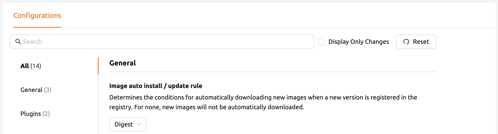

You can also change settings for scaling and plugins.

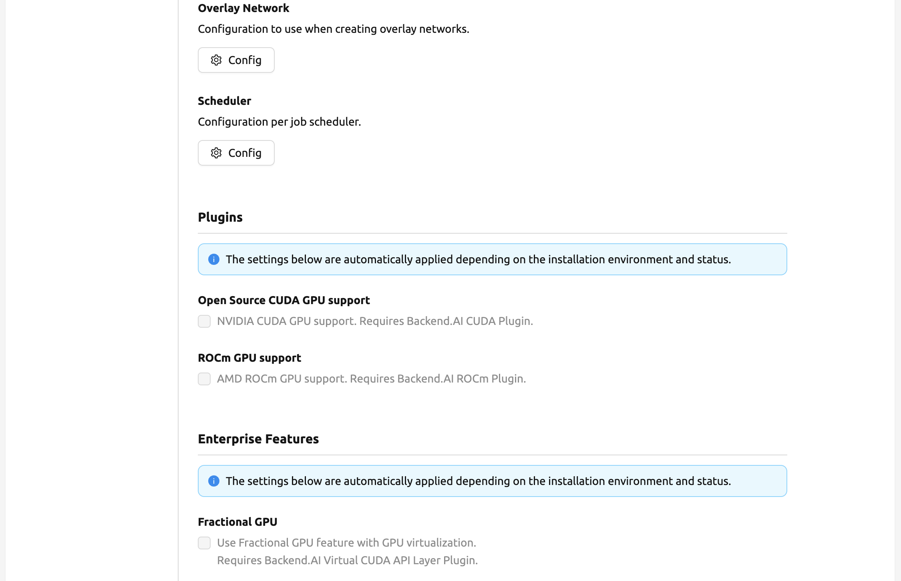

When a user launches a multi-node cluster session, which is introduced at
version 20.09, Backend.AI will dynamically create an overlay network to support
private inter-node communication. Admins can set the value of the Maximum
Transmission Unit (MTU) for the overlay network, if it is certain that the value
will enhance the network speed.

.. image:: overlay_network_setting_dialog.png
   :width: 350
   :align: center
   :alt: Overlay network setting dialog

.. seealso::
   For more information about Backend.AI Cluster session, please refer to
   :ref:`Backend.AI Cluster Compute Session<backendai-cluster-compute-session>` section.

You can edit the configuration per job scheduler by clicking the Scheduler's config button.
The values in the scheduler setting are the defaults to use when there is no scheduler
setting in each :ref:`resource group<scheduling-methods>`. If there is a resource
group-specific setting, this value will be ignored.

Currently supported scheduling methods include ``FIFO``, ``LIFO``, and ``DRF``.
Each method of scheduling is exactly the same as the :ref:`scheduling methods<scheduling-methods>` above.
Scheduler options include session creation retries. Session creation retries refers to the number
of retries to create a session if it fails. If the session cannot be created within the trials,
the request will be ignored and Backend.AI will process the next request. Currently, changes are
only possible when the scheduler is FIFO.

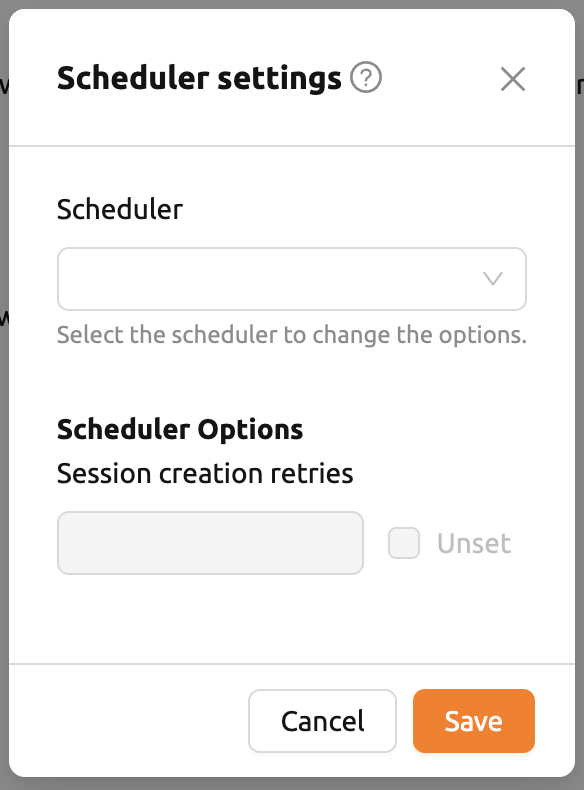

.. note::
   We will continue to add broader range of setting controls.

.. note::
   System settings are default settings. If resource group has certain value,
   then it overrides configured value in system settings.

Server management
-----------------

Go to the Maintenance page and you will see some buttons to manage the server.

- RECALCULATE USAGE: Occasionally, due to unstable network connections or
  container management problem of Docker daemon, there may be a case where the
  resource occupied by Backend.AI does not match the resource actually used by
  the container. In this case, click the RECALCULATE USAGE button to manually
  correct the resource occupancy.
- RESCAN IMAGES: Update image meta information from all registered Docker
  registries. It can be used when a new image is pushed to a
  Backend.AI-connected docker registry.

.. image:: maintenance_page.png
   :width: 500
   :align: center
   :alt: Maintenance page

.. note::
   We will continue to add other settings needed for management, such as
   removing unused images or registering periodic maintenance schedules.

Detailed Information
---------------------

In Information page, you can see several detailed information and status of each feature.
To see Manager version and API version, check the Core panel. To see whether each component
for Backend.AI is compatible or not, check the Component panel.

.. note::

   This page is only for showing current information.

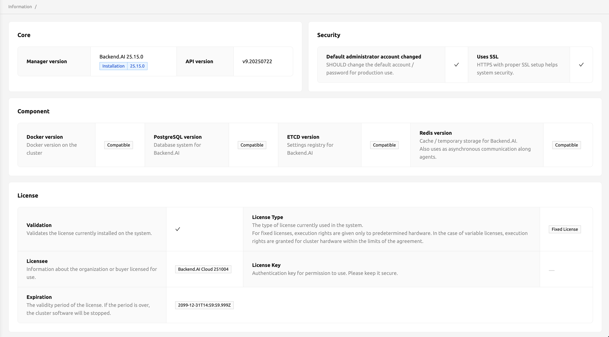

.. image:: information_page_2.png
   :align: center
   :alt: Information page 2
