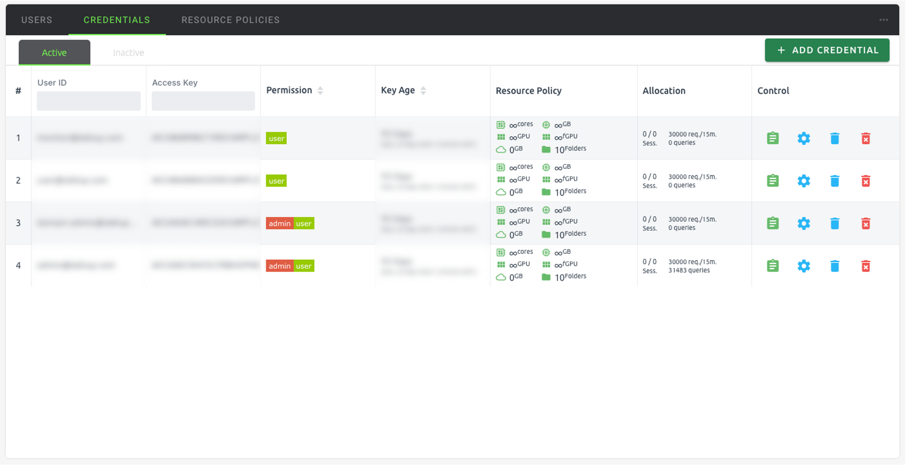
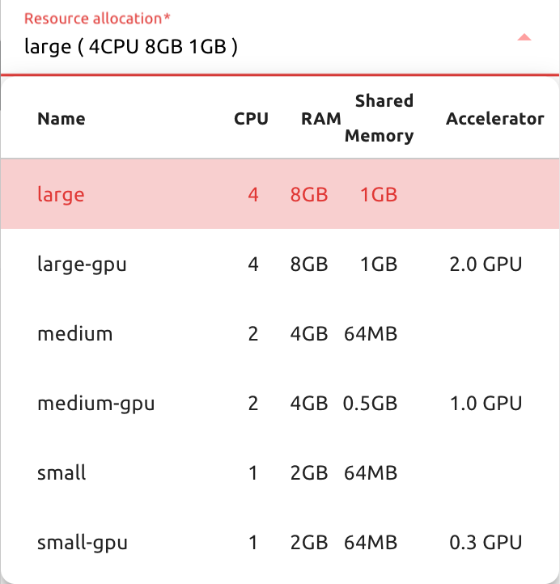
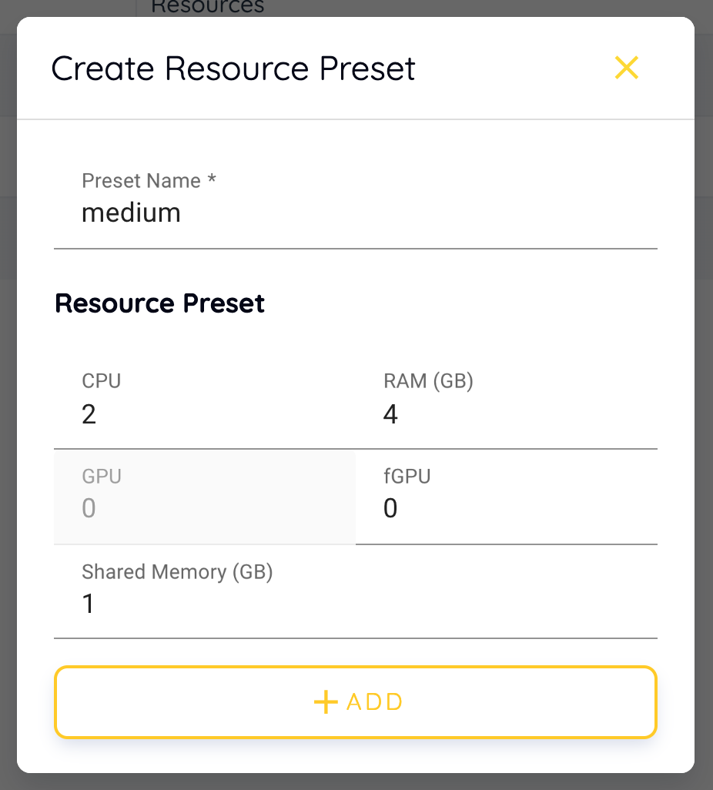
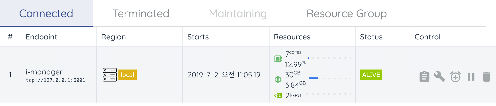
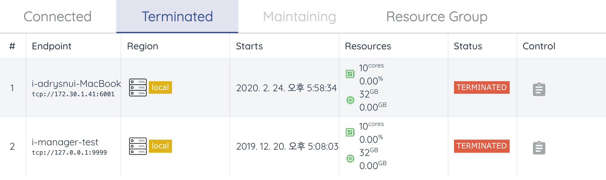
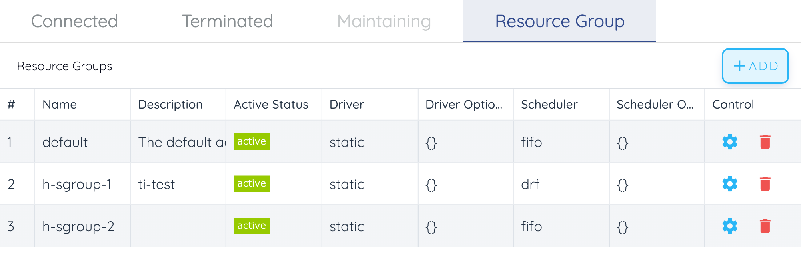

===========
Admin Menus
===========

When you log in with an admin account, you will see an additional Administration
menu in the bottom left sidebar. User information registered in Backend.AI is
listed in the Users tab. Domain admin can see only the users who belong to the domain, 
while superadmin can see all users' information. Only
superadmin can create and deactivate a user.

.. image:: admin_user_page.png
   :alt: User management page

Create and update users
----------------------

A user can be created by clicking the CREATE USER button. Note that the password
must be longer or equal to 8 characters and at least 1 alphabet/special
character/ number should be included.

.. image:: create_user_dialog.png
   :width: 500
   :align: center
   :alt: Create user dialog

Check if the user is created.

.. image:: check_if_user_created.png
   :alt: User management page

Click the green button in the Controls column for more detailed user
information. You can also check the domain and group information where the
user belongs.

.. image:: user_detail_dialog.png
   :width: 500
   :align: center
   :alt: Detailed information of a user

Click the gear icon in the Controls column to update information of a user who
already exists. User's name, password, activation state, etc. can be changed.

.. image:: user_update_dialog.png
   :width: 350
   :align: center
   :alt: User update dialog

Deactivate user account
-----------------------

Deleting user accounts is not allowed even for superadmins, to track usage
statistics per user, metric retention, and accidental account loss. Instead,
admins can deactivate user accounts to keep users from logging in. Click the
trash icon in the Controls column. A dialog asking confirmation appears, and
you can deactivate the user by clicking the OKAY button.

.. image:: user_deactivate_confirmation.png
   :width: 600
   :align: center
   :alt: Deactivating user account

Deactivated users are not listed in Users tab.

Manage User's Keypairs
----------------------

Each user account usually have one or more keypairs. A keypair is used for API
authentication to the Backend.AI server, after user logs in. Login requires
authentication via user email and password, but every request the user sends to
the server is authenticated based on the keypair.

A user can have multiple keypairs, but to reduce the user's burden of managing
keypairs, we are currently using only one of the user's keypairs to send requests.
Also, when you create a new user, a keypair is automatically created, so you do
not need to create and assign a keypair manually in most cases.

Keypairs can be listed on the Credentials tab of in the Users page. Active
keypairs are shown immediately, and to see the inactive keypairs, click the
Inactive panel at the bottom.

Like in Users tab, you can use the buttons in the Controls column to view or
update keypair details. Click the blue trash button to disable that keypair, or
click the red trash button to completely delete the keypair. However, if you
have created a compute session using a keypair, you cannot delete it. If you
accidentally deleted a keypair, you can re-create keypair for the user by
clicking the ADD CREDENTIAL button at the upper right corner. If necessary, you
can also explicitly enter the access key and secret key by clicking the Advanced
panel.

The Rate Limit field is where you specify the maximum number of requests that
can be sent to the Backend.AI server in 15 minutes. For example, if set to 1000,
and the keypair sends more than 1000 API requests in 15 minutes, and the server
throws an error and does not accept the request. It is recommended to use the
default value and increase it when the API request frequency goes up high
according to the user's pattern.

.. image:: add_keypair_dialog.png
   :width: 400
   :align: center
   :alt: Add keypair dialog

Manage Resource Policy
----------------------

Resource policies can be listed and modified in Resource Policies tab on the
Users page. Resource policies allow you to set maximum allowed resources and/or
other compute session related settings per keypair basis. If necessary, multiple
resource policies can be created, for example, user / research purposes, and
apply them separately to each keypair.

.. note::
   To set resource policies at the domain and group level, you have to use
   Manager Hub, a UI for superadmin only. In the Console UI, you can only set
   resource policies based on keypairs. Manager Hub is a part of the enterprise
   version.

.. image:: resource_policy_tab.png
   :alt: Resource policy page

In the example image above, there is one resource policy named ``default``. You
can change the resource policy by clicking the settings icon in the Control
column. After changing the settings, click UPDATE to save.

.. image:: update_resource_policy.png
   :width: 400
   :align: center
   :alt: Update resource policy dialog

The meaning of each field is as follows.

- CPU: The maximum number of CPU cores that a keypair can use. For example, if
  set to 4, keypairs bound to the resource policy cannot assign more than 4
  cores to the container. Note that the number of cores is limited based on the
  sum of all containers created by the keypair. If one container allocates three
  cores, a new container can only allocate one core. In addition, if you check
  Unlimited, the keypair can allocate resources as much as the server permits.
  This also applies to other resource settings.
- RAM: Maximum memory.
- GPU: The maximum number of physical GPUs that can be allocated. Used only when
  the GPU provisioning mode of the Backend.AI server is set to "device".
- fGPU: The maximum number of virtualized GPUs that can be allocated. Used only
  when the GPU provisioning mode of the Backend.AI server is set to "shares".
  The unit of fGPU is independent of the number of physical GPU devices, and is
  determined by the streaming multiprocessor (SM) and GPU memory unit set by the
  server.
- Container per session: Maximum number of containers a session can have. This
  is a setting which will be used to bundle multiple containers and use them as
  a single session. The ability to bundle multiple containers is under
  development and is currently not used.
- Idle timeout: If a running session is not used for the time specified in the
  idle timeout, the session is automatically garbage collected (terminated). You
  can set the time interval here. For example, if set to 600, sessions which have not been used
  for 10 minutes are automatically terminated. If set to 0 or checked
  Unlimited, garbage collection is not performed for the session created by the
  keypair.
- Concurrent Jobs: The maximum number of sessions a user can create
  concurrently. If set to 5, a keypair using that policy cannot create more
  than 5 compute sessions.
- Allowed hosts: Used to control the accessible storage and/or NFS hosts from a
  session when multiple storage/NFS hosts are available. Even if a NFS is
  mounted and can be used from Backend.AI, a user will not be able to use that
  host unless it is specified here. However, the NFS host may be accessible in case
  the host is configured to be accessible in the domain and/or group level.
  Domain / group level settings are possible in Manager Hub.
- Capacity: This is where you set the maximum available storage size. The disk
  size limit is only available under certain circumstances and is currently not
  supported. This feature is under active development, and will be supported in
  the near future.
- Max. #: The maximum number of storage folders that can be created.

You can create a new resource policy by clicking the CREATE POLICY button. Each
setting value is the same as described above.

To create a resource policy and associate it with a keypair, go to the
Credentials tab of the Users page, click the settings button located in the
Controls column of the desired keypair, and click the Select Policy field to
choose it.

Manage Images
-------------

Admins can manage images, which are used in creating a compute session, in the
Images tab of the Environments page. In the tab, meta information of all images
currently in the Backend.AI server is displayed. You can check information such
as registry, namespace, image name, image's based OS, digest, and minimum
resources required for each image. For images downloaded to one or more agent
nodes, a check mark is displayed on the left. An unchecked image means that it
is not installed on any agent.

.. note::
   The feature to install images by selecting specific agents is currently
   under development.

.. image:: image_list_page.png
   :alt: Image list page

You can change the minimum resource requirements for each image by clicking the
settings icon in the Controls column. Each image has hardware and resource
requirements for minimal operation. (For example, for GPU-only images, there
must be a minimum allocated GPU.) The default value for the minimum resource
amount is provided as embedded in the image's metadata. If an attempt is made to
create a compute session with a resource that is less than the amount of
resources specified in each image, the request is automatically adjusted to the
minimum resource requirements for the image and then generated, not canceled.

.. warning::
   Don't change the minimum resource requirements to an amount less than the
   predefined value! The minimum resource requirements included in the image
   metadata are values that have been tested and determined. If you are not
   really sure about the minimum amount of resources you want to change, leave
   it in the default.

.. image:: update_image_resource_setting.png
   :width: 350
   :align: center
   :alt: Update image resource setting

Manager docker registry
-----------------------

You can click on the Registries tab in Environments page to see the information
of the docker registry that are currently connected. ``index.docker.io`` is
registered by default, and it is a registry provided by Docker.

.. note::
   In the offline environment, the default Docker registry is not accessible, so
   click the trash icon on the right to delete it.

Click the refresh icon in Controls to update image metadata for Backend.AI from
the connected registry. Image information which does not have labels for
Backend.AI among the images stored in the registry is not updated.

.. image:: image_registries_page.png
   :alt: Registries page

You can add your own private docker registry by clicking the ADD REGISTRY
button. Note that Registry Hostname and Registry URL address must be set
identically, and in the case of Registry URL, a scheme such as ``http://`` or
``https://`` must be explicitly attached. Also, images stored in the registry
must have a name prefixed with Registry Hostname. Username and Password are
optional and can be filled in if you set separate authentication settings in the
registry.

.. note::
   In the case of ``index.docker.io``, the Hostname and Registry URL are
   different, because Docker internally handles an exception for the default
   registry. If it is not the default registry, you must match the Hostname and
   Registry URL to properly connect.

.. image:: add_registry_dialog.png
   :width: 350
   :align: center
   :alt: Add registry dialog

Even if you created a registry and update meta information, users cannot use the
images in the registry, immediately. Just as you had to register the allowed hosts
to use the storage host, you must register the registry in the allowed docker
registries field at the domain or group level, after registering the registry,
so that users in the domain or group can access the registry image. Allowed
docker registries can be registered using the Manager Hub with domain and group
management. The function to set the allowed docker registries in the keypair's
resource policy is not provided yet.

Manage resource preset
----------------------

The following predefined resource presets are displayed in the Resource
allocation panel when creating a compute session. Superadmin can manage these
resource presets.

Go to the Resource Presets tab on the Environment page. You can check the list
of currently defined resource presets.

.. image:: resource_preset_list.png
   :alt: Resource presets tab

You can set resources such as CPU, RAM, fGPU, etc. to be provided by the
resource preset by clicking the settings icon (cogwheel) in the Controls column.
In the example below, the GPU field is disabled since the GPU provision mode of
the Backend.AI server is set to "fractional". After setting the resources with
the desired values, save it and check if the corresponding preset is displayed
when creating a compute session. If available resources are less
than the amount of resources defined in the preset, the corresponding preset
would not be shown.

Query agent nodes
-----------------

Superadmins can view the list of agent worker nodes, currently connected to
Backend.AI, by visiting the Resources page. You can check agent node's IP,
connecting time, actual resources currently in use, etc. The Console does
not provide the function to manipulate agent nodes.

On Terminated tab, you can check the information of the agents that has been
connected once and then terminated or disconnected. It can be used as a
reference for node management.

Manage resource group
---------------------

Agents can be grouped into units called resource (scaling) groups. For example,
let's say there are 3 agents with V100 GPUs and 2 agents with P100 GPUs. You
want to expose two types of GPUs to users separately, then you can group three
V100 agents into one resource group, and the remaining two P100 agents into
another resource group.

Adding a specific agent to a specific resource group is not currently handled in
the UI, and it can be done by editing agent config file from the installation
location and restart the agent daemon. Management of the resource groups is
possible in Scaling Group tab of the Resource page.

You can edit a resource group by clicking the settings icon in the Control
column. In the Select scheduler field, you can choose the scheduling method for
creating a compute session. Currently, there are three types: FIFO, LIFO, and
DRF. FIFO and LIFO are scheduling methods creating the first- or the
last-enqueued compute session in the job queue. DRF stands for Dominant Resource
Fairness, and it aims to provide resources as fair as possible for each user.
You can deactivate a resource policy by turning off Active Status.

.. image:: modify_resource_group.png
   :width: 350
   :align: center
   :alt: Modify resource group dialog

You can create a new resource policy by clicking the CREATE button.

System settings
---------------

In the System Settings page, you can see main settings of Backend.AI server.
Currently, it provides several controls which can change and list settings.

.. note::
   We will continue to add broader range of setting controls.

Server management
-----------------

Go to the Maintenance page and you will see some buttons to manage the server.

- RECALCULATE USAGE: Occasionally, due to unstable network connections or
  container management problem of Docker daemon, there may be a case where the
  resource occupied by Backend.AI does not match the resource actually used by
  the container. In this case, click the RECALCULATE USAGE button to manually
  correct the resource occupancy.
- RESCAN IMAGES: Update image meta information from all registered Docker
  registries. It can be used when a new image is pushed to a
  Backend.AI-connected docker registry.

.. image:: maintenance_page.png
   :width: 500
   :align: center
   :alt: Maintenance page

.. note::
   We will continue to add other settings needed for management, such as
   removing unused images or registering periodic maintenance schedules.
