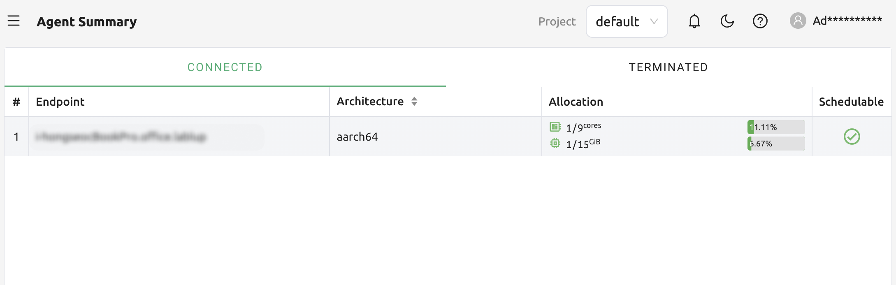

=========================
Agent Summary
=========================

If you have admin privileges, you can access full agent information via the **Administration** menu.
From version 22.09, Backend.AI WebUI also supports displaying partial agent node information for non-admin users when the server configuration allows it.
On the **Agent Summary** page, you can view agent information including endpoint address, CPU architecture, resource allocation,
and whether the agent is schedulable. This page is useful for checking resource availability before creating a compute session.

Agent Information
-----------------

The agent list displays the following information for each connected agent node:

* **Endpoint**: The network address of the agent node.
* **CPU Architecture**: The CPU architecture of the agent (e.g., ``x86_64``, ``aarch64``).
* **Resource Allocation**: A summary of the resources currently allocated and available on the agent, including CPU, memory, and AI accelerators.
* **Schedulable**: Indicates whether the agent is available for scheduling new compute sessions. If the agent is not schedulable, new sessions cannot be placed on it.

.. note::
   Depending on the server configuration, the agent summary feature may not be available.
   In that case, please contact your system administrator.
