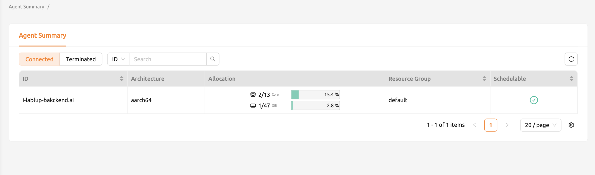

=========================
Agent Summary
=========================

For now, users with admin role only can see agent information via administration menu.
From 22.09 GPU Platform WebUI supports showing partial information of agent node(s) when configuration is set.
In Agent summary menu, you can see the list of agent information including endpoint address, CPU architecture, resource utilization, 
and whether the agent is schedulable or not. This menu is useful to check resource allocation on session creation.

