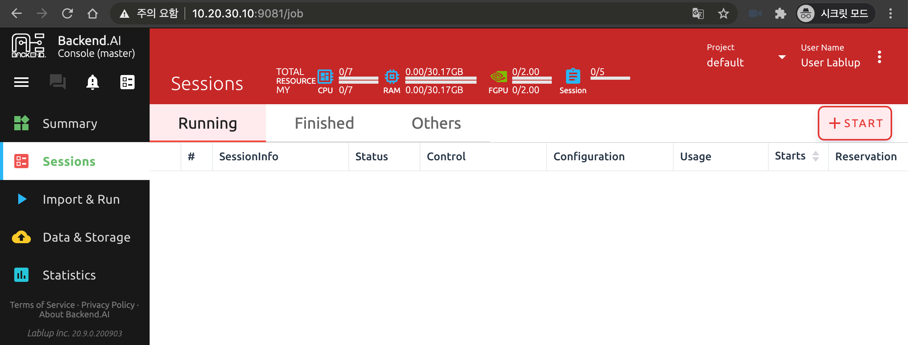
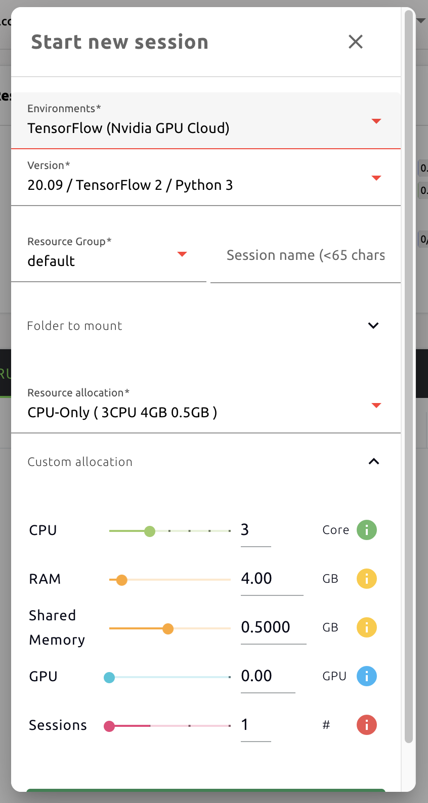
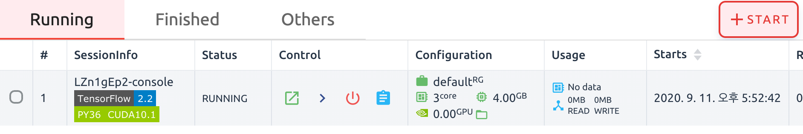
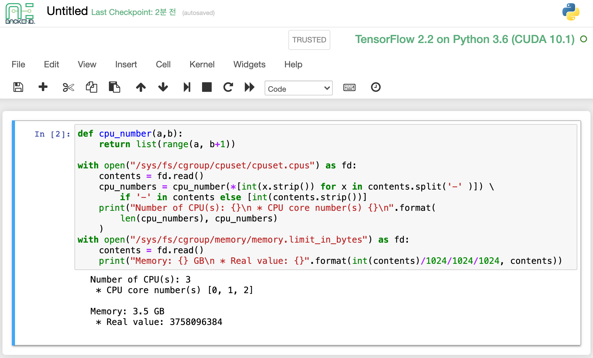
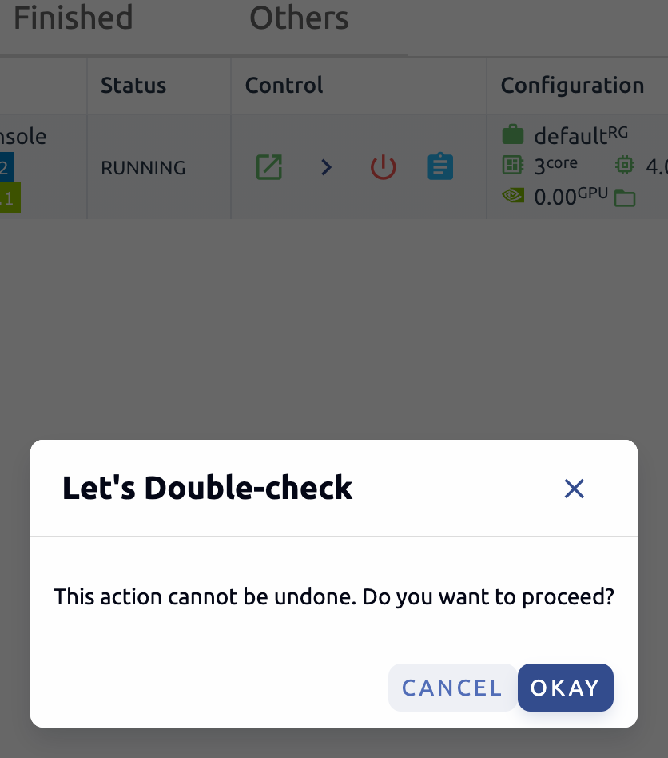

================================================
CPU/Memory Allocation and Using Compute Sessions
================================================

.. note:: Objectives

   * From the GUI environment, users can create a compute session by specifying
     the amount of CPU and memory resources dynamically
   * From the GUI, check the amount of CPU and memory resources of the session
   * Using Jupyter Notebook and Terminal apps in container environment
   * Check the allocated CPU and memory resources from inside the container by
     referencing cgroup

The most visited pages in the Backend.AI GUI Console would be the Sessions and
Storage pages. On the Sessions page, you can view, create, and use
container-based compute sessions, and on the Storage page, you can create a
storage folder to keep important data. Here, you will learn how to create
container-based compute sessions and utilize various web applications on
the Sessions page.

Start a new session
-------------------

After logging in with a user account, click Sessions on the left menu to visit
the Sessions page.

Click the START button to start a new compute session. The following setup
dialog will appear. You can specify the language environment (Environments,
Version) and resources you want to allocate. Set the CPU and memory as shown in
the following figure and click the LAUNCH button. The environment was chosen as
TensorFlow 2.2.

If you need more detailed settings, refer to the meaning of each items.

* Environment: Specify the default environment for compute sessions such as
  TensorFlow, PyTorch, C++, and etc. When you select a TensorFlow environment,
  your compute session will automatically include the TensorFlow library.
  If you select another environment, the corresponding environment is installed
  by default.
* Version: Select the version of the environment. For example, for TensorFlow
  environment, you can select different versions such as 1.15, 2.3, etc.
* Resource Group: Specify the resource group in which to create the compute
  session. If there are multiple resource groups, you can select the desired
  value, but if there is only one resource group, it cannot be changed.
* Session name (optional): Specifies the name of the compute session to be
  created. If specified, this name appears in Session Info, making it easy to
  distinguish from other compute sessions. If not specified, a
  randomly-generated name is used. You can set up to 4 to 64 characters, and no
  spaces are allowed.
* Folder to mount: Specifies the data folder to be mounted in the compute
  session. When a compute session is deleted, by default all data is deleted
  altogether, but the data stored in the folder mounted here is not deleted.
* Resource allocation: This is a template that has predefined resources to be
  allocated to the compute session. You can save and use frequently used
  resource settings in advance. Resource templates can be managed in a dedicated
  admin hub.
* CPU: The number of CPU cores to allocate to the compute session. The maximum
  value depends on the resource policy applied to the user.
* RAM: The amount of memory (GB) to allocate for the compute session. The
  maximum value depends on the resource policy applied to the user.
* Shared Memory: The amount of shared memory (GB) to allocate for the
  compute session. It can only be set up to 2 GB, and cannot be greater than the
  amount specified in RAM.
* GPU: The unit of GPU to allocate to the compute session. The maximum value
  depends on the resource policy applied to the user.
* Sessions: The number of compute sessions to be created with the specified
  settings. You can specify when you need to create the same computational
  sessions at once.

If no mount folder is specified in the Folder to mount input box, a warning
dialog may appear indicating that the storage folder is not mounted. For now,
ignore the warning and click the LAUNCH WITHOUT STORAGE FOLDER button to create
a compute session. Let's see that a new compute session is created in the
Running tab. In the FINISHED tab, you can see terminated compute sessions, and
in the OTHERS tab you can query for compute sessions with errors.

You can check information such as ID, start date, usage time, resource setting,
and resource usage for each session. In particular, check the allocated
resources in the Configuration column. Note that the amounts of resources you
specified in creating the compute session are displayed.

.. note::
   Superadmins can view all compute session information currently running (or
   terminated) in the cluster, and users can view only the sessions they have
   created.

.. note::
   Compute session list may not be displayed normally due to intermittent
   network connection problems, and etc. This can be solved by refreshing the
   browser page.

Utilize Jupyter Notebook and check the resource quota from inside the container
-------------------------------------------------------------------------------

Let's look at how to use and manage compute sessions that are already running.
If you look at the Control column of the session list, there are several icons.
When you click the first icon, the app launcher appears as shown in the figure
below, and several app services supported by the session appear.

.. image:: app_launch_dialog.png
   :width: 400
   :align: center

Let's click on Jupyter Notebook.

.. note::
   Try preferred port: When the web service is opened, a specific port is
   assigned from the port pool created in advance by Backend.AI. Users can
   use the service only when they connect to the port along with the IP
   address or domain name. If you check this item and enter the port number,
   the entered port number will be tried.
   However, there is no guarantee that the desired port will always be assigned.
   The port may not exist at all in the port pool, or another service may
   already be using the port.In this case, the port number is randomly assigned.
   Do not open the app by checking this option unless you have a clear usage
   purpose and know what it means.

.. image:: jupyter_app.png

A new window pops up and you can see that Jupyter Notebook is running. This
notebook was created inside a running compute session and can be used easily
with the click of a button without any other settings. Also, there is no need
for a separate package installation process because the language environment and
library provided by the computation session can be used as it is. For detailed
instructions on how to use Jupyter Notebook, please refer to the official
documentation.

Click the NEW button on the top right and select the Notebook for Backend.AI,
then the ipynb window appears where you can enter your own code.

.. image:: backendai_notebook_menu.png
   :width: 400
   :align: center

In this window, you can enter and execute any code you want by using the
environment that session provides. The code execution happens on one of the
Backend.AI nodes where the compute session is actually created, and there is no
need to configure a separate environment on the local machine. Enter the
following code and click the Run button or type ``Ctrl-Enter`` to run the code.
It is a Python code that reads and prints the resource quota under
``/sys/fs/cgroup/``.

Since Python is already installed in the TensorFlow 2.2 environment, the code
will run without any configuration. Make sure that the amount of core and memory
you specified when you first created the compute session is displayed.

.. note::
   The amount of memory may vary slightly depending on the calculation method.

Like this, after creating a compute session, you can use web apps such as
Jupyter Notebook, and in Jupyter Notebook, you can run Python code that checks
resource constraints right away without installing a separate packages.

Web terminal
------------

If you close the Jupyter Notebook app and open the app launcher screen of the
math session again, you will see the Console app present. Let's click.

.. image:: session_terminal.png
   :width: 500
   :align: center

A terminal will also appear in a new window, and you can issue shell commands by
accessing inside the computational session as shown in the following figure. If
you are familiar with using commands, you can easily issue various Linux
commands. You can see that the Untitled.ipynb file automatically generated in
Jupyter Notebook is viewed through the ``ls`` command. This is proof that both
apps are running in the same container environment.

In addition to this, you can use web-based services such as TensorBoard, Jupyter
Lab, etc., depending on the type of service provided by the compute session.

To delete a specific session, simply click on the red power icon.

