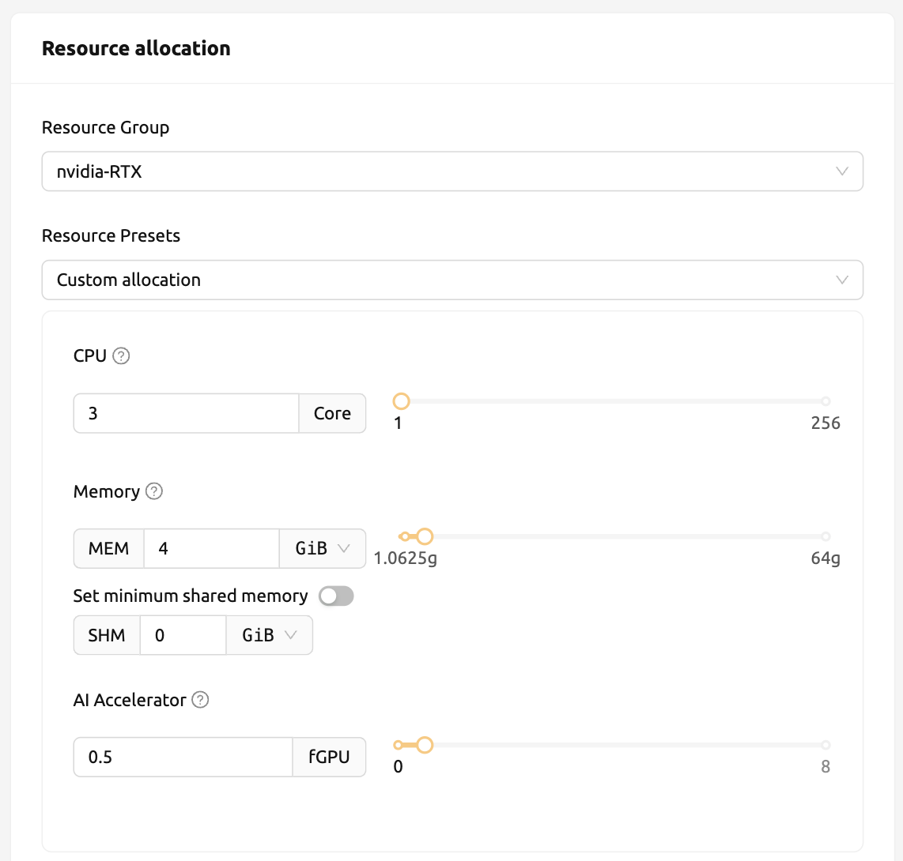

================================================
Appendix
================================================

GPU Virtualization and Fractional GPU Allocation
------------------------------------------------

.. note:: Objectives

   * From the GUI environment, the fGPU (fractional GPU) resource option can be
     dynamically given when creating a compute session
   * Check the allocated fGPU resource of a compute session from the GUI and
     make sure it is created with the amount requested
   * Open the web terminal app on the GUI and check the GPU is partially
     allocated at the container level by the ``nvidia-smi`` command

Backend.AI supports GPU virtualization technology which allows single physical
GPU can be divided and shared by multiple users simultaneously. Therefore, if
you want to execute a task that does not require much GPU computation
capability, you can create a compute session by allocating a portion of the GPU.
The amount of GPU resources that 1 fGPU actually allocates may vary from system
to system depending on administrator settings. For example, if the administrator
has set one physical GPU to be divided into five pieces, 5 fGPU means 1 physical
GPU, or 1 fGPU means 0.2 physical GPU. If you set 1 fGPU when creating a compute
session, the session can utilize the streaming multiprocessor (SM) and GPU
memory equivalent to 0.2 physical GPU.

In this section, we will create a compute session by allocating a portion of
the GPU, and then check whether the GPU recognized inside the compute
container is really corresponds to the partial physics GPU.

First, let's check information such as the type of physical GPU installed in the
host node and the amount of memory. The GPU node used in this guide is equipped
with a GPU with 8 GB of memory as in the following figure. And through the
administrator settings, 1 fGPU is set to an amount equivalent to 0.5 physical
GPUs (or 1 physical GPU is 2 fGPU).

Now let's go to the Sessions page and create a compute session by allocating 0.5
fGPUs as follows:

In the Configuration column of the calculation session list, you can see that
0.5 fGPU is allocated.

.. image:: session_list_with_gpu.png

Now, let's connect directly to the inside of the container and check if the GPU
memory (~2 GB) equivalent to 0.5 units is really allocated. Let's bring up a web
terminal. When the terminal comes up, run the ``nvidia-smi`` command. As you can
see in the following figure, you can see that about 2 GB of GPU memory is
allocated. This is not possible by a way like PCI passthrough, showing that the
physical GPU is actually divided into quarters and allocated inside the
container for this compute session.

.. image:: nvidia_smi_inside_container.png
   :width: 600
   :align: center

Let's open up a Jupyter Notebook and run a simple ML training code.

.. image:: mnist_train.png

While training is in progress, connect to the shell of the GPU host node and
execute the ``nvidia-smi`` command. You can see that there is one GPU attached
process, and this process is occupying about 25% of the resources of the
physical GPU. (GPU occupancy can vary greatly depending on training code and GPU
model)

Alternatively, you can run the ``nvidia-smi`` command from the web terminal you
left earlier to query the GPU usage history recognized inside the container.
