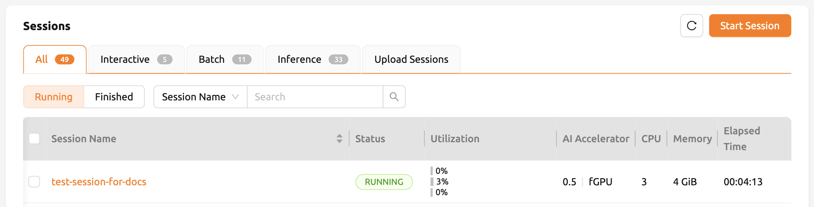
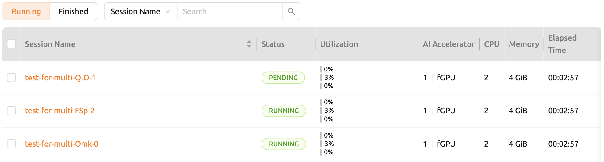
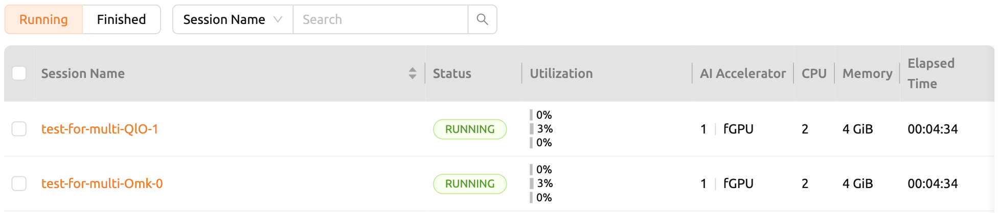

================================================
Appendix
================================================

GPU Virtualization and Fractional GPU Allocation
------------------------------------------------

Backend.AI supports GPU virtualization technology which allows single physical
GPU can be divided and shared by multiple users simultaneously. Therefore, if
you want to execute a task that does not require much GPU computation
capability, you can create a compute session by allocating a portion of the GPU.
The amount of GPU resources that 1 fGPU actually allocates may vary from system
to system depending on administrator settings. For example, if the administrator
has set one physical GPU to be divided into five pieces, 5 fGPU means 1 physical
GPU, or 1 fGPU means 0.2 physical GPU. If you set 1 fGPU when creating a compute
session, the session can utilize the streaming multiprocessor (SM) and GPU
memory equivalent to 0.2 physical GPU.

In this section, we will create a compute session by allocating a portion of
the GPU, and then check whether the GPU recognized inside the compute
container is really corresponds to the partial physics GPU.

First, let's check information such as the type of physical GPU installed in the
host node and the amount of memory. The GPU node used in this guide is equipped
with a GPU with 8 GB of memory as in the following figure. And through the
administrator settings, 1 fGPU is set to an amount equivalent to 0.5 physical
GPUs (or 1 physical GPU is 2 fGPU).

.. image:: host_gpu.png
   :width: 600
   :align: center

Now let's go to the Sessions page and create a compute session by allocating 0.5
fGPUs as follows:

.. image:: session_launch_dialog_with_gpu.png
   :width: 350
   :align: center

In the Configuration column of the calculation session list, you can see that
0.5 fGPU is allocated.

Now, let's connect directly to the inside of the container and check if the GPU
memory (~2 GB) equivalent to 0.5 units is really allocated. Let's bring up a web
terminal. When the terminal comes up, run the ``nvidia-smi`` command. As you can
see in the following figure, you can see that about 2 GB of GPU memory is
allocated. This is not possible by a way like PCI passthrough, showing that the
physical GPU is actually divided into quarters and allocated inside the
container for this compute session.

.. image:: nvidia_smi_inside_container.png
   :width: 600
   :align: center

Let's open up a Jupyter Notebook and run a simple ML training code.

.. image:: mnist_train.png

While training is in progress, connect to the shell of the GPU host node and
execute the ``nvidia-smi`` command. You can see that there is one GPU attached
process, and this process is occupying about 25% of the resources of the
physical GPU. (GPU occupancy can vary greatly depending on training code and GPU
model)

.. image:: host_nvidia_smi.png
   :width: 600
   :align: center

Alternatively, you can run the ``nvidia-smi`` command from the web terminal you
left earlier to query the GPU usage history recognized inside the container.

Resource Monitoring and Automated Job Scheduling
------------------------------------------------

Resource monitoring through GUI
^^^^^^^^^^^^^^^^^^^^^^^^^^^^^^^

Backend.AI GUI Console supports resource monitoring through GUI. After logging
in with a user account, create a compute session. Resource allocation is set as
shown in the following figure.

.. image:: session_launch_dialog.png
   :width: 350
   :align: center

After creating a compute session by clicking the LAUNCH button, you can see that
the amount of resources allocated by CPU, RAM, and FGPU in the upper resource
indicator increases. You can check the amount of resources currently used and
the total amount of resources that can be allocated. The display bar is divided
into two parts: the upper and the lower. he upper part shows the resource
allocation status in the current scaling group, and the lower part shows the
allocation status of total accessible resources.

* Upper: Allocated and available resources within the current scaling group

  - (Resources allocated by the user in the current scaling group) / (Total
    resources allocatable by the user in the current scaling group)

* Lower: Total allocated and available resources

  - (Resources allocated by the user) / (Resources allocated by the user + Total
    resources allocatable by the user in the current scaling group)

.. image:: resource_indicator_after_creation.png
   :align: center

Next, let's delete the compute session we just created. End the session by pressing
the red power button in the Control column.

.. image:: destroy_kernel.png
   :width: 500
   :align: center

After the compute session disappears from the list, you can see that the CPU,
RAM, and FGPU of the resource indicator decrease by the exact amount of
resources.

.. image:: resource_indicator_after_destroy.png
   :align: center

Job scheduler
^^^^^^^^^^^^^^^^^^^

Backend.AI server has a built-in self-developed task scheduler. It automatically
checks the available resources of all worker nodes and delegates the request to
create a compute session to the worker that meets the user's resource request.
In addition, when resources are insufficient, the user's request to create a
compute session is registered as a PENDING state in the job queue. Later, when
the resource becomes available again, the PENDING request is activated to
perform compute session creation.

You can also check the operation of the job scheduler in a simple way from the
user GUI console. Currently, our GPU host can allocate up to 2 fGPUs of
resources. Now let's create 3 compute sessions at the same time requesting
allocation of resources equal to 1 fGPU. At the bottom of the session launch
dialog, there are GPU and Sessions sliders. If you specify a value greater than
1 in Sessions, when the LAUNCH button is clicked, the number of sessions will be
requested at the same time. Let's set the GPU and Sessions to 1 and 3,
respectively. In a situation where only 2 fGPUs exists, 3 sessions requesting a
total of 3 fGPU resources are created.

.. image:: session_launch_dialog_3_sessions.png
   :width: 350
   :align: center

Wait for a while and you will see three compute sessions being listed. At this
time, if you look closely at the Status column, you can see that two of the
three compute sessions are in RUNNING state, but the other compute session
remains in the PENDING state. This PENDING session is only registered in the
job queue and has not actually been allocated a container due to insufficient
GPU resources.

Now let's destroy one of the two sessions in the RUNNING state. Then you can see
that the compute session in the PENDING state will soon be allocated resources
by the job scheduler and converted to the RUNNING state. In this way, the job
scheduler utilizes the job queue to hold the user's compute session requests,
and then automatically process the requests when resources become available.

Multi-version Machine Learning Container Support
-------------------------------------------------

Backend.AI provides variaous pre-built ML and HPC kernel images. Therefore,
users can immediately utilize major libraries and packages without having to
install packages themselves. Here, we'll walk through an example that takes
advantage of multiple versions of the multiple ML library immediately.

Go to the Sessions page and open the session launch dialog. There may be various
kernel images depending on the installation settings.

.. image:: various_kernel_images.png
   :width: 350
   :align: center

Here, we selected the TensorFlow 2.2 environment and created a session.

.. image:: session_launch_dialog_tf22.png
   :width: 350
   :align: center

Open the web terminal of the created session and run the following Python
command. You can see that TensorFlow 2.2 version is actually installed.

.. image:: tf22_version_print.png
   :width: 450
   :align: center

This time, we select the TensorFlow 1.13 environment to create a compute
session. (If resources are insufficient, previous sessions are deleted)

.. image:: session_launch_dialog_tf113.png
   :width: 350
   :align: center

Open the web terminal of the created session and run the same Python command as
before. You can see that TensorFlow 1.13(.1) version is actually installed.

.. image:: tf113_version_print.png
   :width: 450
   :align: center

Finally, create a compute session using PyTorch version 1.5.

.. image:: session_launch_dialog_pytorch15.png
   :width: 350
   :align: center

Open the web terminal of the created session and run the following Python
command. You can see that PyTorch 1.5 version is actually installed.

.. image:: pytorch15_version_print.png
   :width: 450
   :align: center

Like this, you can utilize various versions of major libraries such as
TensorFlow and PyTorch through Backend.AI without unnecessary installation
effort.

Backend.AI Server Installation Guide
-----------------------------------------

For Backend.AI Server daemons/services, following hardware specification should be met. For
optimal performance, just double the amount of each resources.

* Manager: 2 cores, 4 GiB memory
* Agent: 4 cores, 32 GiB memory, NVIDIA GPU (for GPU workload), > 512 GiB SSD
* Console-Server: 2 cores, 4 GiB memory
* WSProxy: 2 cores, 4 GiB memory
* PostgreSQL DB: 2 cores, 4 GiB memory
* Redis: 1 core, 2 GiB memory
* Etcd: 1 core, 2 GiB memory

The essential host dependent packages that must be pre-installed before installing
each service are:

* GUI console: Operating system that can run the latest browsers (Windows, Mac
  OS, Ubuntu, etc.)
* Manager: Python (≥3.8), pyenv/pyenv-virtualenv (≥1.2)
* Agent: docker (≥19.03), CUDA/CUDA Toolkit (≥8, 11 recommend),
  nvidia-docker v2, Python (≥3.8), pyenv/pyenv-virtualenv (≥1.2)
* Console-Server: Python (≥3.8), pyenv/pyenv-virtualenv (≥1.2)
* WSProxy: docker (≥19.03), docker-compose (≥1.24)
* PostgreSQL DB: docker (≥19.03), docker-compose (≥1.24)
* Redis: docker (≥19.03), docker-compose (≥1.24)
* Etcd: docker (≥19.03), docker-compose (≥1.24)

For Enterprise version, Backend.AI server daemons are installed by Lablup support team and following materials/services are provided after initial installation:

* DVD 1 (includes Backend.AI packages)
* User GUI Guide manual
* Admin GUI Guide manual
* Installation report
* First-time user/admin on-site tutorial (3-5 hours)

Product maintenance and support information: the commercial contract includes a
monthly/annual subscription fee for the Enterprise version by default. Initial
user/administrator training (1-2 times) and wired/wireless customer support
services are provided for about 2 weeks after initial installation, minor
release updater support and customer support services through online channels
are provided for 3-6 months. Maintenance and support services provided
afterwards may have different details depending on the terms of the contract.

Users of the open source version can also purchase an installation and support
plan separately.

Backend.AI Server Management Guide
-----------------------------------------

Backend.AI is composed of many modules and daemons. Here, we briefly describe
each services and provide basic maintenance guide in case of specific service
failure. Note that the maintenance operations provided here are generally
applicable, but may differ depending on the host-specific installation details.

Manager
^^^^^^^

Gateway server that accepts and handles every user request. If the request is
related with the compute session (container), Manager will delegate the request
to Agent and/or containers in each Agent.

.. code-block:: shell

   # check status
   sudo systemctl status backendai-manager
   # start service
   sudo systemctl start backendai-manager
   # stop service
   sudo systemctl stop backendai-manager
   # restart service
   sudo systemctl restart backendai-manager
   # see logs
   sudo journalctl --output cat -u backendai-manager

Agent
^^^^^

Worker node which manages the lifecycle of compute sessions (containers).

.. code-block:: shell

   # check status
   sudo systemctl status backendai-agent
   # start service
   sudo systemctl start backendai-agent
   # stop service
   sudo systemctl stop backendai-agent
   # restart service
   sudo systemctl restart backendai-agent
   # see logs
   sudo journalctl --output cat -u backendai-agent

Console-Server
^^^^^^^^^^^^^^

Serves user GUI Console and provides authentication by email and password.

.. code-block:: shell

   # check status
   sudo systemctl status backendai-console-server
   # start service
   sudo systemctl start backendai-console-server
   # stop service
   sudo systemctl stop backendai-console-server
   # restart service
   sudo systemctl restart backendai-console-server
   # see logs
   sudo journalctl --output cat -u backendai-console-server

WSProxy
^^^^^^^

Proxies the connection between user-created web apps (such as web Terminal and
Jupyter Notebook) and Manager, which is then relayed to a specific compute
session (container).

.. code-block:: shell

   cd /home/lablup/halfstack
   # check status
   docker-compose -f docker-compose.wsproxy-simple.yaml -p <project> ps
   # start service
   docker-compose -f docker-compose.wsproxy-simple.yaml -p <project> up -d
   # stop service
   docker-compose -f docker-compose.wsproxy-simple.yaml -p <project> down
   # restart service
   docker-compose -f docker-compose.wsproxy-simple.yaml -p <project> restart
   # see logs
   docker-compose -f docker-compose.wsproxy-simple.yaml -p <project> logs

PostgreSQL DB
^^^^^^^^^^^^^

Database for Manager.

.. code-block:: shell

   cd /home/lablup/halfstack
   # check status
   docker-compose -f docker-compose.hs.postgres.yaml -p <project> ps
   # start service
   docker-compose -f docker-compose.hs.postgres.yaml -p <project> up -d
   # stop service
   docker-compose -f docker-compose.hs.postgres.yaml -p <project> down
   # restart service
   docker-compose -f docker-compose.hs.postgres.yaml -p <project> restart
   # see logs
   docker-compose -f docker-compose.hs.postgres.yaml -p <project> logs

To back up the DB data, you can use the following commands from the DB host. The
specific commands may vary depending on the configuration.

.. code-block:: shell

   # query postgresql container's ID
   docker ps | grep halfstack-db
   # Connect to the postgresql container via bash
   docker exec -it <postgresql-container-id> bash
   # Backup DB data. PGPASSWORD may vary depending on the system configuration
   PGPASSWORD=develove pg_dumpall -U postgres > /var/lib/postgresql/backup_db_data.sql
   # Exit container
   exit

To restore the DB from the backup data, you can execute the following commands.
Specific options may vary depending on the configuration.

.. code-block:: shell

   # query postgresql container's ID
   docker ps | grep halfstack-db
   # Connect to the postgresql container via bash
   docker exec -it <postgresql-container-id> bash
   # Disconnect all connection, for safety
   psql -U postgres
   postgres=# SELECT pg_terminate_backend(pg_stat_activity.pid)
   postgres-# FROM pg_stat_activity
   postgres-# WHERE pg_stat_activity.datname = 'backend'
   postgres-# AND pid <> pg_backend_pid();
   # Ensure previous data be cleaned (to prevent overwrite)
   postgres=# DROP DATABASE backend;
   postgres=# \q
   # Restore from data
   psql -U postgres < backup_db_data.sql

Redis
^^^^^

Cache server which is used to collect per-session and per-agent usage
statistics and relays heartbeat signal from Agent to Manager. It also keeps
user's authentication information.

.. code-block:: shell

   cd /home/lablup/halfstack
   # check status
   docker-compose -f docker-compose.hs.redis.yaml -p <project> ps
   # start service
   docker-compose -f docker-compose.hs.redis.yaml -p <project> up -d
   # stop service
   docker-compose -f docker-compose.hs.redis.yaml -p <project> down
   # restart service
   docker-compose -f docker-compose.hs.redis.yaml -p <project> restart
   # see logs
   docker-compose -f docker-compose.hs.redis.yaml -p <project> logs

Usually, Redis data do not need backup since it contains temporary cached data
only, such user's login session information, per-container live stat, and etc.

Etcd
^^^^^

Config server, which contains Backend.AI system-wide configuration.

.. code-block:: shell

   cd /home/lablup/halfstack
   # check status
   docker-compose -f docker-compose.hs.etcd.yaml -p <project> ps
   # start service
   docker-compose -f docker-compose.hs.etcd.yaml -p <project> up -d
   # stop service
   docker-compose -f docker-compose.hs.etcd.yaml -p <project> down
   # restart service
   docker-compose -f docker-compose.hs.etcd.yaml -p <project> restart
   # see logs
   docker-compose -f docker-compose.hs.etcd.yaml -p <project> logs

To back up the Etcd config data used by the Manager, go to the folder where the
Manager is installed and use the following command.

.. code-block:: shell

   cd /home/lablup/manager  # paths may vary
   backend.ai mgr etcd get --prefix '' > etcd_backup.json

To restore Etcd settings from the backup data, you can run a command like this.

.. code-block:: shell

   cd /home/lablup/manager  # paths may vary
   backend.ai mgr etcd put-json '' etcd_backup.json
