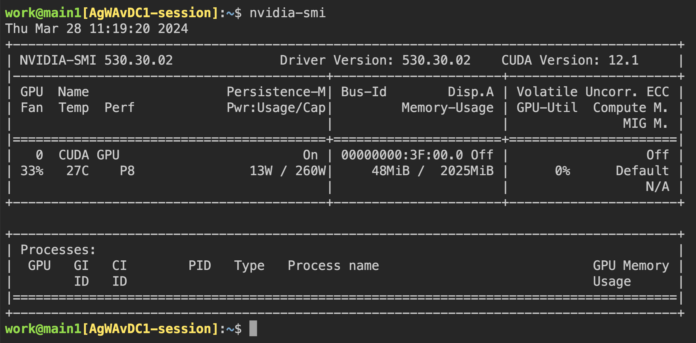
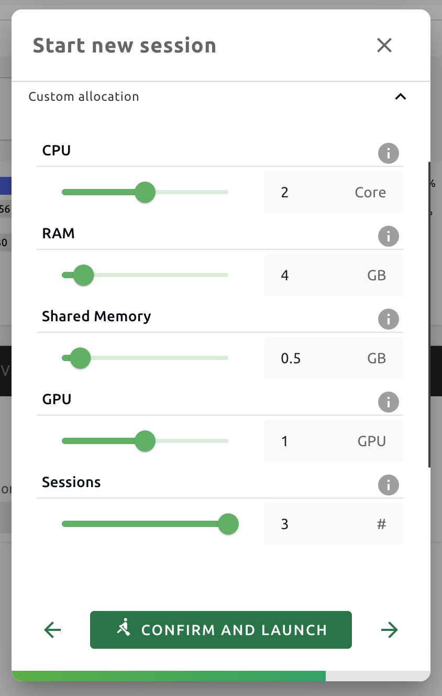
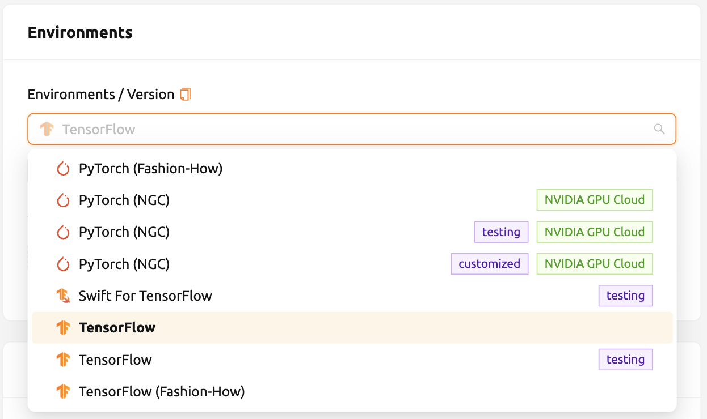
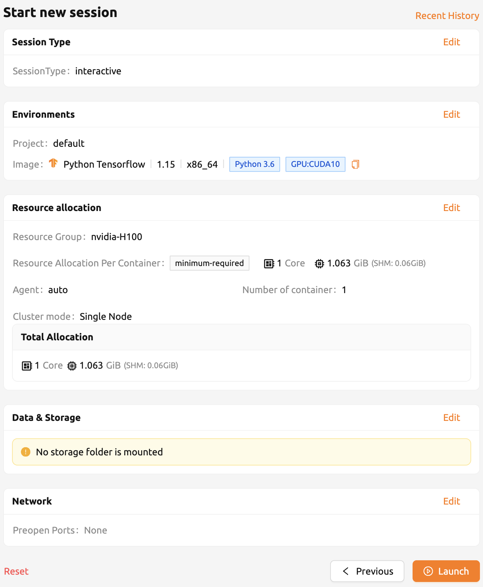
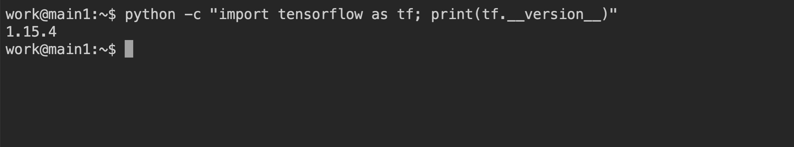
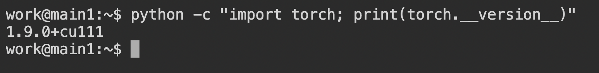

================================================
Appendix
================================================

GPU virtualization and fractional GPU allocation
------------------------------------------------

Backend.AI supports GPU virtualization technology which allows single physical
GPU can be divided and shared by multiple users simultaneously. Therefore, if
you want to execute a task that does not require much GPU computation
capability, you can create a compute session by allocating a portion of the GPU.
The amount of GPU resources that 1 fGPU actually allocates may vary from system
to system depending on administrator settings. For example, if the administrator
has set one physical GPU to be divided into five pieces, 5 fGPU means 1 physical
GPU, or 1 fGPU means 0.2 physical GPU. If you set 1 fGPU when creating a compute
session, the session can utilize the streaming multiprocessor (SM) and GPU
memory equivalent to 0.2 physical GPU.

In this section, we will create a compute session by allocating a portion of
the GPU and then check whether the GPU recognized inside the compute
container really corresponds to the partial physics GPU.

First, let's check the type of physical GPU installed in the
host node and the amount of memory. The GPU node used in this guide is equipped
with a GPU with 32 GB of memory as in the following figure. And through the
administrator settings, 0.5 fGPU is set to an amount equivalent to 0.5 physical
GPU (or 1 physical GPU is 1 fGPU).

.. image:: host_gpu.png
   :width: 600
   :align: center

Now let's go to the Sessions page and create a compute session by allocating 0.5
fGPU as follows:

.. image:: session_launch_dialog_with_gpu.png
   :width: 350
   :align: center

In the Configuration panel of the session list, you can see that
0.5 fGPU is allocated.

.. image:: session_list_with_gpu.png

Now, let's connect directly to the container and check if the allocated GPU
memory is really equivalent to 0.5 units (~16 GB). Let's bring up a web
terminal. When the terminal comes up, run the ``nvidia-smi`` command. As you can
see in the following figure, you can see that about 16 GB of GPU memory is
allocated. This shows that the physical GPU is actually divided into quarters and allocated inside the
container for this compute session, which is not possible by a way like PCI passthrough.

Let's open up a Jupyter Notebook and run a simple ML training code.

.. image:: mnist_train.png

While training is in progress, connect to the shell of the GPU host node and
execute the ``nvidia-smi`` command. You can see that there is one GPU attached
to the process and this process is occupying about 16% of the resources of the
physical GPU. (GPU occupancy can vary greatly depending on training code and GPU
model.)

.. image:: host_nvidia_smi.png
   :width: 600
   :align: center

Alternatively, you can run the ``nvidia-smi`` command from the web terminal to query the GPU usage history inside the container.

Automated job scheduling
------------------------------------------------

Backend.AI server has a built-in self-developed task scheduler. It automatically
checks the available resources of all worker nodes and delegates the request to
create a compute session to the worker that meets the user's resource request.
In addition, when resources are insufficient, the user's request to create a
compute session is registered as a PENDING state in the job queue. Later, when
the resources become available again, the pended request is resumed to
create a compute session.

You can check the operation of the job scheduler in a simple way from the
user Web-UI. When the GPU host can allocate up to 1 fGPUs,
let's create 3 compute sessions at the same time requesting
allocation of 0.4 fGPU, respectivley. In the Custom allocation section of the session launch
dialog, there are GPU and Sessions sliders. If you specify a value greater than
1 in Sessions and click the LAUNCH button, the number of sessions will be
requested at the same time. Let's set the GPU and Sessions to 0.4 and 3,
respectively. This is the situation that 3 sessions requesting a
total of 1.2 fGPUs are created when only 1 fGPUs exist.

Wait for a while and you will see three compute sessions being listed.
If you look closely at the Status panel, you can see that two of the
three compute sessions are in RUNNING state, but the other compute session
remains in PENDING state. This PENDING session is only registered in the
job queue and has not actually been allocated a container due to insufficient
GPU resources.

.. image:: pending_session_list.png
   :width: 700
   :align: center

Now let's destroy one of the two sessions in RUNNING state. Then you can see
that the compute session in PENDING state is allocated resources
by the job scheduler and converted to RUNNING state soon. In this way, the job
scheduler utilizes the job queue to hold the user's compute session requests
and automatically process the requests when resources become available.

.. image:: pending_to_running.png
   :width: 700
   :align: center

Multi-version machine learning container support
-------------------------------------------------

Backend.AI provides variaous pre-built ML and HPC kernel images. Therefore,
users can immediately utilize major libraries and packages without having to
install packages by themselves. Here, we'll walk through an example that takes
advantage of multiple versions of the multiple ML library immediately.

Go to the Sessions page and open the session launch dialog. There may be various
kernel images depending on the installation settings.

Here, let's select the TensorFlow 2.7 environment and created a session.

Open the web terminal of the created session and run the following Python
command. You can see that TensorFlow 2.7 version is installed.

This time, let's select the TensorFlow 1.15 environment to create a compute
session. If resources are insufficient, delete the previous session.

Open the web terminal of the created session and run the same Python command as
before. You can see that TensorFlow 1.15(.4) version is installed.

Finally, create a compute session using PyTorch version 1.9.

Open the web terminal of the created session and run the following Python
command. You can see that PyTorch 1.9 version is installed.

Like this, you can utilize various versions of major libraries such as
TensorFlow and PyTorch through Backend.AI without unnecessary effort to install them.

Convert a compute session to a new private Docker image
-------------------------------------------------------

If you want to convert a running compute session (container) to a new Docker image
that you can use later to create a new compute session, you need to prepare your
compute session environment and ask administrators to convert it.

- First, prepare your compute session by installing the packages that you need
  and adjust the configurations as you like.

  .. note::

     If you want to install OS packages, for example via ``apt`` command, it
     usually requires the ``sudo`` privilege. Depending on the security policy
     of the institute, you may not be allowed to use ``sudo`` inside a
     container.

     It is recommended to use :ref:`automount folder<using-automount-folder>` to
     install :ref:`Python packages via pip<install_pip_pkg>`. However, if you
     want to add Python packages in a new image, you should install them with
     ``sudo pip install <package-name>`` to save them not in your home but in
     the system directory. The contents in your home directory, usually
     ``/home/work``, are not saved in converting a compute session to a new
     Docker image.

- When your compute session is prepared, please ask an administrator to convert
  it to a new Docker image. You need to inform them the session name or ID and
  your email address in the platform.
- The administrator will convert your compute session to a new Docker image and
  send you the full image name and tag.
- You can manually enter the image name in the session launch dialog. The image
  is private and not be revealed to other users

  .. image:: session-creation-by-specifying-image-name.png
     :width: 400
     :align: center

- A new compute session will be created using the new Docker image.

Backend.AI Server Installation Guide
-----------------------------------------

For Backend.AI Server daemons/services, following hardware specification should be met. For
optimal performance, just double the amount of each resources.

* Manager: 2 cores, 4 GiB memory
* Agent: 4 cores, 32 GiB memory, NVIDIA GPU (for GPU workload), > 512 GiB SSD
* Webserver: 2 cores, 4 GiB memory
* WSProxy: 2 cores, 4 GiB memory
* PostgreSQL DB: 2 cores, 4 GiB memory
* Redis: 1 core, 2 GiB memory
* Etcd: 1 core, 2 GiB memory

The essential host dependent packages that must be pre-installed before installing
each service are:

* Web-UI: Operating system that can run the latest browsers (Windows, Mac
  OS, Ubuntu, etc.)
* Manager: Python (≥3.8), pyenv/pyenv-virtualenv (≥1.2)
* Agent: docker (≥19.03), CUDA/CUDA Toolkit (≥8, 11 recommend),
  nvidia-docker v2, Python (≥3.8), pyenv/pyenv-virtualenv (≥1.2)
* Webserver: Python (≥3.8), pyenv/pyenv-virtualenv (≥1.2)
* WSProxy: docker (≥19.03), docker-compose (≥1.24)
* PostgreSQL DB: docker (≥19.03), docker-compose (≥1.24)
* Redis: docker (≥19.03), docker-compose (≥1.24)
* Etcd: docker (≥19.03), docker-compose (≥1.24)

For Enterprise version, Backend.AI server daemons are installed by Lablup support 
team and following materials/services are provided after initial installation:

* DVD 1 (includes Backend.AI packages)
* User GUI Guide manual
* Admin GUI Guide manual
* Installation report
* First-time user/admin on-site tutorial (3-5 hours)

Product maintenance and support information: the commercial contract includes a
monthly/annual subscription fee for the Enterprise version by default. Initial
user/administrator training (1-2 times) and wired/wireless customer support
services are provided for about 2 weeks after initial installation, minor
release updater support and customer support services through online channels
are provided for 3-6 months. Maintenance and support services provided
afterwards may have different details depending on the terms of the contract.

.. Users of the open source version can also purchase an installation and support
.. plan separately.

Backend.AI Server Management Guide
-----------------------------------------

Backend.AI is composed of many modules and daemons. Here, we briefly describe
each services and provide basic maintenance guide in case of specific service
failure. Note that the maintenance operations provided here are generally
applicable, but may differ depending on the host-specific installation details.

Manager
^^^^^^^

Gateway server that accepts and handles every user request. If the request is
related with the compute session (container), Manager will delegate the request
to Agent and/or containers in each Agent.

.. code-block:: shell

   # check status
   sudo systemctl status backendai-manager
   # start service
   sudo systemctl start backendai-manager
   # stop service
   sudo systemctl stop backendai-manager
   # restart service
   sudo systemctl restart backendai-manager
   # see logs
   sudo journalctl --output cat -u backendai-manager

Agent
^^^^^

Worker node which manages the lifecycle of compute sessions (containers).

.. code-block:: shell

   # check status
   sudo systemctl status backendai-agent
   # start service
   sudo systemctl start backendai-agent
   # stop service
   sudo systemctl stop backendai-agent
   # restart service
   sudo systemctl restart backendai-agent
   # see logs
   sudo journalctl --output cat -u backendai-agent

Webserver
^^^^^^^^^

Serves user Web-UI and provides authentication by email and password.

.. code-block:: shell

   # check status
   sudo systemctl status backendai-webserver
   # start service
   sudo systemctl start backendai-webserver
   # stop service
   sudo systemctl stop backendai-webserver
   # restart service
   sudo systemctl restart backendai-webserver
   # see logs
   sudo journalctl --output cat -u backendai-webserver

WSProxy
^^^^^^^

Proxies the connection between user-created web apps (such as web Terminal and
Jupyter Notebook) and Manager, which is then relayed to a specific compute
session (container).

.. code-block:: shell

   cd /home/lablup/halfstack
   # check status
   docker-compose -f docker-compose.wsproxy-simple.yaml -p <project> ps
   # start service
   docker-compose -f docker-compose.wsproxy-simple.yaml -p <project> up -d
   # stop service
   docker-compose -f docker-compose.wsproxy-simple.yaml -p <project> down
   # restart service
   docker-compose -f docker-compose.wsproxy-simple.yaml -p <project> restart
   # see logs
   docker-compose -f docker-compose.wsproxy-simple.yaml -p <project> logs

PostgreSQL DB
^^^^^^^^^^^^^

Database for Manager.

.. code-block:: shell

   cd /home/lablup/halfstack
   # check status
   docker-compose -f docker-compose.hs.postgres.yaml -p <project> ps
   # start service
   docker-compose -f docker-compose.hs.postgres.yaml -p <project> up -d
   # stop service
   docker-compose -f docker-compose.hs.postgres.yaml -p <project> down
   # restart service
   docker-compose -f docker-compose.hs.postgres.yaml -p <project> restart
   # see logs
   docker-compose -f docker-compose.hs.postgres.yaml -p <project> logs

To back up the DB data, you can use the following commands from the DB host. The
specific commands may vary depending on the configuration.

.. code-block:: shell

   # query postgresql container's ID
   docker ps | grep halfstack-db
   # Connect to the postgresql container via bash
   docker exec -it <postgresql-container-id> bash
   # Backup DB data. PGPASSWORD may vary depending on the system configuration
   PGPASSWORD=develove pg_dumpall -U postgres > /var/lib/postgresql/backup_db_data.sql
   # Exit container
   exit

To restore the DB from the backup data, you can execute the following commands.
Specific options may vary depending on the configuration.

.. code-block:: shell

   # query postgresql container's ID
   docker ps | grep halfstack-db
   # Connect to the postgresql container via bash
   docker exec -it <postgresql-container-id> bash
   # Disconnect all connection, for safety
   psql -U postgres
   postgres=# SELECT pg_terminate_backend(pg_stat_activity.pid)
   postgres-# FROM pg_stat_activity
   postgres-# WHERE pg_stat_activity.datname = 'backend'
   postgres-# AND pid <> pg_backend_pid();
   # Ensure previous data be cleaned (to prevent overwrite)
   postgres=# DROP DATABASE backend;
   postgres=# \q
   # Restore from data
   psql -U postgres < backup_db_data.sql

Redis
^^^^^

Cache server which is used to collect per-session and per-agent usage
statistics and relays heartbeat signal from Agent to Manager. It also keeps
user's authentication information.

.. code-block:: shell

   cd /home/lablup/halfstack
   # check status
   docker-compose -f docker-compose.hs.redis.yaml -p <project> ps
   # start service
   docker-compose -f docker-compose.hs.redis.yaml -p <project> up -d
   # stop service
   docker-compose -f docker-compose.hs.redis.yaml -p <project> down
   # restart service
   docker-compose -f docker-compose.hs.redis.yaml -p <project> restart
   # see logs
   docker-compose -f docker-compose.hs.redis.yaml -p <project> logs

Usually, Redis data do not need backup since it contains temporary cached data
only, such user's login session information, per-container live stat, and etc.

Etcd
^^^^^

Config server, which contains Backend.AI system-wide configuration.

.. code-block:: shell

   cd /home/lablup/halfstack
   # check status
   docker-compose -f docker-compose.hs.etcd.yaml -p <project> ps
   # start service
   docker-compose -f docker-compose.hs.etcd.yaml -p <project> up -d
   # stop service
   docker-compose -f docker-compose.hs.etcd.yaml -p <project> down
   # restart service
   docker-compose -f docker-compose.hs.etcd.yaml -p <project> restart
   # see logs
   docker-compose -f docker-compose.hs.etcd.yaml -p <project> logs

To back up the Etcd config data used by the Manager, go to the folder where the
Manager is installed and use the following command.

.. code-block:: shell

   cd /home/lablup/manager  # paths may vary
   backend.ai mgr etcd get --prefix '' > etcd_backup.json

To restore Etcd settings from the backup data, you can run a command like this.

.. code-block:: shell

   cd /home/lablup/manager  # paths may vary
   backend.ai mgr etcd put-json '' etcd_backup.json
