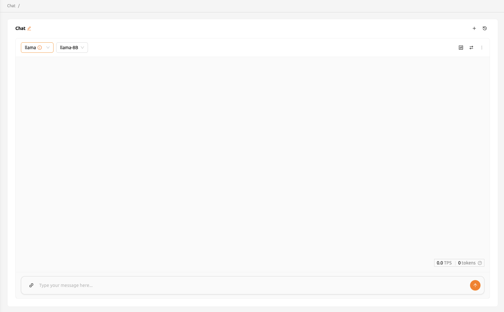
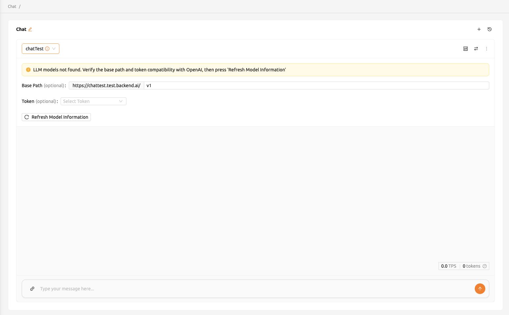
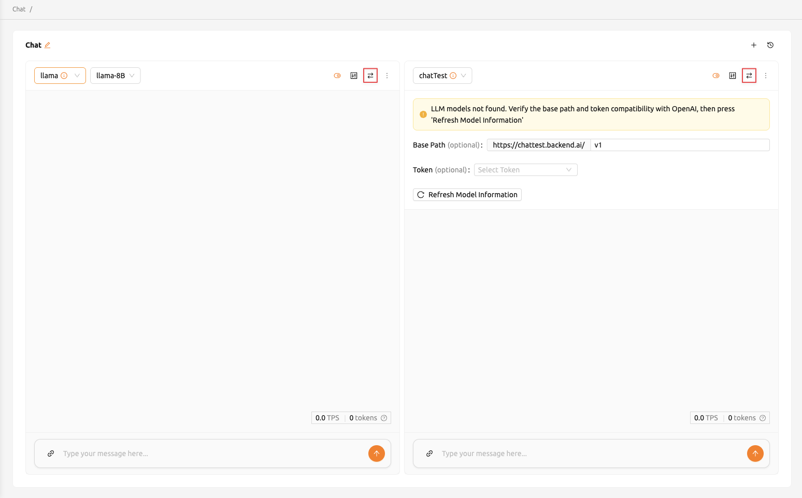
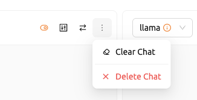
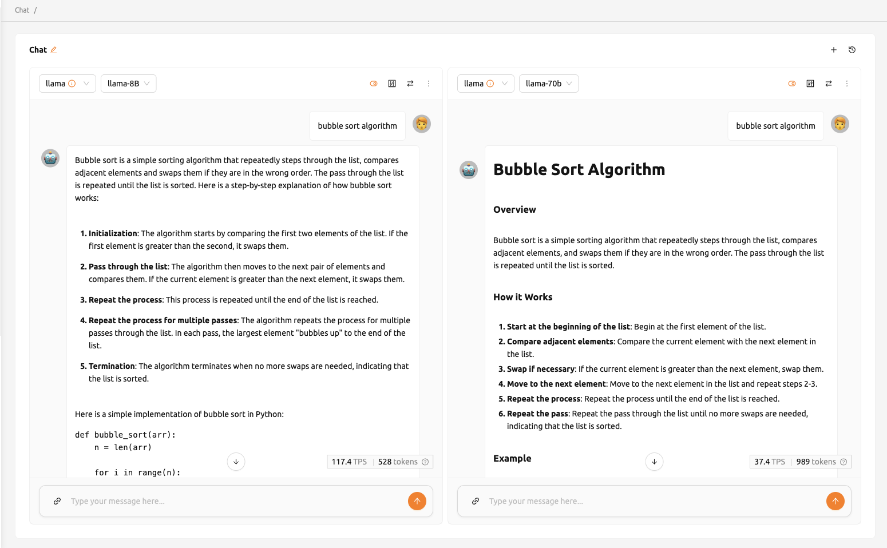

==============
Chat Page
==============

.. _chat:

Starting from version 25.05, the 'LLM Playground' feature has been separated into its own page and renamed to Chat. 
Chat page enables users to conveniently compare and interact with different LLM models all in one location.
This allows users to experience the services offered by Backend.AI as well as a variety of large language models (LLMs).

Selecting models
----------------

Users can select the endpoint and model from the top left corner of each chat card on the Chat page.
Clicking the endpoint field allows users to search for or choose from available endpoints, and the model can be selected in the same way.
If no model is associated with the selected endpoint, the model will be set to Custom.
When the model information cannot be retrieved, users will need to manually configure the model settings.

Refer to the description below for the necessary inputs to configure custom modal settings:

- baseURL: Base URL of the server where the model is located.
  Make sure to include the version information.
  For instance, when utilizing the OpenAI API, users should enter https://api.openai.com/v1.
- Model ID: Unique identifier of the model. To specify the model users wish to use, provide its unique identifier.
  For instance, for GPT-4, users would input gpt-4o.
- Token (optional): An authentication key to access the model service. Tokens can be 
  generated from various services, not just Backend.AI. The format and generation process
  may vary depending on the service. Always refer to the specific service's guide for details.
  For instance, when using the service generated by Backend.AI, please refer to the
  :ref:`Generating Tokens<generating-tokens>` section for instructions on how to generate tokens.

Add or remove chat cards
------------------------

To add new chat cards, click the '+' button located in the top right corner. 

To remove a chat session, click on the 'more' button located in the upper right corner of the chat card. 
Then a dropdown menu will appear, and users can select 'Delete Chat' to remove a chat session.
Please be cautious as this will delete all entered content.

Clear chat history
-------------------

Clicking the 'more' button will reveal the 'Clear chat' option. 
By selecting this, users will erase all chat history associated with the card, 
although the card session itself will remain active. 

Synchronize input
-----------------

The 'Sync Input' button, located at the top right, enables the synchronization of input across chat cards where the option is enabled. 
Enabling 'Sync input' means that pressing 'Enter' or clicking the 'Send' button on 
any card will submit the input from the card users are currently working on. 
This functionality is beneficial for comparing the outputs of various models using identical input data.

