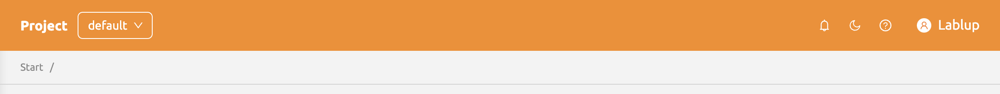
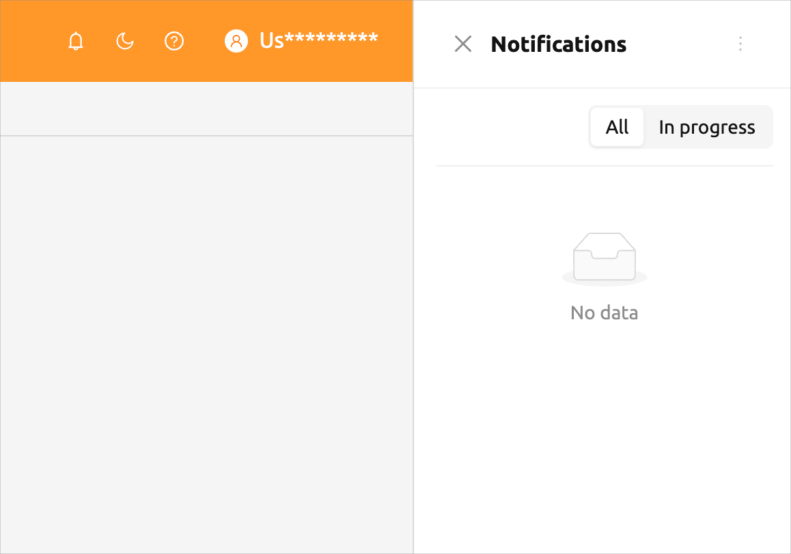
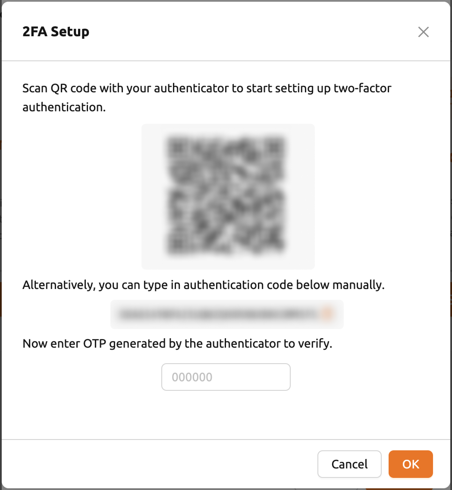
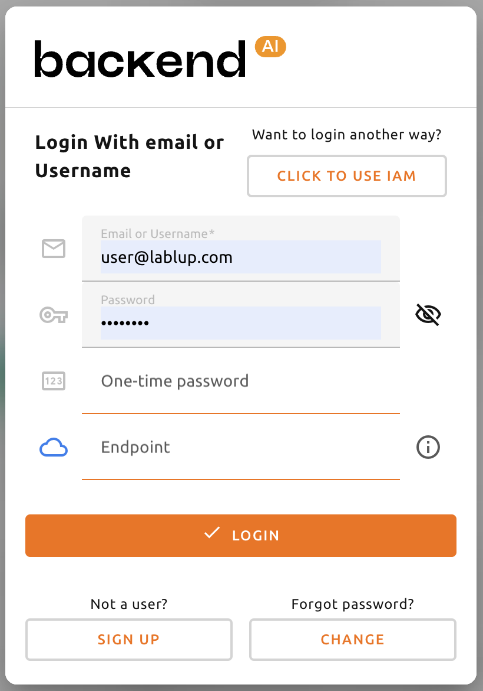

=================
Top Bar Features
=================

.. _top-bar-features:

The tob bar includes various features that support use of the WebUI.

Project selector
-----------------

.. _project-selector:

Users can switch between projects using the project selector provided in the top bar.
By default, the project that user currently belongs to is selected. 
Since each project may have different resource policies, switching projects may also change the available resource policies.

Notification
-------------

.. _notification:

The bell shape button is the event notification button.
Events that need to be recorded during WebUI operation are displayed here.
When background tasks are running, such as creating a compute session,
you can check the jobs here. When the background task is finished.

Theme mode
-----------

.. _theme-mode:

You can change the theme mode of the WebUI via the dark mode button on the
right side of the header.

.. image:: theme_mode.png
   :align: center
   :width: 100%
   :alt: Theme mode

Help
------

.. _help:

Click question mark button to access the web version of this guide document. 
You will be directed to the appropriate documentation based on the page you are currently on.

User Menu
-----------

.. _user-menu:

Click the person button on the right side of the top bar to see the user menu.
Each menu item has the following functions.

.. image:: user_drop_down.png
  :width: 350
  :align: center
  :alt: user drop down

* About Backend.AI: Displays information such as version of Backend.AI WebUI,
  license type, etc.
* My Account: Check/Update information of current login user.
* Preferences: Go to user settings page.
* Logs / Errors: Go to the log page. You can check the log and error history
  recorded on the client side.

My Account
^^^^^^^^^

If you click My Account, the following dialog appears.

.. image:: my_account_information.png
  :width: 350
  :align: center
  :alt: My account information

Each item has the following meaning. Enter the desired value and click the UPDATE button to update the user
information.

* Full Name: User's name (up to 64 characters).
* Original password: Original password. Click the right view button to see the
  input contents.
* New password: New password (8 characters or more containing at least 1
  alphabet, number, and symbol). Click the right view button to see the input
  contents. Ensure this is the same as the Original password.
* 2FA Enabled: 2FA activation. The user needs to enter the OTP code when logging in if it is checked.

.. note::
  Depending on the plugin settings, the ``2FA Enabled`` column might be invisible.
  In that case, please contact administrator of your system.

2FA Setup
^^^^^^^^^
If you activate the ``2FA Enabled`` switch, the following dialog appears.

Turn on the 2FA application you use and scan the QR code or manually enter the verification
code. There are many 2FA-enabled applications, such as Google Authenticator, 2STP, 1Password,
and Bitwarden.

Then enter the 6-digit code from the item added to your 2FA application into the dialog above.
2FA is activated when you press the CONFIRM button.

When you log in later, if you enter an email and password, an additional field appears asking
for the OTP code.

To log in, you must open the 2FA application and enter a 6-digit code in the One-time password field.

.. image:: remove_2fa.png
  :width: 350
  :align: center

If you want to disable 2FA, turn off the ``2FA Enabled`` switch and click the confirm button in the
following dialog.