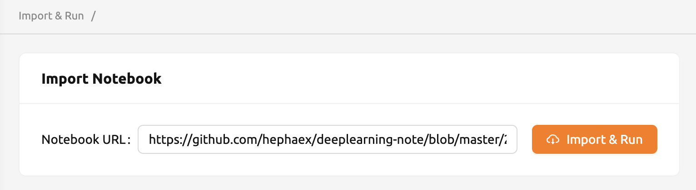
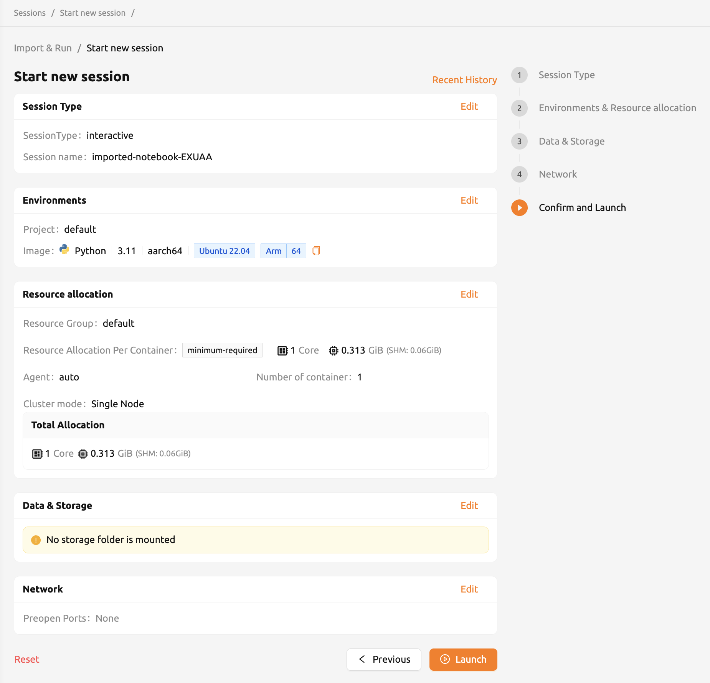
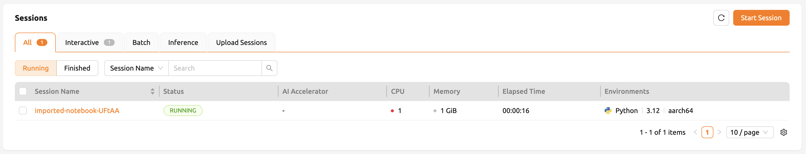
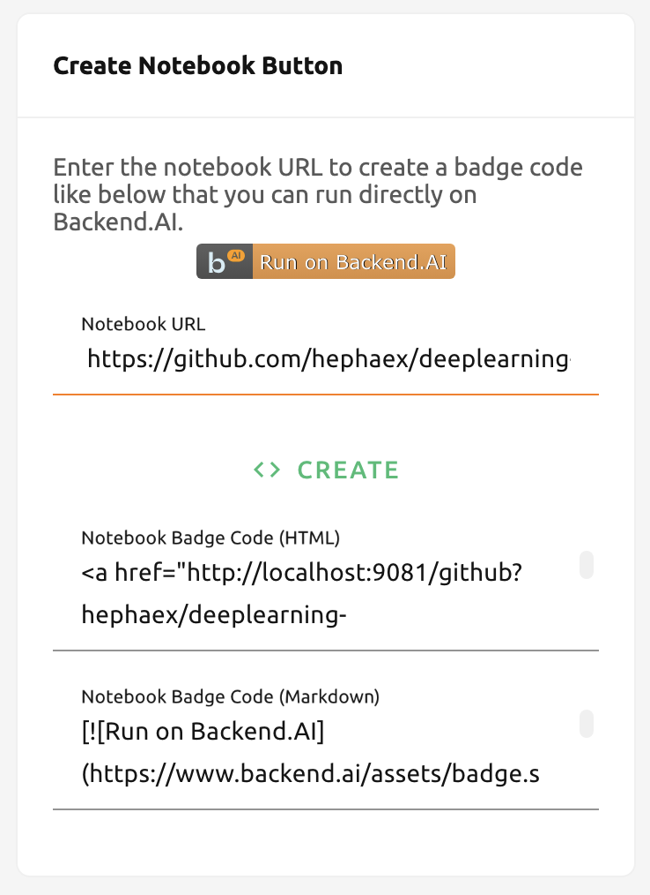
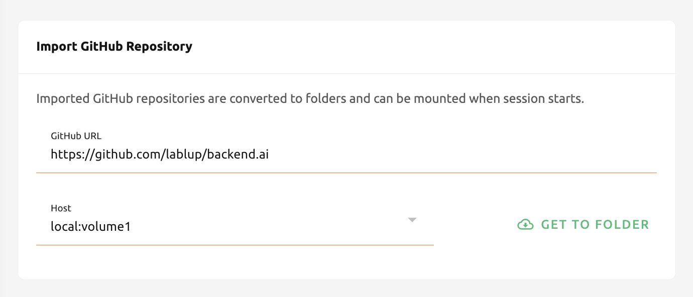
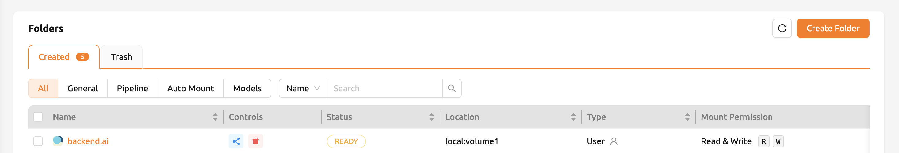
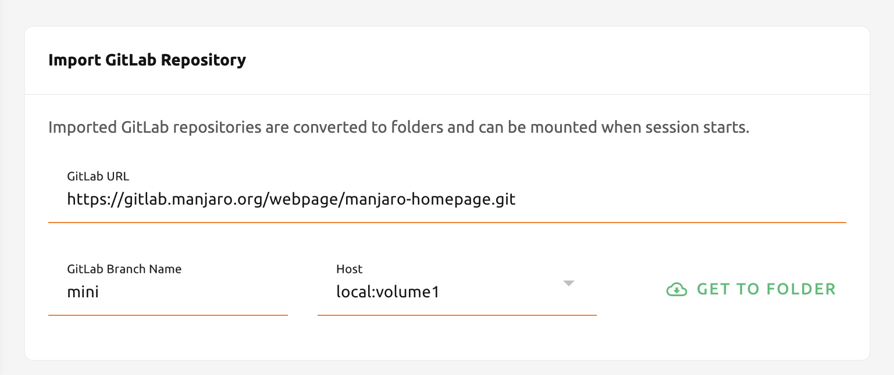

=====================================================
Import & Run notebooks and web based Git repositories
=====================================================

.. _import-and-run:

On the 'Import & Run' page, Backend.AI supports executing Jupyter notebook files and importing web based Git repositories
such as GitHub and GitLab on the fly. You don't need to create or download into your local storage
and re-upload it. The only thing you have to do is input a valid URL you want to execute or import,
and click the button on the right side.

Import and run Jupyter notebooks
----------------------------------

To import Jupyter notebooks and run, you need one thing, the valid URL for the notebook file.
For example, if you want execute Jupyter notebook that's in github, you can copy and paste
the URL and click 'IMPORT & RUN' button.

.. note::

   When you trying to IMPORT & RUN Jupyter notebook file with local address,
   It will be regarded as invalid. You have to input URL which is not starting from localhost.

After clicking the button, the dialog appears. This is a session launcher dialog same as
when you starts the session at Sessions page or Summary page. Difference between import notebook
and starting a new session is that import notebook automatically imports jupyter notebook in the
URL, but simple starting a new session doesn't do that. the rest is same. Click 'LAUNCH' button to
the notebook after setting the environments and resource allocation as needed.

.. warning::
   The pop-up blocker must be turned off before clicking 'LAUNCH' button to immediately
   see the running notebook window. Also, if there's not enough resources to execute the session,
   imported Jupyter notebook will not run.

You can see the importing operation is successfully completed in Sessions page.

Create executable Jupyter notebook button
-----------------------------------------

You can also create HTML or Markdown button about Jupyter notebook URL, too.
Input a valid Jupyter notebook URL and click 'CREATE' button. It will show code blocks that directly
links to creating a session with notebook. You can see the badge code working by inserting it in
the GitHub repositories or where it supports html or markdown.

.. note::

   your account must be logined before clicking the button. Otherwise, you have to login first.

.. _importing-github-repositories:

Importing GitHub Repositories
-----------------------------

Importing a GitHub repository is similar to import and running jupyter notebook.
All you have to do is to fill out with github repository URL and click 'GET TO
FOLDER' button. If you can access to more than one storage host, you can select one from the list.

.. warning::

   If there are not enough resources to start a session or folder count is at
   the limit, then importing repository will fail. Please check resource
   statistics panel and Data & Storage page before importing the repository.

You can see the repository is successfully imported as a data folder with its
name.

Importing GitLab Repositories
-----------------------------

From 22.03, Backend.AI supports importing from GitLab. It's almost the same as
:ref:`Importing GitHub Repositories<importing-github-repositories>`,
but you need to explicitly set the branch name to import.

.. note::

   If there's data folder that has the same name already, the system will append
   ``_`` (underscore) and number in the imported repository folder.
