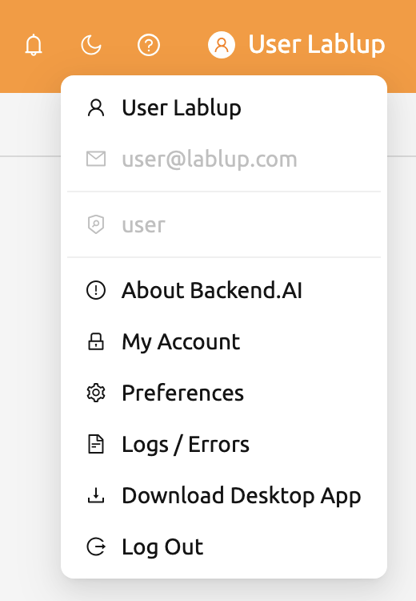
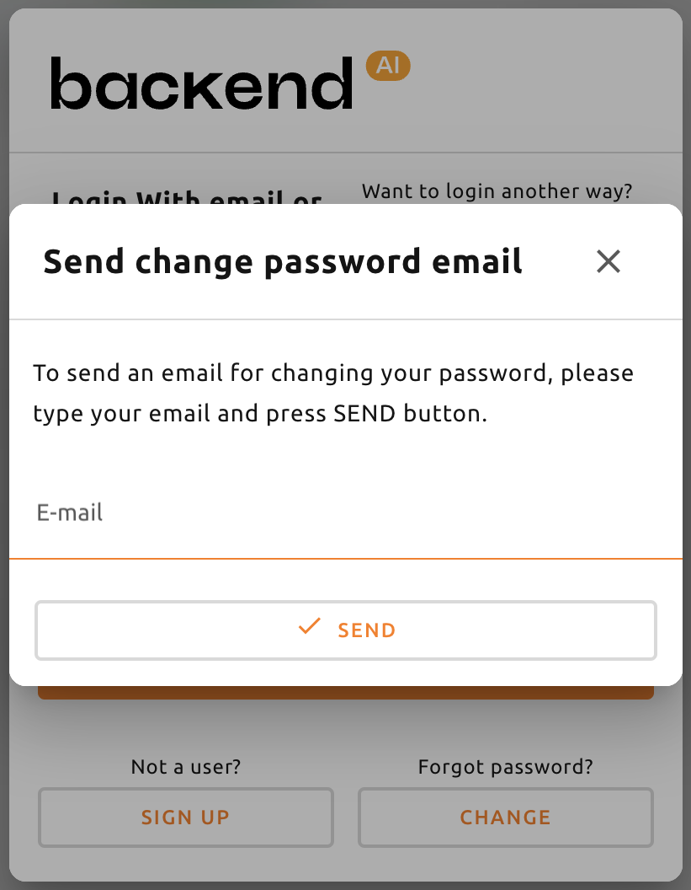

================
Signup and Login
================

Signup
------

When you launch the GUI console, login dialog appears. If you haven't signed up
yet, press the SIGN UP button.

.. image:: login_dialog.png
   :width: 400
   :align: center
   :alt: Login dialog

Enter email, username, password, etc., read and agree to the Terms of Service /
Privacy Policy, and click the SIGNUP button. Depending on your system settings,
you may need to enter an invitation token to sign up.  Furthermore, an email may
be sent to verify that the email is yours. If a verification email is sent, you
will need to read the email and click the link inside to pass verification
before you can log in with your account.

.. image:: signup_dialog.png
   :width: 350
   :align: center
   :alt: Signup dialog

.. note::
   Depending on the server configuration and plugin settings, sign up by
   anonymous user may not be allowed. In that case, please contact administrator
   of your system.

Login
-----

Enter your ID and password and press the LOGIN button. In API ENDPOINT, the URL
of Backend.AI Console Server, which relays the request to the Manager, should be
entered.

.. note::
   Depending on the installation and setup environment of the Console Server,
   the endpoint might be pinned and not configurable.

After login, you can check the information of the current resource usage in
the Summary tab.

Buy clicking the icon in the upper-right corner, you will see sub menus. You
can logout by selecting the Log Out menu.

When you forgot your password
-----------------------------

If you have forgotten your password, you can click the CHANGE PASSWORD button on
the login panel to email a link to change password. You can change your password
by reading and following the instruction. Depending on the server settings, the
password change feature may be disabled. In this case, contact the
administrator.

.. note::
   This is also a modular feature, so changing password may not be possible in
   some systems.
