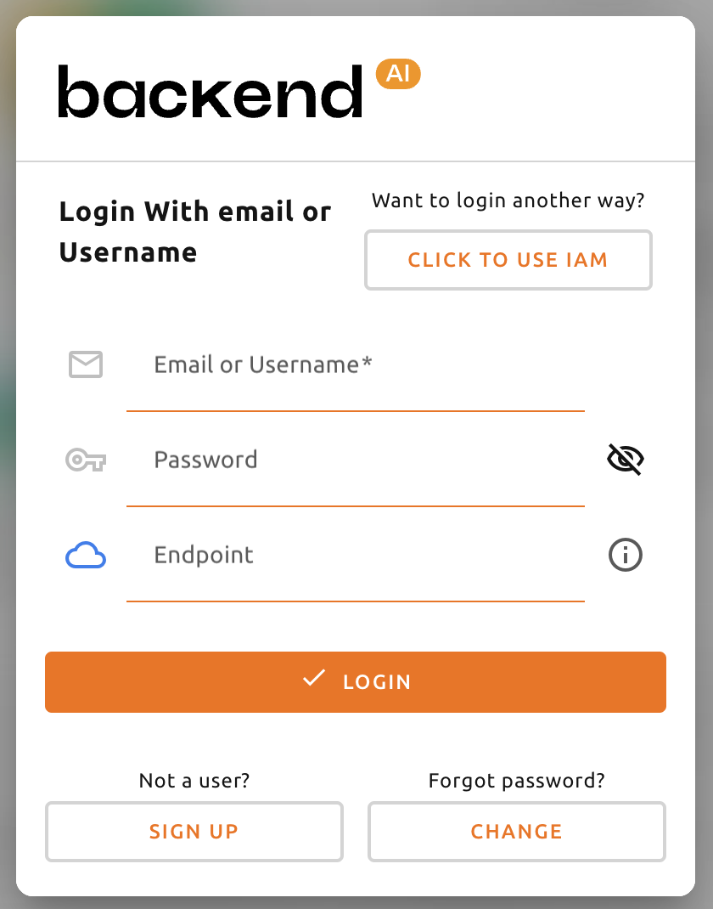

================
Signup and Login
================

Signup
------

When you launch the WebUI, login dialog appears. If you haven't signed up
yet, press the SIGN UP button.

Enter the required information, read and agree to the Terms of Service /
Privacy Policy, and click the SIGNUP button. Depending on your system settings,
you may need to enter an invitation token to sign up. A verification email may
be sent to verify that the email is yours. If the verification email is sent, you
will need to read the email and click the link inside to pass verification
before you can log in with your account.

.. image:: signup_dialog.png
   :width: 400
   :align: center
   :alt: Signup dialog

.. note::
   Depending on the server configuration and plugin settings, signing up by
   anonymous user may not be allowed. In that case, please contact administrator
   of your system.

.. note::
   To prevent malicious users from guessing user's password, password should be longer
   than 8 characters with at least one alphabet(s), number(s), and special
   character(s).

Login
-----

Enter your ID and password and press the LOGIN button. In API ENDPOINT, the URL
of Backend.AI Webserver, which relays the request to the Manager, should be
entered.

.. note::
   Depending on the installation and setup environment of the Webserver,
   the endpoint might be pinned and not configurable.

.. note::
   Backend.AI keeps the user's password securely through a one-way hash. BCrypt,
   the default password hash of BSD, is used, so even the server admins cannot
   know the user's password.

After login, you can check the information of the current resource usage in
the Summary tab.

By clicking the icon in the upper-right corner, you will see sub menus. You
can logout by selecting the Log Out menu.

.. image:: signout_button.png
   :width: 600
   :align: center
   :alt: Signout button

When you forgot your password
-----------------------------

If you have forgotten your password, you can click the CHANGE PASSWORD button on
the login panel to email a link to change password. You can change your password
by reading and following the instruction. Depending on the server settings, the
password change feature may be disabled. In this case, contact the
administrator.

.. image:: forgot_password_panel.png
   :width: 350
   :align: center
   :alt: Signout button

.. note::
   This is also a modular feature, so changing password may not be possible in
   some systems.

.. warning::
   If login failure occures more than 10 times consecutively, access
   to the endpoint is temporarily restricted for 20 minutes for security
   reasons. If the access restriction continues on more than 20 minutes, please contact
   your system administrator.

Sidebar Menus
--------------------

Change the size of the sidebar via the buttons on the right side of the sidebar.
Click it to significantly reduce the width of the sidebar, giving you a wider view of its contents.
Clicking it again will return the sidebar to its original width.
You can also use the shortcut keys ( ``[`` and ``]`` ) to toggle between the narrow and original sidebar widths.

Header Events
----------------
The bell shape button is the event notification button.
Events that need to be recorded during WebUI operation are displayed here.
When background tasks are running, such as creating a compute session,
you can check the jobs here. When the background task is finished.

.. image:: notification.png
   :align: center
   :width: 600

You can change the theme mode of the WebUI via the dark mode icon on the
right side of the header.

.. image:: theme_mode.png
   :align: center

There is a question mark icon at the lower right side of the header.
Click this icon to access the web version of this guide document.
