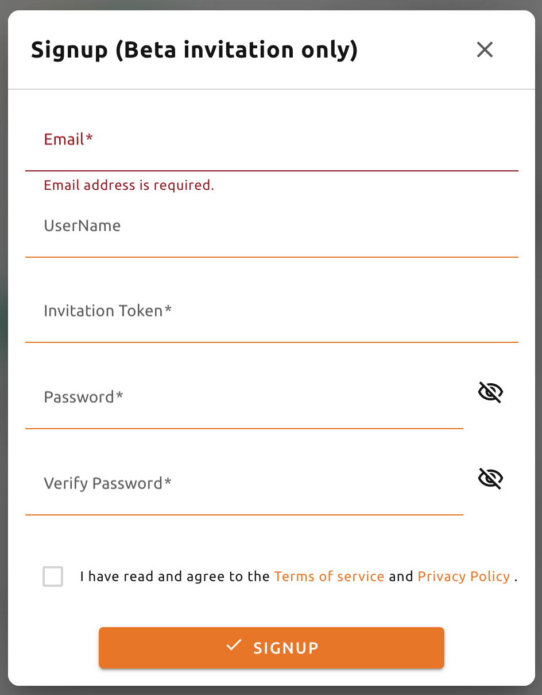

================
Signup and Login
================

Signup
------

When you launch the GUI console, login dialog appears. If you haven't signed up
yet, press the SIGN UP button on the top right.

.. image:: login_dialog.png
   :alt: Login dialog

After entering the e-mail, press the CHECK button to retrieve your information.
(Depending on the server configuration and plug-in settings, you may not need a
separate CHECK procedure.) Then enter your password and press the SIGNUP button
to complete the signup. If successful, you will be returned to the initial
login screen.

Login
-----
Enter your ID and password and press the LOGIN button. In API ENDPOINT, the URL
of Backend.AI Console Server, which relays the request to the Manager, should be
entered.

.. note::
   Depending on the installation and setup environment of the Console Server,
   the endpoint might be pinned and not configurable.

After login, you can check the information of the current resource usage in
the Summary tab.

You can logout by clicking the Exit icon in the upper right corner.

.. image:: signout_button.png
   :width: 400
   :align: center
   :alt: Signout button
