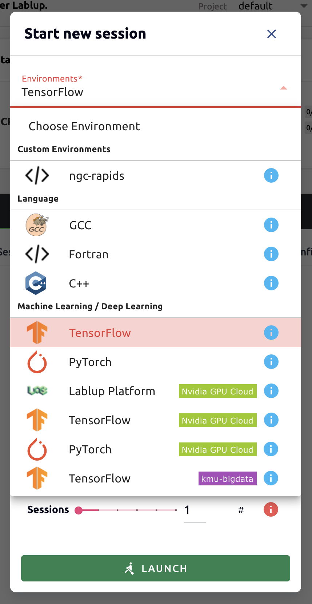
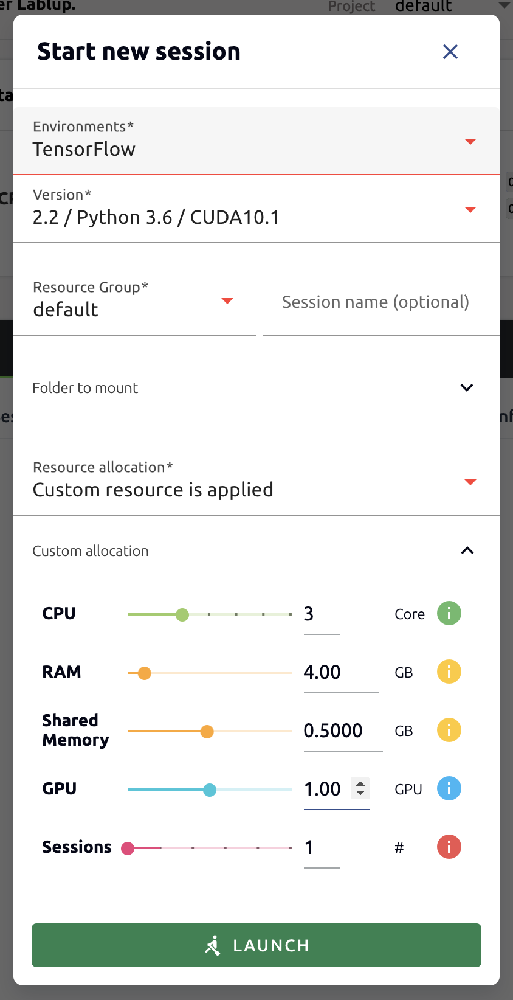
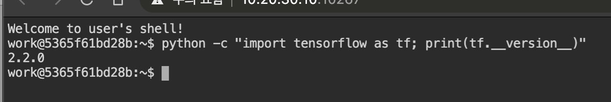
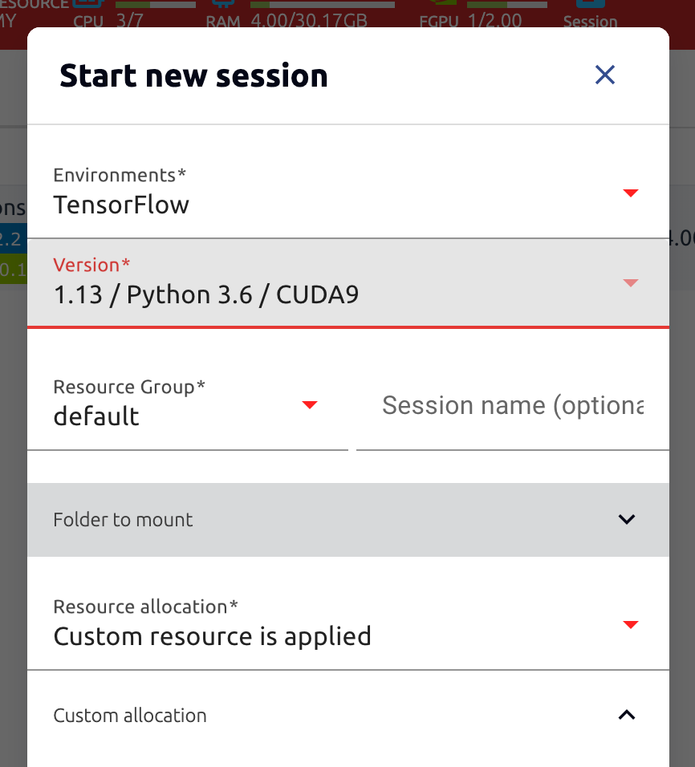
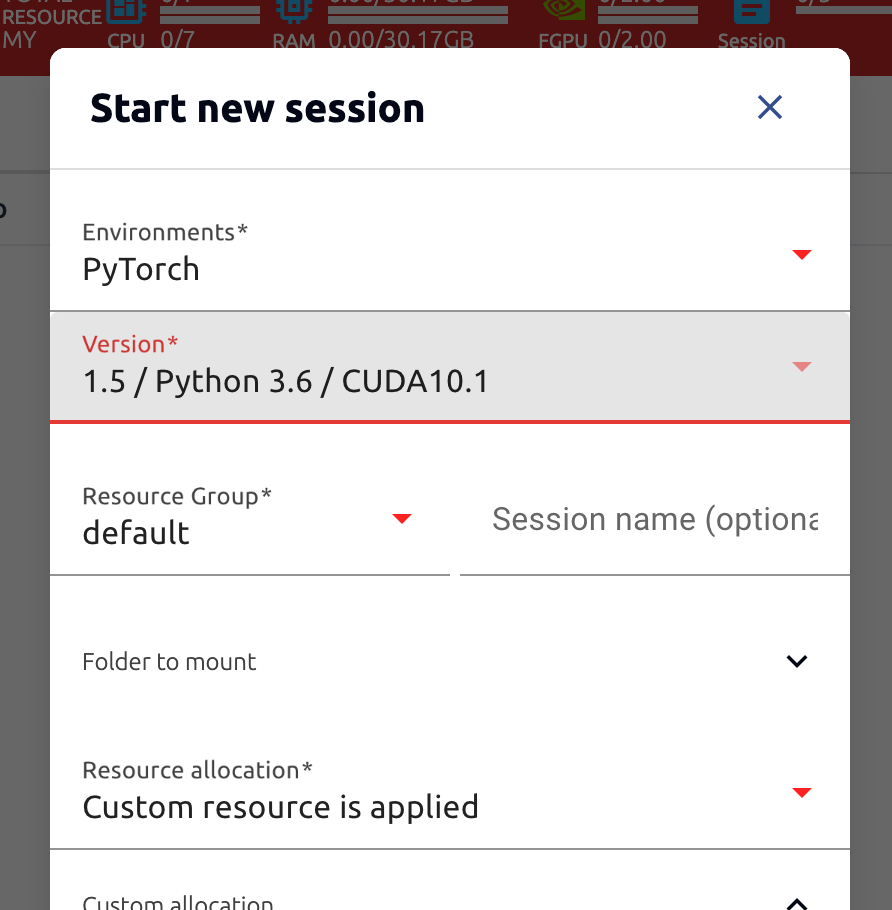
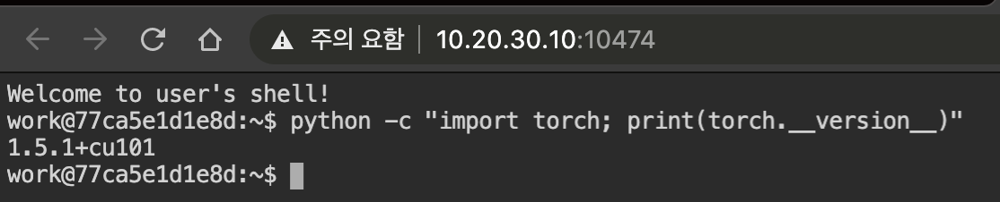

================================================
Multi-version Machine Learning Container Support
================================================

.. note:: Objectives

   * Use of images such as TensorFlow and PyTorch without user's installation
   * Support multiple versions of major ML libraries

Backend.AI provides variaous pre-built ML and HPC kernel images. Therefore,
users can immediately utilize major libraries and packages without having to
install packages themselves. Here, we'll walk through an example that takes
advantage of multiple versions of the multiple ML library immediately.

Go to the Sessions page and open the session launch dialog. There may be various
kernel images depending on the installation settings.

Here, we selected the TensorFlow 2.2 environment and created a session.

Open the web terminal of the created session and run the following Python
command. You can see that TensorFlow 2.2 version is actually installed.

This time, we select the TensorFlow 1.13 environment to create a compute
session. (If resources are insufficient, previous sessions are deleted)

Open the web terminal of the created session and run the same Python command as
before. You can see that TensorFlow 1.13(.1) version is actually installed.

.. image:: tf113_version_print.png
   :width: 450
   :align: center

Finally, create a compute session using PyTorch version 1.5.

Open the web terminal of the created session and run the following Python
command. You can see that PyTorch 1.5 version is actually installed.

Like this, you can utilize various versions of major libraries such as
TensorFlow and PyTorch through Backend.AI without unnecessary installation
effort.
