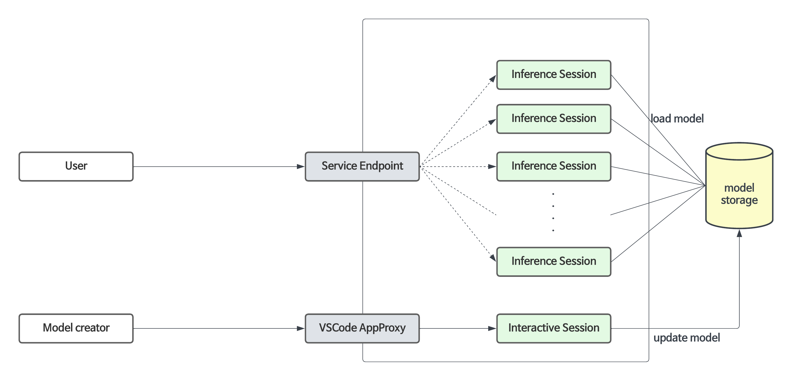
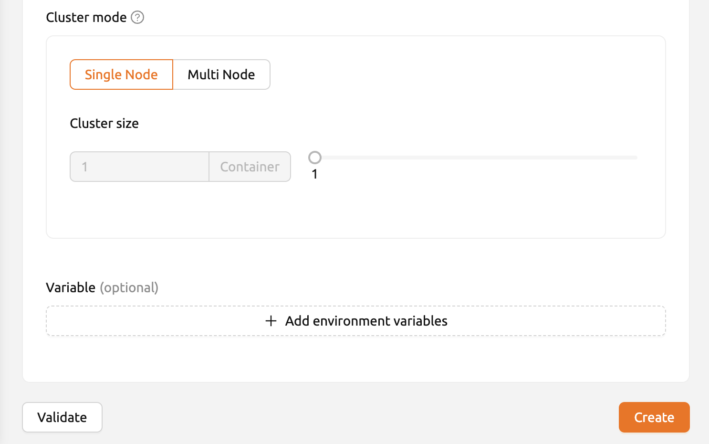

=============
Model Serving
=============

Model Service
-------------

.. note::
   This feature is supported in Enterprise version only.

Backend.AI not only facilitates the construction of development environments 
and resource management during the model training phase, but also supports 
the model service feature from version 23.09 onwards. This feature allows 
end-users (such as AI-based mobile apps and web service backends) to make
inference API calls when they want to deploy the completed model as an 
inference service.

The Model Service extends the functionality of the existing training
compute sessions, enabling automated maintenance, scaling, and permanent
port and endpoint address mapping for production services. Developers or
administrators only need to specify the scaling parameters required for
the Model Service, without the need to manually create or delete compute
sessions.

Configuring and limitations of model service in version 23.03 and earlier
-------------------------------------------------------------------------

Although the model serving-specific feature is officially supported from 
version 23.09, you can still use model service in earlier versions.

For example, in version 23.03, you can configure a model service by
modifying the compute session for training in the following way:

1. Add pre-opened ports during session creation to map the running
   server port inside the session for model serving. 
   (For instructions on how to use preopen ports, refer to this :ref:`Set Preopen Ports <set_preopen_ports>`.)

2. Check “Open app to public” to allow the service mapped to the
   pre-opened port to be publicly accessible. 
   (For detailed information about “Open app to public,” refer to this :ref:`Open app to public <open_app_to_public>`.)

However, there are certain limitations in version 23.03:

-  Sessions do not automatically recover if they are terminated due to
   external factors such as idle timeout or system errors.
-  The app port changes every time a session is restarted.
-  If sessions are repeatedly restarted, the idle ports may be
   exhausted.

The official Model Service feature in version 23.09 resolves these
limitations. Therefore, starting from version 23.09, it is recommended
to create/manage Model Services through the model serving menu whenever
possible. The use of pre-opened ports is recommended only for
development and testing purposes.

Guide to Steps for Using Model Service
--------------------------------------

To use the Model Service, you need to follow the steps below:

1. Create a model definition file.
2. Upload the model definition file to the model type folder.
3. Create/modify the Model Service.
4. (If the Model Service is not public) Obtain a token.
5. (For end users) Access the endpoint corresponding to the Model
   Service to verify the service.

Creating a Model Definition File
~~~~~~~~~~~~~~~~~~~~~~~~~~~~~~~~

   .. note::
      From 24.03, you can configure model definition file name. But if you don't
      input any other input field in model definition file path, then the system will 
      regard it as ``model-definition.yml`` or ``model-definition.yaml``

The model definition file contains the configuration information
required by the Backend.AI system to automatically start, initialize,
and scale the inference session. It is stored in the model type folder 
independently from the container image that contains the inference 
service engine. This allows the engine to serve different models based on 
specific requirements and eliminates the need to build and deploy a new
container image every time the model changes. By loading the model 
definition and model data from the network storage, the deployment
process can be simplified and optimized during automatic scaling.

The model definition file follows the following format:

.. code:: yaml

   models:
     - name: "simple-http-server"
       model_path: "/models"
       service:
         start_command:
           - python
           - -m
           - http.server
           - --directory
           - /home/work
           - "8000"
         port: 8000
         health_check:
           path: /
           max_retries: 5

.. _model_definition_guide:

Key-Value Descriptions for Model Definition File
~~~~~~~~~~~~~~~~~~~~~~~~~~~~~~~~~~~~~~~~~~~~~~~~

   .. note:: 
      Fields without "(Required)" mark is optional

- ``name`` (Required): Defines the name of the model.
- ``model_path`` (Required): Addresses the path of where model is defined.
- ``service``: Item for organizing information about the files to be served   
  (includes command scripts and code).

   - ``pre_start_actions`` : Item for organizing preceding commands or actions to be executed before the ``start_command``.

      - ``action``: Further information and description is in :ref:`here <prestart_actions>`.
      - ``args/*``: Further information and description is in :ref:`here <prestart_actions>`.

   - ``start_command`` (Required): Specify the command to be executed in model serving.
   - ``port`` (Required): Specify the ports to be opened in accordance with the commands executed during model serving at the container.

   - ``health_check``: Item for checking whether service is running without   
     any error according to defined period.

     - ``path``: Specify the path for verifying that the service is running properly in model serving.
     - ``max_retries``: Specify the number of retries to be made if there is no response after a request is sent to the service during model serving. 

Description for service action supported in Backend.AI Model serving
~~~~~~~~~~~~~~~~~~~~~~~~~~~~~~~~~~~~~~~~~~~~~~~~~~~~~~~~~~~~~~~~~~~~

.. _prestart_actions:

- ``write_file``: This is an action to create a file with the given   
  file name and append control to it. the default access permission is ``644``.

   - ``arg/filename``: Specify the file name
   - ``body``: Specify the content to be added to the file.
   - ``mode``: Specify the file's access permissions.
   - ``append``: Set whether to overwrite or append content to the file as ``True`` or ``False`` .

- ``write_tempfile``: This is an action to create a file with   
  a temporary file name (``.py``) and append content to it. If no value is specified for the mode, the default access permission is ``644``.

   - ``body``: Specify the content to be added to the file.
   - ``mode``: Specify the file's access permissions.

- ``run_command``: The result of executing a command,   
  including any errors, will be returned in following format 
  ( ``out``: Output of the command execution, ``err``: Error message if an error occurs during command execution)

   - ``args/command``: Specify the command to executed as an array. (e.g. ``python3 -m http.server 8080`` command goes to ["python3", "-m", "http.server", "8080"] )

- ``mkdir``: This is an action to create a directory by input path

   - ``args/path``: Specify the path to create a directory

- ``log``: This is an action to print out log by input message

   - ``args/message``: Specify the message to be displayed in the logs.
   -  ``debug``: Set to ``True`` if it is in debug mode, otherwise set to ``False``.

Uploading Model Definition File to Model Type Folder
~~~~~~~~~~~~~~~~~~~~~~~~~~~~~~~~~~~~~~~~~~~~~~~~~~~~

To upload the model definition file (``model-definition.yml``) to the
model type folder, you need to create a virtual folder. When creating
the virtual folder, select the ``model`` type instead of the default
``general`` type. Refer to the section on :ref:`creating a storage 
folder<create_storage_folder>` in the Data & Folders page for
instructions on how to create a folder.

.. image:: model-type-folder-creation.png
   :width: 500
   :align: center
   :alt: Model type folder creation

After creating the folder, select the “Model” tab in the Data & Folders
page, click on the recently created model type folder icon to open the
folder explorer, and upload the model definition file.

.. image:: model-definition-file-upload.png
   :align: center
   :alt: Model definition file upload

Creating/Validating Model Service
~~~~~~~~~~~~~~~~~~~~~~~~~~~~~~~~~~

Once the model definition file is uploaded to the virtual folder of the
model type, you are ready to create the model service.

Click the “Start Service” button on the Model Serving page. This will
bring up a modal where you can enter the required settings for creating
the service.

.. image:: service-launcher1.png
   :width: 700
   :align: center
   :alt: Service launcher

First, provide a service name. For detailed explanations of each item, please refer to the following:

-  Open To Public: This option allows access to the model service
   without any separate token on the server where the service is to be
   hosted. By default, it is disabled.
-  Model Storage To Mount: This is model folder to mount, which contains 
   model definition file inside the directory
-  Model Destination For Model Folder: This option allows aliasing path of 
   model storage path to session corresponding to routing, which represents 
   the service. default value is ``/models``.
-  Model Definition File Path: You can also set model definition file as you
   uploaded in model storage path. default value is ``model-definition.yaml``.
-  Additional Mounts: Likewise session, service provides additional mounts. 
   Notice that only you can mount general/data usage mode folder, not additional 
   model folder.
-  Desired Routing Count: The model service can be serviced by multiple
   servers. This setting determines how many routing sessions to create
   for the current service. The value specified here will be used as the
   basis for creating the sessions.

.. image:: service-launcher2.png
   :width: 700
   :align: center
   :alt: Service launcher

Then select a resource group. The resource group is a collection of
resources that can be allocated to the model service.

-  Environment / Version: You can configure the execution environment
   for the dedicated server of the model service. Currently, even if the
   service has multiple routings, it will be executed in a single
   environment only. (Support for multiple execution environments will
   be added in a future update)
-  CPU: The number of CPU cores allocated to the routing for running the
   model service.
-  RAM: The amount of memory allocated to the routing for running the
   model service (in GiB).
-  GPU: The GPU allocation for the routing for running the model
   service.
-  Shared Memory: The amount of shared memory allocated to the routing
   for running the model service (in GiB). It should be smaller than the
   allocated memory.
-  AI Accelerator: The amount of AI accelerator (GPUs or NPUs). 
   If manual image setting is allowed by configuration, users could select
   any AI accelerator on demand according to resource group.

-  Single Node : When running a session, the managed node and worker nodes are 
   placed on a single physical node or virtual machine.
-  Multi Node : When running a session, one managed node and one or more worker 
   nodes are split across multiple physical nodes or virtual machines.

Before creating model service, Backend.AI supports validation feature to check 
whether execution is available or not(due to any errors during execution.) By 
clicking ``Validate`` button in bottom-left of service launcher, a new popup for 
listening validation event will pops up. in the popup modal, you can check the status 
by container log. when result is set to ``Finished``, then validation check is finished.

.. note:: 
   The result ``Finished`` doesn't guarantee that the execution is successfully done. 
   Instead, please check the container log. 

Modifying Model Service
~~~~~~~~~~~~~~~~~~~~~~~

Click on the wrench icon in the Control tab to open a modal where you can change 
the model service. The format is identical to the model service start modal, with 
previously entered fields already filled in. You can optionally modify only the 
fields you wish to change. After modifying the fields, click the confirm button. 
The changes will be adjusted accordingly.

.. image:: edit-service-launcher.png
   :align: center
   :alt: Edit model service dialog

Terminating Model Service
~~~~~~~~~~~~~~~~~~~~~~~~~

The model service periodically runs a scheduler to adjust the routing
count to match the desired session count. However, this puts a burden on
the Backend.AI scheduler. Therefore, it is recommended to terminate the 
model service if it is no longer needed. To terminate the model service, 
click on the trash icon in the Control tab. A modal will appear asking 
for confirmation to terminate the model service. Clicking ``OK`` 
will terminate the model service. The terminated model service will be 
removed from the list of model services.

.. image:: terminate-model-service-dialog.png
   :width: 500
   :align: center
   :alt: Terminate model service dialog

Handling Failed Model Service Creation
~~~~~~~~~~~~~~~~~~~~~~~~~~~~~~~~~~~~~~

If the status of the model service remains ``UNHEALTHY``, it indicates
that the model service cannot be executed properly.

The common reasons for creation failure and their solutions are as
follows:

-  Insufficient allocated resources for the routing when creating the
   model service

   -  Solution: Terminate the problematic service and recreate it with
      an allocation of more sufficient resources than the previous
      settings.

-  Incorrect format of the model definition file (``model-definition.yml``)

   .. image:: serving-route-error.png
      :width: 500
      :align: center
      :alt: Serving route error

   -  Solution: Verify :ref:`the format of the model definition file <model_definition_guide>` and 
      if any key-value pairs are incorrect, modify them and overwrite the file in the saved location. 
      Then, click ``Clear error and Retry`` button to remove all the error stacked in routes info 
      table and ensure that the routing of the model service is set correctly.

      .. image:: refresh-button.png
         :align: center
         :alt: Refresh button

Generating Tokens
~~~~~~~~~~~~~~~~~

Once the model service is successfully executed, the status will be set
to ``HEALTHY``. In this case, you can click on the corresponding endpoint
name in the Model Service tab to view detailed information about the
model service. From there, you can check the service endpoint in the
routing information of the model service. If the “Open to Public” option
is enabled when the service is created, the endpoint will be publicly
accessible without any separate token, and end users can access it.
However, if it is disabled, you can issue a token as described below to
verify that the service is running properly.

.. image:: routing-page.png
   :align: center
   :alt: Routing page

Click the token creation button located to the right of the generated
token list in the routing information. In the modal that appears for
token creation, enter the expiration date. 

.. image:: token-generation-dialog.png
   :width: 500
   :align: center
   :alt: Token generation dialog

The issued token will be added to the list of generated tokens. Click the copy icon in the token
item to copy the token, and add it as the value of the following key.

.. image:: generated-token-copy.png
   :align: center
   :alt: Generated token copy

============= ================
Key           Value
============= ================
Content-Type  application/json
Authorization BackendAI
============= ================

Accessing the Model Service Endpoint for End Users
~~~~~~~~~~~~~~~~~~~~~~~~~~~~~~~~~~~~~~~~~~~~~~~~~~

To complete the model serving, you need to share information with the
actual end users so that they can access the server where the model
service is running. If the Open to Public option is enabled when the
service is created, you can share the service endpoint value from the
routing information page. If the service was created with the option
disabled, you can share the service endpoint value along with the token
previously generated.

Here's the simple command using ``curl`` command whether to check sending any requests 
to model serving endpoint working properly or not.

.. code:: console

   $ export API_TOKEN="<token>"
   $ curl -H "Content-Type: application/json" -X GET \
   $ -H "Authorization: BackendAI $API_TOKEN" \
   $ <model-service-endpoint>

.. warning:: 
   By default, end users must be on a network that can access the
   endpoint. If the service was created in a closed network, only end
   users who have access within that closed network can access the
   service.
