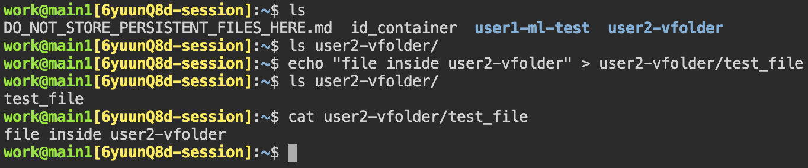
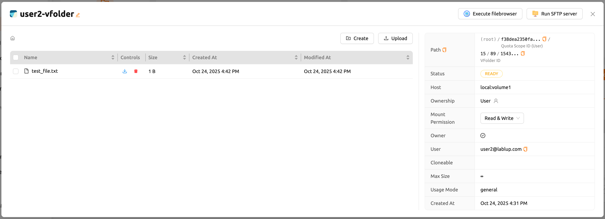

.. _session-with-mounts:

=============================================
Create a Compute Session with Mounted Folders
=============================================

When you start a compute session, the user has access to the ``/home/work/``
directory, and the normal directores and files created under ``/home/work/``
will disappear when the compute session is destroyed. This is because compute
sessions are dynamically created and deleted based on the container. To preserve
the data inside the container independent of the life cycle of the container, a
separate host folder must be mounted into the container, and then files must be
created within the mounted folder. Backend.AI provides a function to mount
storage folders when creating a compute session.

Let's go to the Sessions page and click the START button to create a new compute
session. In the session create dialog, click Folders to mount to see a list of
storage folders that a user can mount. Among them, you can add them by clicking
the folder you want to mount. You can also mount multiple folders simultaneously
by clicking multiple items. In this example, we will mount two folders,
``user1-ml-test`` and ``user2-vfolder``, and then create a compute session.

.. image:: create_session_with_folders.png
   :width: 400
   :align: center
   :alt: Launch a compute session with storage folders

Now, open the terminal by clicking the terminal icon in the created session. If
you run ``ls`` command in the terminal, you can see that the ``user1-ml-test``
and ``user2-vfolder`` folders are mounted under the home directory. Let's create
a ``test_file`` under ``user2-vfolder`` to see if the file can be preserved
after the compute session is destroyed. The contents of this file will filled
with "file inside user2-vfolder".

If you run ``ls`` command against ``user2-vfolder``, you can see that the file
was created successfully. Also note the contents of the file with the ``cat``
command.

Now delete the compute session and go to the Storage page. Locate the
``user2-vfolder folder``, open a file explorer and check that the file
``test_file`` exists. Click the file download button in Actions to download the
file to the local machine and open it in an editor to confirm that the contents
of the file are "file inside user2-vfolder".

Like this, when creating a compute session, you can mount storage folders and
perform any file operations on those mounted folders to save data even after the
compute session termination.
