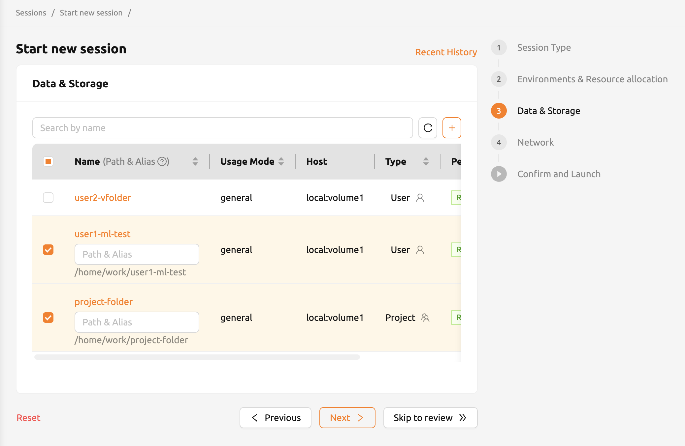

.. _session-with-mounts:

=============================================
Create a Compute Session with Mounted Folders
=============================================

When you start a compute session, the user has access to the ``/home/work/``
directory, and the normal directores and files created under ``/home/work/``
will disappear when the compute session is destroyed. This is because compute
sessions are dynamically created and deleted based on the container. To preserve
the data inside the container independent of the life cycle of the container, a
separate host folder must be mounted into the container, and then files must be
created within the mounted folder. Backend.AI provides a function to mount
storage folders when creating a compute session.

Let's go to the Sessions page and click the START button to create a new compute
session. In the session create dialog, click Folders to mount to see a list of
storage folders that a user can mount. Among them, you can add them by clicking
the folder you want to mount. You can also mount multiple folders simultaneously
by clicking multiple items. In this example, we will mount two folders,
``user1-ml-test`` and ``user2-vfolder``, and then create a compute session.

Now, open the terminal by clicking the terminal icon in the created session. If
you run ``ls`` command in the terminal, you can see that the ``user1-ml-test``
and ``user2-vfolder`` folders are mounted under the home directory. Let's create
a ``test_file`` under ``user2-vfolder`` to see if the file can be preserved
after the compute session is destroyed. The contents of this file will filled
with "file inside user2-vfolder".

.. image:: mounted_folders_in_terminal.png
   :alt: Mounted folders in terminal

If you run ``ls`` command against ``user2-vfolder``, you can see that the file
was created successfully. Also note the contents of the file with the ``cat``
command.

Now delete the compute session and go to the Storage page. Locate the
``user2-vfolder folder``, open a file explorer and check that the file
``test_file`` exists. Click the file download button in Actions to download the
file to the local machine and open it in an editor to confirm that the contents
of the file are "file inside user2-vfolder".

.. image:: download_file_from_folder.png
   :alt: Download icon in the folder explorer

Like this, when creating a compute session, you can mount storage folders and
perform any file operations on those mounted folders to save data even after the
compute session termination.

.. _using-automount-folder:

Configuring a compute session environment using an automount folder
-------------------------------------------------------------------

Sometimes you need a new program or library that is not pre-installed in a
compute session. In that case, you can install packages and configure a certain
environment regardless of the type of compute session by using the Storage
folder, which persists independent of session lifecycle, and the :ref:`automount
folder<automount-folder>`.

**Install Python packages via pip**

Creating a folder named ``.local`` allows a user to install Python user packages
in that folder. This is because installing a package with the ``–-user`` option
appended to ``pip`` installs the package in the ``.local`` folder under the
user's home folder (note that automount folder is mounted under user's home
folder). So, if you want to install and keep the Python package ``tqdm``
regardless of the type of computing environment, you can issue the following
command in your terminal:

.. code-block:: shell

   pip install --user tqdm

After that, when a new compute session is created, the ``.local`` folder where
the ``tqdm`` package is installed is automatically mounted, so you can use the
``tqdm`` package without reinstalling.

.. warning::

   If you spawn multiple sessions that uses multiple Python versions, there may
   be compatibility issues with the packages. This can be circumvented by
   branching ``PYTHONPATH`` environment variable via the ``.bashrc``. This is
   because the user's ``pip`` package is installed in the path specified in the
   ``PYTHONPATH``.

**Install packages via Homebrew**

Package managers like Ubuntu's ``apt`` or CentOS's ``yum`` usually require
``sudo`` permissions. For security, ``sudo`` and ``root`` accesses are blocked
by default in Backend.AI's compute session (it may allowed depending on the
configuration), so we recommend to use `Homebrew on Linux
<https://docs.brew.sh/Homebrew-on-Linux>`_ which does not require ``sudo``.
Homebrew can be installed and used in the following ways:

- Create ``.linuxbrew`` folder in Data & Storage page
- Create a compute session (``.linuxbrew`` folder is automatically mounted)
- Install Homebrew on Linux

.. code-block:: shell

   sh -c "$(curl -fsSL https://raw.githubusercontent.com/Linuxbrew/install/master/install.sh)"
   export PATH=/home/work/.linuxbrew/bin:$PATH
   brew

- Install package

.. code-block:: shell

   brew install fortune
   fortune

You can manage various settings using the automount folder in the same way as
above. More details can be found on the `Backend.AI wiki
<https://github.com/lablup/backend.ai/blob/master/docs/install/install-user-programs.rst>`_.
