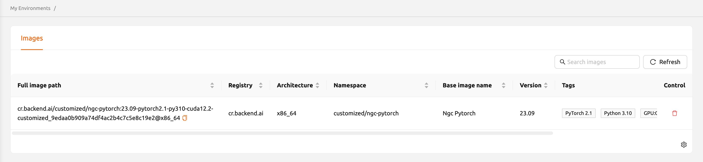

.. _my-environments:

===============
My Environments
===============

From 24.03, a new \"My Environments\" page for users has been introduced.
This page displays contents such as a list of images created by the user's
:ref:`session commits<session-commit>`.

On the Images tab of the My Environments page, users can manage customized
images used in creating compute sessions. This tab displays metadata information
of images converted from computational sessions to images. User can view details
such as the registry, architecture, namespace, language, version, base,
constraint, digest, and other information for each image.

.. _delete-customized-image:

To delete an image, click on the red trash button in the control column.
After deletion, you will not be able to create a new session using that image.

You can also copy the my environment image and create session with manual image. 
Click 'Copy' button in the control column, and go to sessions page and create a session. 
Fill the input of manual image by pasting the image that you copied.

.. image:: copy_image_name_manual.png
   :alt: Copy image name manual

If you want to hide or show the certain columns, click the gear icon at the
bottom right of the table. Then you can see below dialog to select the columns
you want to see.

.. image:: table_setting.png
  :align: center
  :width: 500
  :alt: Table Setting
