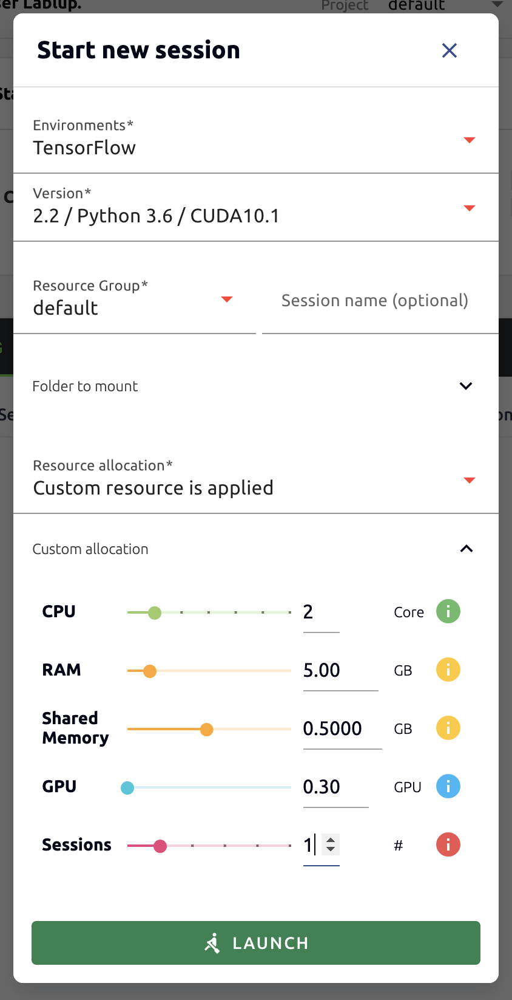
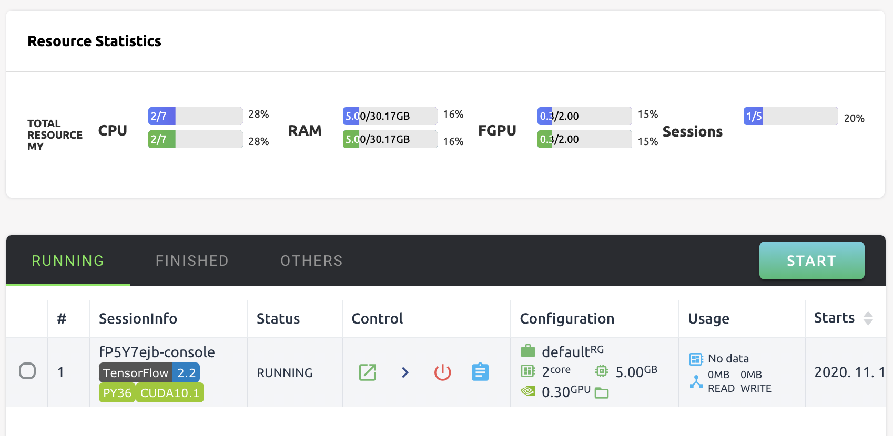
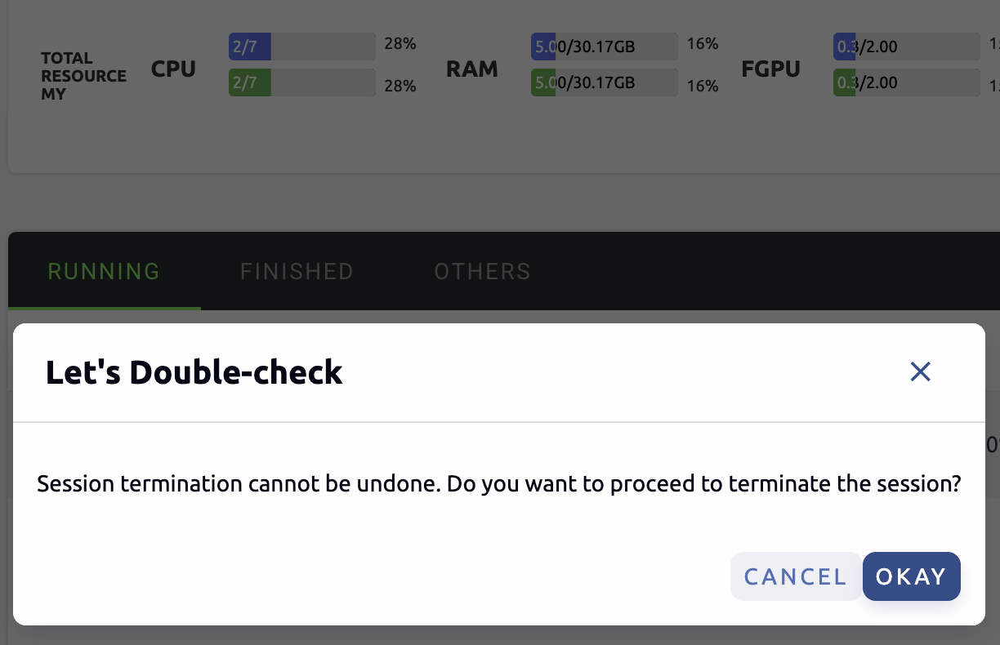
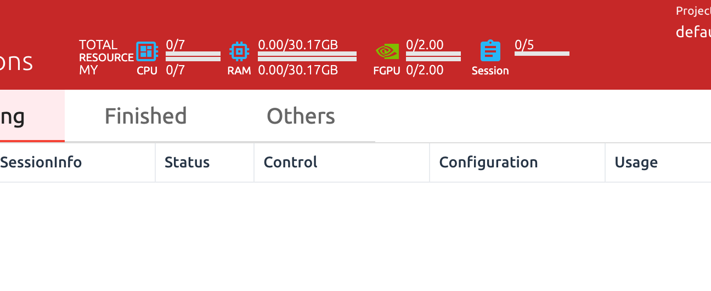
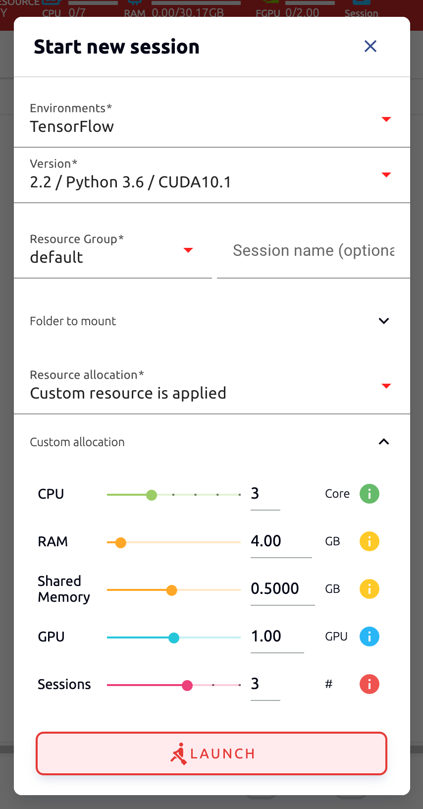
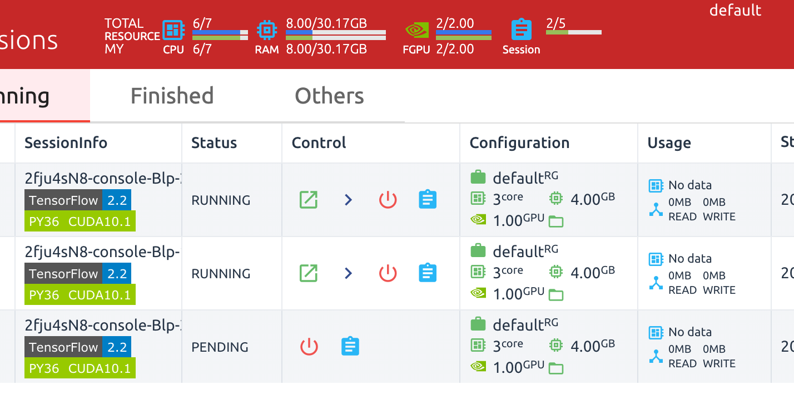
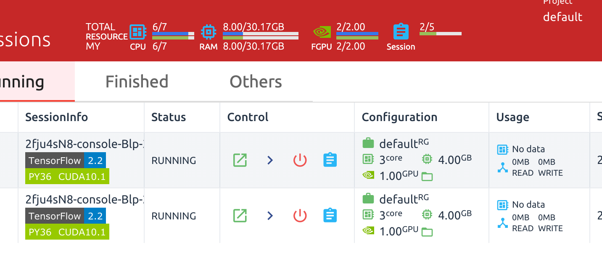

================================================
Resource Monitoring and Automated Job Scheduling
================================================

.. note:: Objectives

   * Confirm that the change in resource usage status is displayed on the GUI
     after creating a compute session.
   * When creating a compute session by setting resources more than the allowed
     amounts, the scheduler keeps the request on the job queue and marks it as
     in the PENDING state.
   * Check that the PENDING session is automatically scheduled and converted to
     the RUNNING state just after resources are available.

Resource monitoring through GUI
-------------------------------

Backend.AI GUI Console supports resource monitoring through GUI. After logging
in with a user account, create a compute session. Resource allocation is set as
shown in the following figure.

After creating a compute session by clicking the LAUNCH button, you can see that
the amount of resources allocated by CPU, RAM, and FGPU in the upper resource
indicator increases.

Next, let's delete the compute session we just created. End the session by pressing
the red power button in the Control column.

After the compute session disappears from the list, you can see that the CPU,
RAM, and FGPU of the resource indicator decrease by the exact amount of
resources.

Job scheduler
-------------

Backend.AI server has a built-in self-developed task scheduler. It automatically
checks the available resources of all worker nodes and delegates the request to
create a compute session to the worker that meets the user's resource request.
In addition, when resources are insufficient, the user's request to create a
compute session is registered as a PENDING state in the job queue. Later, when
the resource becomes available again, the PENDING request is activated to
perform compute session creation.

You can also check the operation of the job scheduler in a simple way from the
user GUI console. Currently, our GPU host can allocate up to 2 fGPUs of
resources. Now let's create 3 compute sessions at the same time requesting
allocation of resources equal to 1 fGPU. At the bottom of the session launch
dialog, there are GPU and Sessions sliders. If you specify a value greater than
1 in Sessions, when the LAUNCH button is clicked, the number of sessions will be
requested at the same time. Let's set the GPU and Sessions to 1 and 3,
respectively. In a situation where only 2 fGPUs exists, 3 sessions requesting a
total of 3 fGPU resources are created.

Wait for a while and you will see three compute sessions being listed. At this
time, if you look closely at the Status column, you can see that two of the
three compute sessions are in RUNNING state, but the other compute session
remains in the PENDING state. This PENDING session is only registered in the
job queue and has not actually been allocated a container due to insufficient
GPU resources.

Now let's destroy one of the two sessions in the RUNNING state. Then you can see
that the compute session in the PENDING state will soon be allocated resources
by the job scheduler and converted to the RUNNING state. In this way, the job
scheduler utilizes the job queue to hold the user's compute session requests,
and then automatically process the requests when resources become available.

