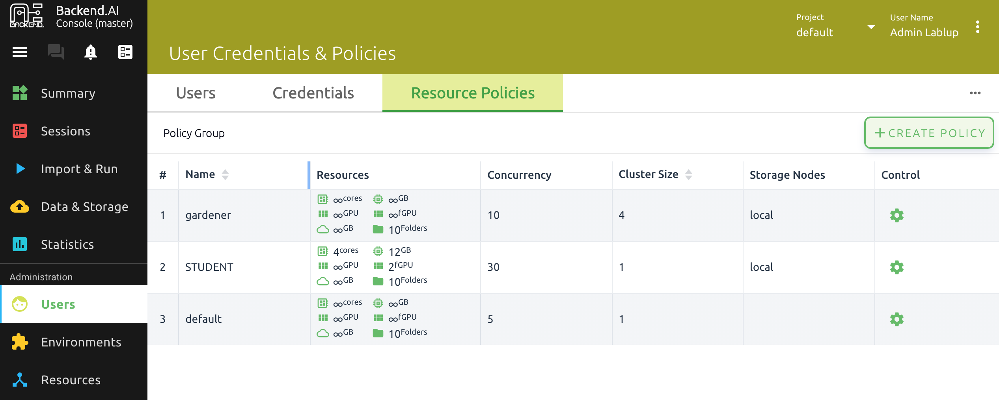
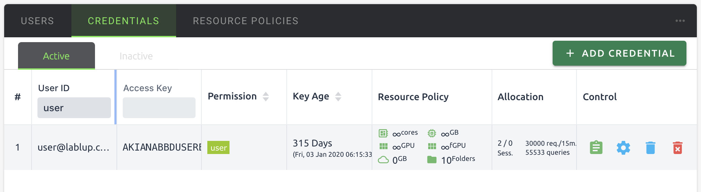
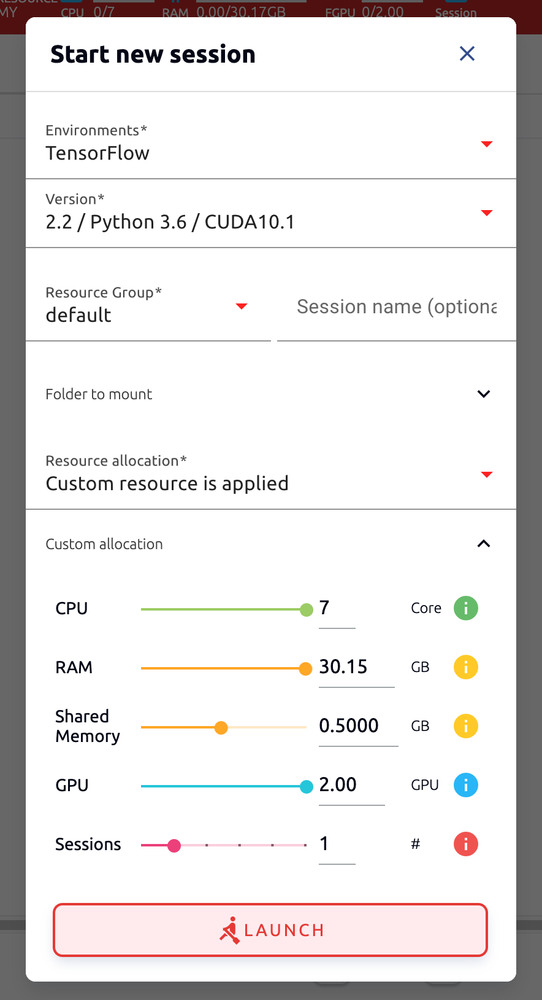
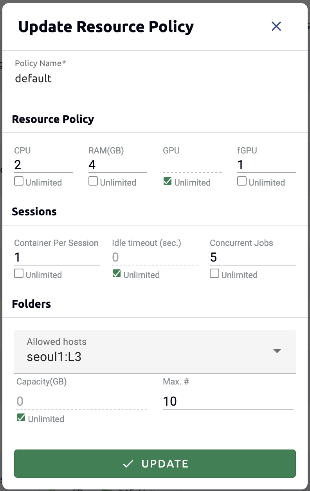
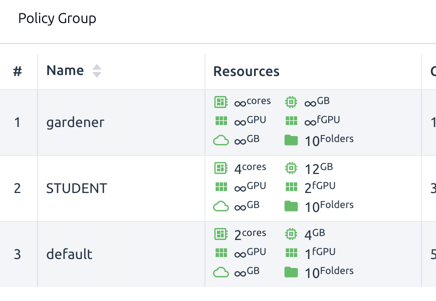
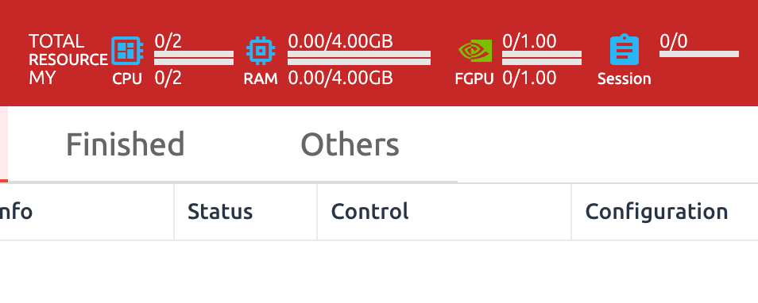
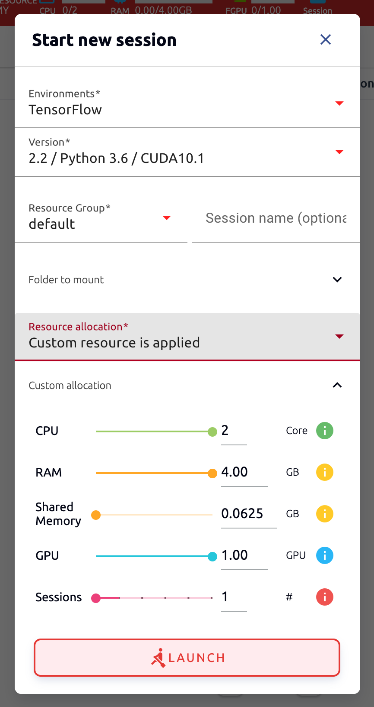

=====================================================
Limiting Maximum Compute Resources per User (Keypair)
=====================================================

.. note:: Objective

   * After logging in to the administrator account, use the function to set the
     allowed resources for each user (keypair)
   * Confirm that only allowed resources can be used at maximum when creating a
     compute session by a user

In Backend.AI, you can set a limit on the total amount of resources available
for each user and group. Resource limits per group can only be set through the
enterprise-dedicated administrator GUI console, but resource limits per user
(precisely user's keypair) can be set in the user GUI console.

Log in to the user GUI Console with an administrator account to check the
resource limit status. If you log in as an administrator, you will see more
administrator-only menus at the bottom of the left menu. Among them, click Users
to go to the user management page and click the Resource Policies tab. You can
check the list of currently registered resource policies. In the figure below,
there are a total of three policies (gardener, STUDENT, default). If you look at
the Resources column of the default policy, you can see that resources such as
Cores, Ram, and fGPU are marked as infinite (∞). The infinity means that no
resource restrictions have been placed at all.

Currently, the user accounts used in this guide are restricted by the default
resource policy. This can be found in the Credentials tab on the left. If you
look at the Resource Policy, you can also see that all resources can be used
indefinitely (to the extent the hardware allows).

Log in again with your user account, now. Go to the Sessions page and check the
resource indicator at the top. Check the maximum quota for CPU, RAM and FGPU.
This corresponds to the total amount of resources currently held by the test
node.

.. image:: resource_indicator_no_limit.png
   :align: center

Click START to open the compute session creation dialog and pull the CPU, RAM,
and GPU sliders all the way to the right, and you can see that you cannot
allocate more than the total amount shown in the resource indicator.

Now log back into the administrator account and go to the Resource Policies tab.
Click the gear button in the Control column of the default policy to enter the
policy editing screen. Uncheck the Unlimited checkbox at the bottom of CPU, RAM,
fGPU, and set the resource limits to the desired values. Set the amount of
constrained resource to be smaller than the total amount of hardware. Here, we
set it to 2, 4 and 1 respectively. Click the UPDATE button to update the
resource policy.

In the resource policy list, check that the Resources value of the default
policy has been updated.

Once again, log in with your user account. Go to the Session page. You can see
that the resource constraint value set earlier is reflected in the resource
indicator at the top.

Click START to open the calculation session creation dialog and pull the CPU,
RAM, and GPU sliders all the way to the right, and you can see that it cannot be
moved beyond the value after the resource constraint was placed.

In this way, it was confirmed that the development user can control the maximum
amount of resources that can be allocated when creating a compute session
based on the user's key pair.
