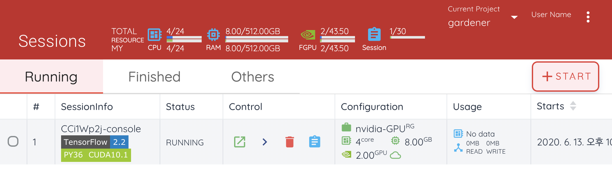

=========================
Querying Compute Sessions
=========================

To see the list of compute sessions, click Sessions in the left sidebar. In
the Running tab on the right, you can check the information on the currently
running sessions. Click the Finished tab to see the list of terminated
sessions. For each session, you can check information such as ID, created date,
used time, allocated resources, resource usage, and etc.

As a superadmin, you can see the information of all sessions currently running
(or ended) in the cluster. On the other hand, users can see their sessions only.
