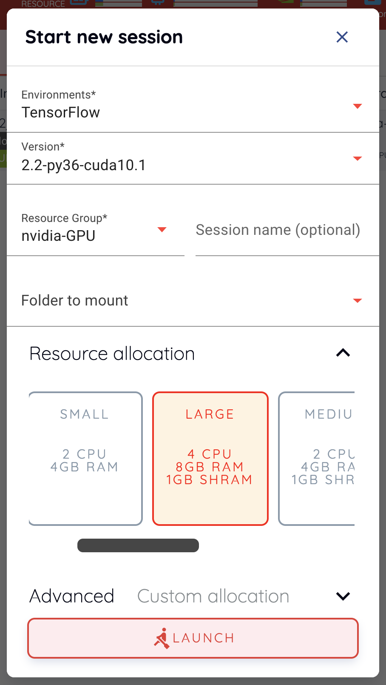
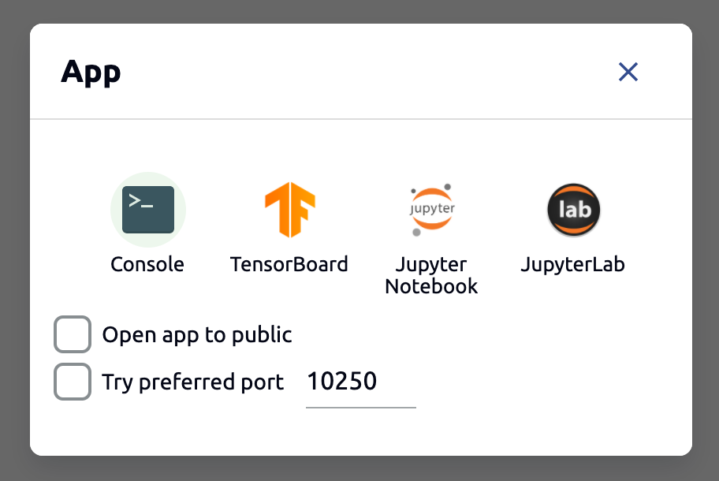
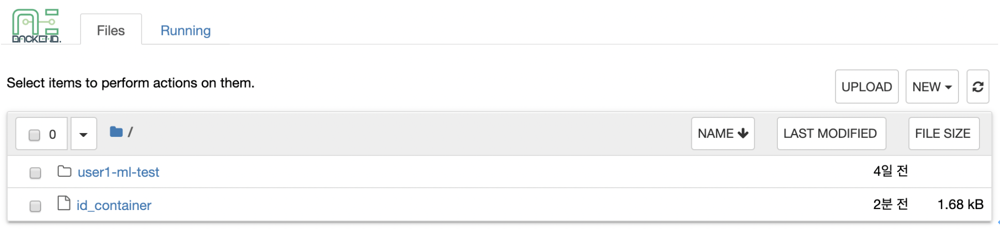
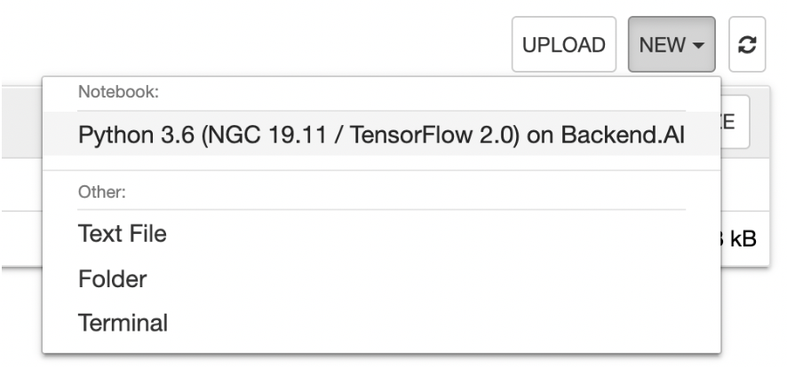
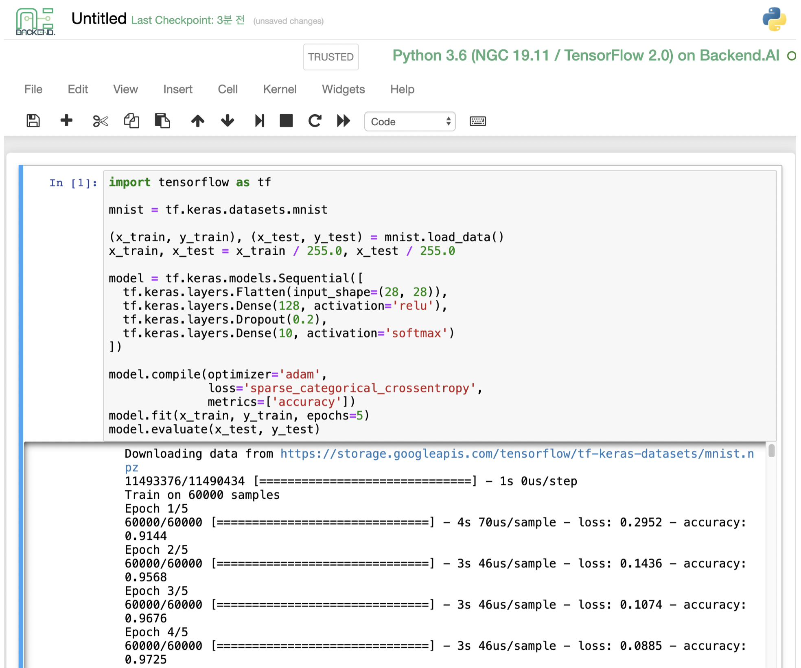
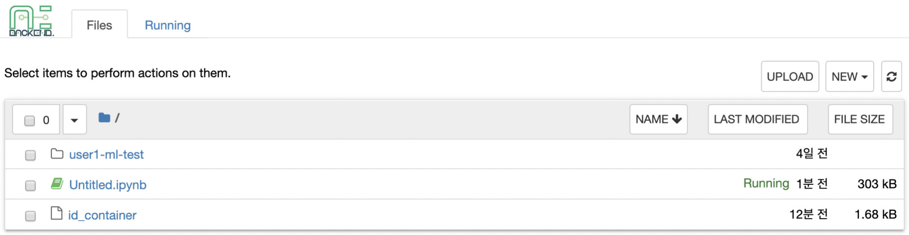
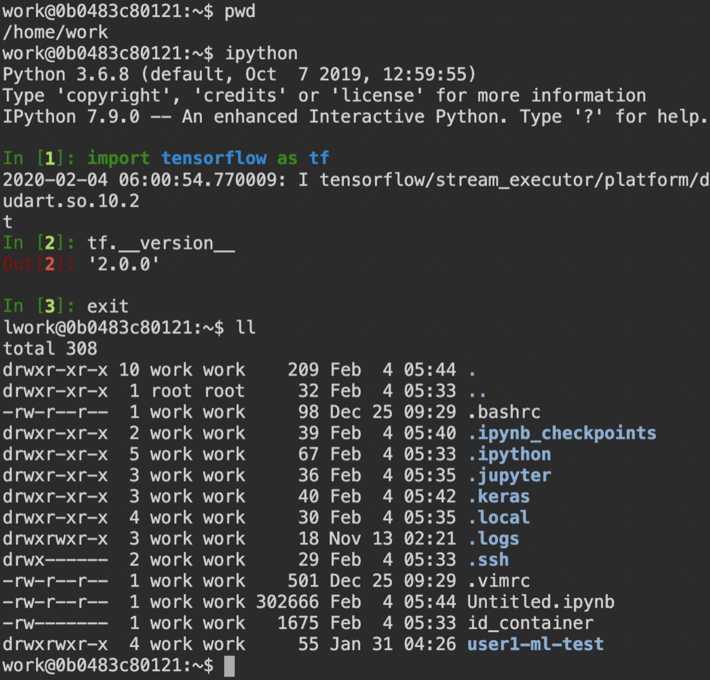

=====================
Using Compute Session
=====================

In addition to see the list of compute sessions, Sessions tab lets you start
new sessions or use and manage already running sessions.

Start a new session
-------------------

Click START button to start a new compute session. The following setup dialog
will appear. Specify the language environment (Environments, Version), the
amount of resources (CPU, RAM, GPU, etc.) you want to use, and then press the
LAUNCH button.

.. note::
   If the GPU resource is marked as FGPU, this means that the server is serving
   the GPU resources in a virtualized form. Backend.AI supports GPU
   virtualization technology that a single physical GPU can be divided and
   shared by multiple users for better utilization. Therefore, if you want to
   execute a task that does not require a large amount of GPU computation, you
   can create a compute session by allocating only a portion of a GPU. The
   amount of GPU resources that 1 FGPU actually allocates may vary from system
   to system depending on the administrator's setting. For example, if
   administrator has set to split one physical GPU into five pieces, 5 FGPU
   means 1 physical GPU, or 1 FGPU means 0.2 physical GPU. At this
   configuration, if you create a compute session by allocating 1 FGPU, you can
   utilize SM (streaming multiprocessor) and GPU memory corresponding to 0.2
   physical GPU for the session.

Wait for a while for the compute session to be started. If you have created a
folder in the Storage menu, you can also choose them from the Folders to mount
menu. Folders/Storages are discussed in a separate section.

Notice that a new compute session is created in the Running tab.

.. image:: session_created.png
   :alt: New session is created

Use and Manage Running Session
------------------------------

This time, let's take a look at how to use and manage a running compute session.
If you see the Control column in the session list, there are several icons. When
you click the first icon, several app services supported by the session will
appear as shown in the following figure.

As a test, let's click on Jupyter Notebook.

You will see a new window pop up and Jupyter Notebook is running. This Notebook
was created inside the running compute session, and it's easy to use with just a
click of a button without any setup. In addition, you can just use the language
environment and libraries provided by the compute session as is, so there is no
need to install a separate packages. For more information on how to use Jupyter
Notebook, please refer to the official documentation.

In the notebook's file explorer, the ``id_container file`` contains a private
SSH key. If necessary, you can download it and use it for SSH / SFTP access to
the container.

Click the NEW button on the upper right corner and select Notebook for
Backend.AI, and ipynb window will pop up where you can enter the new code.

In this window, you can enter and execute any code you want by using the
environment that session provides.  The code execution happens on one of the
Backend.AI nodes where the compute session is actually created, and there is no
need to configure a separate environment on the local machine.

When you close the window, you can notice that the ``Untitled.ipynb`` file is
created in the Notebook File Explorer. Note that the files created here are
deleted when you destroy the session. The way to preserve those files even when
the session is gone is described in the Storage/Folders section.

Return to the Session list page. This time, let's launch the terminal. Click the
terminal icon (the second button) to use the container's ttyd daemon. The
terminal will also appear in a new window, and you can type commands, just like
any usual terminal, which will be delivered to the compute session as shown in
the following figure. If you are familiar with using command-line interface
(CLI), you can easily interact with Linux commands.

If you create a file here, you can immediately see it in the Jupyter Notebook
you opened earlier as well. Conversely, changes made to files in Jupyter
Notebook can also be checked right from the terminal. This is because they are
using the same files in the same compute session.

In addition, you can use web-based services such as TensorBoard, Jupyter Lab,
etc., depending on the type of services provided by the compute session.

To delete a specific session, tap the red trash icon. Since the data in the
folder inside the compute session is deleted as soon as the compute session
ends, it is recommended that you move the data to the mounted folder or upload
it to the folder from the beginning if you want to keep it.

Advanced Web Terminal Usage
---------------------------

The web-based terminal we used above internally embed a utility called `tmux
<https://github.com/tmux/tmux/wiki>`_. tmux is a terminal multiplexer that
supports to open multiple shell windows within a single shell, so as to allow
multiple programs to run in foreground simultaneously. If you want to take
advantage of more powerful tmux features, you can refer to the official tmux
documentation and other usage examples on the Internet.

Here we are introducing some simple but useful features.

**Copy terminal contents**

tmux offers a number of useful features, but it's a bit confusing for first-time
users. In particular, tmux has its own clipboard buffer, so when copying the
contents of the terminal, you can suffer from the fact that it can be pasted
only within tmux by default. Furthermore, it is difficult to expose user
system's clipboard to tmux inside web browser, so when using tmux, the terminal
contents cannot be copied and pasted to other programs of user's computer. The
so-called ``Ctrl-C`` / ``Ctrl-V`` is not working.

If you need to copy and paste the terminal contents to your system's clipboard,
you can temporarily turn off tmux's mouse support. First, press ``Ctrl-B`` key
to enter tmux control mode. Then type ``:set -g mouse off`` and press ``Enter``
(note that you have to type the first colon as well). You can check what you are
typing in the status bar at the bottom of the screen. Then drag the desired text
from the terminal with the mouse and press the ``Ctrl-C`` or ``Cmd-C`` (in Mac)
to copy them to the clipboard of the user's computer.

With mouse support turned off, you cannot scroll through the mouse wheel to see
the contents of the previous page from the terminal. In this case, you can turn
on mouse support again. Press ``Ctrl-B``, and this time, type ``:set -g mouse
on``. Now you can scroll mouse wheel to see the contents of the previous page.

If you remember ``:set -g mouse off`` or ``:set -g mouse on`` after ``Ctrl-B``,
you can use the web terminal more conveniently.

.. note::
   ``Ctrl-B`` is tmux's default control mode key. If you set another control key
   by modifying ``.tmux.conf`` in user home directory, you should press the set
   key combination instead of ``Ctrl-B``.

**Checking the terminal history using keyboard**

There is also a way to copy the terminal contents and check the previous
contents of the terminal simultaneously. It is to check the previous contents
using the keyboard. Again, click ``Ctrl-B`` first, and then press the ``Page
Up`` and/or ``Page Down`` keys. You can see that you navigate through the
terminal's history with just keyboard. To exit search mode, just press the ``q``
key. With this method, you can check the contents of the terminal history even
when the mouse support is turned off to allow copy and paste.

**Spawn multiple shells**

The main advantage of tmux is that you can launch and use multiple shells in one
terminal window. Since seeing is believing, let's press the ``Ctrl-B`` key and
then the ``c``. You can see that the contents of the existing window disappeared
and a new shell environment appeared. Then, did the previous window terminated?
It's not like that. Let's press ``Ctrl-B`` and then ``w``. You can now see the
list of shells currently open on tmux like following image. Here, the shell
starting with ``0:`` is the shell environment you first saw, and the shell
starting with ``1:`` is the one you just created. You can move between shells
using the up/down keys. Place the cursor on the shell ``0:`` and press the Enter
key to select it.

.. image:: tmux_multi_session_pane.png
   :alt: tmux's multiple session management

You can see the shell environment you saw first appears. In this way, you can
use multiple shell environments within a web terminal. To exit or terminate the
current shell, just enter ``exit`` command or press ``Ctrl-B x`` key and then
type ``y``.

In summary:

- ``Ctrl-B c``: create a new tmux shell
- ``Ctrl-B w``: query current tmux shells and move around among them
- ``exit`` or ``Ctrl-B x``: terminate the current shell

Combining the above commands allows you to perform various tasks simultaneously
on multiple shells.
