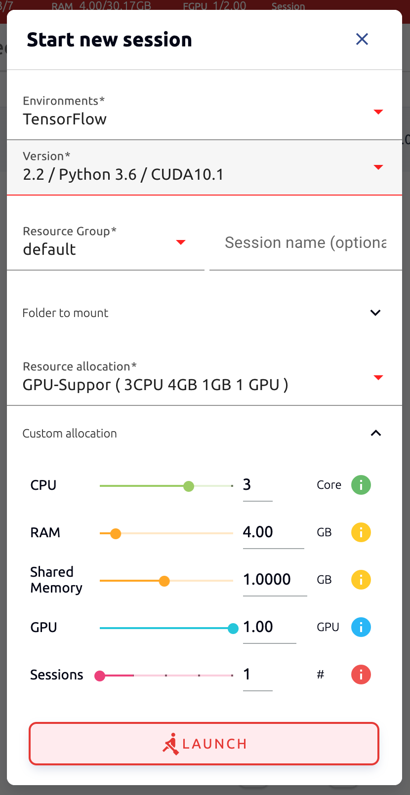
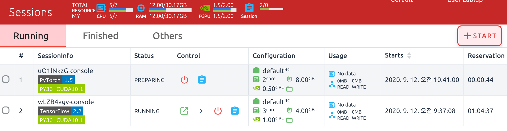

=====================
Using Compute Session
=====================

In addition to see the list of compute sessions, Sessions tab lets you start
new sessions or use and manage already running sessions.

Start a new session
-------------------

Click START button to start a new compute session. The following setup dialog
will appear. Specify the language environment (Environments, Version), the
amount of resources (CPU, RAM, GPU, etc.) you want to use, and then press the
LAUNCH button. Wait for a while for the compute session to be started. If you
have created a folder in the Storage menu, you can also choose them from the
Folders to mount menu.  Folders/Storages are discussed in a separate section.

Notice that a new compute session is created in the Running tab.

Use and Manage Running Session
------------------------------

This time, let's take a look at how to use and manage a running compute session.
If you see the Control column in the session list, there are several icons. When
you click the first icon, several app services supported by the session will
appear as shown in the following figure.

As a test, let's click on Jupyter Notebook.

.. image:: jupyter_app.png
   :alt: Jupyter app is launched

You will see a new window pop up and Jupyter Notebook is running. This Notebook
was created inside the running compute session, and it's easy to use with just a
click of a button without any setup. In addition, you can just use the language
environment and libraries provided by the compute session as is, so there is no
need to install a separate packages. For more information on how to use Jupyter
Notebook, please refer to the official documentation.

In the notebook's file explorer, the ``id_container file`` contains a private
SSH key. If necessary, you can download it and use it for SSH / SFTP access to
the container.

Click the NEW button on the upper right corner and select Notebook for
Backend.AI, and ipynb window will pop up where you can enter the new code.

.. image:: backendai_notebook_menu.png
   :width: 400
   :align: center
   :alt: Backend.AI notebook on Jupyter menu

In this window, you can enter and execute any code you want using the
environment that session provides.  The code execution happens on one of the
Backend.AI nodes where the compute session is actually created, and there is no
need to configure a separate environment on the local machine.

.. image:: notebook_code_execution.png
   :alt: Code execution on Jupyter Notebook

When you close the window, you can notice that the ``Untitled.ipynb`` file is
created in the Notebook File Explorer. Note that the files created here are
deleted when you destroy the session. The way to preserve those files even when
the session is gone is described in the Storage/Folders section.

.. image:: untitled_ipynb_created.png
   :alt: Untitled.ipynb file is created in the Jupyter

Return to the Session list page. This time, let's launch the terminal. Click the
terminal icon (the second button) to use the container's ttyd daemon. The
terminal will also appear in a new window, and you can type commands, just like
any usual terminal, which will be delivered to the compute session as shown in
the following figure. If you are familiar with using command-line interface
(CLI), you can easily interact with Linux commands.

.. image:: session_terminal.png
   :width: 500
   :align: center
   :alt: Backend.AI session terminal

If you create a file here, you can immediately see it in the Jupyter Notebook
you opened earlier as well. Conversely, changes made to files in Jupyter
Notebook can also be checked right from the terminal. This is because they are
using the same files in the same compute session.

In addition, you can use web-based services such as TensorBoard, Jupyter Lab,
etc., depending on the type of services provided by the compute session.

To delete a specific session, tap the red trash icon. Since the data in the
folder inside the compute session is deleted as soon as the compute session
ends, it is recommended that you move the data to the mounted folder or upload
it to the folder from the beginning if you want to keep it.
