================
Compute Sessions
================

The most visited pages in the Backend.AI Web-UI would be the Sessions and
Data & Storage pages. Here, you will learn how to query and
create container-based compute sessions and utilize various web applications on
the Sessions page.

.. _create_session:

Start a new session
-------------------

After logging in with a user account, click Sessions on the left sidebar to visit the Sessions page.
Sessions page lets you start new sessions or use and manage existing running sessions.

.. image:: sessions_page.png

.. TODO: Please change the link to 23.09. not stable.

Click the START button to start a new compute session. From version 24.03, Backend.AI offers an improved 
version of the session launcher (NEO). If you want to use the previous dialog-style session launcher, press
the Classic button in the notification and create your session. For instructions on how to use it, please 
refer to the following `link <https://webui.docs.backend.ai/en/23.09_a/sessions_all/sessions_all.html>`_.

.. image:: launch_session_1.png
   :align: center

In the first page, you need to choose the type of session, interactive or batch.
And you can set the session name, which is optional.

.. _session-naming-rule:

* Session type: Determines the type of the session. "Interactive" and
  "Batch" are the two session types currently available. The following are the
  primary distinctions between the two types:

  - Interactive compute session

    - This type has been supported from the initial version of Backend.AI.
    - The compute session is used in a way that the user interacts with after
      creating a session without specifying a pre-defined execution script or
      command.
    - The session is not terminated automatically unless user explicitly destroys
      the session or session garbage collectors are set by the admin.

  - Batch compute session

    - This type of session is supported via GUI from Backend.AI 22.03 (CLI has
      supported the batch-type session before the 22.03).
    - Pre-define the script that will be executed when a compute session is
      ready.
    - Executes the script as soon as the compute session is ready, and then
      automatically terminates the session as soon as the execution finishes.
      So, it will more efficiently and flexibly utilize the server farm's
      resources if a user can write the execution script in advance or is
      building a pipeline of workloads.
    - You can set the start time of a batch-type compute session. However, it
      does not guarantee the session will be created at that time. It may still
      be PENDING due to the lack of resources, etc. Rather, it guarantees that
      the session WILL NOT run until the start time.

    .. image:: session_type_batch.png
       :align: center

* Session name: You can specify the name of the compute session to be
  created. If set, this name appears in Session Info, so it is easy to
  distinguish among multiple computation sessions. If not specified, a random
  word is assigned automatically. Session names only accept alphanumeric
  characters between 4 and 64 without spaces.

Click the Next button below, or the Environments & Resource allocation on the right
to proceed to the next page. If you want to create a session without any further
settings, press the Skip to review button. button. In this case, the settings on the
other pages will all use the default values.

For detailed explanations of each item that can be set on the second page, please
refer to the following.

  .. image:: launch_session_2.png
     :align: center
     
* Environments: You can choose the base environment for compute sessions such as
  TensorFlow, PyTorch, C++, etc. When you select TensorFlow, your compute
  session will automatically include the TensorFlow library. If you choose
  another environment, the corresponding packages will be installed by default.
* Version: Selects the version of the environment. For example, you can select
  different versions, such as 1.15, 2.3, etc., for the TensorFlow environment.
* Image Name: You can specify the name of the image to be used for the
  compute session. Depending on your environment settings, this configurations
  may not be available.
* Set Environment Variable: Provides an interface for users to set environment
  variables in a compute session. See the section
  :ref:`How to add environment variables before session creation<set-environment-variables>`
  on how to use.
* Resource Group: Specifies the resource group in which to create a compute
  session. A resource group is a unit that groups host servers that each user
  can access. Usually, servers in a resource group would have the same type of
  GPU resources. Administrators can classify servers by any criteria, group them
  into one or more resource groups, and configure which resource groups a user
  can use. Users can launch a compute session only on servers in resource groups
  allowed by the administrator. If you are allowed multiple resource groups, you
  can select any group you want, but you cannot change it if you have only one.
* Resource Presets: These templates have pre-defined resource sets, such as
  CPU, memory, and GPU, to be allocated to a compute session. Administrators can
  define frequently used resource settings in advance. By adjusting the numerical
  input or sliding the slider, you can allocate the desired amount of resources.

  .. image:: resource_presets.png
     :align: center

  The meaning of each item is as follows, and you can check it by clicking the
  Help (?) button as well.

  * CPU: The CPU performs basic arithmetic, logic, controlling, and input/output
    (I/O) operations specified by the instructions. For high performance computing
    workloads, many CPUs are helpful, but the program code must be written to use
    multiple CPUs.
  * Memory: Computer memory is a temporary storage area. It holds the data and
    instructions that the Central Processing Unit (CPU) needs. When using a GPU in
    a machine learning workload, you must allocate at least twice the memory of the
    GPU to memory. Otherwise, the GPU's idle time will increase, resulting in a
    performance penalty.
  * Shared Memory: The amount of shared memory in GB to allocate for the compute
    session. Shared memory will use some part of the memory set in RAM. Therefore,
    it cannot be greater than the amount specified in RAM.
  * AI Accelerator: AI accelerators (GPUs or NPUs) are well-suited for the
    matrix/vector computations involved in machine learning. AI accelerators speed
    up training / inference algorithms by orders of magnitude, reducing running
    times from weeks to days.
  * Sessions: A session is a unit of computational environment that is created
    according to a specified environment and resources. If this value is set to a
    value greater than 1, multiple sessions corresponding to the resource set above
    are created. If there are not enough resources available, requests to create
    sessions that cannot be created are put on the waiting queue.
  * Cluster mode: Backend.AI supports cluster mode, which allows you to create
    multiple compute sessions at once. For more information, see the section
    :ref:`Overview of Backend.AI cluster compute session<backendai-cluster-compute-session>`.
  
* High-Performance Computing Optimizations: Backend.AI provides configuring values
  related to HPC Optimizations. For more information, See the section
  :ref:`Optimizing Accelerated Computing<optimizing-accelerated-computing>`.

Click the Next button below, or the Data & Storage on the right to proceed to the
next page.

.. image:: launch_session_3.png
   :align: center

Here, you can specify the data folders to mount in the compute session. When a
compute session is destroyed, all data is deleted altogether by default, but the
data stored in the mounted folders will survive. Data in those folders can also
be reused by mounting it when creating another compute session. For the
information on how to mount a folder and run a compute session, see
:ref:`Mounting Folders to a Compute Session<session-mounts>`. Here, we will pass
by without mounting any folder. Let's move on to the next page.

.. image:: launch_session_4.png
   :align: center

On the fourth page, you can set Network configurations such as Preopen Ports.

* Set Preopen Ports: Provides an interface for users to set preopen ports in a 
  compute session. See the section :ref:`How to add preopen ports before session creation
  <set_preopen_ports>` on how to use.

If you are done with the network setting, click the Next button below, or the
Confirm and Launch on the right to proceed to the last page.

.. image:: launch_session_5.png
   :align: center

Now, we have reached the last page. You can view information of session(s) to create,
such as environment itself, allocated resources, mount information,
environment variables set on the previous pages, preopen ports, etc.
After confirming the settings, click the Launch button. If there's anything you'd like
to change, you can return to the previous page by clicking the Previous button, or click
the Edit button located at the top right of each card to go directly to the relevant page.

If there is an issue with the settings, an error will be displayed as follows. Please
click Edit to correct the settings.

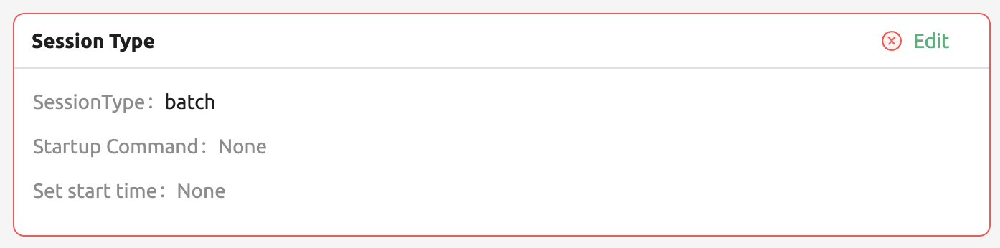

A warning dialog appears, stating that there are no mounted folders. Ignore the
warning for now and click the Start button to proceed.

.. image:: no_vfolder_notification_dialog.png
   :width: 350
   :align: center

Now a new compute session is created in the RUNNING tab.

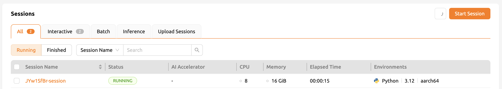

In the RUNNING tab, you can check the information on the currently running
sessions. It includes both interactive and batch sessions.
BATCH tab and INTERACTIVE tab show only sessions corresponding to each type,
but only for sessions not in terminated status.
FINISHED tab shows the list of terminated sessions and OTHERS tab shows the compute sessions with errors.
For each session, you can check the information such as session environments, the amount of allocated
and used resources, session starting time, etc.

.. note::
   Superadmins can query all compute session information currently running (or
   terminated) in the cluster, and users can view only the sessions they have
   created.

.. note::
   Compute session list may not be displayed normally due to intermittent
   network connection problems, and etc. This can be solved by refreshing the
   browser page.

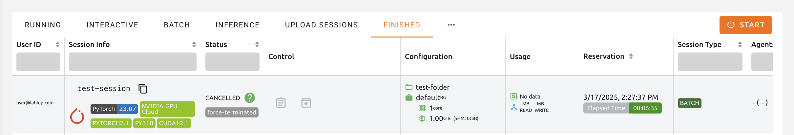

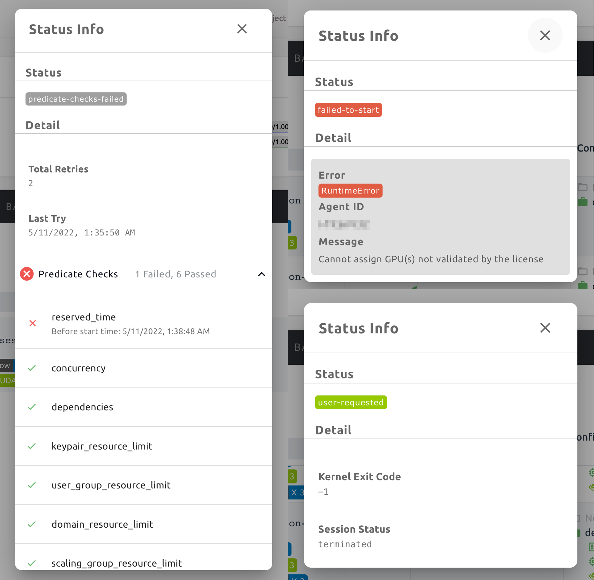

Backend.AI provides detailed status information for ``PENDING``, ``TERMINATED``,
or ``CANCELLED`` sessions. In the case of ``PENDING`` sessions, in particular,
you can check why the session is not scheduled and stuck in the ``PENDING``
status. You can see the details by clicking the question mark icon right next
to the status of each session.

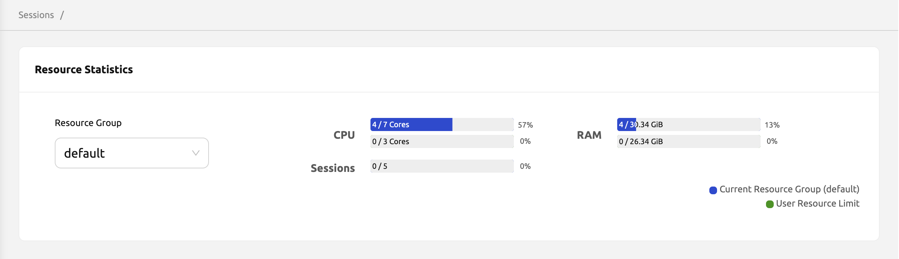

The resource statistics are displayed at the top of the screen. You can check the
amount of resources currently used and the total amount of resources
that can be allocated. The display bars are divided into upper and
lower parts. The upper part shows the resource allocation status in the current
scaling group and the lower part shows the allocation status of total
accessible resources.

* Upper: (Resources allocated by the user in the current scaling group) /
  (Total resources allocatable by the user in the current scaling group)

* Lower: (Resources allocated by the user) / (Resources allocated by the user +
  Total resources allocatable by the user in the current scaling group)

.. note::
   If the GPU resource is marked as FGPU, this means that the server is serving
   the GPU resources in a virtualized form. Backend.AI supports GPU
   virtualization technology that a single physical GPU can be divided and
   shared by multiple users for better utilization. Therefore, if you want to
   execute a task that does not require a large amount of GPU computation, you
   can create a compute session by allocating only a portion of a GPU. The
   amount of GPU resources that 1 FGPU actually allocates may vary from system
   to system depending on the administrator's setting.

   For example, if administrator has set to split one physical GPU into five pieces,
   5 FGPU means 1 physical GPU, or 1 FGPU means 0.2 physical GPU. At this
   configuration, if you create a compute session by allocating 1 FGPU, you can
   utilize SM (streaming multiprocessor) and GPU memory corresponding to 0.2
   physical GPU for the session.

.. _use_session:

Use Jupyter Notebook
----------------------

Let's look at how to use and manage compute sessions that are already running.
If you look at the Control panel of the session list, there are several icons.
When you click the first icon, the app launcher pops up and shows the available
app services as below. The app launcher dialog also opens automatically just
after the compute session is created.

.. image:: app_launch_dialog.png
   :width: 400
   :align: center

.. _open_app_to_public:

.. note::
   There are two check options under the app icons. Opening the app with each item checked
   applies the following features, respectively:

   * Open app to public: Open the app to the public. Basically, web services
     such as Terminal and Jupyter Notebook services are not accessible by
     other users, even if the user knows the service URL, since they are
     considered unauthenticated. However, checking this option makes it possible
     for anyone who knows the service URL (and port number) to access and use it. Of
     course, the user must have a network path to access the service.
   * Try preferred port: Without this option checked, a port number for the web service is randomly
     assigned from the port pool prepared in advance by Backend.AI.
     If you check this item and enter a specific port number, the entered
     port number will be tried first. However, there is no guarantee that the desired
     port will always be assigned because the port may not exist at all in the port
     pool or another service may already be using the port. In this case, the
     port number is randomly assigned.

   Depending on the system configuration, these options may not be shown.

Let's click on Jupyter Notebook.

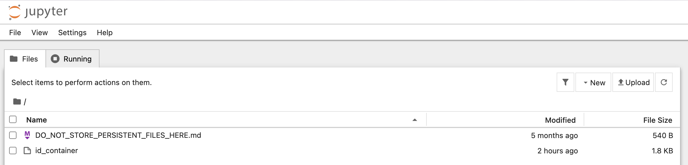

A new window pops up and you can see that Jupyter Notebook is running. This
notebook was created inside a running compute session and can be used easily
with the click of a button without any other settings. Also, there is no need
for a separate package installation process because the language environment and
library provided by the computation session can be used as it is. For detailed
instructions on how to use Jupyter Notebook, please refer to the official
documentation.

In the notebook's file explorer, the ``id_container file`` contains a private
SSH key. If necessary, you can download it and use it for SSH / SFTP access to
the container.

Click the NEW button at the top right and select the Notebook for Backend.AI,
then the ipynb window appears where you can enter your own code.

.. image:: backendai_notebook_menu.png
   :width: 400
   :align: center

In this window, you can enter and execute any code you want by using the
environment that session provides. The code is executed on one of the
Backend.AI nodes where the compute session is actually created and there is no
need to configure a separate environment on the local machine.

.. image:: notebook_code_execution.png

When you close the window, you can find that the ``Untitled.ipynb`` file is
created in the notebook file explorer. Note that the files created here are
deleted when you terminate the session. The way to preserve those files even
after the session is terminated is described in the Data & Storage Folders section.

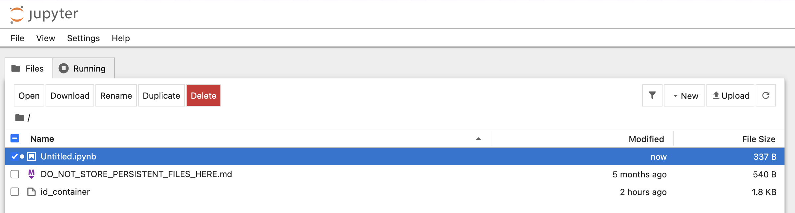

Use web terminal
----------------

Return to the Session list page. This time, let's launch the terminal. Click the
terminal icon (the second button in the Control panel) to use the container's
ttyd app. A terminal will appear in a new window and you can run shell commands
to access the computational session as shown in the following figure. If you are
familiar with using commands, you can easily run various Linux commands. You may
notice that the ``Untitled.ipynb`` file automatically generated in Jupyter Notebook
is listed with the ``ls`` command. This shows that both apps are running in the
same container environment.

.. image:: session_terminal.png

If you create a file here, you can immediately see it in the Jupyter Notebook
you opened earlier as well. Conversely, changes made to files in Jupyter
Notebook can also be checked right from the terminal. This is because they are
using the same files in the same compute session.

In addition to this, you can use web-based services such as TensorBoard, Jupyter
Lab, etc., depending on the type of environments provided by the compute session.

Query compute session log
-------------------------

You can view the log of the compute session by clicking the last icon in the
Control panel of the running compute session.

.. image:: session_log.png

.. note::
   From 22.09, you can download session log by clicking download button on upper-right side of the dialog.
   This feature is helpful for tracking artifacts.

Rename running session
----------------------

You can change the name of an active session. Just click the edit icon in the
session information column. Write down the new name and click the confirm button.
The new session name should also follow the :ref:`the authoring rule<session-naming-rule>`.

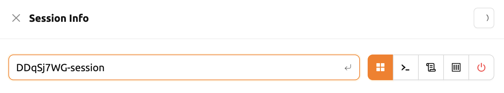

.. _delete_session:

Delete a compute session
------------------------

To terminate a specific session, simply click on the red power icon and click
OKAY button in the dialog. Since the data in the folder inside the compute
session is deleted as soon as the compute session ends, it is recommended to
move the data to the mounted folder or upload it to the mounted folder from the
beginning if you want to keep it.

.. image:: session_destroy_dialog.png
   :width: 500
   :align: center

Idleness Checks
---------------

Backend.AI supports three types of inactivity (idleness) criteria for automatic garbage
collection of compute sessions: Max Session Lifetime, Network Idle Timeout, and Utilization
Checker.

Idle checkers(inactivity criterion) will be displayed in the idle checks column of the session list.

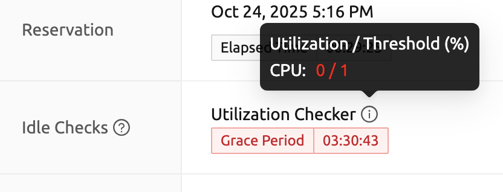

The meaning of idle checkers are as follows, and more detailed explanations can be
found by clicking the information (i) icon in the idle checks column.

* Max Session Lifetime: Force-terminate sessions after this time from creation.
  This measure prevents sessions from running indefinitely.
* Network Idle Timeout: Force-terminate sessions that do not exchange data with the user (browser
  or web app) after this time. Traffic between the user and the compute session continuously occurs
  when the user interacts with an app, like terminal or Jupyter, by keyboard input, Jupyter cell
  creation, etc. Jupyter cell creation, etc. If there is no interaction for a certain period, the
  condition of garbage collection will be met. Even if there is a process executing a job in the
  compute session, it is subject to termination if there is no user interaction.
* Utilization Checker: Resources allocated to a compute session are reclaimed
  based on the utilization of those resources. The decision to delete is based on
  the following two factors:

  - Grace Period: The time during which the utilization idle checker is
    inactive. Even with low usage, the compute session won't be terminated during
    this period. However, once the grace period is over, if the average
    utilization remain below the threshold during the set idle timeout period,
    the system can terminate the session at any time. The grace period is
    merely a guaranteed duration during which termination does not occur. This
    measure is primarily for efficient management of low-usage GPU resources.
  - Utilization Threshold: If the resource utilization of a compute session does
    not exceed the set threshold for a certain duration (idle timeout), that
    session will be automatically terminated. For example, if the accelerator
    utilization threshold is set to 1%, and a compute session shows a
    utilization of less than 1% over the idle itmeout, it becomes a target for
    termination. Resources with empty values are excluded from the garbage
    collection criteria.

   .. note::
      After the grace period, sessions can be terminated anytime if utilization
      remains low. Briefly using the resources does not extend the grace period.
      Only the average utilization over the last idle timeout is considered.

Hovering your mouse over the Utilization Checker will display a tooltip with the
utilization and threshold values. The text color changes to yellow and then red
as the current utilization approaches the threshold (indicating low resource
utilization).

.. image:: utilization_checker.png
   :width: 250
   :align: center

.. note::
   Depending on the environment settings, idle checkers and resource types of
   utilization checker's tooltip may be different.

.. _set-environment-variables:

How to add environment variable before creating a session
---------------------------------------------------------

To give more convenient workspace for users, Backend.AI supports environment variable setting
in session launching. In this feature, you can add any envs such as ``PATH`` by filling out
variable name and value in environment configuration dialog.

To add environment variable, simply click + Add environment variables button of the Variable.
Also, you can remove the variable by clicking ``-`` button of the row that you want to get rid of.

.. image:: env-config-start.png
   :align: center
   :alt: Env Configuration Button

You can input variable name and value in the same line of the input fields.

.. _set_preopen_ports:

How to add preopen ports before creating a session
--------------------------------------------------

Backend.AI supports preopen ports setting at container startup. When using this feature, there is no need to build
separate images when you want to expose the serving port.

To add preopen ports, simply enter multiple values separated by either a comma (,) or a space.

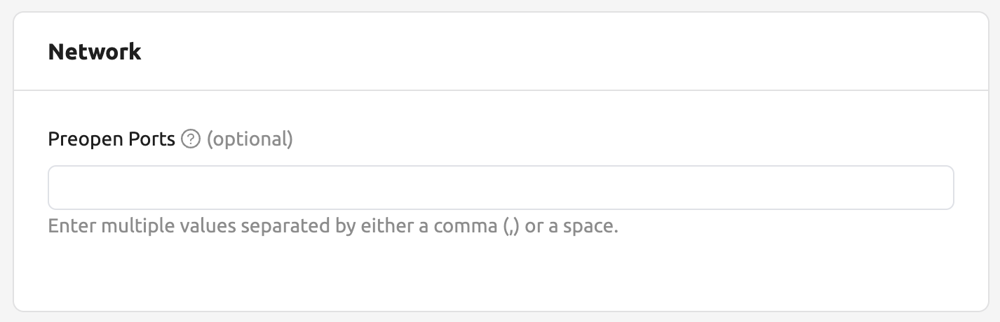

In the forth page of session creation page, you can add, update and delete written preopen ports. To see more detail
information, please click Help (?) button.

You can input between 1024 ~ 65535 port numbers to the input fields. Then, click the save button. You can check the
configured preopen ports in the session app launcher.

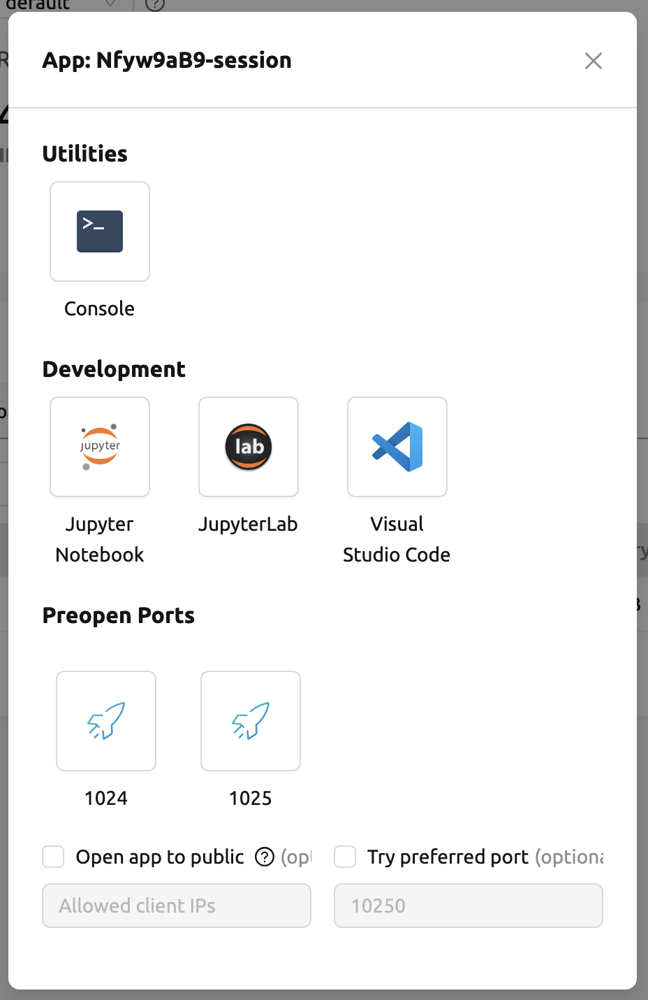

.. note::
   The preopen ports are **internal ports within the container**. Therefore, unlike other apps, when you click on the
   preopen ports in the session app launcher, you will see a blank page. Please bind a server to the respective port
   before using it.

Save container commit
---------------------

Backend.AI supports \"container commit\" feature from 22.09 and \"convert session to image\" feature from 24.03. 
Committing a ``RUNNING`` session will save the current state of the main container as a new image. Clicking the commit
button in the control pane of ``RUNNING`` session will display a dialog to show the information of the session. After
checking the information, you can click the confirmation button to convert the container to a new image.

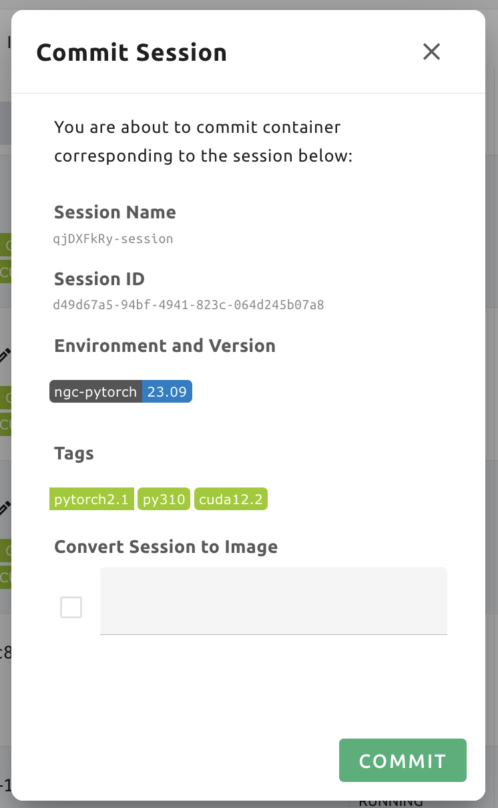

After clicking ``COMMIT`` button in the dialog, Backend.AI internally requests
Docker to create a new image as ``tar.gz`` to be stored into a specific
host path. Please note that it's not available to access directly in your local
environment. Users need to contact the administrator to get the image file.

.. _session-commit:

If you want to commit ongoing session to image, check the checkbox of ``Convert Session to Image`` 
in the dialog and fill out the session name. The session name must be 4 to 32 characters, 
containing alphanumeric letters or hyphen(``-``) or underscore(``_``) only. 
After filling out session name in the input field, click the ``PUSH SESSION TO CUSTOMIZED IMAGE`` button.
The customized image created in this way can be used in future session creations. However, directories
mounted to the container for image commits are considered external resources and are not included in
the final image. Remember that ``/home/work`` is a mount folder (scratch directory), so it is not included.

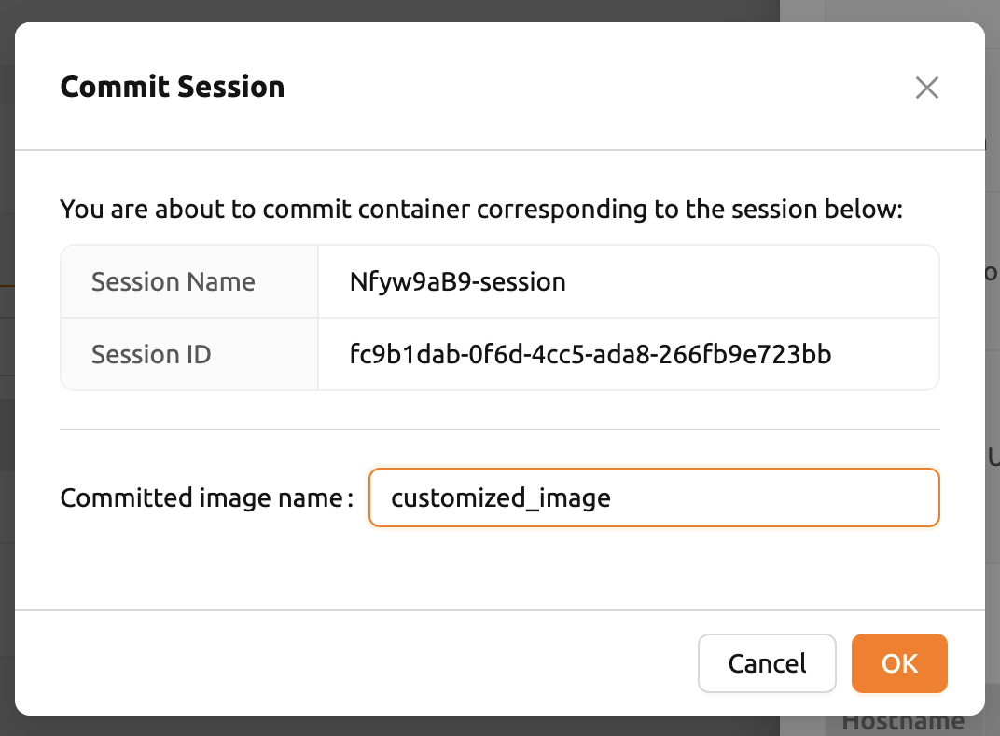

.. note::
   Currently, Backend.AI supports container commit and converting session to image feature
   when session is ``INTERACTIVE`` mode only. During container commit process, you may not be
   able to terminate the session to prevent unexpected error. If you want to
   stop the ongoing process, please check the session, and force-terminate
   the session.

.. note::
   The number of times you can ``Convert Session to Image`` may be limited by the user resource
   policy. In this case, try :ref:`removing the existing customized image<delete-customized-image>`
   and retry, or contact the administrator.

Utilizing converted images of ongoing sessions
----------------------------------------------

Converting an ongoing session into an image allows you to select this image from the environments in the session launcher
when creating a new session. This image is not exposed to other users and is useful for continuing to use the current session
state as is. The converted image is tagged with ``Customized<session name>``.

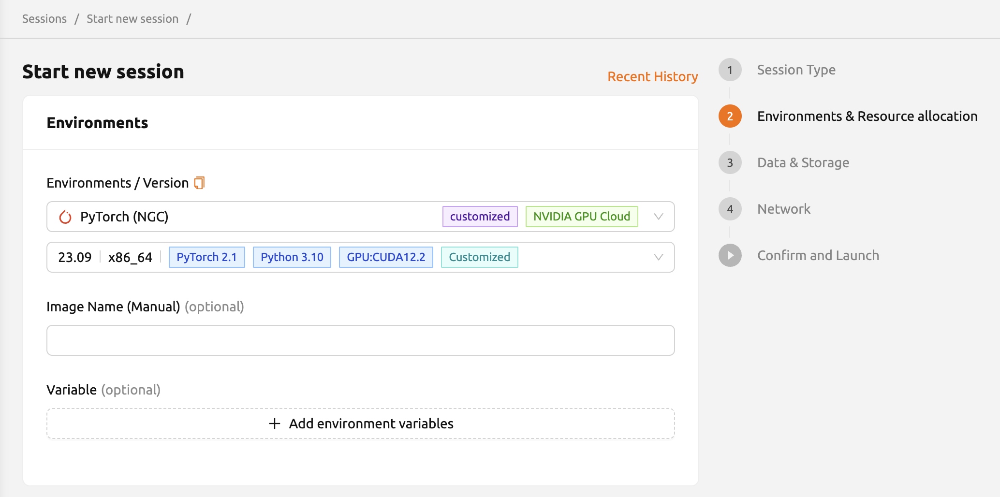

To manually enter the environment name for future session creation, please click the copy icon.

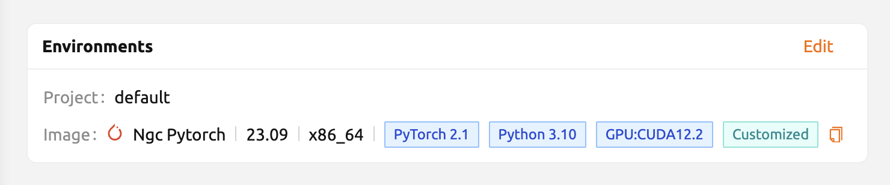

.. _optimizing-accelerated-computing:

Optimizing Accelerated Computing
--------------------------------

Backend.AI provides configuration UI for internal control variable in ``nthreads-var``.
Backend.AI sets this value equal to the number of session's CPU cores by default,
which has the effect of accelerating typical high-performance computing workloads.
Nevertheless, for some multi-thread workloads, multiple processes using OpenMP are used at same time,
resulting in an abnormally large number of threads and significant performance degradation.
To resolve this issue, setting the number of threads to 1 or 2 would work.

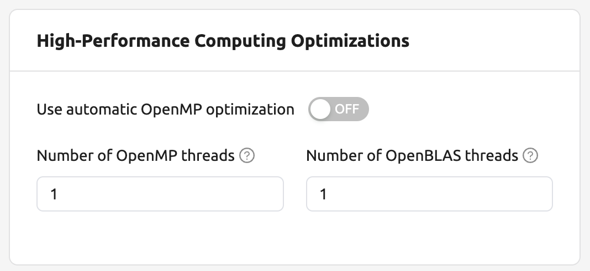

.. _tmux_guide:

Advanced web terminal usage
---------------------------

The web-based terminal internally embeds a utility called
`tmux <https://github.com/tmux/tmux/wiki>`_. tmux is a terminal multiplexer that
supports to open multiple shell windows within a single shell, so as to allow
multiple programs to run in foreground simultaneously. If you want to take
advantage of more powerful tmux features, you can refer to the official tmux
documentation and other usage examples on the Internet.

Here we are introducing some simple but useful features.

Copy terminal contents
~~~~~~~~~~~~~~~~~~~~~~

tmux offers a number of useful features, but it's a bit confusing for first-time
users. In particular, tmux has its own clipboard buffer, so when copying the
contents of the terminal, you can suffer from the fact that it can be pasted
only within tmux by default. Furthermore, it is difficult to expose user
system's clipboard to tmux inside web browser, so the terminal
contents cannot be copied and pasted to other programs of user's computer. The
so-called ``Ctrl-C`` / ``Ctrl-V`` is not working with tmux.

If you need to copy and paste the terminal contents to your system's clipboard,
you can temporarily turn off tmux's mouse support. First, press ``Ctrl-B`` key
to enter tmux control mode. Then type ``:set -g mouse off`` and press ``Enter``
(note that you have to type the first colon as well). You can check what you are
typing in the status bar at the bottom of the screen. Then drag the desired text
from the terminal with the mouse and press the ``Ctrl-C`` or ``Cmd-C`` (in Mac)
to copy them to the clipboard of the user's computer.

With mouse support turned off, you cannot scroll through the mouse wheel to see
the contents of the previous page from the terminal. In this case, you can turn
on mouse support again. Press ``Ctrl-B``, and this time, type ``:set -g mouse
on``. Now you can scroll mouse wheel to see the contents of the previous page.

If you remember ``:set -g mouse off`` or ``:set -g mouse on`` after ``Ctrl-B``,
you can use the web terminal more conveniently.

.. note::
   ``Ctrl-B`` is tmux's default control mode key. If you set another control key
   by modifying ``.tmux.conf`` in user home directory, you should press the set
   key combination instead of ``Ctrl-B``.

.. note::
   In the Windows environment, refer to the following shortcuts.

   * Copy: Hold down ``Shift``, right-click and drag
   * Paste: Press ``Ctrl-Shift-V``

Check the terminal history using keyboard
~~~~~~~~~~~~~~~~~~~~~~~~~~~~~~~~~~~~~~~~~~~~

There is also a way to copy the terminal contents and check the previous
contents of the terminal simultaneously. It is to check the previous contents
using the keyboard. Again, click ``Ctrl-B`` first, and then press the ``Page
Up`` and/or ``Page Down`` keys. You can see that you navigate through the
terminal's history with just keyboard. To exit search mode, just press the ``q``
key. With this method, you can check the contents of the terminal history even
when the mouse support is turned off to allow copy and paste.

Spawn multiple shells
~~~~~~~~~~~~~~~~~~~~~

The main advantage of tmux is that you can launch and use multiple shells in one
terminal window. Since seeing is believing, let's press the ``Ctrl-B`` key and
then the ``c``. You can see that the contents of the existing window disappears
and a new shell environment appears. But the previous window is not terminated.
Let's press ``Ctrl-B`` and then ``w``. You can now see the
list of shells currently open on tmux like following image. Here, the shell
starting with ``0:`` is the shell environment you first saw, and the shell
starting with ``1:`` is the one you just created. You can move between shells
using the up/down keys. Place the cursor on the shell ``0:`` and press the Enter
key to select it.

.. image:: tmux_multi_session_pane.png
   :alt: tmux's multiple session management

You can see the first shell environment appears. In this way, you can
use multiple shell environments within a web terminal. To exit or terminate the
current shell, just enter ``exit`` command or press ``Ctrl-B x`` key and then
type ``y``.

In summary:

- ``Ctrl-B c``: create a new tmux shell
- ``Ctrl-B w``: query current tmux shells and move around among them
- ``exit`` or ``Ctrl-B x``: terminate the current shell

Combining the above commands allows you to perform various tasks simultaneously
on multiple shells.
