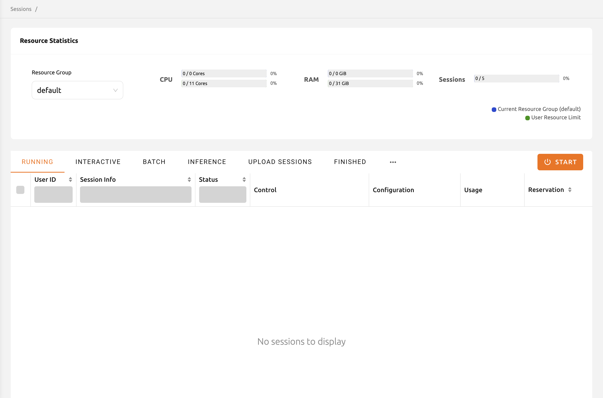
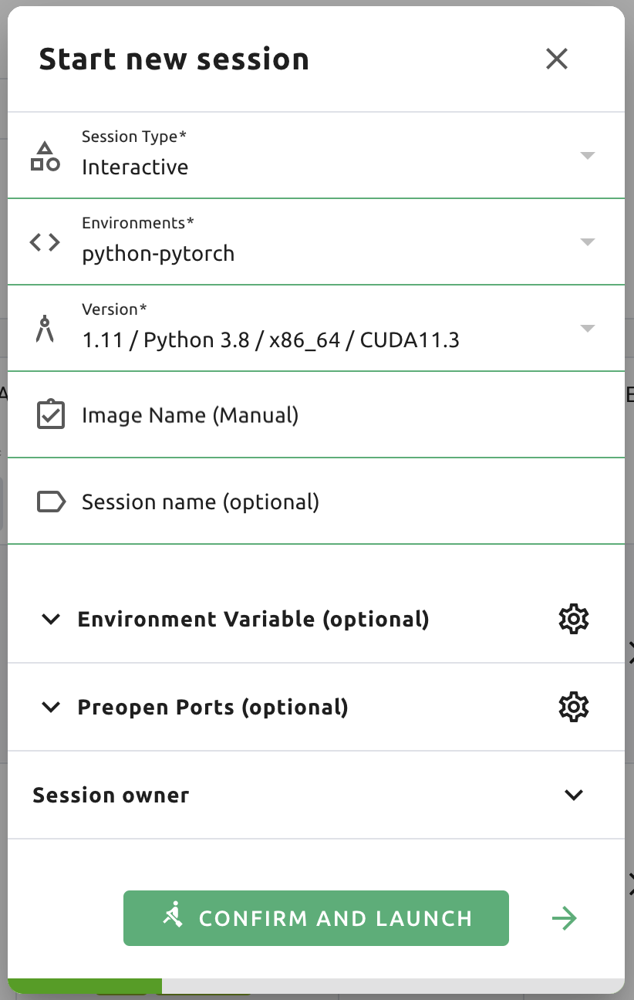
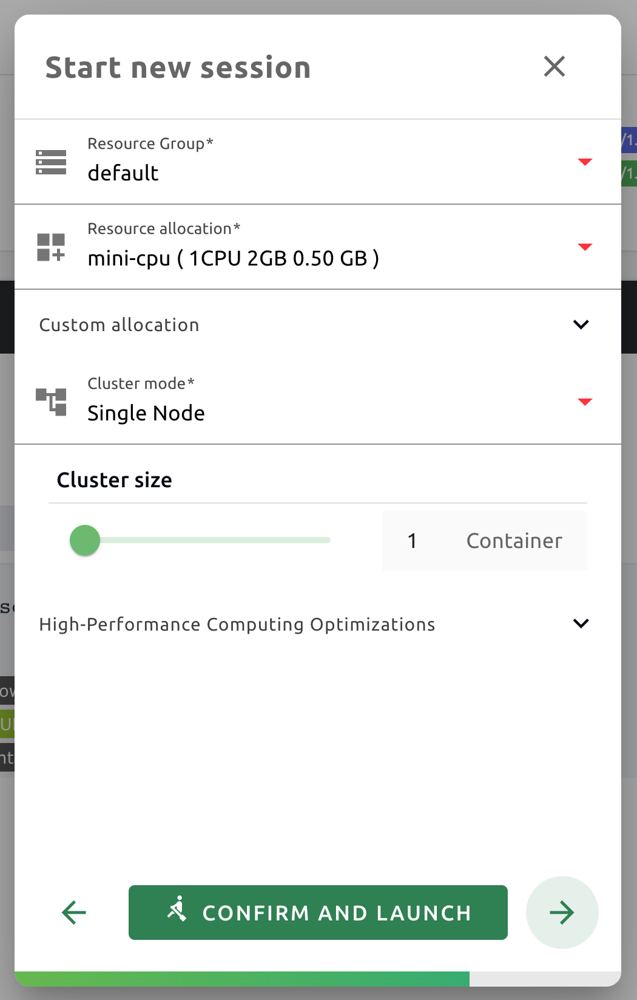
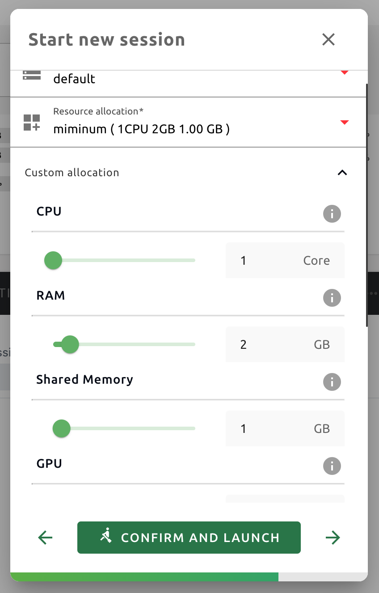
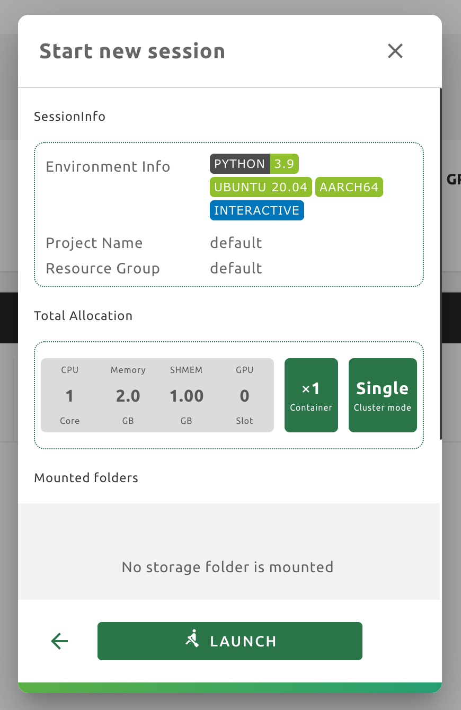
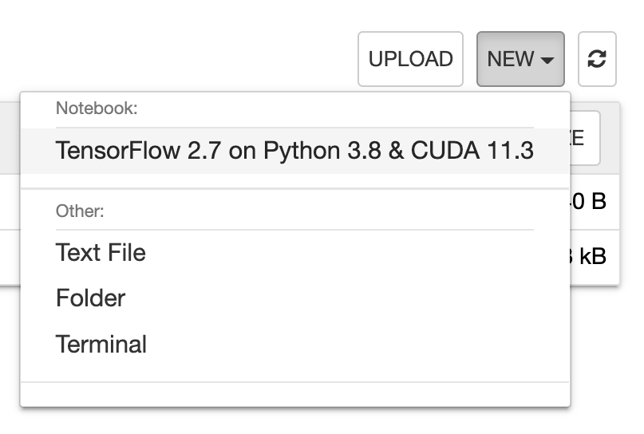
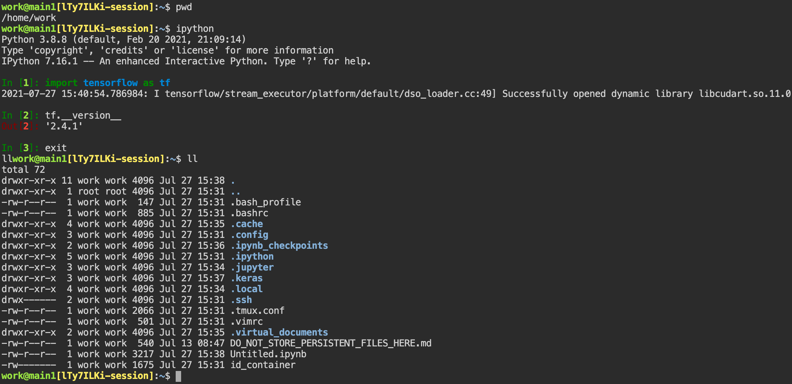
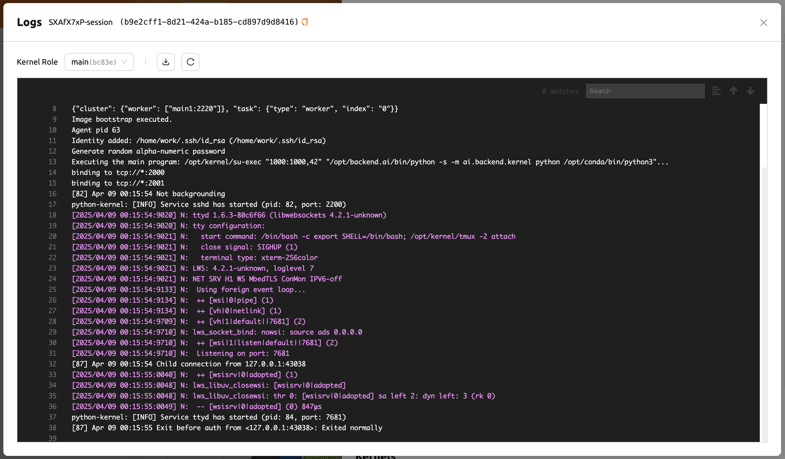
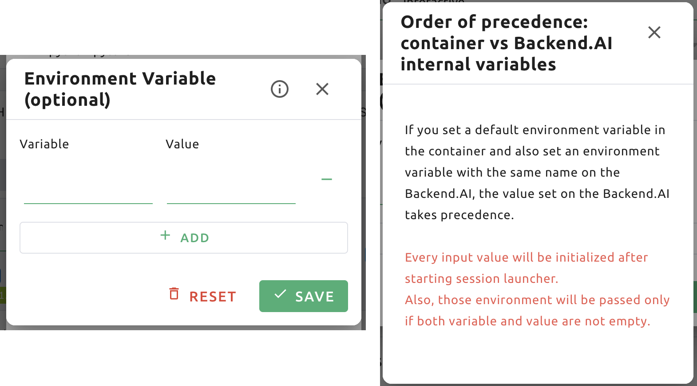

================
Compute Sessions
================

The most visited pages in the Backend.AI Web-UI would be the Sessions and
Data & Storage pages. Here, you will learn how to query and
create container-based compute sessions and utilize various web applications on
the Sessions page.

Start a new session
-------------------

After logging in with a user account, click Sessions on the left sidebar to visit the Sessions page.
Sessions page lets you start new sessions or use and manage existing running sessions.

Click the START button to start a new compute session. The following
wizard-style dialog will appear.

First, you need to choose the language Environment and Version you want to
create.  The rest items are optional. For a detailed description of each item,
please refer to the following.

* Environments: You can choose the base environment for compute sessions such as
  TensorFlow, PyTorch, C++, etc. When you select TensorFlow, your compute
  session will automatically include the TensorFlow library. If you choose
  another environment, the corresponding packages will be installed by default.
* Version: Selects the version of the environment. For example, you can select
  different versions, such as 1.15, 2.3, etc., for the TensorFlow environment.
* Session name: You can specify the name of the compute session to be
  created. If set, this name appears in Session Info, so it is easy to
  distinguish among multiple computation sessions. If not specified, a random
  word is assigned automatically. Session names only accept alphanumeric
  characters between 4 and 64 without spaces.
* Set Environment Variable: Provides an interface for users to set environment
  variables in a compute session. See the section
  :ref:`How to add environment variables before session creation<set-environment-variables>`
  on how to use.

Click the right arrow button at the bottom to advance to the next page. You can
also launch a compute session directly by clicking the CONFIRM AND LAUNCH
button. In this case, the settings on the other pages will all use the default
values.

.. image:: session_launch_dialog_2.png
   :width: 350
   :align: center

Here, you can specify the data folders to mount in the compute session. When a
compute session is destroyed, all data is deleted altogether by default, but the
data stored in the mounted folders will survive. Data in those folders can also
be reused by mounting it when creating another compute session. For the
information on how to mount a folder and run a compute session, see
:ref:`Mounting Folders to a Compute Session<session-mounts>`. Here, we will pass
by without mounting any folder. Click the right arrow button.

This page allows you to set the resources to be allocated for the new compute
session.

* Resource Group: Specifies the resource group in which to create a compute
  session. A resource group is a unit that groups host servers that each user
  can access. Usually, servers in a resource group would have the same type of
  GPU resources. Administrators can classify servers by any criteria, group them
  into one or more resource groups, and configure which resource groups a user
  can use. Users can launch a compute session only on servers in resource groups
  allowed by the administrator. If you are allowed multiple resource groups, you
  can select any group you want, but you cannot change it if you have only one.
* Resource allocation: These templates have pre-defined resource sets, such as
  CPU, memory, and GPU, to be allocated to a compute session. Administrators can
  define frequently used resource settings in advance.

If you want to allocate every resource by yourself, click Custom allocation.
The following advanced resource panel opens, and you can set each resource as
you wish within the allowed resource limits.

The meaning of each item is as follows, and you can check it by clicking the
Information (I) button on the right as well.

* CPU: The number of CPU cores to allocate to the compute session. The maximum
  value depends on the resource policy applied to the user.
* RAM: The amount of memory (GB) to allocate to the compute session. The
  maximum value depends on the resource policy applied to the user.
* Shared Memory: The amount of shared memory in GB to allocate for the compute
  session. Shared memory will use some part of the memory set in RAM. Therefore,
  it cannot be greater than the amount specified in RAM.
* GPU: The unit of GPU to allocate to the compute session. The maximum value
  depends on the resource policy applied to the user.
* Sessions: The number of compute sessions to be created with the specified
  settings. You can specify this value when you need to create the same
  compute sessions at once.

If you are done with the resource setting, click the right arrow button to
proceed to the next page.

Now, we have reached the last page. You can view information such as allocated
resources, mount information, environment variables set on the previous pages,
etc. After confirming the settings, click the LAUNCH button. If there is a
setting you want to change, you can return to the previous page by clicking the
left arrow button.

.. image:: no_vfolder_notification_dialog.png
   :width: 350
   :align: center

A warning dialog appears, stating that there are no mounted folders. Ignore the
warning for now and click the LAUNCH button to proceed.

Now a new compute session is created in the RUNNING tab.

.. image:: session_created.png

In the RUNNING tab, you can check the information on the currently running
sessions. FINISHED tab shows the list of terminated sessions and OTHERS tab shows the compute sessions with errors.
For each session, you can check the information such as session environments, the amount of allocated
and used resources, session starting time, etc.

.. note::
   Superadmins can query all compute session information currently running (or
   terminated) in the cluster, and users can view only the sessions they have
   created.

.. note::
   Compute session list may not be displayed normally due to intermittent
   network connection problems, and etc. This can be solved by refreshing the
   browser page.

.. image:: resource_stat_and_session_list.png

The resource statistics are displayed at the top of the screen. You can check the
amount of resources currently used and the total amount of resources
that can be allocated. The display bars are divided into upper and
lower parts. The upper part shows the resource allocation status in the current
scaling group and the lower part shows the allocation status of total
accessible resources.

* Upper: (Resources allocated by the user in the current scaling group) /
  (Total resources allocatable by the user in the current scaling group)

* Lower: (Resources allocated by the user) / (Resources allocated by the user +
  Total resources allocatable by the user in the current scaling group)

.. note::
   If the GPU resource is marked as FGPU, this means that the server is serving
   the GPU resources in a virtualized form. Backend.AI supports GPU
   virtualization technology that a single physical GPU can be divided and
   shared by multiple users for better utilization. Therefore, if you want to
   execute a task that does not require a large amount of GPU computation, you
   can create a compute session by allocating only a portion of a GPU. The
   amount of GPU resources that 1 FGPU actually allocates may vary from system
   to system depending on the administrator's setting. For example, if
   administrator has set to split one physical GPU into five pieces, 5 FGPU
   means 1 physical GPU, or 1 FGPU means 0.2 physical GPU. At this
   configuration, if you create a compute session by allocating 1 FGPU, you can
   utilize SM (streaming multiprocessor) and GPU memory corresponding to 0.2
   physical GPU for the session.

Use Jupyter Notebook
----------------------

Let's look at how to use and manage compute sessions that are already running.
If you look at the Control panel of the session list, there are several icons.
When you click the first icon, the app launcher pops up and shows the available app services as below.

.. image:: app_launch_dialog.png
   :width: 400
   :align: center

.. note::
   There are two check options under the app icons. Opening the app with each item checked
   applies the following features, respectively:

   * Open app to public: Open the app to the public. Basically, web services
     such as Terminal and Jupyter Notebook services are not accessible by
     other users, even if the user knows the service URL, since they are
     considered unauthenticated. However, checking this option makes it possible
     for anyone who knows the service URL (and port number) to access and use it. Of
     course, the user must have a network path to access the service.
   * Try preferred port: Without this option checked, a port number for the web service is randomly
     assigned from the port pool prepared in advance by Backend.AI.
     If you check this item and enter a specific port number, the entered
     port number will be tried first. However, there is no guarantee that the desired
     port will always be assigned because the port may not exist at all in the port
     pool or another service may already be using the port. In this case, the
     port number is randomly assigned.

  Depending on the system configuration, these options may not be shown.

Let's click on Jupyter Notebook.

.. image:: jupyter_app.png

A new window pops up and you can see that Jupyter Notebook is running. This
notebook was created inside a running compute session and can be used easily
with the click of a button without any other settings. Also, there is no need
for a separate package installation process because the language environment and
library provided by the computation session can be used as it is. For detailed
instructions on how to use Jupyter Notebook, please refer to the official
documentation.

In the notebook's file explorer, the ``id_container file`` contains a private
SSH key. If necessary, you can download it and use it for SSH / SFTP access to
the container.

Click the NEW button at the top right and select the Notebook for Backend.AI,
then the ipynb window appears where you can enter your own code.

In this window, you can enter and execute any code you want by using the
environment that session provides. The code is executed on one of the
Backend.AI nodes where the compute session is actually created and there is no
need to configure a separate environment on the local machine.

When you close the window, you can find that the ``Untitled.ipynb`` file is
created in the notebook file explorer. Note that the files created here are
deleted when you terminate the session. The way to preserve those files even
after the session is terminated is described in the Data & Storage Folders section.

.. image:: untitled_ipynb_created.png

Use web terminal
----------------

Return to the Session list page. This time, let's launch the terminal. Click the
terminal icon (the second button in the Control panel) to use the container's ttyd daemon. A terminal
will appear in a new window and you can run shell commands to access
the computational session as shown in the following figure. If you are
familiar with using commands, you can easily run various Linux commands. You
may notice that the Untitled.ipynb file automatically generated in Jupyter Notebook
is listed with the ``ls`` command. This shows that both apps are running
in the same container environment.

If you create a file here, you can immediately see it in the Jupyter Notebook
you opened earlier as well. Conversely, changes made to files in Jupyter
Notebook can also be checked right from the terminal. This is because they are
using the same files in the same compute session.

In addition to this, you can use web-based services such as TensorBoard, Jupyter
Lab, etc., depending on the type of environments provided by the compute session.

Query compute session log
-------------------------

You can view the log of the compute session by clicking the last icon in the
Control panel of the running compute session.

Delete a compute session
------------------------

To terminate a specific session, simply click on the red power icon and click
OKAY button in the dialog. Since the data in the folder inside the compute
session is deleted as soon as the compute session ends, it is recommended to move the data
to the mounted folder or upload it to the mounted folder from the beginning if you want to keep it.

.. image:: session_destroy_dialog.png
   :width: 400
   :align: center

.. _set-environment-variables:

How to add environment variable before creating a session
---------------------------------------------------------

To give more convenient workspace for users, Backend.AI supports environment variable setting
in session launching. In this feature, you can add any envs such as ``PATH`` by filling out
variable name and value in environment configuration dialog.

To add environment variable, simply click CONFIG button.

.. image:: env-config-start.png
   :width: 350
   :align: center
   :alt: Env Configuration Button

and then, environment configuration dialog appears.

In this dialog, you can add,update and delete written env variables.
To see more information about how it works, please click 'i' button at the header of the dialog.

You can input variable name and value in the same line of the input fields.
Then, click save button. It will be applied in the session.

.. warning::
   If you close the dialog without click saving variables or If you didn't fill out
   the variable and value, then those input values will not be applied into the session as env.
   Please remind that every variable and value that is not empty will be applied to session by
   clicking SAVE button.

   .. image:: env-config-dialog-closing-confirmation.png
      :width: 350
      :align: center
      :alt: Env config dialog closing confirmation

To Add more environment variables, yon can click ``+`` button in the right side of the first row of input field.
Also, you can remove the variable by clicking ``-`` button of the row that you want to get rid of.

If you want to delete the whole variables and value, please click DELETE ALL button at the bottom of the dialog.

Advanced web terminal usage
---------------------------

The web-based terminal internally embeds a utility called
`tmux <https://github.com/tmux/tmux/wiki>`_. tmux is a terminal multiplexer that
supports to open multiple shell windows within a single shell, so as to allow
multiple programs to run in foreground simultaneously. If you want to take
advantage of more powerful tmux features, you can refer to the official tmux
documentation and other usage examples on the Internet.

Here we are introducing some simple but useful features.

Copy terminal contents
~~~~~~~~~~~~~~~~~~~~~~

tmux offers a number of useful features, but it's a bit confusing for first-time
users. In particular, tmux has its own clipboard buffer, so when copying the
contents of the terminal, you can suffer from the fact that it can be pasted
only within tmux by default. Furthermore, it is difficult to expose user
system's clipboard to tmux inside web browser, so the terminal
contents cannot be copied and pasted to other programs of user's computer. The
so-called ``Ctrl-C`` / ``Ctrl-V`` is not working with tmux.

If you need to copy and paste the terminal contents to your system's clipboard,
you can temporarily turn off tmux's mouse support. First, press ``Ctrl-B`` key
to enter tmux control mode. Then type ``:set -g mouse off`` and press ``Enter``
(note that you have to type the first colon as well). You can check what you are
typing in the status bar at the bottom of the screen. Then drag the desired text
from the terminal with the mouse and press the ``Ctrl-C`` or ``Cmd-C`` (in Mac)
to copy them to the clipboard of the user's computer.

With mouse support turned off, you cannot scroll through the mouse wheel to see
the contents of the previous page from the terminal. In this case, you can turn
on mouse support again. Press ``Ctrl-B``, and this time, type ``:set -g mouse
on``. Now you can scroll mouse wheel to see the contents of the previous page.

If you remember ``:set -g mouse off`` or ``:set -g mouse on`` after ``Ctrl-B``,
you can use the web terminal more conveniently.

.. note::
   ``Ctrl-B`` is tmux's default control mode key. If you set another control key
   by modifying ``.tmux.conf`` in user home directory, you should press the set
   key combination instead of ``Ctrl-B``.

Check the terminal history using keyboard
~~~~~~~~~~~~~~~~~~~~~~~~~~~~~~~~~~~~~~~~~~~~

There is also a way to copy the terminal contents and check the previous
contents of the terminal simultaneously. It is to check the previous contents
using the keyboard. Again, click ``Ctrl-B`` first, and then press the ``Page
Up`` and/or ``Page Down`` keys. You can see that you navigate through the
terminal's history with just keyboard. To exit search mode, just press the ``q``
key. With this method, you can check the contents of the terminal history even
when the mouse support is turned off to allow copy and paste.

Spawn multiple shells
~~~~~~~~~~~~~~~~~~~~~

The main advantage of tmux is that you can launch and use multiple shells in one
terminal window. Since seeing is believing, let's press the ``Ctrl-B`` key and
then the ``c``. You can see that the contents of the existing window disappears
and a new shell environment appears. But the previous window is not terminated.
Let's press ``Ctrl-B`` and then ``w``. You can now see the
list of shells currently open on tmux like following image. Here, the shell
starting with ``0:`` is the shell environment you first saw, and the shell
starting with ``1:`` is the one you just created. You can move between shells
using the up/down keys. Place the cursor on the shell ``0:`` and press the Enter
key to select it.

.. image:: tmux_multi_session_pane.png
   :alt: tmux's multiple session management

You can see the first shell environment appears. In this way, you can
use multiple shell environments within a web terminal. To exit or terminate the
current shell, just enter ``exit`` command or press ``Ctrl-B x`` key and then
type ``y``.

In summary:

- ``Ctrl-B c``: create a new tmux shell
- ``Ctrl-B w``: query current tmux shells and move around among them
- ``exit`` or ``Ctrl-B x``: terminate the current shell

Combining the above commands allows you to perform various tasks simultaneously
on multiple shells.
