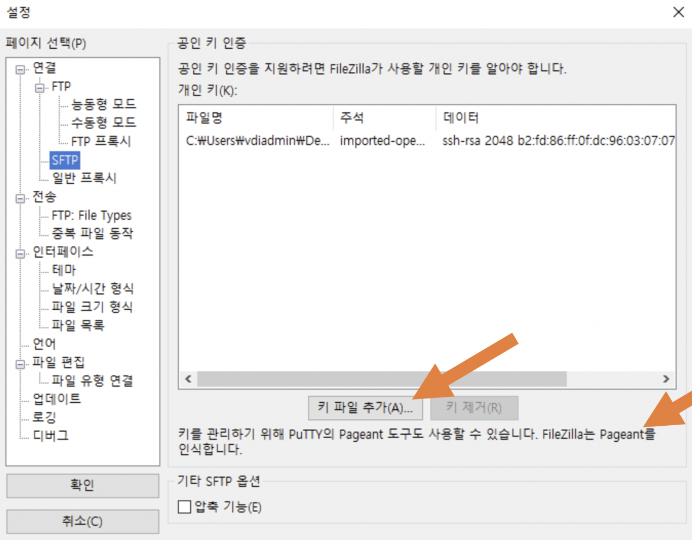
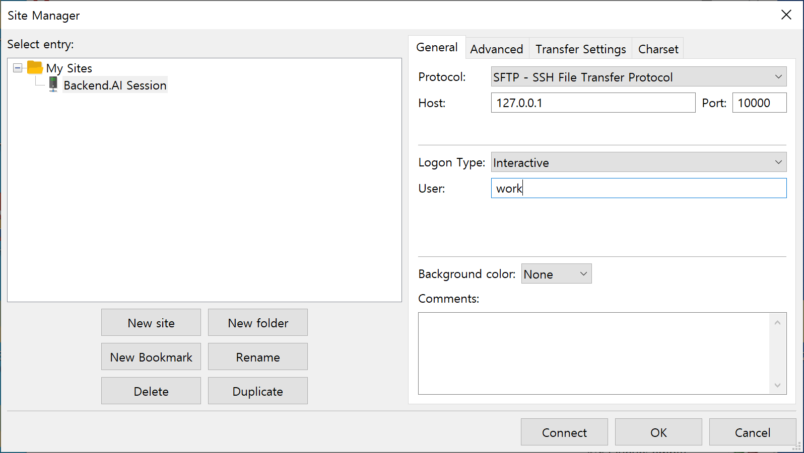
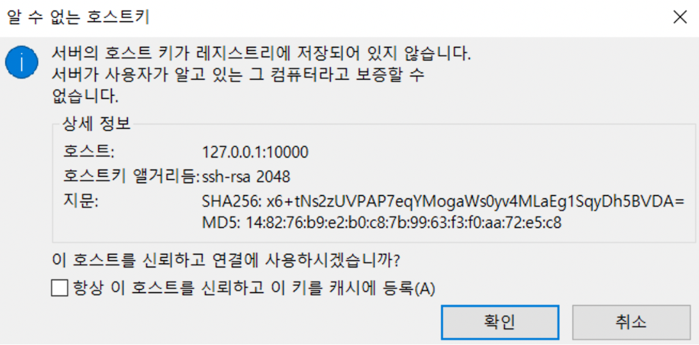
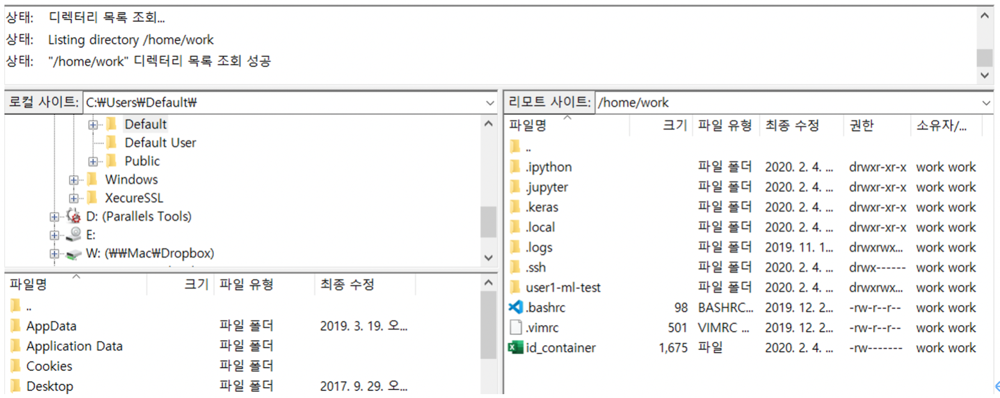

==========================================
SSH/SFTP Connection to a Compute Session
==========================================

Backend.AI supports SSH/SFTP connection to the created compute sessions
(containers). In this section, we will learn how to do it.

.. note::
   SSH/SFTP connection is supported only on desktop apps, and not yet supported
   on web-based Web-UI service.

For Linux / Mac
----------------------------------------------------

First, create a compute session, then click the app icon (first button) in
Control, followed by SSH / SFTP icon. Then, a daemon that allows SSH/SFTP access
from inside the container will be initiated, and the Web-UI app interacts with
the daemon through a local proxy service.

.. warning::
   You cannot establish a SSH/SFTP connection to the session until you click
   the SSH/SFTP icon. When you close the Web-UI app and launch it again, the
   connection between the local proxy and the Web-UI app is initialized, so the
   SSH/SFTP icon must be clicked again.

Next, a dialog containing SSH/SFTP connection information will be pop up.
Remember the address (especially the assigned port) written in the SFTP URL and
click the download link to save the ``id_container`` file on the local machine.
This file is an automatically generated SSH private key. Instead of using the
link, you can also download the ``id_container`` file located under
``/home/work/`` with your web terminal or Jupyter Notebook. The auto-generated
SSH key may change when new session is created. In that case, it must be
downloaded again.

.. image:: sftp_app.png
   :alt: Starting SSH/SFTP daemon inside a compute session (container)

To SSH connect to the compute session with the downloaded SSH private key, you
run the following command in the shell environment. You should write the
path to the downloaded ``id_container`` file after ``-i`` option and the
assigned port number after ``-p`` option. The user inside the compute session is
usually set to ``work``, but if your session uses other account, the ``work``
part in ``work@localhost`` should be changed to the actual session account.  If
you run the command correctly, you can see that SSH connection is made to the
compute session and you are welcomed by the container's shell environment.

.. code-block:: shell

   $ ssh -o StrictHostKeyChecking=no \
   >     -o UserKnownHostsFile=/dev/null \
   >     -i ~/.ssh/id_container \
   >     work@localhost -p 52468
   Warning: Permanently added '[127.0.0.1]:52468' (RSA) to the list of known hosts.
   f310e8dbce83:~$

Connecting by SFTP would almost be the same. After running the SFTP client and
setting public key-based connection method, simply specify ``id_container``
as the SSH private key. Each FTP client may adopt different way, so refer to
each FTP client manual for details.

.. note::
   The SSH/SFTP connection port number is randomly assigned each time when a session
   is created. If you want to use a specific SSH/SFTP port number, you can input
   the port number in the "Preferred SSH Port" field in the user settings menu.
   To avoid possible collisions with other services within the compute session,
   it is recommended to specify a port number between 10000-65000. However, if
   SSH/SFTP connections are made by two or more compute sessions at the same
   time, the second SSH/SFTP connection cannot use the designated port (since
   the first SSH/SFTP connection has already taken it), so a random port number
   will be assigned.

.. note::
   If you want to use your own SSH keypair instead of ``id_container``, create a
   user-type folder named ``.ssh``. If you create ``authorized_keys`` file in
   that folder and append it with the contents of your SSH public key, you can
   connect by SSH/SFTP through your own SSH private key without having to
   download the ``id_container`` after creating a compute session.

For Windows / FileZilla
--------------------------------------------------------------

Backend.AI Web-UI app supports OpenSSH-based public key connection (RSA2048).
To access with a client such as PuTTY on Windows, a private key must be
converted into a ``ppk`` file through a program such as PuTTYgen. You can refer
to the following link for the conversion method:
https://wiki.filezilla-project.org/Howto. For easier explanation, this section
will describe how to connect to SFTP through FileZilla client on Windows.

Refer to the connection method on Linux/Mac, create a compute session, check the
connection port and download ``id_container``. ``id_container`` is an
OpenSSH-based key, so if you use a client that supports only Windows or ppk type
keys, you must convert it. Here, we will convert through the PuTTYgen program
installed with PuTTY. After running the PuTTYgen, click on the import key in the
Conversions menu. Select the downloaded ``id_container`` file from the file open
dialog. Click the Save private key button of PuTTYGen and save the file with the
name ``id_container.ppk``.

.. image:: puttygen_conversion.png
   :alt: SSH key conversion with PuttyGen

After launching the FileZilla client, go to the Settings-Connection-SFTP
and register the key file ``id_container.ppk`` (``id_container`` for clients
supporting OpenSSH).

Open Site Manager, create a new site, and enter the connection information as
follows.

When connecting to a container for the first time, the following confirmation
popup may appear. Click the OK button to save the host key.

After a while, you can see that the connection is established as follows. You
can now transfer large files to ``/home/work/`` or other mounted storage folder
with this SFTP connection.

