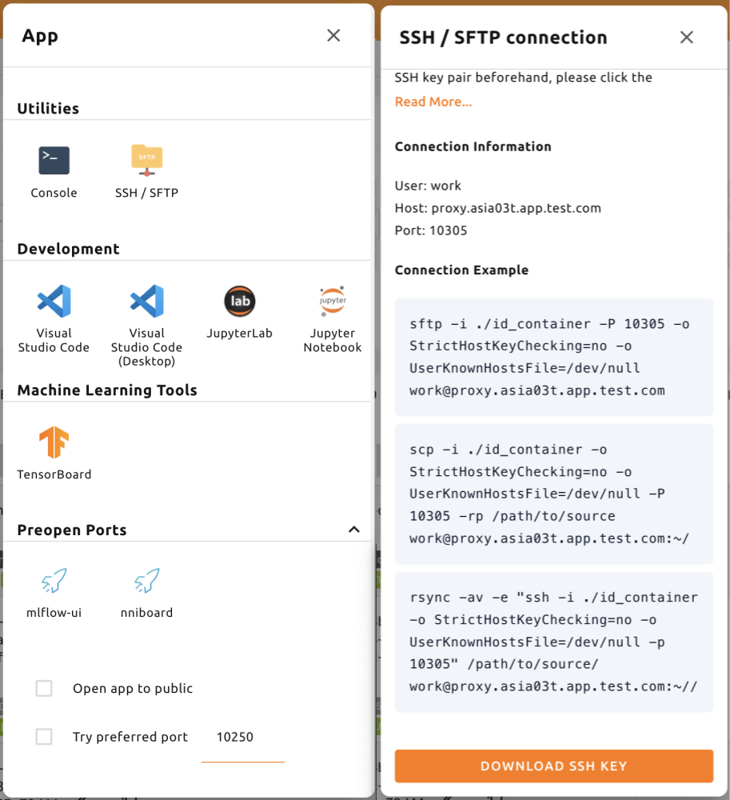
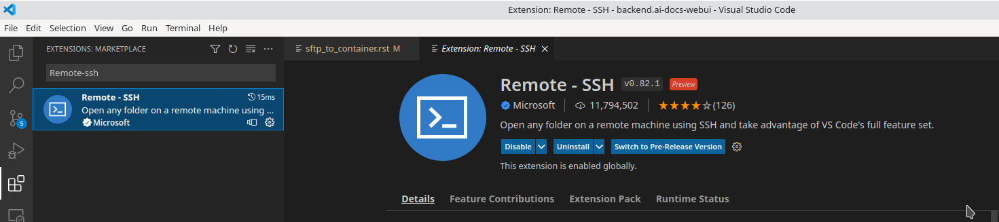
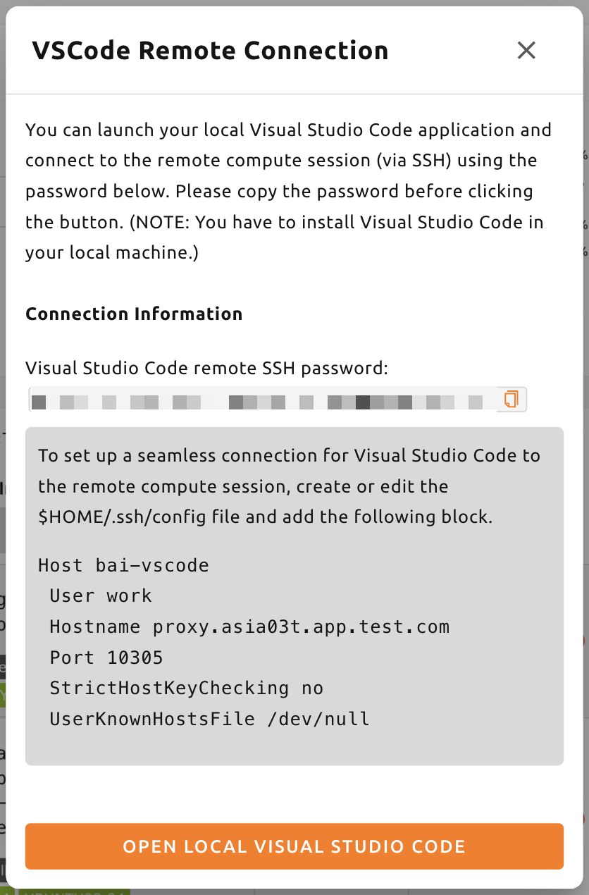
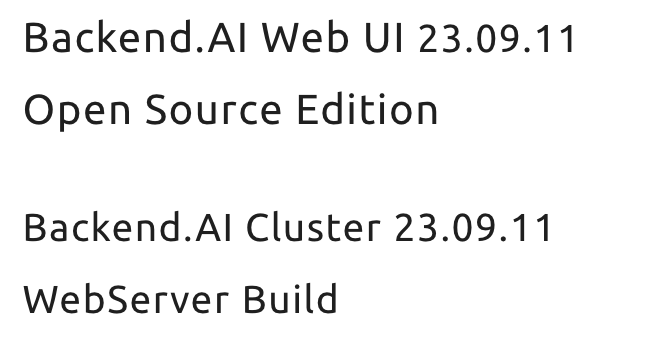

.. _ssh-sftp-container:

==========================================
SSH/SFTP Connection to a Compute Session
==========================================

Backend.AI supports SSH/SFTP connection to the created compute sessions
(containers). In this section, we will learn how to do it.

.. note::
   SSH/SFTP connection feature is supported through a WebUI Desktop application. 
   Currently web-based WebUI does not support this feature due to limitations of file system
   access on browser-level. Desktop app can be downloaded a panel from the Summary page. Using
   this panel, the compatible version will be downloaded automatically.

   .. image:: app_download_panel.png
      :width: 350
      :align: center

   You can also download the app from
   https://github.com/lablup/backend.ai-webui/releases. Make sure to download
   the compatible version of the Web-UI in this case. You can check the Web-UI
   version by clicking on the "About Backend.AI" sub-menu located in the
   preference menu on the upper-right side of the GUI.

.. _sftp_connection_for_linux_and_mac:

For Linux / Mac
----------------------------------------------------

First, create a compute session, then click the app icon (first button) in
Control, followed by SSH / SFTP icon. Then, a daemon that allows SSH/SFTP access
from inside the container will be initiated, and the Web-UI app interacts with
the daemon through a local proxy service.

.. warning::
   You cannot establish a SSH/SFTP connection to the session until you click
   the SSH/SFTP icon. When you close the Web-UI app and launch it again, the
   connection between the local proxy and the Web-UI app is initialized, so the
   SSH/SFTP icon must be clicked again.

Next, a dialog containing SSH/SFTP connection information will be pop up.
Remember the address (especially the assigned port) written in the SFTP URL and
click the download link to save the ``id_container`` file on the local machine.
This file is an automatically generated SSH private key. Instead of using the
link, you can also download the ``id_container`` file located under
``/home/work/`` with your web terminal or Jupyter Notebook. The auto-generated
SSH key may change when new session is created. In that case, it must be
downloaded again.

To SSH connect to the compute session with the downloaded SSH private key, you
run the following command in the shell environment. You should write the
path to the downloaded ``id_container`` file after ``-i`` option and the
assigned port number after ``-p`` option. The user inside the compute session is
usually set to ``work``, but if your session uses other account, the ``work``
part in ``work@localhost`` should be changed to the actual session account.  If
you run the command correctly, you can see that SSH connection is made to the
compute session and you are welcomed by the container's shell environment.

.. code-block:: shell

   $ ssh -o StrictHostKeyChecking=no \
   >     -o UserKnownHostsFile=/dev/null \
   >     -i ~/.ssh/id_container \
   >     work@localhost -p 52468
   Warning: Permanently added '[127.0.0.1]:52468' (RSA) to the list of known hosts.
   f310e8dbce83:~$

Connecting by SFTP would almost be the same. After running the SFTP client and
setting public key-based connection method, simply specify ``id_container``
as the SSH private key. Each FTP client may adopt different way, so refer to
each FTP client manual for details.

.. note::
   The SSH/SFTP connection port number is randomly assigned each time when a session
   is created. If you want to use a specific SSH/SFTP port number, you can input
   the port number in the "Preferred SSH Port" field in the user settings menu.
   To avoid possible collisions with other services within the compute session,
   it is recommended to specify a port number between 10000-65000. However, if
   SSH/SFTP connections are made by two or more compute sessions at the same
   time, the second SSH/SFTP connection cannot use the designated port (since
   the first SSH/SFTP connection has already taken it), so a random port number
   will be assigned.

.. note::
   If you want to use your own SSH keypair instead of ``id_container``, create a
   user-type folder named ``.ssh``. If you create ``authorized_keys`` file in
   that folder and append it with the contents of your SSH public key, you can
   connect by SSH/SFTP through your own SSH private key without having to
   download the ``id_container`` after creating a compute session.

.. note::
   If you receive the following warning message, try again after changing the
   permission of the ``id_container`` to 600. (``chmod 600 <id_container path>``) 

   .. image:: bad_permissions.png
      :alt: Permissions Warning Message

For Windows / FileZilla
--------------------------------------------------------------

Backend.AI Web-UI app supports OpenSSH-based public key connection (RSA2048).
To access with a client such as PuTTY on Windows, a private key must be
converted into a ``ppk`` file through a program such as PuTTYgen. You can refer
to the following link for the conversion method:
https://wiki.filezilla-project.org/Howto. For easier explanation, this section
will describe how to connect to SFTP through FileZilla client on Windows.

Refer to the connection method on Linux/Mac, create a compute session, check the
connection port and download ``id_container``. ``id_container`` is an
OpenSSH-based key, so if you use a client that supports only Windows or ppk type
keys, you must convert it. Here, we will convert through the PuTTYgen program
installed with PuTTY. After running the PuTTYgen, click on the import key in the
Conversions menu. Select the downloaded ``id_container`` file from the file open
dialog. Click the Save private key button of PuTTYGen and save the file with the
name ``id_container.ppk``.

.. image:: puttygen_conversion.png
   :alt: SSH key conversion with PuttyGen

After launching the FileZilla client, go to the Settings-Connection-SFTP
and register the key file ``id_container.ppk`` (``id_container`` for clients
supporting OpenSSH).

.. image:: filezilla_setting.png
   :alt: Filezilla settings to connect to compute session

Open Site Manager, create a new site, and enter the connection information as
follows.

.. image:: filezilla_site_setting.png
   :alt: Filezilla site setting

When connecting to a container for the first time, the following confirmation
popup may appear. Click the OK button to save the host key.

.. image:: unknown_host_key.png
   :width: 500
   :align: center
   :alt: Unknown Host Key dialog

After a while, you can see that the connection is established as follows. You
can now transfer large files to ``/home/work/`` or other mounted storage folder
with this SFTP connection.

.. image:: filezilla_connection_established.png
   :alt: Filezilla connection established

For Visual Studio Code
--------------------------------------------------------------

Backend.AI supports to develop with the local Visual Studio Code through SSH/SFTP
connection to a compute session. Once connected, you can interact with files and
folders anywhere on the compute session. In this section, we will learn how to
do it.

First, you should install Visual Studio Code and the Remote Development
extension pack.

Link: https://aka.ms/vscode-remote/download/extension

After installing the extension, you should configure the SSH connection for the
compute sesion. In the SSH/SFTP connection dialog, click "DOWNLOAD SSH KEY" button
to download the SSH private key (``id_container``) for the session. Also,
remember the port number.

And then, setting SSH config file. Edit the ``~/.ssh/config`` file (for Linux/Mac)
or ``C:\Users\[user name]\.ssh\config`` (for Windows) and add the following block.
For convenience, we set the hostname to ``vscode``. It can be changed to any alias.

.. code-block::

   Host vscode
     HostName 127.0.0.1
     Port 30732  # write down the port number that you remembered
     User work
     ForwardAgent yes
     StrictHostKeyChecking no
     IdentityFile path/to/downloaded/id_container

Now in the Visual Studio Code, select the `Command Palette...` from `View` menu.

  .. image:: vscode_view_commandpalett.png
   :alt: View > comma

Visual Studio Code can automatically detect the type of host you are connecting
to. Let's choose `Remote-SSH: Connect to Host...`.

  .. image:: vscode_remote_ssh_connect.png
   :alt: SSH connect

You will see the list of hosts in ``.ssh/config``. Please select the host to
connect, in this case, ``vscode``.

  .. image:: vscode_remote_ssh_select_host.png
   :alt: Select remote ssh select Host

Selecting the host name will lead you to access the remote compute session.
After you are connected, you will see an empty window. You can always refer to
the Status bar to see which host you are connected to.

  .. image:: vscode_connect_finish.png
   :alt: Finished remote ssh connection

You can then open any folder or workspace on the remote host by accessing `File >
Open...` or `File > Open Workspace...` menu just as you usually would do!

  .. image:: vscode_connected_host_file_open.png
   :alt: open remote host file directory

Establish SSH connection with Backend.AI client package
-------------------------------------------------------

This document describes how to establish an SSH connection to a compute session
in environments where a graphical user interface (GUI) cannot be used.

Typically, GPU nodes that runs compute sessions (containers) cannot be accessed
directly from the outside. Therefore, in order to establish an SSH or sFTP
connection to a compute session, a local proxy that creates a tunnel needs to be
launched to relay the connection between the user and the session. Using the
Backend.AI Client package, this process is relatively simple to configure.

Prepare Backend.AI Client package
^^^^^^^^^^^^^^^^^^^^^^^^^^^^^^^^^

Prepare with Docker image
~~~~~~~~~~~~~~~~~~~~~~~~~

The Backend.AI Client package is available as a Docker image. You can pull the
image from the Docker Hub with the following command:

.. code-block:: bash

   $ docker pull lablup/backend.ai-client:22.09.18

The version of Backend.AI server can be found in "About Backend.AI" menu that
appears when you click on the person icon on the top right corner of the Web UI.

Run the Docker image with the following command:

.. code-block:: bash

   $ docker run --rm -it lablup/backend.ai-client:22.09.18 bash

Check if ``backend.ai`` command is available in the container. If it is
available, the help message will be displayed.

.. code-block:: bash

   $ backend.ai

Prepare directly from host with a Python virtual environment
~~~~~~~~~~~~~~~~~~~~~~~~~~~~~~~~~~~~~~~~~~~~~~~~~~~~~~~~~~~~

If you cannot or do not want to use Docker, you can install the Backend.AI Client
package directly on your host machine. Prerequisites are:

- The required version of Python may vary depending on the Backend.AI Client
  version. You can check the compability matrix at
  https://github.com/lablup/backend.ai#python-version-compatibility.
- ``clang`` compiler might be needed
- ``zstd`` package might be needed if you are using ``indygreg`` Python binary.

It is recommended to use a Python virtual environment to install the packages.
One way is to use the statically-built Python binary from the ``indygreg``
repository. Download the binary that matches your local machine architecture
from the following page and unzip it.

- https://github.com/indygreg/python-build-standalone/releases
- If you are using a popular x86-based Ubuntu environment, you can download and
  extract it as follows:

  .. code-block:: bash

     $ wget https://github.com/indygreg/python-build-standalone/releases/download/20230116/cpython-3.10.9+20230116-x86_64-unknown-linux-gnu-pgo-full.tar.zst
     $ tar -I unzstd -xvf *.tar.zst

After unarchiving the binary, ``python`` directory will be created under the
current directory. You can check the version of the downloaded Python by running
the following command.

.. code-block:: bash

   $ ./python/install/bin/python3 -V
   Python 3.10.9

To avoid affecting other Python environments on the system, it is recommended to
create a separate Python virtual environment. When you run the following
command, a Python virtual environment will be created under the directory
``.venv.``.

.. code-block:: bash

   $ ./python/install/bin/python3 -m venv .venv

Activate the virtual environment. Since a new virtual environment has been
activated, only the ``pip`` and ``setuptools`` packages will be installed when
you run the ``pip list`` command.

.. code-block:: bash

   $ source .venv/bin/activate
   (.venv) $ pip list
   Package    Version
   ---------- -------
   pip        21.3.1
   setuptools 59.4.0

Now, install the Backend.AI Client package. Install the client package according
to the server version. Here, we assume that the version is 22.09. If an
installation-related error occurs with the ``netifaces`` package, you may need to
lower the versions of ``pip`` and ``setuptools``. Check if the ``backend.ai``
command is available.

.. code-block:: bash

   (.venv) $ pip install -U pip==22.0.4 && pip install -U setuptools==58.1.0
   (.venv) $ pip install -U backend.ai-client~=22.09
   (.venv) $ backend.ai

Setting up server connection for CLI
^^^^^^^^^^^^^^^^^^^^^^^^^^^^^^^^^^^^

Create a ``.env`` file and add the following content. Use the same address for
``webserver-url`` that you use to connect to the Web UI service from your
browser.

.. code-block:: bash

   BACKEND_ENDPOINT_TYPE=session
   BACKEND_ENDPOINT=<webserver-url>

Run the following CLI command to connect to the server. Enter the email and
password that you use to log in from your browser. If everything goes well, you
will see the message ``Login succeeded``.

.. code-block:: bash

   $ backend.ai login
   User ID: myuser@test.com
   Password:
   ✓ Login succeeded.

SSH/SCP Connection to Computation Session
^^^^^^^^^^^^^^^^^^^^^^^^^^^^^^^^^^^^^^^^^

Create a compute session from the browser by mounting the folder where you want
to copy the data. You can create the session using CLI as well, but for
convenience, let's assume that you have created it from the browser. Remember
the name of the created compute session. Here, we assume it is
``ibnFmWim-session``.

If you simply want to SSH, execute the following command:

.. code-block:: bash

   $ backend.ai ssh ibnFmWim-session
   ∙ running a temporary sshd proxy at localhost:9922 ...
   work@main1[ibnFmWim-session]:~$

If you want to download the SSH key file and explicitly run the ssh command, you
need to first run the following command to launch a local proxy service that
relays connection from the local machine to the computation session. You can
specify the port (9922) to use on the local machine with the b option.

.. code-block:: bash

   $ backend.ai app ibnFmWim-session sshd -b 9922
   ∙ A local proxy to the application "sshd" provided by the session "ibnFmWim-session" is available at:
     tcp://127.0.0.1:9922

Open another terminal window on your local machine. Move to the working
directory where the ``.env`` file is located, and download the SSH key
automatically generated in the compute session.

.. code-block:: bash

   $ source .venv/bin/activate  # Reactivate the Python virtual environment as this is a different terminal
   $ backend.ai session download ibnFmWim-session id_container
   Downloading files: 3.58kbytes [00:00, 352kbytes/s]
   ✓ Downloaded to /*/client.

You can use the downloaded key to SSH as follows. Since you launched the local
proxy on port 9922, the connection address should be 127.0.0.1 and the port
should be 9922. Use the user account ``work`` for the connection.

.. code-block:: bash

   $ ssh \
       -o StrictHostKeyChecking=no \
       -o UserKnownHostsFile=/dev/null \
       -i ./id_container \
       -p 9922 \
       work@127.0.0.1
   Warning: Permanently added '[127.0.0.1]:9922' (RSA) to the list of known hosts.
   work@

Similarly, you can use the ``scp`` command to copy files. In this case, you
should copy the files to the mounted folder within the compute session to
preserve them even after the session has been terminated.

.. code-block:: bash

   $ scp \
       -o StrictHostKeyChecking=no \
       -o UserKnownHostsFile=/dev/null \
       -i ./id_container \
       -P 9922 \
       test_file.xlsx work@127.0.0.1:/home/work/myfolder/
   Warning: Permanently added '[127.0.0.1]:9922' (RSA) to the list of known hosts.
   test_file.xlsx

When all the tasks are completed, press ``Ctrl-C`` on the first terminal to
cancel the local proxy service.
