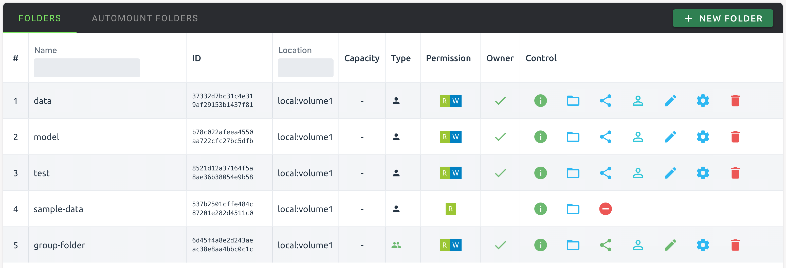
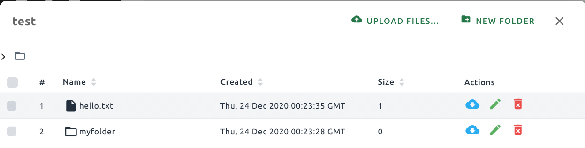
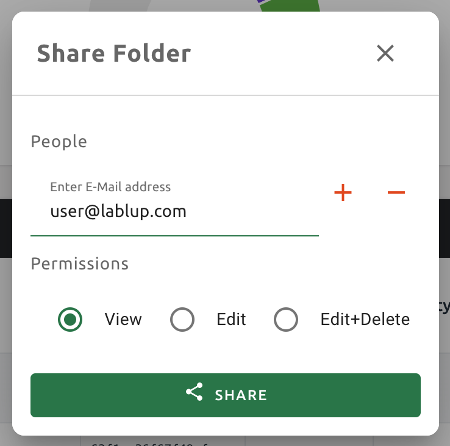
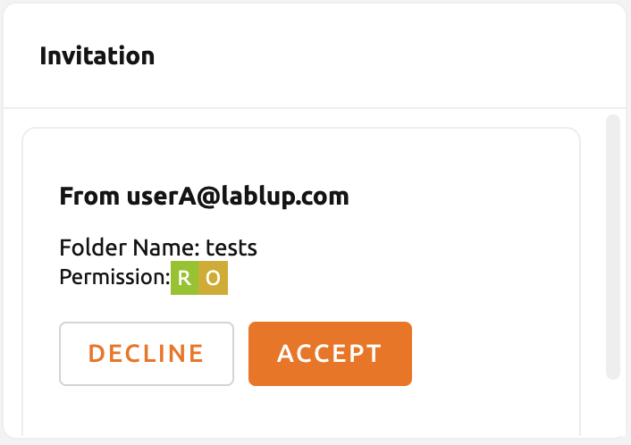
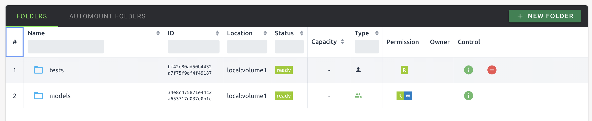
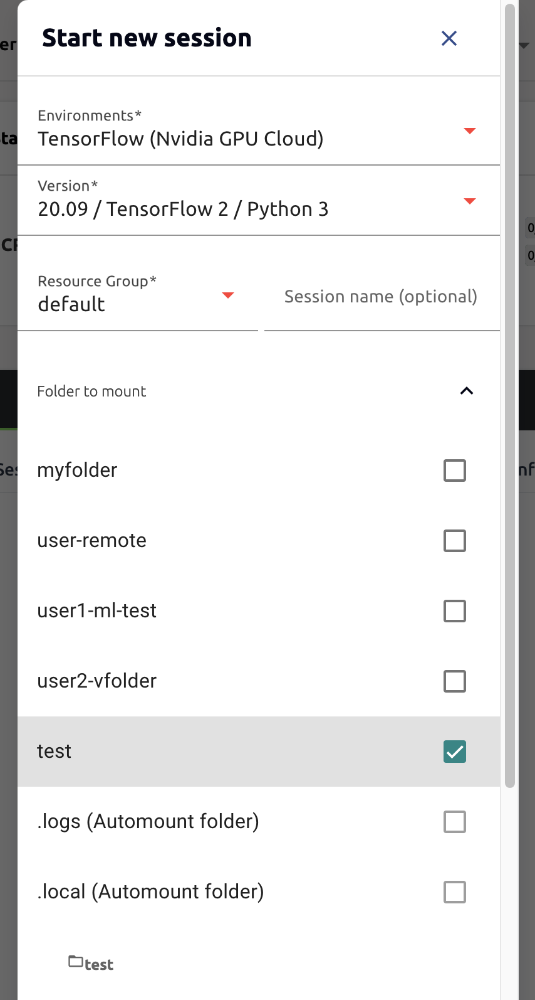
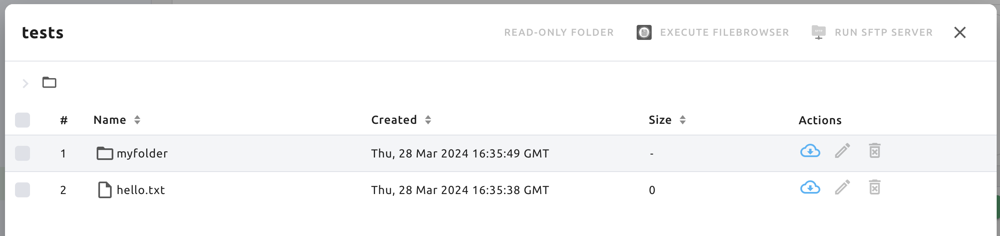

========================================================
Data Sharing and Access Control by Shared Storage Folder
========================================================

.. note:: Objectives

   * Share user's storage folders to other users
   * Understand the sharing by group storage folder (admin-only)

You may need to share the contents of a storage folder with other users or group
members to collaborate. For this purpose, Backend.AI provides flexible folder
sharing feature.

Sharing user's storage folders with other users
-----------------------------------------------

Let's learn how to share your personal Storage folder with other users. First,
log in to User A's account and go to the Data & Storage page. There are several
folders, and we want to share a folder named ``test`` to User B.

Inside the ``test`` folder you can see files and directories like ``hello.txt``
and ``myfolder``.

Confirm that the ``test`` folder is not listed when logging in with User B's
account.

.. warning::
   If a folder named ``test`` already exists in User B's account, User A's
   ``test`` folder cannot be shared with User B.

.. image:: no_test_vfolder_in_B.png

Back to User A's account and click the third icon in the Control column on the
right of the ``test`` folder. Enter User B's email in the email input field and
click the SHARE button to send a sharing invitation. No actual email is sent,
and invitations are generated through the Backend.AI database. In the case of
Permissions, if you check View, it is shared as read-only, and if you check Edit
together, even write operation is allowed to User B. If you want to share with
multiple users, you can also click the + button to enter additional emails.

Back to User B's account and visit to the Summary page. At the bottom of the
page, you can see an invitation with the title Invitation arrived. If you don't
see the invitation, go to another page once and then go back to the Summary
page again. Click the ACCEPT button to accept the invitation.

Visit the Data & Storage page and check that the ``test`` folder is displayed in
the list. If you don't see it on the list, try refreshing your browser page.
Since you have accepted the invitation, you can now view the contents of User
A's ``test`` folder in User B account. Compared to the other folders created by
User B, the ``test`` folder has no management icon in the Control column. You
can also see only the R (read-only) mark displayed in the Permission column.

Let's navigate inside the ``test`` folder by clicking the folder icon in the
Control column of ``test``. You can check the ``hello.txt`` and ``myfolder``
that you checked in the user A's account again. Let's create a compute session
by mounting this storge folder with the user B's account.

After creating a session, open the web terminal and check that the ``test``
folder is mounted in the home folder. The contents of the ``test`` folder are
displayed, but attempts to create or delete files are not allowed. This is
because User A shared it as read-only. User B can create a file in the ``test``
folder if it has been shared including write access.

This way, you can share your personal storage folders with other users based on
your Backend.AI email account.

Sharing a group storage folder with group members
-------------------------------------------------

In addition to user's storage folders, Backend.AI provides storage folders for
groups. A group storage folder is a folder belonging to a specific group, not a
specific user, and can be accessed by all users belonging to that group.

.. note::
   Group folders can only be created by administrators. Normal users can only
   access the contents of the group folder created by the administrator. Also,
   there may be cases where group folder is not allowed depending on the system
   settings.

First, log in with an administrator account and create a group folder. After
moving to the Data & Storage page, click NEW FOLDER to open the folder creation
dialog. Enter the folder name, set the Type to Group, and select the target
group. The target group should be set to the group to which User B belongs for
this example to work.  Permission is set to Read-Only again.

.. image:: group_folder_creation.png
   :width: 450
   :align: center

After confirming that the folder has been created, log in with the user B's
account and check that the group folder just created on the Data & Storage page
is displayed without an invitation procedure! You can see that R (Read Only) is
also displayed in the Permission column.

.. image:: group_folder_listed_in_B.png

In this way, Backend.AI provides invitation for user's folders and group folders
to help you share data and models in a flexible way.
