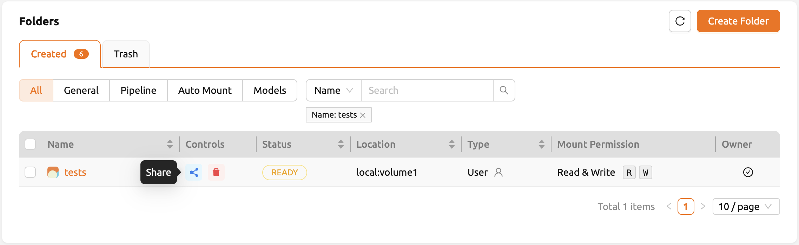
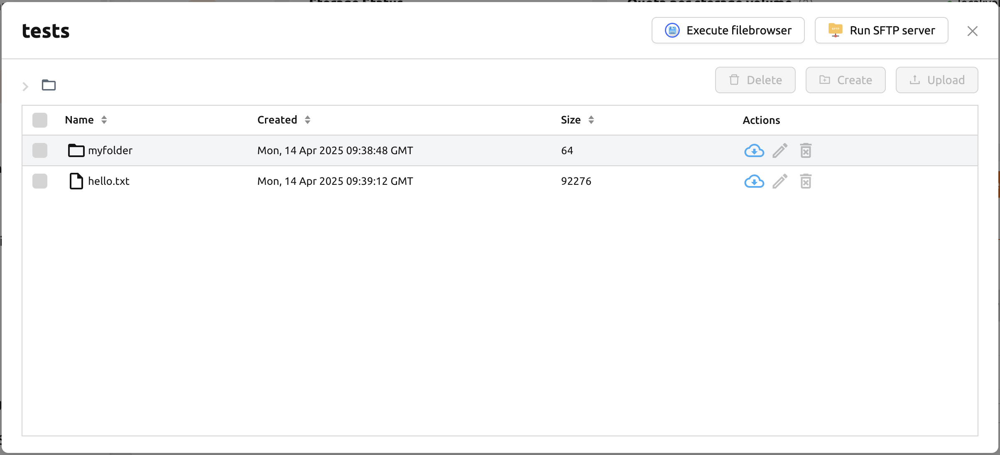
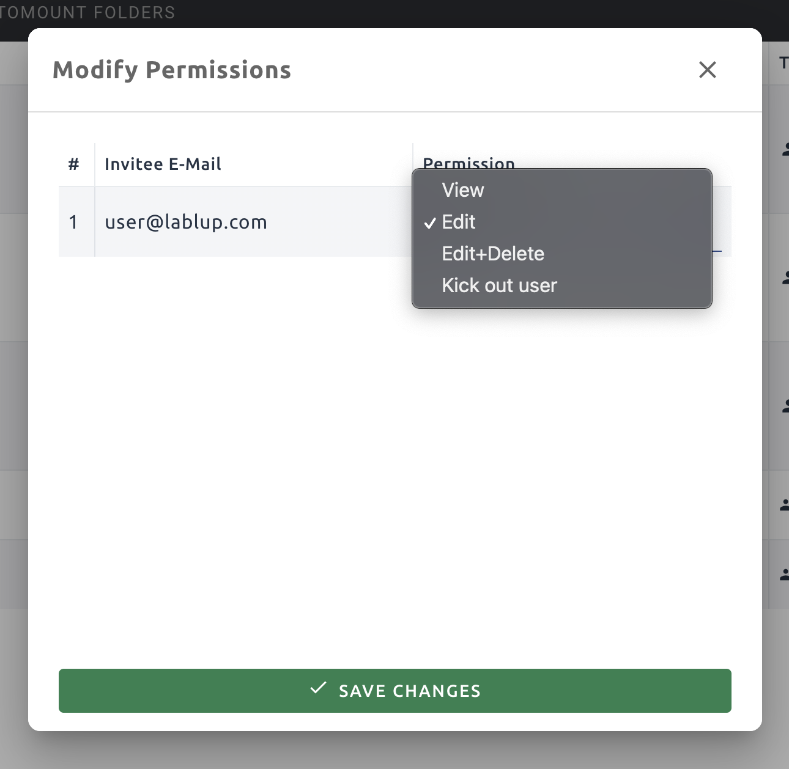

========================================================
Sharing Storage Folders and Access Control
========================================================

You may need to share the contents of storage folders with other users or project
members to collaborate. For this purpose, Backend.AI provides flexible folder
sharing feature.

Share storage folders with other users
-----------------------------------------------

Let's learn how to share your personal Storage folder with other users. First,
log in to User A's account and go to the Data page. There are several
folders, and we want to share a folder named ``tests`` to User B.

.. image:: list_of_vfolders_A.png

Inside the ``tests`` folder you can see files and directories like ``hello.txt``
and ``myfolder``.

.. image:: test_vfolder_explorer_A.png

Confirm that the ``tests`` folder is not listed when logging in with User B's
account.

.. image:: no_test_vfolder_in_B.png

.. warning::
   If a folder named ``tests`` already exists in User B's account, User A's
   ``tests`` folder cannot be shared with User B.

Back to User A's account,click the 'share' button in the Control column on the 
'tests' folder in the list.

In the 'Invite User' section of the modal, enter User B's email address and 
select the desired permission level. If you choose 'Read Only', User B will be 
able to only view the folder but not modify it. If you select 'Read & Write', 
User B will be able to both view and modify the folder.

.. image:: send_vfolder_invitation.png
   :width: 600
   :align: center

Switch back to User B's account and navigate to the Summary page. In the 
Invitation section of the Summary page, you will see the folder invitation. 
Click the 'Accept' button to accept the invitation.

.. image:: invitation_accept.png
   :width: 350
   :align: center

Go to the Data page and check that the ``tests`` folder is displayed in
the list. If you don't see it on the list, try refreshing your browser page.
Since you have accepted the invitation, you can now view the contents of User
A's ``tests`` folder in User B account. Unlike folders created by User B, 
shared folders appear without the check icon in the Owner column. You 
can also see the 'Read only' mark displayed in the Mount Permission column.

.. image:: test_vfolder_listed_in_B.png

Let's navigate inside the ``tests`` folder by clicking the folder icon in the
Control panel of ``tests``. You can check the ``hello.txt`` and ``myfolder``
that you checked in the User A's account again. 

Let's create a compute session
by mounting this storge folder with the User B's account.

.. image:: launch_session_with_test_mounted_B.png
   :width: 100%
   :align: center

.. note::
   From version 24.09, Backend.AI offers an improved version of the session launcher (NEO)
   as default. If you want to use the previous session launcher, please refer :ref:`User Settings<general-settings>` 
   section. For instructions on how to use it, please refer to the following `link <https://webui.docs.backend.ai/en/23.09_a/sessions_all/sessions_all.html>`_. 
   If you want to know more about the NEO session launcher, please refer :ref:`Create Session<create_session>`

After creating a session, open the web terminal and check that the ``tests``
folder is mounted in the home folder. The contents of the ``tests`` folder are
displayed, but attempts to create or delete files are not allowed. This is
because User A shared it as read-only. User B can create a file in the ``tests``
folder if it has been shared including write access.

.. image:: file_operations_on_shared_test_folder.png
   :width: 80%
   :align: center

This way, you can share your personal storage folders with other users based on
your Backend.AI email account.

.. note::
   Backend.AI also provides sharing project folder to project members.
   To See the detail, go to :ref:`sharing a project storage folder with project members <sharing-a-group-storage>`.

Adjust permission for shared folders
------------------------------------

You can modify the permissions of a shared user from the folder sharing modal. 
Click Select permission to set the sharing permission. You can also remove an invited users 
by clicking the 'x' button next to their permission. 

* View: The invited user has read-only access to the folder.
* Edit: The invited user has read and write access to the folder. The user
  cannot delete folders or files.

.. note::
   Renaming folder itself is available only for the owner, even if the user has granted
   Edit permission. Please note that Edit permission does not provide
   renaming folder.
