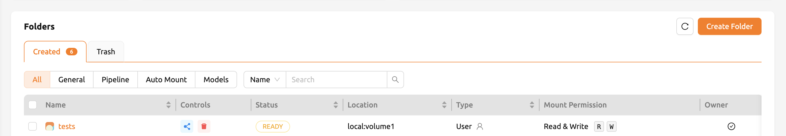
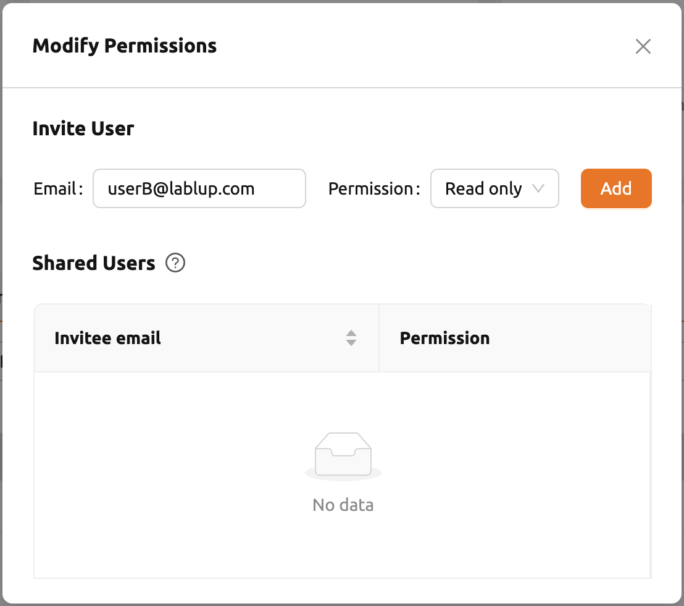
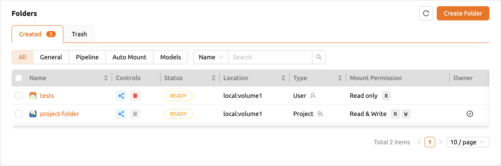
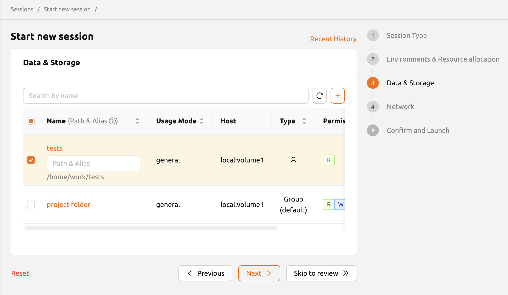
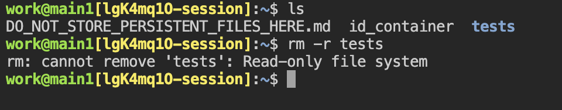
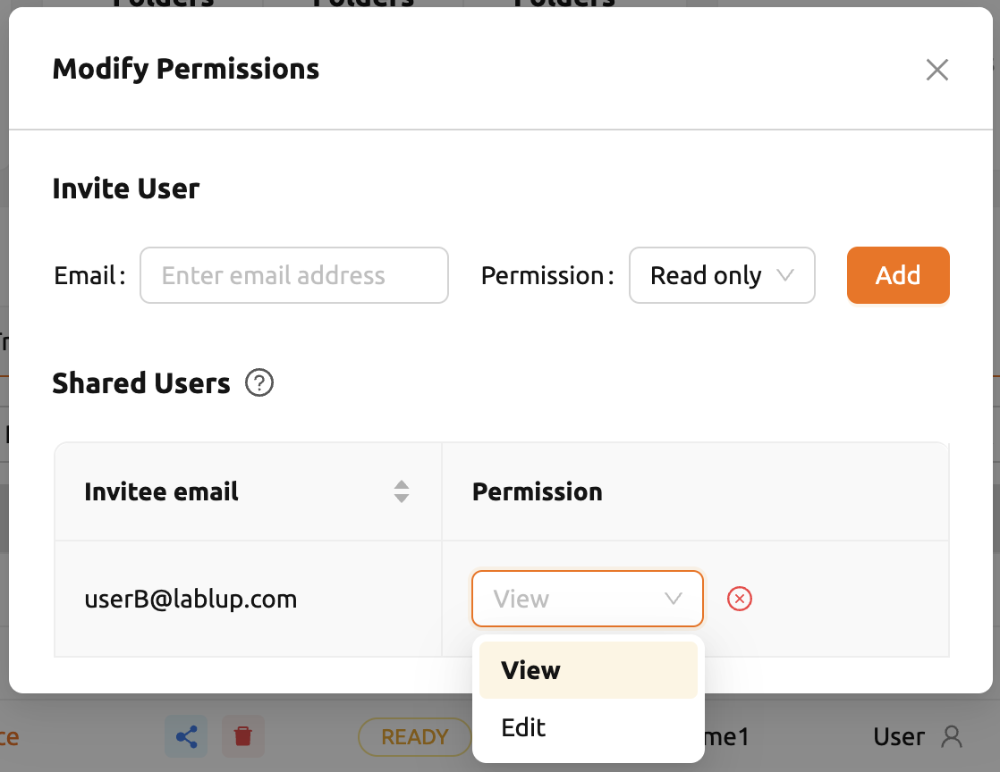

========================================================
Sharing Storage Folders and Access Control
========================================================

You may need to share the contents of storage folders with other users or project
members to collaborate. For this purpose, Backend.AI provides flexible folder
sharing feature.

Share storage folders with other users
-----------------------------------------------

Let's learn how to share your personal Storage folder with other users. First,
log in to User A's account and go to the Data & Storage page. There are several
folders, and we want to share a folder named ``tests`` to User B.

Inside the ``tests`` folder you can see files and directories like ``hello.txt``
and ``myfolder``.

.. image:: test_vfolder_explorer_A.png

Confirm that the ``tests`` folder is not listed when logging in with User B's
account.

.. warning::
   If a folder named ``tests`` already exists in User B's account, User A's
   ``tests`` folder cannot be shared with User B.

.. image:: no_test_vfolder_in_B.png

Back to User A's account and click the share icon (third icon) in the Control panel on the
right of the ``tests`` folder. Enter User B's email in the email input field and
click the SHARE button to send a sharing invitation. No actual email is sent,
and invitations are generated through the Backend.AI database. In the case of
Permissions, if you check View, it is shared as read-only, and if you check Edit
together, even writing is allowed to User B. If you want to share with
multiple users, you can also click the + button to enter additional emails.

Back to User B's account and go to the Summary page. At the bottom of the
page, you can see the invitation arrived. Click the ACCEPT button to accept the invitation.
If you don't see the invitation, go to another page once and then come back to the Summary
page again.

.. image:: invitation_accept.png

Go to the Data & Storage page and check that the ``tests`` folder is displayed in
the list. If you don't see it on the list, try refreshing your browser page.
Since you have accepted the invitation, you can now view the contents of User
A's ``tests`` folder in User B account. Compared to the other folders created by
User B, the ``tests`` folder has no management icon in the Control panel. You
can also see only the R (read-only) mark displayed in the Permission panel.

Let's navigate inside the ``tests`` folder by clicking the folder icon in the
Control panel of ``tests``. You can check the ``hello.txt`` and ``myfolder``
that you checked in the User A's account again. Let's create a compute session
by mounting this storge folder with the User B's account.

After creating a session, open the web terminal and check that the ``tests``
folder is mounted in the home folder. The contents of the ``tests`` folder are
displayed, but attempts to create or delete files are not allowed. This is
because User A shared it as read-only. User B can create a file in the ``tests``
folder if it has been shared including write access.

If you click the folder icon in the Control panel, you may notice that UPLOAD FILES button and
NEW FOLDER button disappears and READ-ONLY FOLDER message is shown on that
spot. Also modify icon and delete icon in the Action panel are also disabled since the
folder is read-only. User B can create a file in the ``tests`` folder if it has
been shared including write access.

.. image:: test_vfolder_explorer_B.png

This way, you can share your personal storage folders with other users based on
your Backend.AI email account.

.. note::
   Backend.AI also provides sharing project folder to project members.
   To See the detail, go to :ref:`sharing a project storage folder with project members <sharing-a-group-storage>`.

Adjust permission for shared folders
------------------------------------

If you click the fourth person icon in the Control panel, you can see a list of
users who have shared the folder. Click Select permission to set the sharing
permission.

* View: The invited user has read-only access to the folder.
* Edit: The invited user has read and write access to the folder. The user
  cannot delete folders or files.
* Edit+Delete: The invited user has full access to the folder and can delete
  files or folders.
* Kick out user: Retrieves the user's invitation. The user cannot view or
  use the folder any more.

.. note::
   Renaming folder itself is available only for the owner, even if the user has granted
   Edit or Edit+Delete permission. Please note that Edit permission does not provide
   renaming folder.
