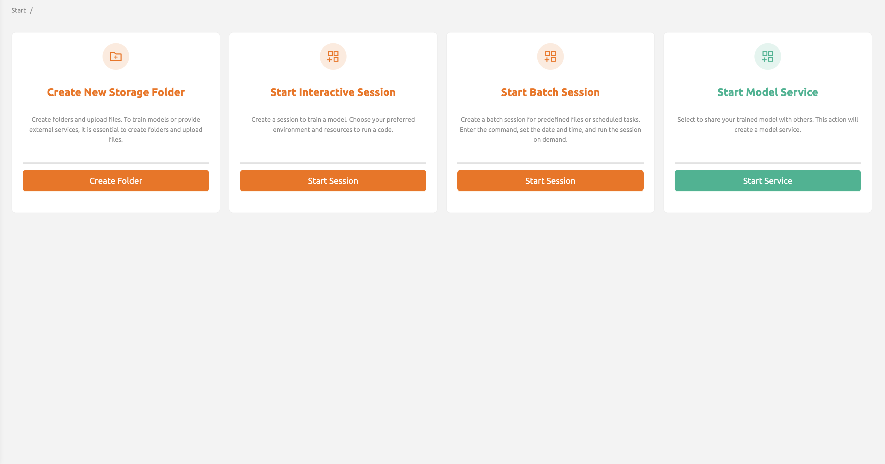

============
Start Page
============

The **Start** page provides quick access to the most frequently used features in the Backend.AI WebUI.
It serves as a convenient launchpad for common tasks, allowing you to get started without navigating through multiple menus.

Available Shortcuts
-------------------

The following shortcut cards are available on the Start page:

* **Create Storage Folder**: Quickly create a new storage folder for your data. For detailed instructions, refer to :ref:`Creating a Storage Folder <create_storage_folder>`.
* **Launch Session**: Start a new interactive or batch compute session with your preferred environment and resource settings. For more details, see :ref:`Starting a New Session <create_session>`.
* **Create Model Service**: Set up a new model serving endpoint for inference. For more information, refer to :ref:`Model Serving <model-serving>`.

You can rearrange the position of each card using the drag handle at the top-left corner of the card.

.. note::
   Depending on the server configuration, some features such as model service may not be available.
   If you need access to a feature that is not shown, please contact your system administrator.
