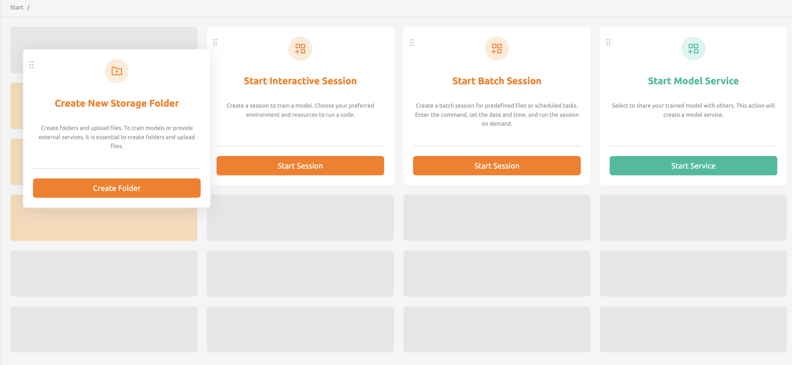

============
Start Page
============

On the Start page, users can quickly access frequently used WebUI features. 
Currently, shortcuts are available for :ref:`creating storage folders <create_storage_folder>`, :ref:`launching interactive or batch session <create_session>`, 
and :ref:`creating model service <model-serving>`. The position can be adjusted using the button at the top-left corner of each card.

.. note:: 
  Depending on the server configuration, the model service feature may not be available. If you want to use model service 
  feature, please contact your system administrator.