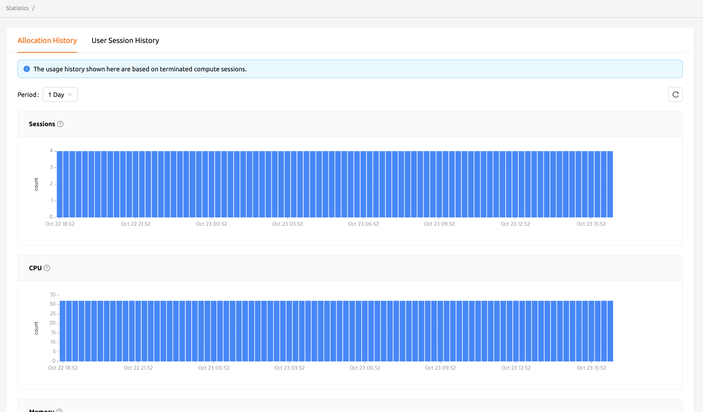

===============
Statistics Page
===============

On the Statistics page, you can check simple statistics related to the use of
compute sessions via a graph. You can check the statistics for a day or a week by selecting the usage period
from the select period menu on the upper left. Displayed items are as follows.

* Sessions: The number of compute sessions created.
* CPU: The number of CPU cores allocated to the compute sessions.
* Memory: The amount of memory allocated to the compute sessions.
* GPU: The number of GPU units allocated to the compute sessions.
  If the Fractional GPU feature is enabled, it may not match the physics GPU.
* IO-Read: The amount of data read from the storage.
* IO-Write: The amount of data written to the storage.

Note that the statistics shown here are based on terminated compute sessions.
Also, one week statistics may not be shown for the users whose account is created no
longer than a week.

More detailed statistics are shown in the admin-only Control-Panel.

