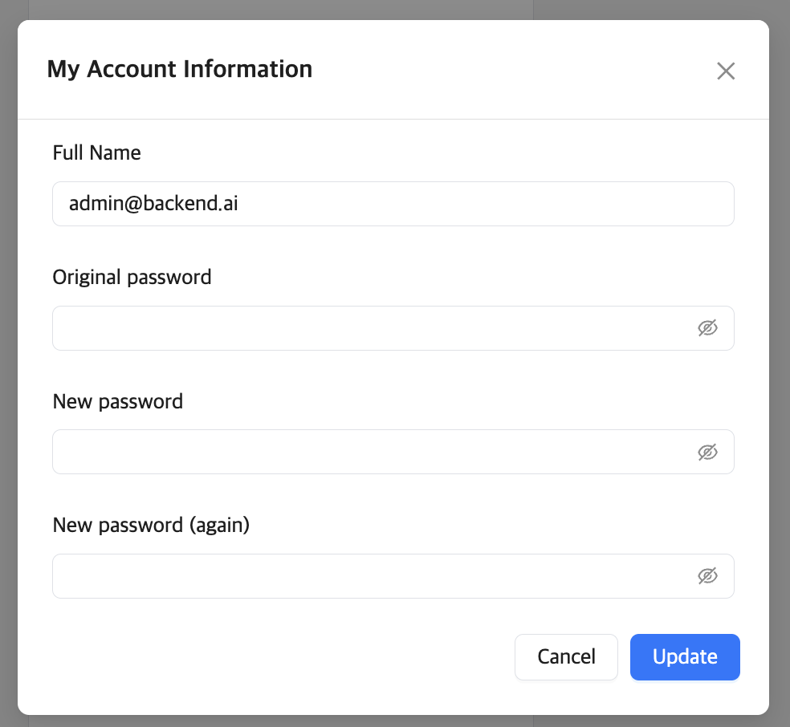
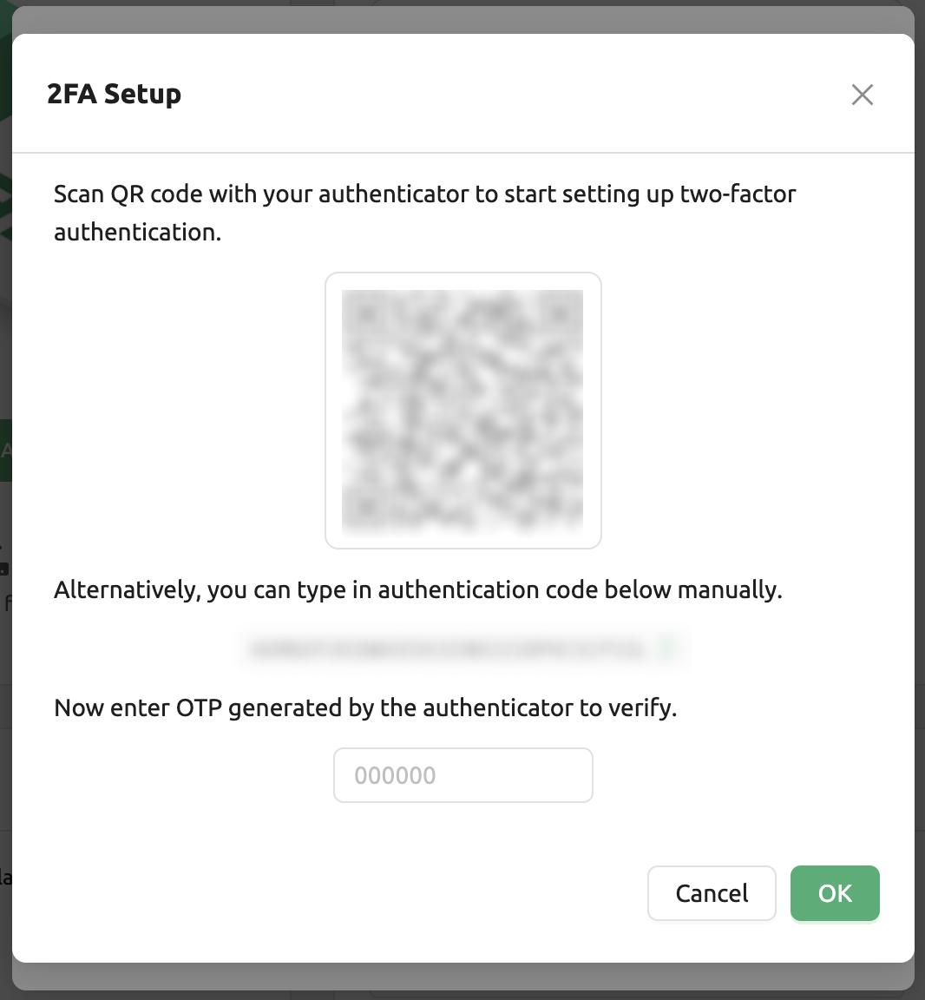
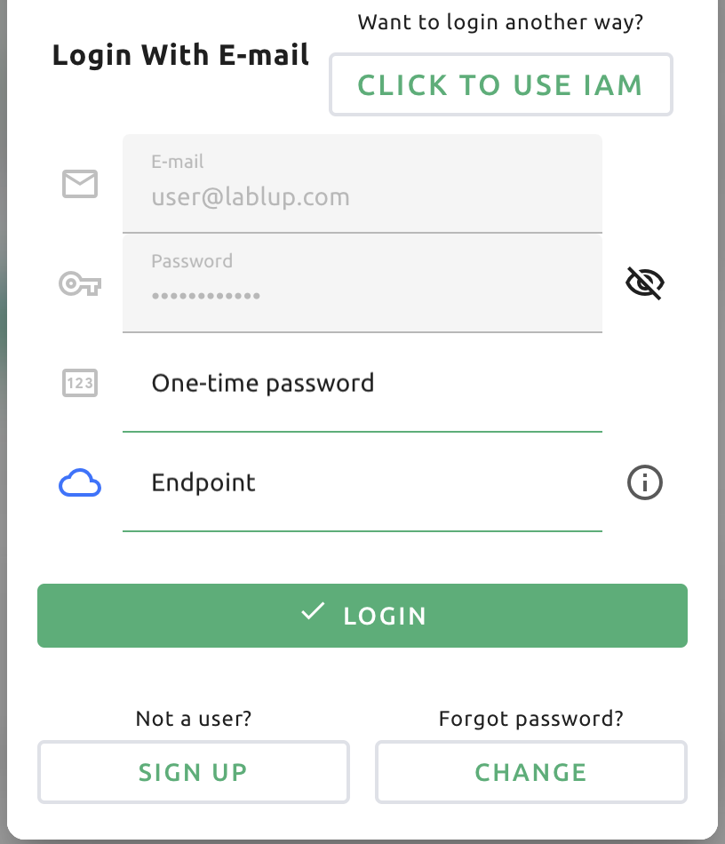
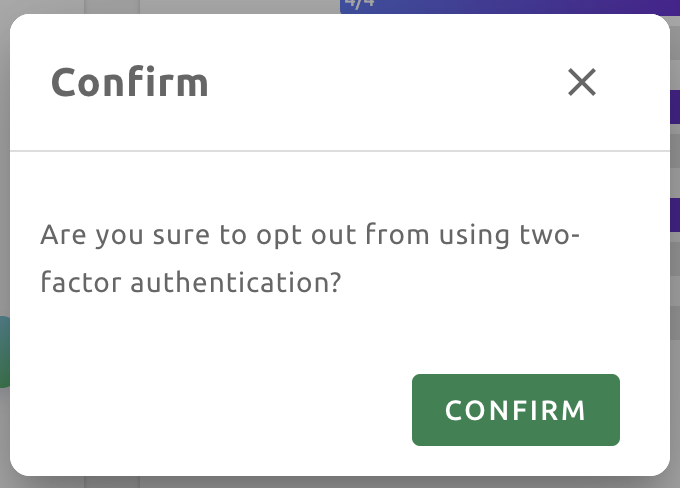

============
Summary Page
============

On the Summary page, users can check resource status and session usage, and
there are shortcut links to frequently used functions.

Topbar
------

.. image:: topbar_usermenu.png
    :width: 600
    :align: center
    :alt: Topbar usermenu

In the middle of the top bar is a drop-down menu to select the user's current
project. If a user belongs to multiple projects, the user can change it from
here. Each project may have different resource policies, therefore changing the project
also changes the available resource policies. If there are not many users, there
may be only one default project.

Click the person icon on the right side of the top bar to see the user menu.
Each menu item has the following functions.

* About Backend.AI: Displays information such as version of Backend.AI WebUI,
  license type, etc.
* My Account: Check/Update information of current login user
* Preferences: Go to user settings page
* Logs / Errors: Go to the log page. You can check the log and error history
  recorded on the client side.
* Log Out: Log out. Users can also logout by clicking the icon on the far right
  of the top bar.

If you click My Account, the following dialog appears.

Each item has the following meaning.

* Full Name: User's name (up to 64 characters)
* Original password: Original password. Click the right view icon to see the
  input contents.
* New password: New password (8 characters or more containing at least 1
  alphabet, number, and symbol). Click the right view icon to see the input
  contents. Ensure this is the same as the Original password.
* 2FA Enabled: 2FA activation. The user needs to enter the OTP code when logging in if it is checked.

.. note::
  Depending on the plugin settings, the ``2FA Enabled`` column might be invisible.
  In that case, please contact administrator of your system.

Enter the desired value and click the UPDATE button to update the user
information.

2FA Setup
^^^^^^^^^
If you activate the ``2FA Enabled`` switch, the following dialog appears.

Turn on the 2FA application you use and scan the QR code or manually enter the verification
code. There are many 2FA-enabled applications, such as Google Authenticator, 2STP, 1Password,
and Bitwarden.

Then enter the 6-digit code from the item added to your 2FA application into the dialog above.
2FA is activated when you press the CONFIRM button.

When you log in later, if you enter an email and password, an additional field appears asking
for the OTP code.

To log in, you must open the 2FA application and enter a 6-digit code in the One-time password field.

If you want to disable 2FA, turn off the ``2FA Enabled`` switch and click the confirm button in the
following dialog.

Summary panel
-------------

.. image:: dashboard.png
   :alt: Dashboard panels

Various convenience panels are located under the top bar.

Start Menu
^^^^^^^^^^

You can start a compute session by clicking on the START button. It is the same
as the feature on the Sessions page, and is a shortcut button that helps you
create a compute session immediately after logging in.

Below the START button are shortcut links to the Data & Storage (Upload files), Users, and
Maintenance pages. Among these, the links to the Users and to Maintenance pages are
only available for the admin account.

Resource Statistics
^^^^^^^^^^^^^^^^^^^

It shows the total amount of resources the user can allocate and the amount of
resources currently allocated. You can check the user's CPU, memory, and GPU
resource occupancy and quota respectively. Also on the Sessions slider, you can
see the maximum number of compute sessions you can create simultaneously and how many
compute sessions are currently running.

You can change the resource group by clicking the Resource Group field at the
top. Resource group is a concept to group multiple Agent nodes as a single
resource unit. If you have many agent nodes, you can configure settings such as
assigning them to a specific project for each resource group. When there is only
one agent node, it is normal to see only one resource group. If you change the
resource group, the amount of resources may change depending on the amount of
resources held by that resource group (agents belong to it).

System Resources
^^^^^^^^^^^^^^^^

It shows the number of Agent worker nodes connected to the Backend.AI system and
the total number of compute sessions currently created. You can also check the
CPU, memory, and GPU utilization of the agent node. If you are logged in as a
normal user, only the number of compute sessions you have created is displayed.

Announcement
^^^^^^^^^^^^

Announcements will be displayed here. Announcements can be made through a
separate admin UI (Control-Panel).

Invitation
^^^^^^^^^^

If another user has shared their storage folder to you, it will be displayed
here. If you accept the share request, you can view and access the shared folder
in the Data & Storage folder. The access rights are determined by the user who has sent the share request.
Of course, you can decline the sharing requests.

Download Backend.AI Web UI App
^^^^^^^^^^^^^^^^^^^^^^^^^^^^^^

Backend.AI WebUI supports desktop applications. 
By using desktop app, you can use desktop app specific features, such as :ref:`SSH/SFTP connection to a Compute Session<ssh-sftp-container>` .
For now Backend.AI WebUI provides desktop application with following OS:

* Windows
* Linux
* Mac

.. note::
   When you click the button that match with your local environment (e.g. OS, Architecture), It will automatically downloads the same version of current webUI version.
   If you want to download later or former version of WebUI as a desktop app, please visit `here <https://github.com/lablup/backend.ai-webui/releases?page=1>`_ and download the desired version(s).