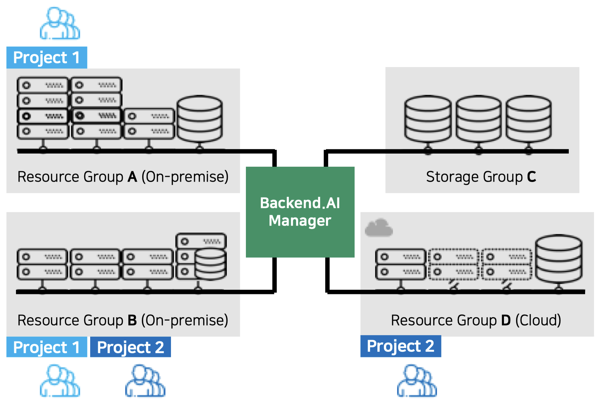
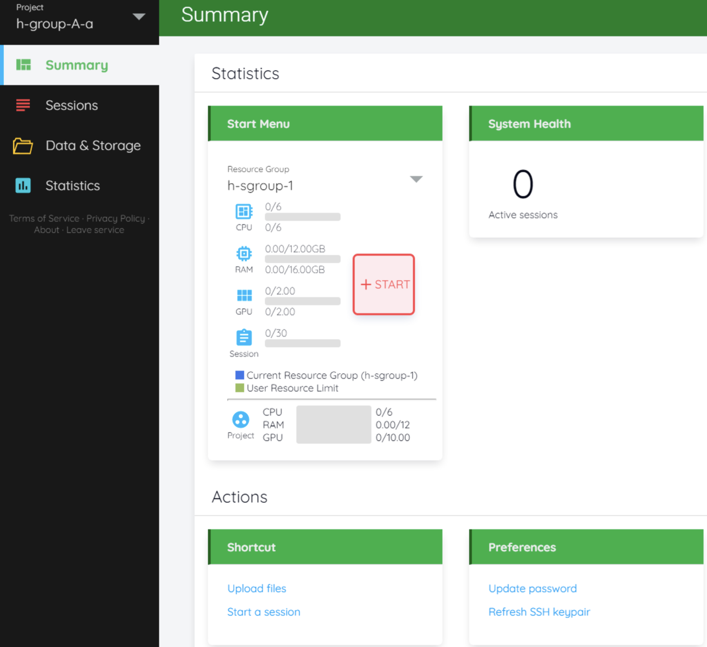
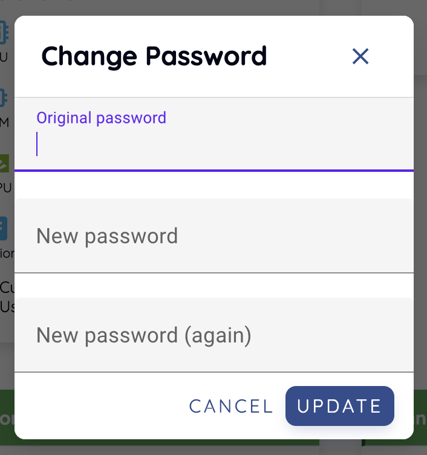

============
Summary Page
============

The Summary page allows you to view resource and session usage information.
There are also shortcut links to frequently used features.

Monitoring resource usage
-------------------------

In the Start menu, you can see the total amount of resources you can allocate
and how much you are currently using. You can check the CPU, RAM, GPU occupancy
status, the number of sessions currently running, etc. Also, you can click the +
START button to create a session immediately (see the Sessions page for how to
create a session).

A user can belong to one or more groups. If you want to change between the groups you are in, click the Project button on the top right corner to select the
group you want. When the group is changed, the total amount of available
resources is changed according to the resource usage policy set in the group,
and the amount of resources currently used is updated with the amount of
resources occupied by sessions running in the group. The groups to which the user
belongs is set up by the administrator. If you want to change the group, you
should contact the administrator in charge.

A user can be set up to use multiple resource groups by an administrator.
Resource groups are administrator functions that allow to set up worker
nodes that can be accessed by user, group, or domain. For example, if you group
multiple V100 GPU servers into one resource group, group multiple P100 GPU
servers into another resource group, and make specific users accessible only to
the P100 resource group, then the users can use only the resources on the P100 servers,
not on the V100 GPU servers. You can select a resource group to which
you have access by clicking Resource Group within the Start Menu. Each time a
resource group is changed, the amount of available resources is changed
accordingly. Resource group policies are set up by administrators. If you want
to use a particular resource, you should contact your administrator.

In the Project section at the bottom, you can see the total usage within your
group and your usage within that group.

The Resource Statistics panel shows the total number of sessions currently
running by the user. Other session-related information will be displayed
depending on the user's permission.

Change password
---------------

You can change the password by clicking the Change Password menu of the settings
button in the upper right corner. Enter the current password in the Original
password field and the new password in the New password and New password (again)
fields, then press the UPDATE button. At this time, the
password should follow the rules below:

- 8 letters or more
- One or more alphabets
- One or more special characters
- One or more numbers

