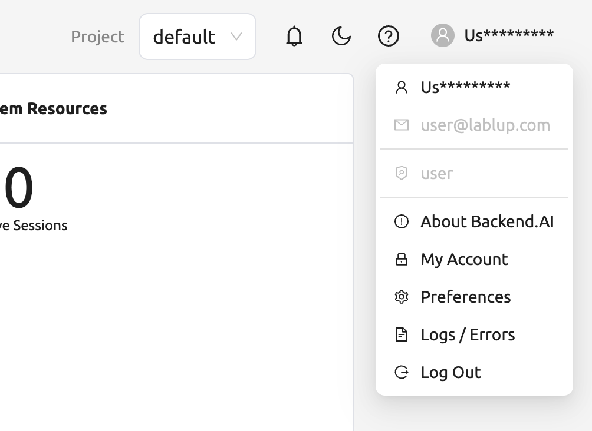
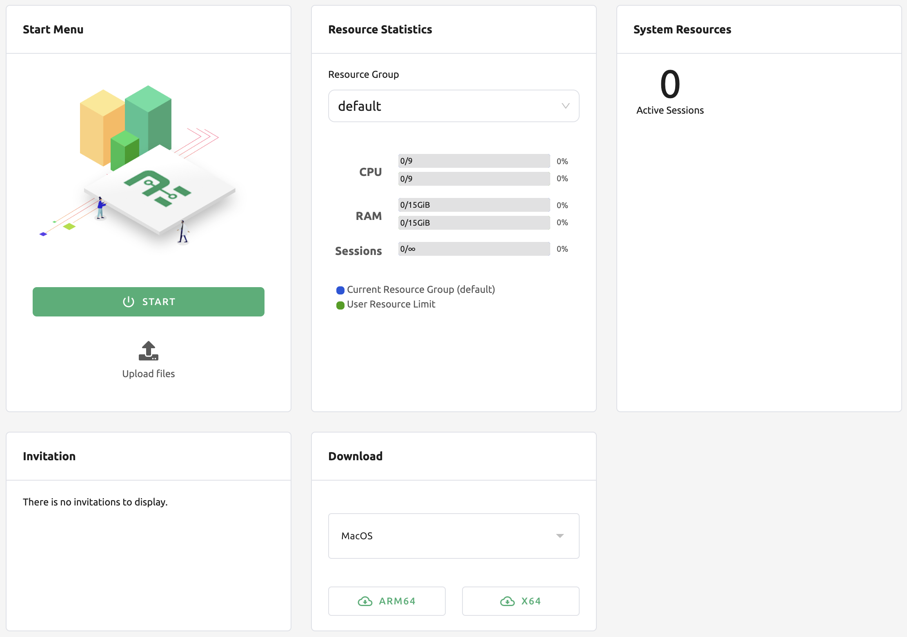

============
Summary Page
============

On the Summary page, users can check resource status and session usage, and
there are shortcut links to frequently used functions.

Topbar
------

In the middle of the top bar is a drop-down menu to select the user's current
project (group). If a user belongs to multiple projects, you can change it from
here. Each project can have different resource policies, so changing the project
also changes the available resource policies. If there are not many users, there
can be only one default project.

Click the person icon on the right side of the top bar to see the user menu.
Each menu item has the following functions.

* About Backend.AI: Displays information such as version of Backend.AI Console,
  license type, etc.
* Change User Info: Change user name and password
* Preferences: Go to user settings page
* Logs / Erros: Go to the log page. You can check the log and error history
  recorded on the client side.
* Logout: Log out. Users can also logout by clicking the icon on the far right
  of the top bar.

Summary panel
-------------

Various convenience panels are located under the top bar.

Start Menu
^^^^^^^^^^

You can start a compute session by clicking on the START button. It is the same
as the feature on the Sessions page, and is a shortcut button that helps you
create a compute session immediately after logging in for the first time.

Below the START button are shortcut links to the Data & Storage, Users, and
Maintenance pages. Among these, the link to the Users and Maintenance page is
only visible when logged in with an admin account.

Resource Statistics
^^^^^^^^^^^^^^^^^^^

It shows the total amount of resources the user can allocate and the amount of
resources currently allocated. You can check the user's CPU, memory, and GPU
resource occupancy and quota respectively. Also, on the Sessions slider, you can
see how many compute sessions the user can create simultaneously and how many
compute sessions are currently running.

You can change the resource group by clicking the Resource Group field at the
top. Resource group is a concept that can group multiple Agent nodes as a single
resource unit. If you have many agent nodes, you can configure settings such as
assigning them to a specific project for each resource group. When there is only
one agent node, it is normal to see only one resource group. If you change the
resource group, the amount of resources may change depending on the amount of
resources held by that resource group (agents belong to it).

System Resources
^^^^^^^^^^^^^^^^

It shows the number of Agent worker nodes connected to the Backend.AI system and
the total number of compute sessions currently created. You can also check the
CPU, memory, and GPU utilization of the agent node. If you are logged in as a
normal user, only the number of compute sessions you have created is displayed.

Announcement
^^^^^^^^^^^^

Announcements will be displayed here. Announcements can be made through a
separate admin console.

Invitation
^^^^^^^^^^

If another user has shared their storage folder to you, it will be displayed
here. If you accept the share request, you can view and access the shared folder
in the Data & Storage folder. The access rights are determined by the shared
user. Of course, you can also decline the sharing requests.

