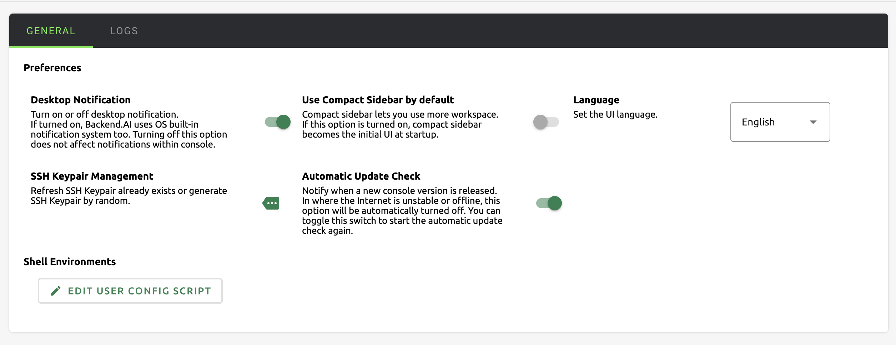
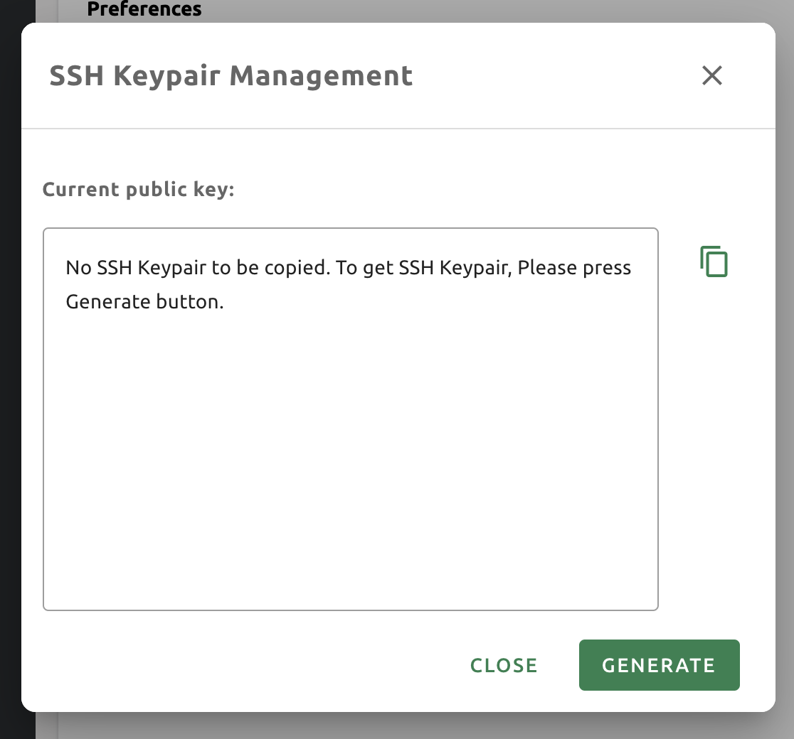
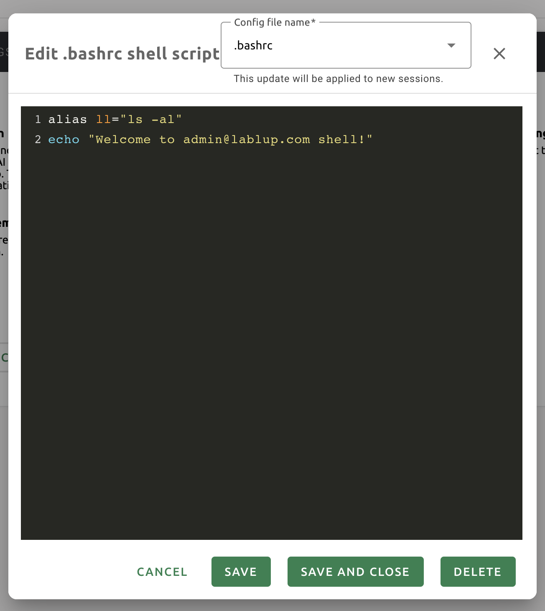

=================
User Setting Page
=================

The user settings page can be accessed by clicking the gear icon at the bottom
of the left sidebar or by selecting the Preferences menu that appears after
clicking the person icon at the top right. This section briefly describes each
item and menu on the user setting page.

GENERAL tab
-----------

Desktop Notification
^^^^^^^^^^^^^^^^^^^^

Enables or disables the desktop notification feature. If the browser and
operating system support it, various  messages that appear in the GUI console
will also appear in the desktop notification panel. If disabled from the
operating system during the first run, the desktop message may not be displayed
even if the option is turned on here. Regardless of the value of this option,
the notification inside the GUI console still works.

Use Compact Sidebar by default
^^^^^^^^^^^^^^^^^^^^^^^^^^^^^^

When this option is on, the left sidebar will appear compact (narrower width).
However, applying the option does not immediately show the effect, and it is
applied when the browser is refreshed. If you want to immediately change the
type of the sidebar without refreshing the page, click the leftmost icon at the
top of the sidebar.

Language
^^^^^^^^

Set the language displayed on the UI. Currently, English and Korean are
supported. However, there may be UI items that do not update their language
before the page is refreshed.

* OS Default: Use the operating system default language.
* English: Set English as the default language.
* Korean: Set Korean as the default language.

SSH Keypair Management
^^^^^^^^^^^^^^^^^^^^^^

This is a feature that retrieves and creates the SSH keypair required when
connecting directly to the compute session via SSH. If you click the button on
the right, the following dialog appears. Click the copy button on the right to
copy the existing SSH public key. There will be provided public key when you 
signed in Backend.AI. You can update SSH keypair by clicking generate button
on the right bottom of the dialog. SSH public/private keys are randomly
generated and stored as user information. Please note that the secret key cannot
be checked again unless it is saved manually immediately after creation.

SSH connection can only be used with the Backend.AI GUI desktop app, and it is
not supported on a web browser because it is difficult to access the local file
system from a web browser.

Automatic Update Check
^^^^^^^^^^^^^^^^^^^^^^

A notification window pops up when a new version of the GUI console is detected.
It works only in an environment where Internet access is available.

Auto logout
^^^^^^^^^^^

Log out automatically if all logined pages are closed except session originated
pages for apps (e.g. jupyter notebook, web terminal, etc.).

EDIT USER CONFIG SCRIPT
^^^^^^^^^^^^^^^^^^^^^^^

You can write scripts to mount and run automatically when creating a compute
session. Currently, three files can be edited by the user: ``.bashrc``,
``.zshrc``, and ``.Renviron``. This script is saved for each user and can be
used when certain automation tasks are required at the start of a compute
session. For example, you can modify the ``.bashrc`` script to register desired
alias or specify that certain files are always downloaded to a specific
location.

Use the drop-down menu at the top to select the type of script you want to write
and then write the content. When writing is complete, you can save the script by
clicking the SAVE or SAVE AND CLOSE button. Click the DELETE button to delete
the script.

LOGS tab
--------

Displays detailed information of various logs recorded on the client side. You
can visit this page to find out more about your request when an error occurs.
You can refresh or delete the logs by using the button at the top right.

.. image:: user_log.png

.. note::
   If you only have one page logged in, clicking the REFRESH button may not seem
   to work properly. Logs pages are collection of requests to the server and
   responses from the server, and if current page is log page, then it will
   not sending any requests to the server except refreshing the page explicitly.
   To check logs are being stacked properly, please open another page and click
   REFRESH button.
