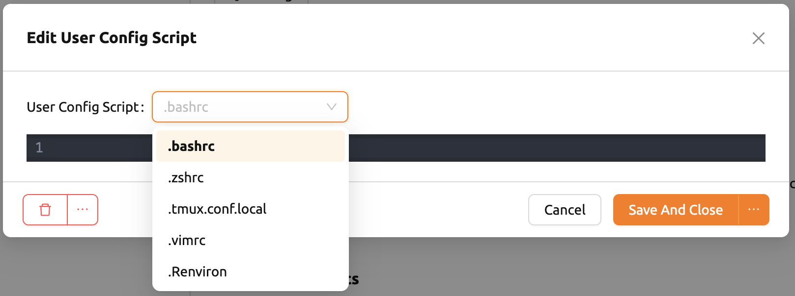

====================
User Settings
====================

The user settings page is accessed by clicking the gear icon at the bottom
of the left sidebar or by selecting the Preferences menu that appears after
clicking the person icon at the top right. Users can change the preferred Console Environment 
from the language setting, SSH keypair management, editing user config script, and even to using
Beta Features.

Language Setting
----------------

Click Language Dropdown to check supported languages.

.. note::
   Currently, only Korean and English are supported.

Change SSH Keypair
------------------

If you are using the GUI console app, you can create SSH/SFTP connection
directly to the container. You can query or create a SSH keypair, which is used
for SSH/SFTP connection. Clicking the button next to the SSH keypair Management
in Preferences panel brings up a dialog. Current public key is displayed, if
exists, and new public key and private key can be created by clicking GENERATE
button. This will generate a new SSH keypair and save it into the database.

.. note::
   The web-based console does not yet support SSH/SFTP connections.

.. note::
   Backend.AI uses SSH keypair based on OpenSSH. On Windows, you may convert
   this into PPK key.

Edit Shell Environment
----------------------

Existing shell scripts can be applied to new sessions.
You can copy the shell script and save it to your favorite shell script run command.
Shell editing feature also supports setting ``.Renviron`` file used in the R language.

.. note::
   Only ``.zshrc``, ``.bashrc`` and ``.Renviron`` are editable for now.
