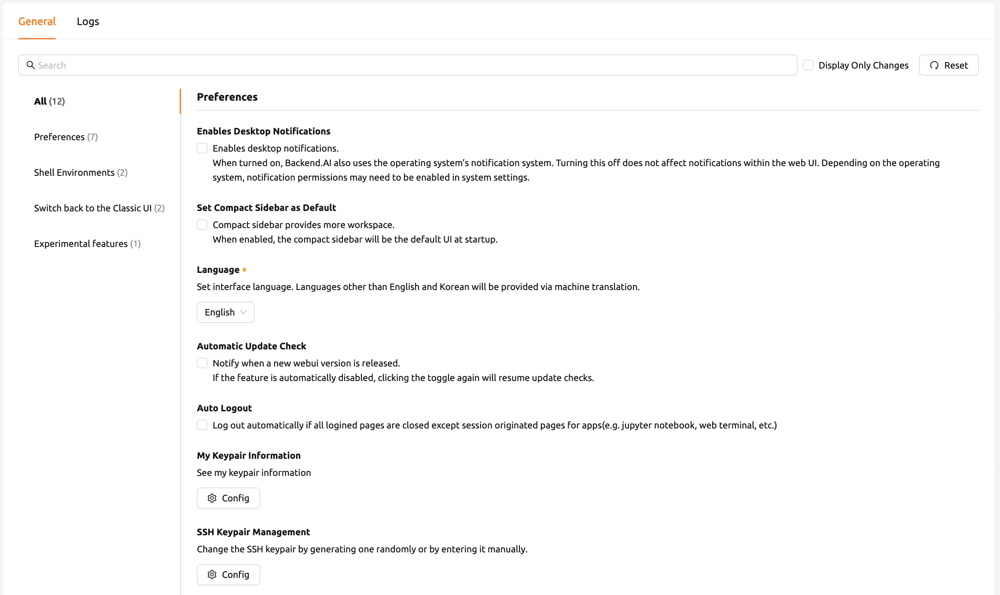
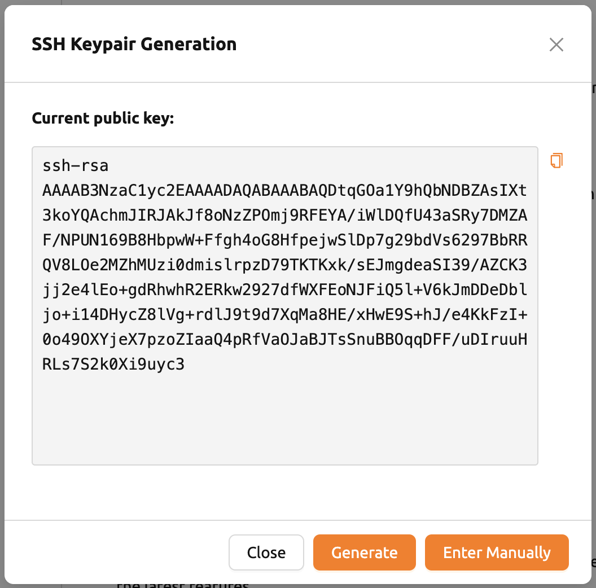
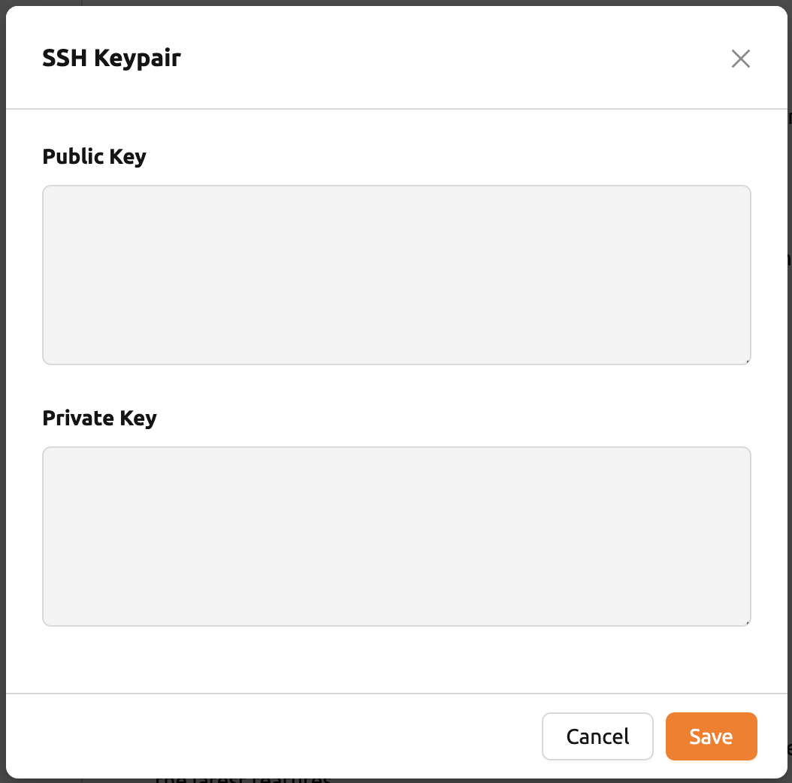
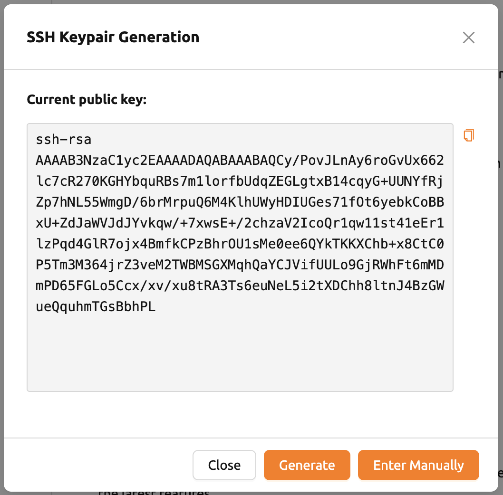
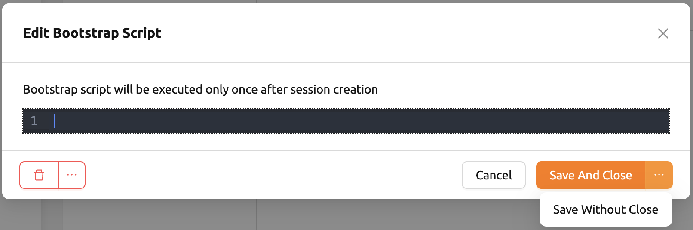
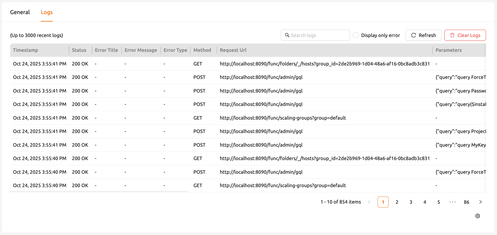

=============
User Settings
=============

The user settings page is accessed by clicking the gear icon at the bottom of
the left sidebar or by selecting the Preferences menu that appears after
clicking the person icon at the top right. Users can change the preferred
Environment from the language setting, SSH keypair management, editing user
config script, and even to using Beta features.

GENERAL tab
-----------

Desktop Notification
^^^^^^^^^^^^^^^^^^^^

Enables or disables the desktop notification feature. If the browser and
operating system support it, various  messages that appear in the Web-UI
will also appear in the desktop notification panel. If disabled from the
operating system during the first run, the desktop message may not be displayed
even if the option is turned on here. Regardless of the value of this option,
the notification inside the Web-UI still works.

Use Compact Sidebar by default
^^^^^^^^^^^^^^^^^^^^^^^^^^^^^^

When this option is on, the left sidebar will be shown in a compact form
(narrower width).  Change of the option is applied when the browser is
refreshed. If you want to immediately change the type of the sidebar without
refreshing the page, click the leftmost icon at the top of the sidebar.

Language
^^^^^^^^

Set the language displayed on the UI. Currently, Backend.AI supports more than
five languages including English and Korean. However, there may be some UI items
that do not update their language
before the page is refreshed.

* OS Default: Use the operating system's default language.
* English: Set English as the default language.
* Korean: Set Korean as the default language.
* Russian: Set Russian as the default language.
* French: Set French as the default language.
* Mongolian: Set Mongolian as the default language.
* Indonesian: Set Indonesian as the default language.

.. note::
   Some of translated items may be marked as ``__NOT_TRANSLATED__``, which
   indicates the item is not yet translated for that language. Since Backend.AI
   WebUI is open sourced, anyone who willing to make the translation better
   can contribute: https://github.com/lablup/backend.ai-webui.

.. _user-ssh-keypair-management:

SSH Keypair Management
^^^^^^^^^^^^^^^^^^^^^^

When using the Web-UI app, you can create SSH/SFTP connection directly to the
compute session. Once you signed up for Backend.AI, a public keypair is
provided. If you click the button on the right to the SSH Keypair Management
section, the following dialog appears. Click the copy button on the right to
copy the existing SSH public key. You can update SSH keypair by clicking
GENERATE button at the bottom of the dialog. SSH public/private keys are
randomly generated and stored as user information. Please note that the secret
key cannot be checked again unless it is saved manually immediately after
creation.

.. note::
   SSH/SFTP connection is available only with the Backend.AI GUI desktop app and is not supported on a web browser.

.. note::
   Backend.AI uses SSH keypair based on OpenSSH. On Windows, you may convert
   this into PPK key.

From 22.09, Backend.AI WebUI supports adding your own ssh keypair in order to provide
flexibility such as accessing to a private repository. In order to add your own ssh keypair, click ``ENTER MANUALLY`` button. Then, you will see
two text area which corresponds to "public" and "private" key.

please enter the keys inside, and click ``SAVE`` button. Now you can access to backend.ai session using your own key.

Automatic Update Check
^^^^^^^^^^^^^^^^^^^^^^

A notification window pops up when a new version of the Web-UI is detected.
It works only in an environment where Internet access is available.

Auto logout
^^^^^^^^^^^

Log out automatically when all Backend.AI Web-UI pages are closed except for
pages created to run apps in session (e.g. jupyter notebook, web terminal,
etc.).

EDIT USER CONFIG SCRIPT
^^^^^^^^^^^^^^^^^^^^^^^

You can write some config scripts to replace the default ones in a compute
session. Files like ``.bashrc``, ``.tmux.conf.local``, ``.vimrc``, etc. can be
customized. The scripts are saved for each user and can be used when certain
automation tasks are required. For example, you can modify the ``.bashrc``
script to register your command aliases or specify that certain files are always
downloaded to a specific location.

Use the drop-down menu at the top to select the type of script you want to write
and then write the content. You can save the script by
clicking the SAVE or SAVE AND CLOSE button. Click the DELETE button to delete
the script.

.. image:: edit_user_config_script.png
   :width: 500
   :align: center

EDIT BOOTSTRAP SCRIPT
^^^^^^^^^^^^^^^^^^^^^^^

If you want to execute a one-time script just after your compute sessions
started, write down the contents here.

.. warning::
   The compute session will be at the ``PREPARING`` status until the bootstrap
   script finishes its execution. Since a user cannot use the session until it
   is ``RUNNING``, if the script contains a long-running tasks, it might be
   better to remove them out of the bootstrap script and run them in a terminal
   app.

LOGS tab
--------

Displays detailed information of various logs recorded on the client side. You
can visit this page to find out more about the errors occurred.
You can refresh or delete the logs by using the trash button at the top right.

.. note::
   If you only have one page logged in, clicking the REFRESH button may not seem
   to work properly. Logs pages are collection of requests to the server and
   responses from the server. If current page is the log page, then it will
   not send any requests to the server except refreshing the page explicitly.
   To check logs are being stacked properly, please open another page and click
   REFRESH button.

