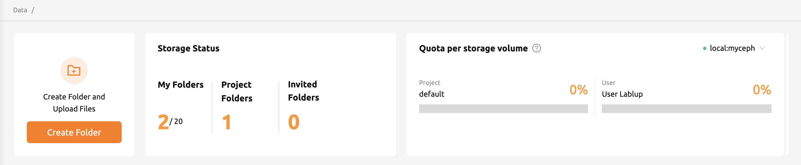
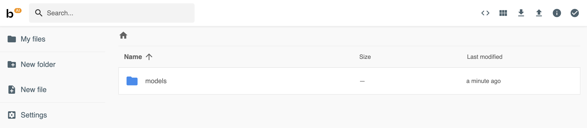
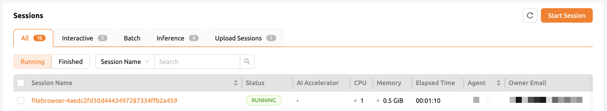
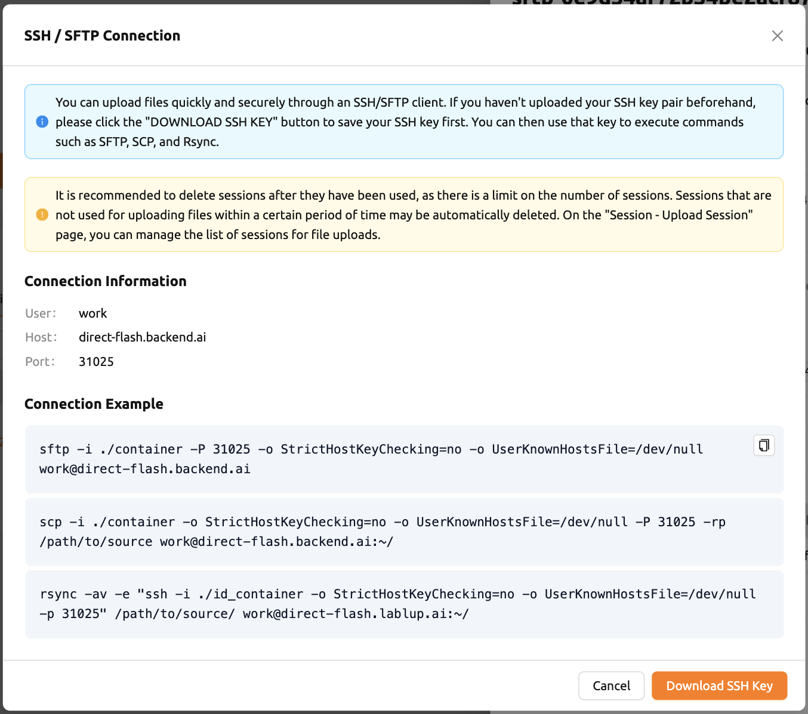

===============================
Handling Data & Storage Folders
===============================

Backend.AI supports dedicated storage to preserve user's files. Since the files
and directories of a compute session are deleted upon session termination, it is
recommended to save them in a storage folder. List of storage folders can be
found by selecting the Data & Storage page on the sidebar. You can see the information
such as the folder name and ID, the NFS host name where the folder is located
(Location), and folder access rights (Permission).

.. image:: vfolder_list.png
   :alt: Folder list in Storage page

There are two types of storage folders. User folders can be created by
normal users, and you can see that there is one user icon in the Type panel.
On the other hand, Project folders can be recognized by an icon with multiple
users in the panel. Project folders are created by domain admins, and normal
users can only see project folders created for the project in which the users
belong.

Storage Status on top of the folder list shows the following information:

* Created: The number of folders that the user created.
* Invited: The number of folders that the user was invited to share.
* Capacity: The maximum number of folders that the user can create afterwards.
  This value depends on the resource policy applied to the user and cannot be
  changed without changing the resource policy. Folders that were not created by
  the user (eg. folders invited to share, or project folders) are not counted.

Check marks on the Owner panel in the folder list indicate the user created folders.

.. tip::
   If there are lots of folders in the list, you can filter the list by using the
   search boxes on top of the list.

.. _create_storage_folder:

Create storage folder
---------------------

You can create a storage folder with the desired name by clicking the NEW FOLDER
button. Enter the name of the folder to be created in Folder name, and select
one of User / Project for Type. (Depending on the server settings, only one of
User or Project may be selectable.) When creating a project folder, the Project field
must be set. The project folder will be bound to the project specified in the Project
field, and only users belonging to the project can mount and use the project folder.
After setting the values as desired, you can create a folder by clicking the
CREATE button.

.. image:: vfolder_create_dialog.png
   :width: 400
   :align: center
   :alt: Folder creation dialog

The meaning of each fields that can be selected in the creation dialog is as
follows.

* Folder name: The name of the folder. You can enter up to 64 characters.
* Host: NFS host to create folder. You can choose one if you have multiple NFS
  hosts.
* Type: Determines the type of folder to be created. It can be set as User or
  Project. The User folder is a folder that users can create and use alone
  and the Project folder is a folder created by admin and shared by users in the project.
* Usage Mode: You can set the purpose of the folder. There are three types of mode:
  General, Data, and Model. It is classified for the development of exclusive functions
  for Data & Model Stores in the future and currently there is no
  difference in UI depending on the purpose.
* Project: Designates the project to which the folder belongs when creating a new project folder.
  Project folders must belong to a project. However, it does not play any
  role when creating a user folder.
* Permission: Set permission of a project folder for project members. If this is
  set to "Read-Only", project members cannot write to this folder inside their
  compute session.

Explore folder
--------------

You can click the folder icon in the Control panel to bring up a file explorer
where you can view the contents of that folder.

.. image:: vfolder_item_with_controls.png
   :alt: Controls in folder item

You can see that directories and files inside the folder will be listed, if
exists. Click a directory name in the Name panel to move to the directory.  You
can click the download button or delete button in the Actions panel to download
it or delete it entirely from the directory. You can rename a file/directory as
well. For more detailed file operations, you can mount this folder when creating
a compute session, and then use a service like Terminal or Jupyter Notebook to
do it.

.. image:: folderexplorer_with_filebrowser.png
   :alt: File explorer of a storage folder

You can create a new directory on the current path with the NEW FOLDER button
(in the file explorer), or upload a local file with the UPLOAD FILES button. All
of these file operations can also be performed using the above-described method
of mounting folders into a compute session.

The maximum length of file or directory inside a folder may depends on the host
file system. But, it usually cannot exceed 255 characters.

To close file explorer, click the X button in the upper right.

Rename folder
-------------

If you have permission to rename the storage folder, you can rename it by
clicking the edit icon in the Control panel. When you click the icon button, a
rename dialog will appear. Write new folder name and then click UPDATE button.

.. image:: vfolder_rename_dialog.png
   :width: 400
   :align: center
   :alt: Folder rename dialog

Delete folder
-------------

If you have permission to delete the storage folder, you can delete it by
clicking the trash can icon in the Control panel. When you click the Delete
button, a confirm dialog appears. To prevent accidental deletion, you have to
enter the name of the folder to be deleted, explicitly.

.. note::
   When delete operation starts, It may take some time in order to delete the
   target folder completely from storage host. Meanwhile, in order to block
   unintended operation such as accessing any file/directory inside the folder
   on-delete status, we disable any accessing operations.

   .. image:: vfolder_deleting.png
      :width: 100%
      :align: center

.. image:: vfolder_delete_dialog.png
   :width: 400
   :align: center
   :alt: Folder deletion dialog

The folders created here can be mounted when creating a compute session. Folders
are mounted under the user's default working directory, ``/home/work/``, and the
files stored in the mounted directory will not be deleted when the compute session
is terminated. (However, if you delete the folder itself, it will be gone).

.. _automount-folder:

Automount folder
----------------

Data & Storage page has an Automount Folders tab. Click this tab to see a
list of folders whose names prefixed with a dot (.). When you create a folder,
if you specify a name that starts with a dot (.), it is added to the Automount
Folders tab, not the Folders tab. Automount Folders are special folders that are
automatically mounted in your home directory even if you do not mount them
manually when creating a compute session. By using this feature, creating and
using Storage folders such as ``.local``, ``.linuxbrew``, ``.pyenv``, etc.,
you can configure a certain user packages or environments that do not change
with different kinds of compute session.

For more detailed information on the usage of Automount folders, refer to
:ref:`examples of using automount folders<using-automount-folder>`.

.. image:: vfolder_automount_folders.png
   :alt: Automount folders

Using FileBrowser
-----------------

Backend.AI supports `FileBrowser <https://filebrowser.org>`_ from version
20.09. FileBrowser is a program that helps you manage files on a remote server
through a web browser. This is especially useful when uploading a directory from
the user's local machine.

Currently, Backend.AI provides a FileBrowser as an application of a compute
session. Therefore, the following conditions are required to launch it.

* User can create at least one compute session
* User can allocated at least 1 core of CPU and 512 MB of memory
* Image that supports FileBrowser has been installed

You can access FileBrowser in two ways.

* Execute FileBrowser from file explorere dialog of a data folder in Data &
  Stroage page
* Launch a compute session directly from a FileBrowser image on Sessions page

Execute FileBrowser from folder explorer dialog in Data & Storage page
^^^^^^^^^^^^^^^^^^^^^^^^^^^^^^^^^^^^^^^^^^^^^^^^^^^^^^^^^^^^^^^^^^^^^^

Go to the Data & Storage page and open the file explorer dialog of target
data folder. Click the folder icon or the folder name to open the file explorer.

.. image:: first_step_to_access_filebrowser.png
   :alt: first step to access FileBrowser

Click EXECUTE FILEBROWSER button in the upper-right corner of the explorer.

.. image:: folderexplorer_with_filebrowser.png
   :alt: Folder explorer with FileBrowser

You can see the FileBrowser is opened in a new window. You can also see that the
data folder you opened the explorer dialog becomes the root directory. From the
FileBrowser window, you can freely upload, modify, and delete any directories
and files.

When user clicks EXECUTE FILEBROWSER, Backend.AI automatically creates a
dedicated compute session for the app. So, in the Sessions page, you should see
FileBrowser compute session. It is user's reponsibility to delete this compute
session.

.. note::
   If you accidentally close the FileBrowser window and want to reopen it, just
   go to Sessions page and click the FileBrowser application icon of the
   FileBrowser compute session.

   .. image:: app_dialog_with_filebrowser.png
      :width: 400
      :align: center

   |
   | When you click EXECUTE FILEBROWSER button again in the data folder
       explorer, a new compute session will be created and a total of two
       FileBrowser sessions
       will appear.

Create a compute session with FileBrowser image
^^^^^^^^^^^^^^^^^^^^^^^^^^^^^^^^^^^^^^^^^^^^^^^

You can directly create a compute session with FileBrowser supported images.
You need to mount at least one or more data folders to access them. You can use
FileBrowser without a problem even if you do not mount any data folder, but
every uploaded/updated files will be lost after the session is terminated.

.. note::
   The root directory of FileBrowser will be ``/home/work``. Therefore, you
   can access any mounted data folders for the compute session.

Basic usage examples of FileBrowser
^^^^^^^^^^^^^^^^^^^^^^^^^^^^^^^^^^^

Here, we present some basic usage examples of FileBrowser in Backend.AI. Most
of the FileBrowser operations are intuitive, but if you need more detailed
guide, please refer to the
`FileBrowser documentation <https://filebrowser.org>`_.

**Upload local directory using FileBrowser**

FileBrowser supports uploading one or more local directories while maintaining
the tree structure. Click the upload button in the upper right corner of the
window, and click Folder button. Then, local file explorer dialog will appear
and you can select any directory you want to upload.

.. note::
   If you try to upload a file to a read-only folder, FileBrowser will raise a
   server error.

Let's upload a directory with the following structure.

.. code-block:: shell

   foo
   +-- test
   |    +-- test2.txt
   +-- test.txt

After selecting ``foo`` directory, you can see the directory just uploaded
successfully.

You can also upload local files and directories by drag and drop.

**Move files or directories to another directory**

Moving files or directories in data folder is also possible from FileBrowser.
You can move files or directories by following steps below.

1. Select directories or files from FileBrowser.

2. Click the arrow icon in the upper right corner of FileBrowser

3. Select the destination

4. Click MOVE button

You will see that moving operation is successfully finished.

.. note::
   FileBrowser is provided via application inside a compute session currently.
   We are planning to update FileBrowser so that it can run independently
   without creating a session.

Using SFTP Server
-----------------

From 22.09, Backend.AI supports SSH / SFTP file upload from both desktop app and
web-based Web-UI. The SFTP server allows you to upload files quickly through reliable
data streams.

.. note::
   Depending on the system settings, running SFTP server from the file dialog may not
   be allowed.

Execute SFTP server from folder explorer dialog in Data & Storage page
^^^^^^^^^^^^^^^^^^^^^^^^^^^^^^^^^^^^^^^^^^^^^^^^^^^^^^^^^^^^^^^^^^^^^^

Go to the Data & Storage page and open the file explorer dialog of target data folder.
Click the folder icon or the folder name to open the file explorer.

Click RUN SFTP SERVER button in the upper-right corner of the explorer.

.. image:: folderexplorer_with_filebrowser.png
   :alt: Folder explorer with SFTP Server

You can see the SSH / SFTP connection dialog. And a new SFTP session will be created
automatically. (This session will not affect resource occupancy.)

.. note::
   We provide a detailed information about using large file upload via ssh/sftp connection.
   For more information, please click the ``Read more`` text link to see all the details of execution.

   .. image:: SSH_SFTP_connection_expanded.png
      :height: 400
      :align: center
      :alt: SSH / SFTP connection dialog expanded

For the SSH connection, click "DOWNLOAD SSH KEY" button to download the SSH private key
(``id_container``). Also, remember the host and port number. Then, you can connect to SFTP server
using the Connection Example code written in the dialog, or you can connect to SSH / SFTP
by referring to the following :ref:`link<sftp_connection_for_linux_and_mac>`.

.. note::
   If you upload your SSH keypair, the ``id_container`` will be set with your
   own SSH private key. So, you don't need to download it every time you
   want to connect via SSH to your container. Please refer to
   :ref:`managing user's SSH keypair<user-ssh-keypair-management>`.

.. Setting quota on XFS
.. --------------------

.. If the underlying file system supports a per-directory or a per-project quota,
.. such as XFS, Backend.AI can provide a per-folder quota. Administrators can set
.. the quota limit through a resource policy, so if you want to increase the quota,
.. contact the administrator. Within the policy limit, users can adjust the quota
.. of their folders by clicking the setting icon for each data folder.

.. .. image:: xfs_quota_setting.png
..    :width: 400
..    :align: center
..    :alt: XFS quota setting

.. For more information on the per-folder quota on XFS, please refer to the
.. following docs:

.. - `XFS Filesystem Backends Guide in Backend.AI Storage Proxy <https://github.com/lablup/backend.ai-storage-proxy#xfs>`_
.. - `Per-folder quota for XFS <https://blog.lablup.com/posts/2022/01/21/xfs-directory-quota>`_

.. You can also see the current usage and capacity of a data folder in information dialog.

.. .. image:: vfolder_information_storage_host_xfs.png
..    :width: 400
..    :align: center
..    :alt: Vfolder information storage host xfs