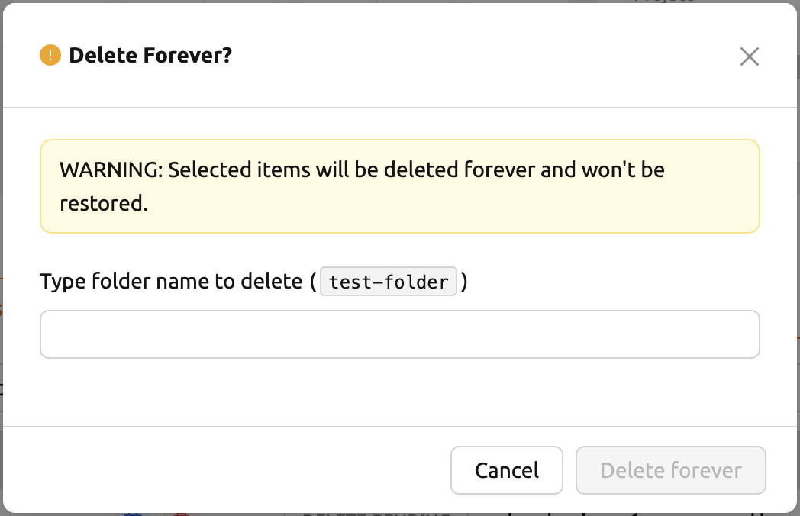
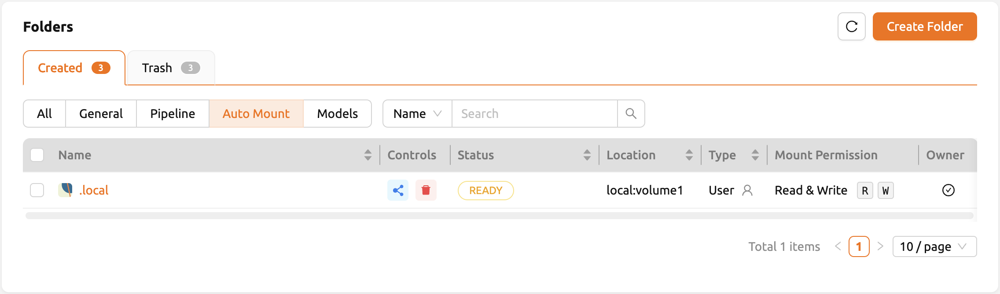

================
Handling Data & Storage Folders
================

Backend.AI supports dedicated storage to preserve user's files. Since the files
and directories of a compute session are deleted upon session termination, it is
recommended to save them in a storage folder. List of storage folders can be
found by selecting the Data & Storage page on the sidebar. You can see the information
such as the folder name and ID, the NFS host name where the folder is located
(Location), and folder access rights (Permission).

.. image:: vfolder_list.png
   :alt: Folder list in Storage page

There are two types of storage folders. User folders can be created by
normal users, and you can see that there is one user icon in the Type panel.
On the other hand, Group folders can be recognized by an icon with multiple
users in the panel. Group folders are created by domain admins, and normal
users can only see group folders created for the group in which the users
belong.

Create storage folder
---------------------

You can create a storage folder with the desired name by clicking the NEW FOLDER
button. Enter the name of the folder to be created in Folder name, and select
one of User / Group for Type. (Depending on the server settings, only one of
User or Group may be selectable.) When creating a group folder, the Group field
must be set. The group folder will be bound to the group specified in the Group
field, and only users belonging to the group can mount and use the group folder.
After setting the values as desired, you can create a folder by clicking the
CREATE button.

.. image:: vfolder_create_dialog.png
   :width: 400
   :align: center
   :alt: Folder creation dialog

The meaning of each fields that can be selected in the creation dialog is as
follows.

* Folder name: The name of the folder. You can enter up to 64 characters.
* Host: NFS host to create folder. You can choose one if you have multiple NFS
  hosts.
* Type: Determines the type of folder to be created. It can be set as User or
  Group. The User folder is a folder that users can create and use alone
  and the Group folder is a folder created by admin and shared by users in the group.
* Usage Mode: You can set the purpose of the folder. There are three types of mode:
  General, Data, and Model. It is classified for the development of exclusive functions
  for Data & Model Stores in the future and currently there is no
  difference in UI depending on the purpose.
* Group: Designates the group to which the folder belongs when creating a new group folder. 
  Group folders must belong to a group. However, it does not play any
  role when creating a user folder.
  
Explore folder
--------------

You can click the folder icon in the Control panel to bring up a file explorer
where you can view the contents of that folder.

.. image:: vfolder_item_with_controls.png
   :alt: Controls in folder item

You can see that directories and files inside the folder will be listed, if
exists. Click a directory name in the Name panel to move to the directory.  You
can click the download button or delete button in the Actions panel to download
it or delete it entirely from the directory. You can rename a file/directory as
well. For more detailed file operations, you can mount this folder when creating
a compute session, and then use a service like Terminal or Jupyter Notebook to
do it.

.. image:: vfolder_explorer.png
   :alt: File explorer of a storage folder

You can create a new directory on the current path with the NEW FOLDER button
(in the file explorer), or upload a local file with the UPLOAD FILES button. All
of these file operations can also be performed using the above-described method
of mounting folders into a compute session.

The maximum length of file or directory inside a folder may depends on the host
file system. But, it usually cannot exceed 255 characters.

To close file explorer, click the X button in the upper right.

Rename folder
-------------

If you have permission to rename the storage folder, you can rename it by
clicking the edit icon in the Control panel. When you click the icon button, a
rename dialog will appear. Write new folder name and then click RENAME button.

Delete folder
-------------

If you have permission to delete the storage folder, you can delete it by
clicking the trash can icon in the Control panel. When you click the Delete
button, a confirm dialog appears. To prevent accidental deletion, you have to
enter the name of the folder to be deleted, explicitly.

The folders created here can be mounted when creating a compute session. Folders
are mounted under the user's default working directory, ``/home/work/``, and the
files stored in the mounted directory will not be deleted when the compute session
is terminated. (However, if you delete the folder itself, it will be gone).

.. _automount-folder:

Automount folder
----------------

Data & Storage page has an Automount Folders tab. Click this tab to see a
list of folders whose names prefixed with a dot (.). When you create a folder,
if you specify a name that starts with a dot (.), it is added to the Automount
Folders tab, not the Folders tab. Automount Folders are special folders that are
automatically mounted in your home directory even if you do not mount them
manually when creating a compute session. By using this feature, creating and
using Storage folders such as ``.local``, ``.linuxbrew``, ``.pyenv``, etc.,
you can configure a certain user packages or environments that do not change
with different kinds of compute session.

For more detailed information on the usage of Automount folders, refer to
:ref:`examples of using automount folders<using-automount-folder>`.

